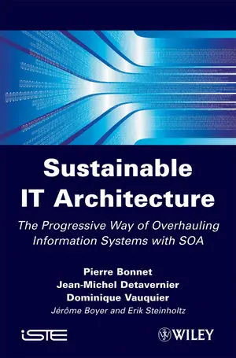
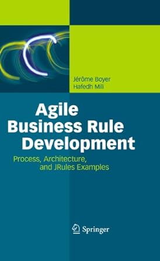
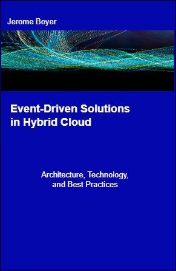
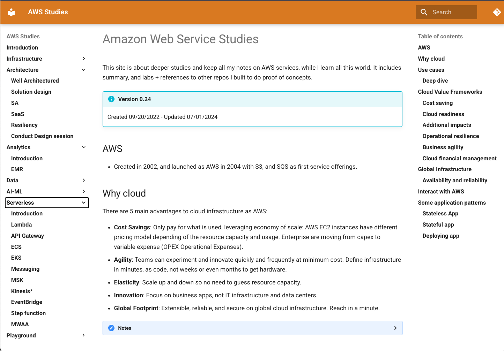

# Home page

## About me

{ align=left width=200 } I am an accomplished technology professional with a diverse background in event-driven architecture (EDA), hybrid cloud solutions (kubernetes and AWS services), real-time processing, business process and business rule implementation. With a strong track record as a former IBM Distinguished Engineer, Principal Solution Architect at AWS, or Flink Ninja at Confluent Inc, my expertise lies in guiding customers through their hybrid cloud journey, real-time processing with Kafka, data as a product pipeline implementation, or in the past decision systems and AI model development and integration.

In my career, I have had the pleasure of assisting customers in a consultative manner, helping them adopt decision management, business process automation, data streaming, complex event processing then event-driven architecture adoption. I have a deep understanding of lean and agile methodologies, having authored books and blogs on agile business rule solution development, and being part of IBM Garage from the creation. Additionally, I have engaged with customers to facilitate the adoption of asynchronous and reactive systems based on Confluent Kafka and Flink, IBM middleware, AWS serverless services, containers, and Kubernetes deployments.

I led a lot of event-storming, and domain-driven design workshops with customers willing to innovate and break their monolithic applications. I also created an agile methodology for developing intelligent automation solutions, and used by IBM automation product consultants for years.

Furthermore, I have contributed to the definition of the next generation of several middleware products, showcasing my ability to drive innovation. I have led the development of IBM reference architectures for event-driven solution, Cognitive, and Data and AI. I am advisor for an AI startup, aroung agentic solution for Hybrid AI, combining rule based system with LLM. 

Since 2024, part of Confluent Flink Ninja team, I help customers moving from batch processing to real-time processing while adopting data as a product / data mesh methodology, and Apache Flink as a service or kubernetes deployment. I also do a lot of agentic implementations for improving our solution engineering group and my day to day work.

### How I can help

Here is a summary of how I can help your organization:

* **Leading Intelligent Automation Solutions**: I specialize in guiding customers towards developing cutting-edge automation solutions by leveraging machine learning, LLM, expert systems, and agents. My expertise lies in creating deployable solutions in hybrid cloud environments (AWS and on-premises or kubernetes deployment).

* **Enabling Cloud Adoption**: I have a proven track record of assisting strategic customers in embracing cloud technologies and deploying their own software as a service (SaaS) solutions. I can provide valuable insights and guidance to help organization leverage the power of the cloud effectively.

* **Architectural Workshops and Prototyping:** By leading architecture workshops, I ensure that solutions are aligned with business requirements and demonstrate their business value through the creation of minimum viable products (MVPs). This approach allows for rapid validation and helps in making informed project decisions.

* **Event Storming and Domain-Driven Design**: I excel in facilitating workshops focused on event storming and domain-driven design, which enable the identification of key business domains, bounded context and microservices. These workshops foster collaboration and innovation within teams.

* **Technical Relationships and Mentoring:** I have extensive experience in building and nurturing long-term, deep technical relationships with C level audience. Furthermore, I enjoy mentoring developers, consultants, and technical sellers, empowering them to enhance their skills and excel in their roles.

* **Knowledge Sharing and Best Practices:** I strongly believe in capturing and sharing best practices and tribal knowledge within teams. By doing so, I actively contribute to the accelerated learning and increased productivity of team members.

* **Customer-Facing Publications:** I have a passion for authoring, presenting, and contributing to customer-facing publications, particularly for conferences. This allows me to share insights, experiences, and innovative solutions with a broader audience.

As a [technical expert](./skills.md), I sell, create, and lead First of a Kind cloud projects and resolve customers’ critical issues. I harvest architecture, best practices, and lessons learned from customer's experiences.

I try to commit myself to be a trusted advisor, so I focus to continuously deeply learn new technologies, programming habits, and agile practices. I try to code and play with new things on a daily basis. The goal is to help customers to innovate and bring business values with new technologies.

Outside of work, I am a devoted parent to three children, with my youngest daughter at WashU in St Louis studying environmental engineering, my sone currently pursuing a master in aerospace engineering at Cornell University, and my oldest daughter working as a software engineer in France. In my leisure time, I enjoy skiing, golfing, sailing, hiking, and engaging in family board games. 

Thank you for taking the time to read my bio. I look forward to the opportunity to contribute my skills and experience to new and exciting projects. 

## Publications

### Books

2013 - Co Author: **[Sustainable IT Architecture - Wisley](https://www.wiley.com/en-us/Sustainable+IT+Architecture%3A+The+Progressive+Way+of+Overhauling+Information+Systems+with+SOA-p-9781118622742)**: A book on Service Oriented Architecture (SOA), the basis of sustainable and more agile IT systems that are able to adapt themselves to new trends and manage processes involving a third party.

Co Author: **[Agile Business Rule Development](http://www.springer.com/business+%26+management/business+information+systems/book/978-3-642-19040-7)** Springer.

[Event-driven solutions virtual book](https://jbcodeforce.github.io/eda-studies/), I think a more flexible way to develop a book, and more agile to change content.

[Machine Learning studies](https://jbcodeforce.github.io/ML-studies/), same approach, it may become a book.

[Flink best practices](https://jbcodeforce.github.io/flink-studies): A Guide to Apache Flink and Confluent Flink, code, best practices, data mesh methodology...

* [AWS Studies for Solution Architect Professional Certification](https://jbcodeforce.github.io/yarfba/), code samples, IaC with AWS CDK, Serverless, Active MQ... a lot of things...

### Assets

* [Flink body of knowledge with best practices and code](tps://jbcodeforce.github.io/flink-studies)
* [Knowledge mnanagement using agents - local oMLX](https://github.com/jbcodeforce/km-agent)
* [My AI Assistant](https://github.com/jbcodeforce/MyAIAssistant): a day to day tool to support customer engagements as solution engineer or architect role.
* [Migration to Apache Flink with an agentic approach](https://github.com/jbcodeforce/migration-to-flink-skills)
* [Messaging in AWS, Active MQ](https://jbcodeforce.github.io/aws-messaging-study)
* [AWS Serverless - Lambda studies ](https://jbcodeforce.github.io/autonomous-car-mgr/)
* [Shift left CLI - hoe to manage a Flink project at scale](https://jbcodeforce.github.io/shift_left_utils)
* [Flink cluster estimator](https://github.com/jbcodeforce/flink-estimator)

### Blogs

* [Medium - Unveiling the Future with Insight Storming: Enhancing Event Driven Architecture (EDA) Solutions](https://medium.com/@jerome.boyer/unveiling-the-future-with-insight-storming-enhancing-event-driven-architecture-eda-solutions-76fcc9c0539c)
* [Medium - Event-driven solution is still a hot topic](https://medium.com/codex/event-driven-solution-is-still-a-hot-topic-15632a8130ef)
* [Medium - Updated EDA reference architecture - 08/2021](https://medium.com/codex/updated-eda-reference-architecture-b1d08a43fc87)
* [Medium - Developer’s experience with an event-driven solution implementation - 03/2022](https://medium.com/@jerome.boyer/developers-experience-with-an-event-driven-solution-implementation-7f6a94fcd162)
* [Linkedin- Why Event-Driven Architecture is important in 2020s](https://www.linkedin.com/pulse/why-event-driven-architecture-important-2020s-jerome-boyer)
Multiple articles on IBM developers site, and BPM journal.

* [Strategies for managing reference data in a business rules application using IBM Operational Decision Manager](https://web.archive.org/web/20160413230740/http://www.ibm.com/developerworks/bpm/bpmjournal/1302_boyer/1302_boyer.html).

* [Best practices for designing and implementing decision services, Part 1: An SOA approach to creating reusable decision services](https://web.archive.org/web/20160413230740/http://www.ibm.com/developerworks/bpm/bpmjournal/1206_boyer/1206_boyer.html).
* [Best practices for designing and implementing decision services, Part 2: Integrating IBM Business Process Manager and IBM Operational Decision Management.](https://web.archive.org/web/20160413230740/http://www.ibm.com/developerworks/bpm/bpmjournal/1212_boyer2/1212_boyer2.html)
* [Using IBM Operational Decision Manager DVS simulation features for risk scoring analysis use cases.](https://web.archive.org/web/20160413230740/http://www.ibm.com/developerworks/bpm/bpmjournal/1404_fu/1404_fu.html)
* [Best practices for designing and implementing decision services, Part 3: Integrating IBM Business Process Manager and IBM Operational Decision Manager RESTful protocol](https://web.archive.org/web/20160413230740/http://www.ibm.com/developerworks/bpm/bpmjournal/1404_boyer/1404_boyer.html).
* [Policies and Rules – Improving business agility: Part 1: Support for business agility](https://web.archive.org/web/20160413230857/http://www.ibm.com/developerworks/webservices/library/ws-policyandrules/index.html)
* [Policies and Rules – Improving Business Agility: Part 2: Demonstrating the value that can be derived from using Policy and Rules.](https://web.archive.org/web/20160413230906/http://www.ibm.com/developerworks/webservices/library/ws-policyandrulespart2/index.html)

## What is in this site

The goal of this site is to keep references and notes from my different studies and may be define some best practices I have used to implement customer's solutions. It addresses some of the common problems I encountered while trying new technologies.

All views expressed on this site are mine only, and do not represent the views of my current and past employers and customers.

## Study Repositories

[Repository list](https://github.com/jbcodeforce?tab=repositories)
