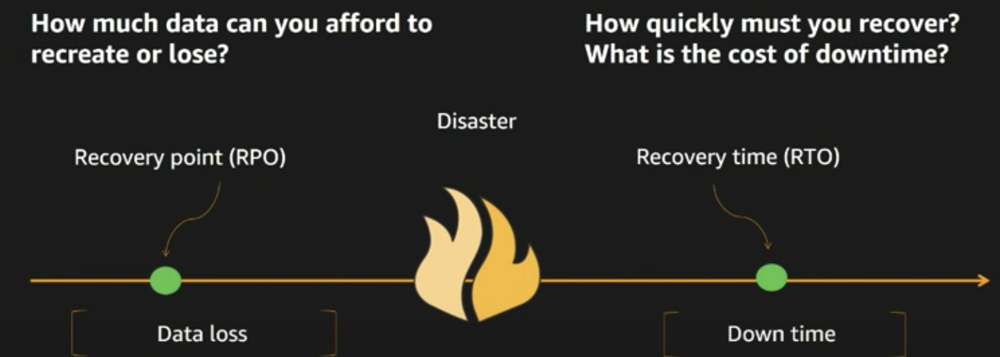
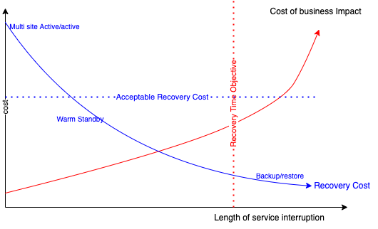

# Disaster recovery assessment

Disaster recovery consists of well-defined strategies to back up the primary data center and restore its data to a secondary data center. During normal operations, the live system is used. The backup programs run in the background to save environmental information and application data. When the live system goes down, the backup system is restored from the backed up data. End users can use the system again.

## Concepts

We are talking about a major disaster like site down, or deep data center failure. Two concepts are then important to consider:

### RTO - Recovery Time Objective

RTO is related to downtime and measure the time required to restore the environment after the primary site becomes unavailable.
This is the maximum time the business can be unavailable. RTO refers then to the amount of time the system's data is unavailable or inaccessible preventing normal service.

### RPO - Recovery Point Objective

RPO refers to the amount of data at risk. It's determined by the amount of time between data protection events and 
reflects the amount of data that potentially could be lost during a disaster recovery. The metric is an indication
 of the amount of data at risk of being lost. Usually measured in the time elapsed, between the state of the runtime data
 at the source and at the replica.

Synchronous replication could deliver a replica with zero lag and, therefore, a recovery point could match the source exactly.

Because asynchronous replication does not guarantee that all updates to the source are simultaneously applied at the replica, the recovery point metric is important. The amount of lag will depend upon the details of the replication management software, but generally a smaller recovery point measure (less lag) is more expensive.

### Different implementations at different costs

Assessing the business dimensions of DR is mandatory to select the best strategy for the cost to operate. 

The first curve illustrates the cost of business impact depending of the length of the service interruption: The RTO vertical line is when the time of the service interruption is acceptable, on the right side of it the business impact is too high.

A less expensive solution that reduce the cost of recovery, as also an higher length of interruption. "Acceptable recovery cost" is the amount of $ the business is accepting to pay for a solution. From those curves we can deduct that backup and restore and warm standby will be acceptable solution. This assessment can be done for all application, as not all of them needs to be active-active.

Also is the RPO line is going to the right and the Acceptable recovery cost going too low, there may be no acceptable solution to support the DR strategy.

## Disaster Recovery patterns

There are some common types of disaster recovery solutions:

* **Database-based disaster recovery solutions**: Database systems such as IBM DB2® have specific features that can be used to
 replicate the primary database data to a standby database. These solutions are commonly adopted by applications that interact 
 with only a single database.
* **Host-based disaster recovery solutions**: Modern operating systems such as AIX® and Linux® have built-in features that can
 provide point-in-time snapshots. These features are widely used by applications that directly use files to store data and don't
 require a short recovery point objective (RPO) and recovery time objective (RTO).
* **Fabric-based disaster recovery solutions**: These methods are focused on transferring data within the storage network from
 a source fabric to a destination fabric using special hardware like Storage Area Network products which provides both Global and Metro mirror capabilities to implement data protection. These solutions are attractive because they can accommodate different storage subsystems. 
* **Storage subsystem-based disaster recovery solutions**: These are also called controller-based solutions because they use a storage controller to transfer data from a source storage subsystem to a destination storage subsystem. Usually controller-based solutions are homogeneous, with data copied between disk arrays from the same manufacturer and often within the same family of products. A dedicated transport channel is commonly required to link the two sites. For example, Global or Metro Mirror can be configured between two IBM System Storage DS series systems to implement disaster recovery.

## What should be considered to prepare for disaster recovery?   

* Not all applications need to be active - active.
* Active/active really means that a user will loose connection to a site and be routed to another site in milliseconds.
* Distributed reads is also a requirement for active - active 
* The biggest challenge is to avoid data collision in the same data store. So entity created in two regions in less than 100ms can collide when replicated. 

There are three types of data to consider:

* **Installation** data is the data associated with the installation of a given product, Operating System, and database.
* **Configuration** data is the data associated with profile configuration, applications, resource configuration.
* **Runtime** data is the data associated with transaction logs, messages saved in the database table, 
process instance information persisted in the database table, and other persistent business states.

For installation and configuration data, the change is infrequent & consistency is important so copy these via snapshots before and after changes done. 
With the adoption of environment as scripts and DevOps configurations are no more manual and can be kept as source code in Git repository.

### Runtime Data

Application requirements determine replication strategy:

* **Aggressive RPO & RTO objectives:** Favor asynchronous replication via Storage System tooling where replication may be done while servers are online and active.
* **Lenient RPO & RTO objectives:** Favor synchronous replication via Operating System tooling (file copy) where replication must be done off line, while the different runtime solutions are quiesced (a maintenance window)
* **DB-managed replication:** This approach leverages transaction logs to be stored in a DB. Remark that this approach is applicable only if the single database stores all application resources that need to be replicated

???+ "Read more"
    * [Data replication](../data/data-replication.md)

## Product specifics

* In most Java app server transaction engine, the transaction logs are located in the database itself, so will be replicated with database HA replicas.
* In active-active settings, Kubernetes ETCD does not need to be replicated, content is local to the clusters.