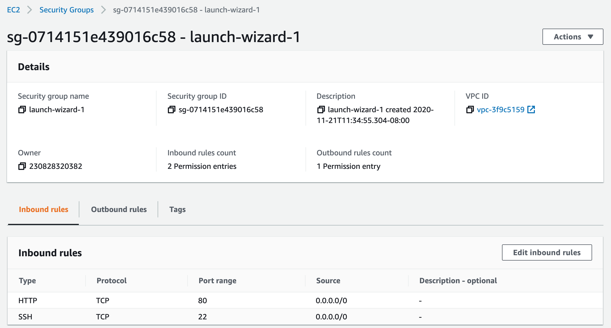
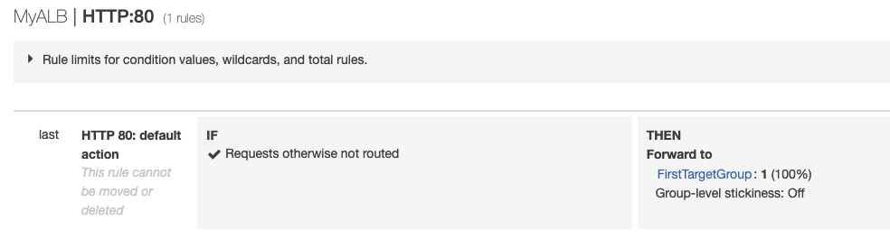
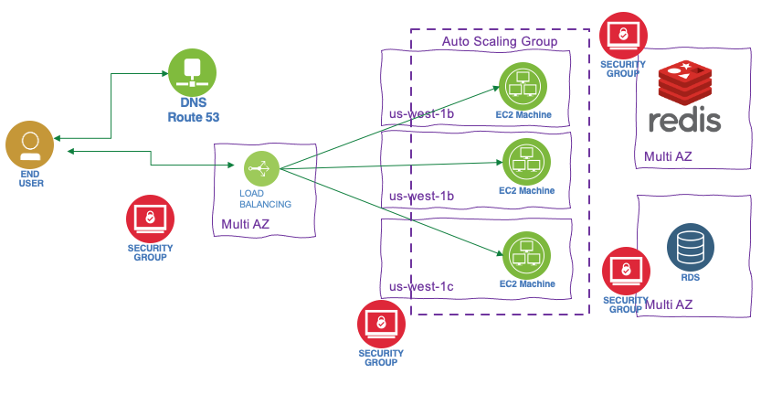
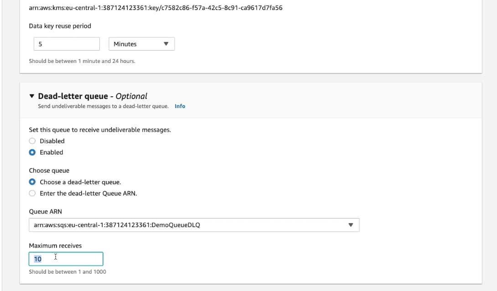
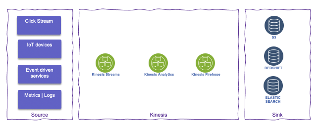

# Amazon Web Service studies

## Organization

24 regions -> 2 to 6 availability zones per region. Ex: us-west-1-2a.  See [Global infrastructure map](https://aws.amazon.com/about-aws/global-infrastructure/).

AZ is one or more DC with redundant power, networking and connectivity. Isolated from disasters. Interconnected with low latency. 

* EC2 is a regional service.
* IAM is a global service

## IAM Identity and Access Management

* Definer user (physical person), group and roles, and permissions
* One role per application
* Users are defined as global service encompasses all regions
* Policies are written in JSON, to define permissions for user and group and role
* Least privilege permission: Give user the minimal amount of permissions they need to do their job
* Assign users to groups and assign policies to groups and not to individual user.
* For identity federation SAML standard is used

## EC2 components

* Renting machine EC2
* Storing data on virtual drives EBS
* Distribute load across machines ELB
* Auto scale the service ASG

Amazon Machine Image: AMI, image for OS and preinstalled softwares. Amazon Linux 2 for linux base image.

 

When creating an instance, we can select the VPC and the AZ subnet, and the storage (EBS) for root folder to get the OS. The security group helps to isolate the instance, for example, authorizing ssh on port 22 or HTTP port 80.
Get the public ssh key, and when the instance is started, use: `ssh -i EC2key.pem  ec2-user@ec2-52-8-75-8.us-west-1.compute.amazonaws.com `

Can also use **EC2 Instance Connect** to open a terminal in the web browser. Need to get SSH port open.

EC2 has a section to add `User data`, which could be used to define a bash script to install dependent software and start some services.

EC2 **instance types**: (see [ec2instances.info](https://www.ec2instances.info))

* R: applications that needs a lot of RAM – in-memory caches
* C: applications that needs good CPU – compute / databases
* M: applications that are balanced (think “medium”) – general / web app
* I: applications that need good local I/O (instance storage) – databases
* G: applications that need a GPU
* T2/T3 for burstable instance: When the machine needs to process something unexpected (a spike in
load for example), it can burst. Use burst credits to control CPU usage.

### Launch types

* **On demand**: short workload, predictable pricing, pay per second after first minute.
* **Reserved** for at least for one year, used for long workloads like database. Get discounted rate from on-demand.
* **Convertible reserved** instance for changing resource capacity over time.
* **Scheduled reserved** instance for job based workload.
* **Spot instance** for very short - 90% discount on on-demand - used for work resilient to failure like batch job, data analysis, image processing,...
    * Define a **max spot price** and get the instance while the current spot price < max. The hourly spot price varies based on offer and capacity. 
    * if the current spot price > max, then instance will be stopped
    * with spot block we can a time frame without interruptions.
    * The expected state is defined in a 'spot request' which can be cancelled. One time or persistent request types are supported. Cancel a spot request does not terminate instances, but need to be the first thing to do and then terminate the instances.
    * Spot fleets allow to automatically request spot instance with the lowest price.
* **Dedicated hosts** to book entire physical server and control instance placement. # years. BYOL. 

Use **EC2 launch templates** to automate instance launches, simplify permission policies, and enforce best practices across the organization. (Look very similar as docker image)

### AMI

Bring our own image. Shareable on amazon marketplace. Can be saved on S3 storage. By default, our AMIs are private, and locked for our account / region.

AMI are built for a specific AWS region. But they can be copied and shared [See AWS doc - copying an AMI](https://docs.aws.amazon.com/AWSEC2/latest/UserGuide/CopyingAMIs.html).

### EC2 Hibernate

The in memory state is preserved, persisted to a file in the root EBS volume. It helps to make the instance startup time quicker. The root EBS volume is encrypted.
Constrained by 150GB RAM. No more than 60 days.

## Security group

Define inbound and outbound security rules.  They regulate access to ports, authorized IP ranges, control inbound and outbound network. By default all inbound traffic is denied and outbound authorized.

* Can be attached to multiple EC2 instances and to load balancers
* Locked down to a region / VPC combination
* Live outside of the EC2
* Define one security group for SSH access
* Application not accessible is a security group
* Connect refused in an application error or is not launched
* Instances with the same security group can access each other
* Security group can reference other security groups, IP address, CIDR but no DNS server

 

## Networking

IPv4 allows 3.7 billions of different addresses. Private IP @ is for private network connections. Internet gateway has public and private connections. Public IP can be geo-located. When connected to an EC2 the prompt lists the private IP (`ec2-user@ip-172-31-18-48`). Private IP stays stable on instance restart, while public may change.

With Elastic IP address we can mask an EC2 instance failure by rapidly remapping the address to another instance. But better to use DNS.

### Playing with Apache HTTP

```shell
# Swap to roo
sudo su
# update OS
yum update -y
# Get Apache HTTPd
yum install -y httpd.x86_64
# Start the service
systemctl start httpd.service
# Enable it cross restart
systemctl enable httpd.service
> Created symlink from /etc/systemd/system/multi-user.target.wants/httpd.service to /usr/lib/systemd/system/httpd.service
# Get the availability zone
EC2-AZ=$(curl -s http://169.254.169.254/latest/meta-data/placement/availability-zone)
# Change the home page by changing /var/www/html/index.html
echo "<h3>Hello World from $(hostname -f) in AZ= $EC2_AZ </h3>" > /var/www/html/index.html
```

This script can be added as User Data (Under Advanced Details while configuring new instance) so when the instance starts it executes this code.

### Elastic Network Instances

ENI is a logical component in a VPC that represents a virtual network card. It has the following attributes:

* Primary private IPv4, one or more secondary IPv4
* One Elastic IP (IPv4) per private IPv4
* One Public IPv4
* One or more security groups
* A MAC address
* We can create ENI independently and attach them on the fly (move them) on EC2 instances for failover 
* Bound to a specific availability zone (AZ)

[New ENI doc.](https://aws.amazon.com/blogs/aws/new-elastic-network-interfaces-in-the-virtual-private-cloud/)

## Placement groups

Define strategy to place EC2 instances:

* **Cluster**: groups instances into a low-latency group in a single Availability Zone
    * highest performance while talking to each other as We're performing big data analysis
* **Spread**: groups across underlying hardware (max 7 instances per group per AZ)
    * Reduced risk is simultaneous failure
    * EC2 Instances are on different physical hardware
    * Application that needs to maximize high availability
    * Critical Applications where each instance must be isolated from failure from each other
* **Partition**: spreads instances across many different partitions (which rely on different sets of racks) within an AZ.
    * Partition is a set of racks
    * Up to 100s of EC2 instances
    * The instances in a partition do not share racks with the instances in the other partitions
    * A partition failure can affect many EC2 but won’t affect other partitions
    * EC2 instances get access to the partition information as metadata
    * HDFS, HBase, Cassandra, Kafka

Access from network and policies menu, define the group with expected strategy, and then it is used when creating the EC2 instance by adding the instance to a placement group.

## Load balancer

Route traffic into the different EC2 instances. It also exposes a single point of access (DNS) to the deployed application. In case of failure, it can route to a new instance, transparently and cross multiple AZ. It uses health check (/health on the app called the `ping path`) to asses instance availability. It provides SSL termination. It supports to separate private (internal) to public (external) traffic.

 

ELB: EC2 load balancer is the managed service by Amazon. Three types supported:

* Classic load balancer: older generation. For each instance created, update the load balancer configuration so it can route the traffic.
* **Application load balancer**: HTTP, HTTPS (layer 7), Web Socket. 
    * It specifies availability zones: it routes traffic to the targets in these Availability Zones. Each AZ has one subnet. To increase availability, we need at least two AZs.
    * It uses target groups, to group applications
    * route on URL, hostname and query string
    * Get a fixed hostname
    * the application do not see the IP address of the client directly (ELB does a connection termination), but ELB put it in the header `X-Forwarded-For`, `X-Forwarded-Port` and `X-Forwarded-Proto`.
* **Network load balancer**: TCP, UDP (layer 4), TLS
    * handle millions request/s
    * use to get a public static IP address

To control that only the load balancer is sending traffic to the application, we need to set up an application security group on HTTP, and HTTPS with the source behind the security group id of the ELB. LBs can scale but need to engage AWS operational team.

HTTP 503 means LB is at capacity or not register target. Verify security group in case of no communication between LB and app.

Target group defines protocol to use, health check checking and what applications to reach (instance, IP or lambda). 

Example of listener rule for an ALB:

 

### Load balancer stickiness

Used when the same client needs to interact with the same backend instance. A cookie, with expiration date, is used to identify the client. The classical or ALB manage the routing. This could lead to inbalance traffic so overloading one instance. 
With ALB it is configured in the target group properties.

### Cross Zone Load Balancing

Each load balancer instance distributes traffic evenly across all registered instances in all availability zones. This is the default setting for ALB and free of charge. It is disabled by default for NLB.

### TLS - Transport Layer Security,

An SSL/TLS Certificate allows traffic between our clients and our load balancer to be encrypted in transit (in-flight encryption).

* Load balancer uses an X.509 certificate (SSL/TLS server certificate). 
* Manage certificates using ACM (AWS Certificate Manager)
* When defining a HTTPS listener in a LB, we must specify a default certificate for the HTTPS protocol, while defining the routing rule to a given target group. Need multiple certs to support multiple domains. 
* Clients can use SNI (Server Name Indication) to specify the hostname they reach. The ALB or NLB will get the certificate for this host to support the TLS handshake. 

### Connection draining

This is a setting to control connection timeout and reconnect when an instance is not responding. It is to set up the time to complete “in-flight requests”. When an instance is "draining", ELB stops sending new requests to the instance. THe time out can be adjusted, depending of the application, from 1 to 3600 seconds, default is 300
seconds, or disabled (set value to 0).

### Auto Scaling Group (ASG)

The goal of an ASG is to scale out (add EC2 instances) to match an increased load, or scale in (remove EC2 instances) to match a decreased load. It helps to provision and balance capacity across Availability Zones to optimize availability.
It can also ensure we have a minimum and a maximum number of machines running. It detects when an instance is unhealthy. 

Automatically Register new instances to a load balancer.

[ASG](https://us-west-1.console.aws.amazon.com/ec2autoscaling/home?region=us-west-1#/) has the following attributes:

* AMI + Instance Type with EC2 User Data (Can use template to define instances)
* EBS Volumes
* Security Groups
* SSH Key Pair
* Min Size / Max Size / Initial Capacity to control number of instances 
* Network + Subnets Information to specify where to run the EC2 instances.
* Load Balancer Information, with target groups to be used as a grouping of the newly created instances
* Scaling Policies help to define rules to manage instance life cycle, based for example on CPU usage or network bandwidth used. 

 

* when creating scaling policies, **CloudWatch** alarms are created. Ex: "Create an alarm if: CPUUtilization < 36 for 15 data points within 15 minutes".
* ASG tries the balance the number of instances across AZ by default, and then delete based on the age of the launch configuration
* The capacity of our ASG cannot go over the maximum capacity ee have allocated during scale out events
* when an ALB validate an health check issue it terminate the EC2 instance.

## EBS Volume

Elastic Block Store Volume is a network drive attached to the instance. It is locked to an AZ, and uses provisioned capacity in GBs and IOPS.

* Create a EBS while creating the EC2 instance and keep it not deleted on shutdown
* Once logged, add a filesystem, mount to a folder and modify boot so the volume is mounted at start time. Which looks like:

```shell
# List existing block storage, verify our created storage is present
lsblk
# Verify file system type
sudo file -s /dev/xdvf
# Create a ext4 file system on the device 
sudo mkfs -t ext4 /dev/xvdb
# make a mount point
sudo mkdir /data
sudo mount  /dev/xvdb /data
# Add entry in /etc/fstab with line like:
/dev/xvdb /data ext4 default,nofail 0 2
```

* EBS is already a redundant storage, replicated within an AZ.
* EC2 instance has a logical volume that can be attached to two or more EBS RAID 0 volumes, where write operations are distributed among them. It is used to increate IOPS without any fault tolerance. If one fails, we lost data. It could be used for database with built-in replication or Kafka.
* RAID 1 is for better fault tolerance: a write operation is going to all attached volumes.

### Volume types

* GP2: used for most workload up to 16 TB at 16000 IOPS max  (3 IOPS per GB brustable to 3000)
* io 1: critical app with large database workloads. max ratio 50:1 IOPS/GB. Min 100 iops and 4G to 16T
* st 1: Streaming workloads requiring consistent, fast throughput at a low price. For Big data, Data warehouses, Log processing, Apache Kafka
* sc 1: throughput oriented storage.  500G- 16T, 500MiB/s. Max IOPs at 250. Used for cold HDD, and infrequently accessed data.

Encryption has a minimum impact on latency. It encrypts data at rest and during snapshots.

Instance store is a volume attached to the instance, used for root folder. It is a ephemeral storage but has millions read per s and 700k write IOPS. It provides the best disk performance and can be used to have high performance cache for our application.


If we need to run a high-performance database that requires an IOPS of 210,000 for its underlying filesystem, we need instance store and DB replication in place.

### Snapshots

Used to backup disk and stored on S3.
Snapshot Lifecycle policies helps to create snapshot with scheduling it by defining policies.
To move a volume to another AZ or data center we can create a volume from a snapshot.

### Elastic File System

Managed Network FS for multi AZs. (3x gp2 cost), controlled by using security group. This security group needs to add in bound rule of type NFS connected / linked to the SG of the EC2.
Only Linux based AMI. Encryption is supported using KMS.
1000 concurrent clients
10GB+/s throughput, bursting or provisioned.
Support different performance mode, like max I/O or general purpose
Support storage tiers to move files after n days, infrequent EFS-IA for files rarely accessed.
Use amazon EFS util tool in each EC2 instance to mount the EFS to a target mount point.

## Relational Database Service

Managed service for SQL based database. Support multi AZs for DR with automatic failover to standby, app uses one unique DNS name. Continuous backup and restore to specific point of time restore. It uses gp2 or io1 EBS. Transaction logs are backed-up every 5 minutes.
Support user triggered snapshot.

* Read replicas: helps to scale the read operations. Can create up to 5 replicas within AZ, cross AZ and cross region. Replication is asynch. Use cases include, reporting, analytics, ML model
* AWS charge for network when for example data goes from one AZ to another.
* Support at rest Encryption. Master needs to be encrypted to get encrypted replicas. 
* We can create a snapshot from unencrypted DB and then copy it by enabling the encryption for this snapshot. From there we can create an Encrypted DB

wer responsibility:

* Check the ports / IP / security group inbound rules in DB’s SG
* In-database user creation and permissions or manage through IAM
* Creating a database with or without public access
* Ensure parameter groups or DB is configured to only allow SSL connections

### Aurora

Proprietary SQL database, work on postgresql and mysql driver. It is cloud optimized and claims 5x performance improvement over mySQL on RDS, and 3x for postgresql.

Can grow up to 64 TB. Sub 10ms replica lag, up to 15 replicas.

Failover in Aurora is instantaneous. It’s HA (High Availability) native. Use 1 master - 5 readers to create 6 copies over 3 AZs. 3 copies of 6 need for reads. Peer to peer replication. Use 100s volumes. Autoscaling on the read operation. 

 

It is CQRS at DB level. Use writer end point and reader endpoint.

It also supports one write with multiple reader and parallel query, multiple writes and serverless to automate scaling down to zero (No capacity planning needed and pay per second).

With Aurora global database one primary region is used for write and then up to 5 read only regions with replica lag up to 1 s. Promoting another region (for disaster recovery) has an RTO of < 1 minute

## ElastiCache

Get a managed Redis or Memcached cluster. Applications queries ElastiCache, if not available, get from RDS and store in ElastiCache. 
It can be used for user session store so user interaction can got to different application instances.

**Redis** is a multi AZ with Auto-Failover, supports read replicas to scale and for high availability. It can persist data using AOF persistence, and has backup and restore features.

**Memcached** is a multi-node for partitioning of data (sharding), and no persistence, no backup and restore. It is based on a multi-threaded architecture.

Some patterns for ElastiCache:
* Lazy Loading: all the read data is cached, data can become stale in cache
* Write Through: Adds or update data in the cache when written to a DB (no stale data)
* Session Store: store temporary session data in a cache (using TTL features)

## Route 53

It is a managed Domain Name System. DNS is a collection of rules and records which helps clients understand
how to reach a server through URLs. Here is a quick figure to summary the process

 

DNS records Time to Live (TTL), is set to get the web browser to keep the DNS resolution in cache. High TTL is around 24 hours, low TTL at 60s will make more DNS calls. TTL should be set to strike a balance between how long the value should be cached vs how much pressure should go on the DNS. Need to define the TTL for the app depending on the expected deployment model.

A hosted zone is a container that holds information about how we want to route traffic for a domain. Two types are supported: public or private within a VPC.

Route 53 is a registrar. We can buy domain name.

Use `dig <hostname>` to get the DNS resolution record.

### CNAME vs Alias

[CNAME](https://en.wikipedia.org/wiki/CNAME_record) is a DNS record to maps one domain name to another. CNAME should point to a ALB. **Alias** is used to point a hostname of an AWS resource and can work on root domain (domainname.com).

### Routing

A simple routing policy to get an IP @ from a hostname could not have health check defined. 

The **weighted** routing policy controls the % of the requests that go to specific endpoint. Can do blue-green traffic management. It can also help to split traffic between two regions. It can be associated with Health Checks

The **latency** routing Policy redirects to the server that has the least latency close to the client. Latency is evaluated in terms of user to designated AWS Region.

**Health check** monitors he health and performance of the app servers or endpoints and assess DNS failure. We can have HTTP, TCP or HTTPS health checks. We can define from which region to run the health check. They are charged per HC / month. It is recommended to have one HC per app deployment. It can also monitor latency,

The **failover** routing policy helps us to specify a record set to point to a primary and then a secondary instance for DR. 

The **Geo Location** routing policy is based on user's location, and we may specify how the traffic from a given country should go to this specific IP. Need to define a “default” policy in case there’s no match on location.

The **Multi Value** routing policy is used to access multiple resources. The record set, associates a Route 53 health checks with records. The client on DNS request gets up to 8 healthy records returned for each Multi Value query. If one fails then the client can try one other IIP @ from the list.

## Some application patterns

For solution architecture we need to assess cost, performance, reliability, security and operational excellence.

### Stateless App

The step to grow a stateless app: add vertical scaling by changing the EC2 profile, but while changing user has out of service. Second step is to scale horizontal, each EC2 instance has static IP address and DNS is configured with 'A record' to get each EC2 end point. But is one instance is gone, the client App will see it down until TTL expires.

The reference architecture includes DNS record set with alias record (to point to ALB. Using alias as ALB address may change over time) with TTL of 1 hour. Use load balancers in 3 AZs (to survive disaster) to hide the horizontal scaling of EC2 instances (managed with auto scaling group) where the app runs. Health checks are added to keep system auto adaptable and hide system down, and restricted security group rules to control EC2 instance accesses. ALB and EC instances are in multi different AZs. The EC instances can be set up with reserved capacity to control cost.

 

### Stateful app

In this case we will add the pattern of shopping cart. If we apply the same architecture as before, at each interaction of the user, it is possible the traffic will be sent to another EC2 instance that started to process the shopping cart. Using ELB with stickiness will help to keep the traffic to the same EC2, but in case of EC2 failure we still loose the cart. An alternate is to use user cookies to keep the cart at each interaction. It is back to a stateless app as state is managed by client and cookie. For security reason the app needs to validate the cookie content. cookie as a limit of 4K data.

Another solution is to keep session data into an elastic cache, like Redis, and use the sessionId as key and persisted in a user cookie. So EC2 managing the interaction can get the cart data from the cache using the sessionID. It can be enhanced with a RDS to keep user data. Which can also support the CQRS pattern with read replicas. Cache can be update with data from RDS so if the user is requesting data in session, it hits the cache.

 

Cache and database are set on multi AZ, as well as EC2 instance and load balancer, all to support disaster. Security groups need to be defined to get all traffic to the ELB and limited traffic between ELB and EC2 and between EC2 and cache and EC2 and DB.

Another example of stateful app is the ones using image stored on disk. In this case EC2 EBS volume will work only for one app instance, but for multi app scaling out, we need to have a Elastic FS which can be Multi AZ too.

### Deploying app

The easiest solution is to create AMI containing OS, dependencies and app binary. This is completed with User Data to get dynamic configuration. Database data can be restored from Snapshot, and the same for EFS data.

[Elastic Beanstalk](https://aws.amazon.com/elasticbeanstalk/) is a developer centric view of the app, hiding the complexity of the IaaS. From one git repository it can automatically handle the deployment details of capacity provisioning, load balancing, auto-scaling, and application health monitoring. 

## S3

Amazon S3 allows people to store objects (files) in **buckets** (directories), which must have a globally unique name (cross users!). They are defined at the region level. **Object** in a bucket, is referenced as a **key** which can be seen to a file path in a file system. The max size for an object is 5 TB but need to be uploaded in multi part using 5GB max size.

S3 supports versioning at the bucket level. So file can be restored from previous version, and even deleted file can be retrieved from a previous version.

Objects can also be encrypted, and different mechanisms are available:

* **SSE-S3**: server-side encrypted S3 objects using keys handled & managed by AWS using AES-256 protocol must set `x-amz-server-side-encryption: "AES256"` header in the POST request.
* **SSE-KMS**: leverage AWS Key Management Service to manage encryption keys. `x-amz-server-side-encryption: "aws:kms"` header. Server side encrypted. It gives user control of the key rotation policy and audit trail.
* **SSE-C**: when We want to manage our own encryption keys. Server-side encrypted. Encryption key must provided in HTTP headers, for every HTTP request made. HTTPS is mandatory
* **Client Side Encryption**: encrypt before sending object.

### Security control

Explicit DENY in an IAM policy will take precedence over a bucket policy permission

### S3 Website

We can have static web site on S3. Once html pages are uploaded, setting the properties as static web site from the bucket. The bucket needs to be public, and have a security policy to allow any user to `GetObject` action. The URL may look like: `<bucket-name>.s3-website.<AWS-region>.amazonaws.com`

* **Cross Origin resource sharing CORS**: The web browser requests won’t be fulfilled unless the other origin allows for the requests, using CORS Headers `Access-Control-Allow-Origin`. If a client does a cross-origin request on our S3 bucket, we need to enable the correct CORS headers: this is done by adding a security policy with CORS configuration like:

```xml
<CORSConfiguration>
    <CORSRule>
        <AllowedOrigin>enter-bucket-url-here</AllowedOrigin>
        <AllowedMethod>GET</AllowedMethod>
        <MaxAgeSeconds>3000</MaxAgeSeconds>
        <AllowedHeader>Authorization</AllowedHeader>
    </CORSRule>
</CORSConfiguration>
```

Finally S3 is eventual consistent.

#### S3 replication

Once versioning enabled, a bucket can be replicated in the same region or cross regions. The replication is done asynchronously. SRR is for log aggregation for example while CRR is used for compliance and DR or replication across accounts. Delete operations are not replicated.

### S3 Storage classes

When uploading a document into an existing bucket we can specify the storage class for keep data over time. Different levels are offered with different cost and SLA.

 

To prevent accidental file deletes, we can setup MFA Delete to use MFA tokens before deleting objects.

Amazon Glacier is for archiving, like writing to tapes. 

We can transition objects between storage classes. For infrequently accessed object, move them to STANDARD_IA. For archive objects We don’t need in real-time, GLACIER or DEEP_ARCHIVE. Moving objects can be automated using a lifecycle configuration

At the bucket level, a user can define lifecycle rules for when to transition an object to another storage class.

 

To improve performance, a big file can be split and then uploaded with local connection to the closed edge access and then use AWS private network to copy between buckets in different region.

[S3 to Kafka lab](https://ibm-cloud-architecture.github.io/refarch-eda/use-cases/connect-s3/)

## AWS Athena

It is to run analytics directly on S3 files, using SQL language to query the files (CSV, JSON, Avro, Parquet...). S3 Access Logs log all the requests made to buckets, and Athena can then be used to run serverless analytics on top of the logs files

## AWS CLI

The cli needs to be configured: `aws configure` with the credential, key and region to be able to access the aws account. Use IAM user to get a new credentials key.

When using CLI in a EC2 instance always use an IAM role to control security credentials. This role can come with a policy authorizing exactly what the EC2 instance should be able to do. Also within a EC2 instance, it is possible to use the URL http://169.254.169.254/latest/meta-data to get information about the EC2. We can retrieve the IAM Role name from that metadata.

## CloudFront

CDN service with DDoS protection. It caches data to the edge to improve web browsing and app performance. 216 Edge location.

The origins of those files are S3 buckets, Custom resource accessible via HTTP. CloudFront keeps cache for the data read. For the edge to access the S3 bucket, it uses an origin access identity (OAI), managed as IAM role. 

For EC2 instance, the security group needs to accept traffic from edge location IP addresses. 

It is possible to control with geo restriction. 

It also support the concept of signed URL. When you want to distribute content to different user groups over the world: We attach a policy with:

* Includes URL expiration
* Includes IP ranges to access the data from
* Trusted signers (which AWS accounts can create signed URLs)
* How long should the URL be valid for?
* Shared content (movie, music): make it short (a few minutes)
* Private content (private to the user): you can make it last for years
* Signed URL = access to individual files (one signed URL per file)
* Signed Cookies = access to multiple files (one signed cookie for many files)

## Storage

### Snowball

Move TB of data in and out AWS using physical device to ship data. The edge has 100TB and compute power to do some local processing on data. Snow mobile is a truck with 100 PB capacity. Once on site, it is transferred to S3.

Snowball Edge brings computing capabilities to allow data pre-processing while it's being moved in Snowball, so we save time on the pre-processing side as well.

## Hybrid cloud storage

Storage gateway expose an API in front of S3. Three gateway types:

* file: S3 bucket accessible using NFS or SMB protocols. Controlled access via IAM roles. File gateway is installed on-premise and communicate with AWS.
* volume: this is a block storage using iSCSI protocol. On-premise and visible as a local volume backed by S3.
* tape: same approach but with virtual tape library. Can go to S3 and Glacier.

### Storage comparison

* S3: Object Storage
* Glacier: Object Archival
* EFS: Network File System for Linux instances, POSIX filesystem
* FSx for Windows: Network File System for Windows servers
* FSx for Lustre: High Performance Computing Linux file system
* EBS volumes: Network storage for one EC2 instance at a time
* Instance Storage: Physical storage for your EC2 instance (high IOPS)
* Storage Gateway: File Gateway, Volume Gateway (cache & stored), Tape Gateway
* Snowball / Snowmobile: to move large amount of data to the cloud, physically
* Database: for specific workloads, usually with indexing and querying

## Integration and middleware: SQS, Kinesis Active MQ

### SQS: Standard queue

Oldest queueing service on AWS. The default retention is 4 days up to 14 days. low latency < 10ms. Duplicate messages is possible and out of order too. Consumer deletes the message. It is auto scaling.

Specific SDK to integrate to SendMessage...

Consumer receive, process and then delete. Parallel is possible on the different messages. The consumers can be in an auto scaling group so with CloudWatch, it is possible to monitor the queue size / # of instances and on the CloudWatch alarm action, trigger scaling. Max size is 256KB. 

Message has metadata out of the box. After a message is polled by a consumer, it becomes invisible to other consumers. By default, the “message visibility timeout” is 30 seconds, which means the message has 30 seconds to be processed (Amazon SQS prevents other consumers from receiving and processing the message.). After the message visibility timeout is over, the message is “visible” in SQS, so it will be processed twice. But a consumer could call the ChangeMessageVisibility API to get more time. When the visibility timeout is high (hours), and the consumer crashes then the re-processing of all the message will take time. If it is set too low (seconds), we may get duplicates

 

Encryption in fight via HTTPS, at rest encryption with KMS keys. Comes with monitoring.

If a consumer fails to process a message within the Visibility Timeout, the message goes back to the queue. But if we can set a threshold of how many times a message can go back to the queue. After the MaximumReceives threshold is exceeded, the message goes into a dead letter queue (DLQ) (which has a limit of 14 days to process).

 

Delay queues let you postpone the delivery of new messages to a queue for a number of seconds. If you create a delay queue, any messages that you send to the queue remain invisible to consumers for the duration of the delay period. The default (minimum) delay for a queue is 0 seconds. The maximum is 15 minutes

Queue can be set as FIFO to guaranty the order: limited to throughput at 300 msg/s without batching or 3000 msg/s with batching. I can also support exactly once. It can be set to remove duplicate by looking at the content.

### Simple Notification Service is for topic pub/sub

SNS supports up to 10,000,000 subscriptions per topic, 100,000 topics limit. The subscribers can publish to topic via SDK and can use different protocols like: HTTP / HTTPS (with delivery retries – how many times), SMTP,  SMS, ... The subscribers can be a SQS, a Lambda, emails, Emails...
Many AWS services can send data directly to SNS for notifications: CloudWatch (for alarms), Auto Scaling Groups notifications, Amazon S3 (on bucket events), CloudFormation.

SNS can be combined with SQS: Producers oush once in SNS, receive in all SQS queues that are subscribers. It is fully decoupled without any data loss. SQS allows for data persistence, delayed processing and retries. SNS cannot send messages to SQS FIFO queues.

### Kinesis

It is like a managed alternative to kafka. It uses the same principle and features set.

 

Data can be kept to for 7 days. Ability to replay data, multiple apps consume the same stream. Only one consumer per shard

* **Kinesis Streams**: low latency streaming ingest at scale. They offer patterns for data stream processing.
* **Kinesis Analytics**: perform real-time analytics on streams using SQL
* **Kinesis Firehose**: load streams into S3, Redshift, ElasticSearch. Mo administration, auto scaling, serverless.

One stream is made of many different shards (like kafka partition). Capacity of 1MB/s or 1000 messages/s at write PER SHARD, and 2MB/s at read PER SHARD. Billing is per shard provisioned, can have as many shards as we want. Batching available or per message calls.

captured Metrics are: # of incoming/outgoing bytes, # incoming/outgoing records, Write / read provisioned throughput exceeded, and iterator age ms.

It offer a CLI to get stream, list streams, list shard...

## Serverless 

Serveless on AWS is supported by a lot of services:

* AWS Lambda: Limited by time - short executions, runs on-demand, and automated scaling. Pay per call, duration and memory used. 
* DynamoDB: no sql db, with HA supported by replication across three AZ. millions req/s, trillions rows, 100s TB storage. low latency on read. Support event driven programming with streams: lambda function can read the stream (24h retention). Table oriented, with dynamic attribute but primary key. 400KB max size for one document. It uses the concept of Read Capacity Unit and Write CU. It supports auto-scaling and on-demand throughput. A burst credit is authorized, when empty we get ProvisionedThroughputException. Finally it use the DynamoDB Accelerator to cache data to authorize micro second latency for cached reads. Supports transactions and bulk tx with up to 10 items. 
* AWS Cognito: gives users an identity to interact with the app.
* AWS API Gateway: API versioning, websocket supported, different environment, support authentication and authorization. Handle request throttling. Cache API response. SDK. Support different security approaches:
    * IAM:
        * Great for users / roles already within your AWS account
        * Handle authentication + authorization
        * Leverages Sig v4
    * Custom Authorizer:
        * Great for 3rd party tokens
        * Very flexible in terms of what IAM policy is returned
        * Handle Authentication + Authorization
        * Pay per Lambda invocation
    * Cognito User Pool:
        * You manage your own user pool (can be backed by Facebook, Google login etc…)
        * No need to write any custom code
        * Must implement authorization in the backend
* Amazon S3
* AWS SNS & SQS
* AWS Kinesis Data Firehose
* Aurora Serverless
* Step Functions
* Fargate

Lambda@Edge is used to deploy Lambda functions alongside your CloudFront CDN, it is for building more responsive applications. Lambda is deployed globally. Here are some use cases: Website security and privacy, dynamic webapp at the edge, search engine optimization (SEO), intelligently route across origins and data centers, bot mitigation at the edge, real-time image transformation, A/B testing, user authentication and authorization, user prioritization, user tracking and analytics.

### Serverless architecture patterns

#### Few write / Lot of reads app

The mobile application access application via REST HTTP through API gateway. They first get JWT token to authenticate and the API gateway validate such token. The Gateway delegates to a Lambda function which go to Dynamo DB.

 

Each of the component supports auto scaling. To improve read throughput cache is used with DAX. Also some of the REST request could be cached in the API gateway. If the application needs to access S3 directly. Cognito can also generate temporary credentials with STS. Restricted policy is set to control access to S3 too. 

## ECS

Amazon ECS is a fully managed container orchestration service, Amazon EKS is a fully managed Kubernetes service, both services support Fargate to provide serverless compute for containers. Fargate removes the need to provision and manage servers, lets us specify and pay for resources per application, and improves security through application isolation by design


## Other interesting stuff

[IBM Cloud pak for integration on AWS](https://aws.amazon.com/quickstart/architecture/ibm-cloud-pak-for-integration/)