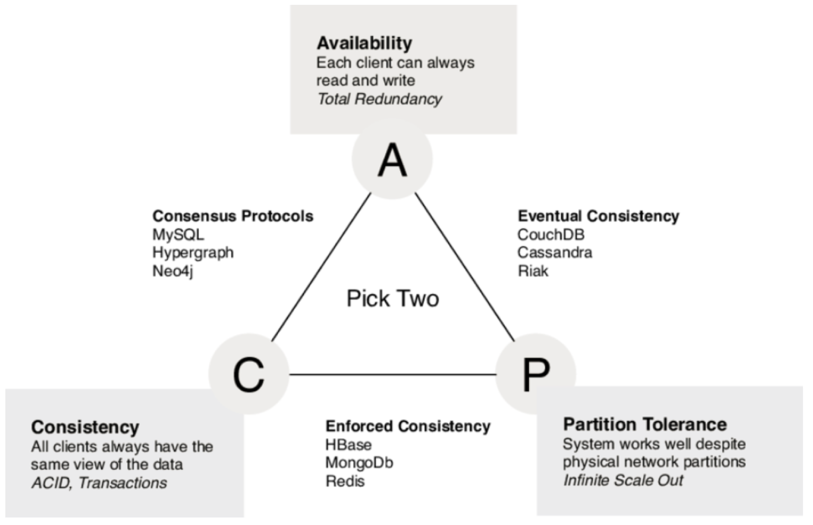

# Data integration

There is no universal database solution to address the variety of data requirements business application's needs. And it is not wish-able to have such monster product. So the needs for data integration should come by considering the dataflows across a business process at stake or across an entire business organization and even sometime in a network of business partners (a blockchain network as an example). 

## Dataflows

At the application level, dataflow definition focuses to address where the data is created, where it is persisted, and how other components access the data. With microservice adoption, the root entity or aggregate will be managed by one service, and persisted in its boundary. There will be multiple databases, or multiple schemas within database cluster, and there will be different database type: document, relational, graph, object, files...  User interface external to this microservice will get the forms, for user will use to enter data. B2B integration can also receive data. User interface or B2B integration needs to use APIs at the microservice level to push those data. Event driven microservice will produce and consume events with un-mutable data. 
At the higher level, a domain level, independent applications will communicate by exchanging data via service operations, via point to point messaging, via pub/sub mechanism, or by getting data using batch jobs and files.    
All those things are part of the dataflows.

As another example when implementing microservices using the [CQRS]() pattern, we need to pay attention on what the write model is, and what are the read representation needs to be, and built from which sources. For each expected query, developer needs to define the formats, the local persistence mechanism, and how it will get data from other microservices. The good news is that, as query part are autonomous deployed microservice or even function as a service, they can be build independant to the bigger microservice responsible of the write operation.

As part of this clear separation of read, write models, and aggregate per microservice, we also need to think about data consistency.

The classical approach to keep different systems data consistent, is to use two phase commit transaction, and the orchestrator to keep the write operation in expected sequence. In the world of microservice with REST end points, it is not possible to do two phase commit transaction across multiple microservices (see next section on the CAP theorem). Alternate model is to use event sourcing to keep write order in a log, and adopt eventual consistency, where we accept a small lag time in the data view.

## CAP Theorem

Data replication in distributed computing, like the cloud, falls into the problem of the [CAP theorem](https://en.wikipedia.org/wiki/CAP_theorem) where only two of three properties consisting of Consistency, Availability and netowrk Partition Tolerance can be met simultaneously. In most microservice implementation context, Consistency (see the same data at any given point in time) and Availability (reads and writes will always succeed, may be not on the most recent data) are in trade off. 

The diagram below explains the mapping of data persistence product types with the CAP theorem dimensions.

## Transaction

We do not want to write another book on transaction, but this is important to keep the followings in mind when addressing application design and architecture:

* With ACID transaction, atomicity, isolation and durability are database characteristics and are the key mechanisms for fault tolerance . Consistency is application specifics and depends on what the code set in the transaction.
* **Atomicity** guarantees that write operations are all done in one unique operation or aborded in case of fault. 
* **Consistency** assesses that the data invariants are always true. This is in the application scope, database can only verifies some constraints, like on null, key integrity, data type, length,... Database can guaranty foreign key and constraints, but not business logic invariants.
* **Isolation** guarantees concurrently executing transactions are isolated from each other. It protects the clients to read the same row at the same time or write in the same table at the same time. Transactions are isolated from each other. This approach impacts performance. So modern databases are using weaker algorithm for isolation to address a good level of scalability.
* **Durability** is to keep data without losing it overtime. It means saving to a durable disk, and avoid data corruption. The transaction could only be considered successful if the write operation on disk is done, or in case of cross node replication, when all the nodes have done their work.
* ACID transaction is not about concurrency (like it is in multithreading) but it is the ability to abort a transaction on error and have all writes from that transaction discarded.

### Transaction in distributed system

Any application using data may consider some potential issues like:

* database software or server hardware failure
* network failure
* application crashes while writing to the database
* concurrent update at the same time, overwriting each others
* reading data while write operation happened

So making application reliable is quite a challenge and is a lot of work and testing. The way to simplify the coding of data centric application is to use transaction.

### When to use transaction

A transaction is a way for an application to group several reads and writes together into a logical unit. The read or write operations succeed (commit) or fail (abort and rollback to avoid side effect).

The majority of stateful business service, micro or monolithic, should use transaction. The aggregate and data responsibility define the scope of the transaction and the microservice bounded context.

For higher availability and higher performance, application needs to run in parallel, and therefore some safety guards needs to be done without transaction.

The introduction of document oriented database, focused on a non relational data model, where relationship integrity is less important, while partitioning, replication are more important to address fault tolerance and scalability.
