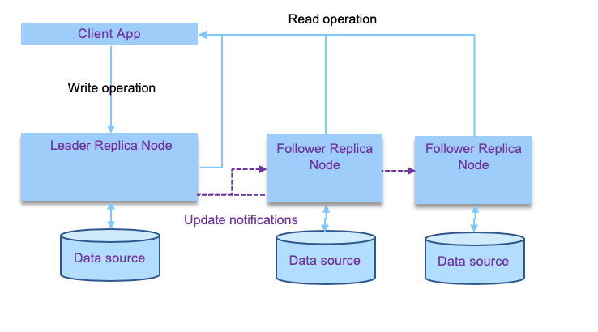
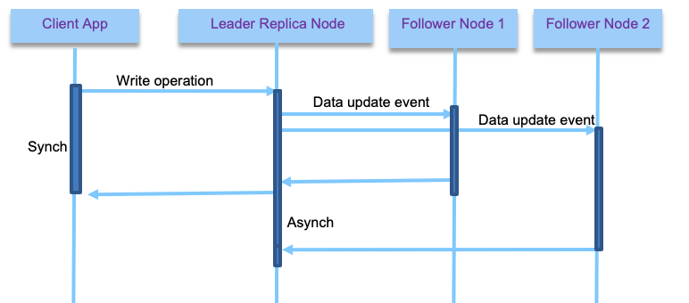
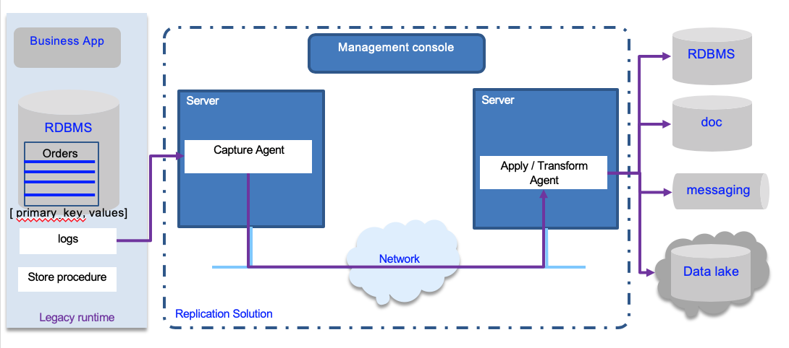
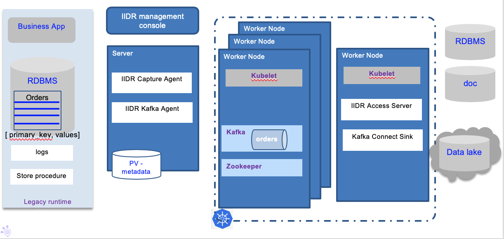
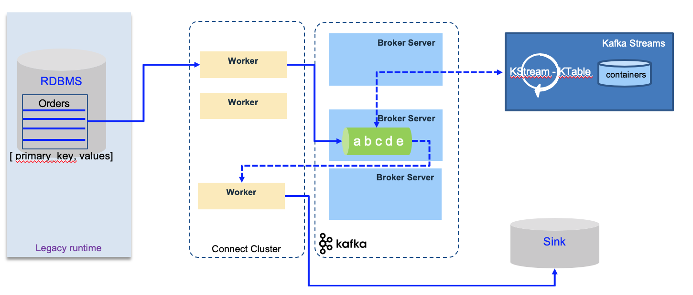

# Data replication

!!! abstract
    In this article, we are dealing with data replication from traditional Database, like DB2, to a microservice environment with document oriented or relational data. Database replications can be used to move data between environments or to separate read and write models, which may be a viable solution with microservices, but we need to assess how to support coexistence where older systems run in parallel to microservices and use eventual data consistency pattern. 

We recommend reading the ['Ensure data resilience' article from Neal Fishman](https://www.ibm.com/cloud/garage/practices/manage/ensure-data-resilience/) to understand the problems related to data resilience and how they fit into [data topology](../topology/README.md) and governance broader discussions.

## Concepts

Data Replication is the process of storing data on more than one storage location on same or different data centers. It fits well, when dataset is small enough to be persisted in one machine, and when data do not change over time.
Data replication encompasses duplication of transactions on an ongoing basis, so that the replicates are in a consistently updated state and synchronized with the source.

The database centric replication mechanism involves different techniques to apply data replication between databases of the same product (DB2 to DB2, Postgresqsl to Postgresql). The approach is to control availability and consistency.

Replication implementations are most of the time, black box for the business application developers, but we want to present three types of replication architecture:

* **single-leader**: one of the replica is the leader, and receive write operations from client services. Other replicas are followers, listening to data updates from a replication log and modify their own data store. Read operations can happen on any node, and followers are specifically read-only. This is a pattern used by Kafka, Postgresql, RabbitMQ...

    

* **multi-leader**: multiple nodes accept write operations (they are leaders), and act as follower for other leaders. 
* **leaderless**: each node accept write operations. Client sends write to multiple replicas, accept p acknowledge (p <= number of nodes), but also performs n reads to assess eventual stale data. (This type is used in Cassandra or DynamoDB)

### Single leader

All write requests are done on the leader, but reads can happen on followers as well. It helps to scale out the solution and also to support long distance replications.
Replication can be done synchronously or asynchronously. With synchronous the leader waits until at least one follower has confirmed replication before reporting to the client that the write operation is successful. From the client point of view, it is a synchronous call.

With asynchronous the leader does not wait for followers to replicate. With synchronous, we are sure the data are not lost as at least one follower responded, but if the follower node has failure then the write operation is not consider completed, even if leader has the data. The client can do a retry. But the leader may need to block other write requests until it sees a follower alive. With synch, the data is also consistent with the leader. The figure above illustrates a synchronous mechanism for client - leader and first follower to respond, and asynchronous for the other followers.

It is important to note that asynch replica may be the only possible solution when the number of followers is important or when they are separated by long distance with high latency networking communication.  Because a full synchronous mechanism will block the write operations in case of a follower failure and will not be reliable.

With asynch, two reads at the same time on the leader and one of the follower will not get the same results. This inconsistency is temporal: when there is no more write then the followers will become eventually consistent. This elapse time is called replication lag.

This lag can have some interesting derived issues, like seeing data in one query (done on a follower with small lag) and then not seeing the data from the same query done on a bigger lagged follower. To avoid that, the pratice is to use a monolitic read: user makes several reads in sequence, they will not see time go backward. Which can be achieved by ensuring the reads for a given user are done on the same follower. This is what kafka does by assigning a consumer to partition.

With asynch replica, if the leader fails, data not yet replicated to the followers, is lost until a new leader starts to accept new writes. 

Also **adding a new follower** brings other challenges: as the data are continuously being written to the leader database, copying the database files to the new follower will not be consistent. One adopted solution is to snapshot the database, without locking write operations, and copy the data to the follower, then from this snapshot, consumes the update log. To work the snapshot position needs to be known in the replication log. 

To support follower failure, the log needs to keep position of the last commited read, so when the follower restarts, it can load data from this position in the log. 

When the leader fails, a follower needs to take the leadership, and then other followers need to get data from the new leader. Kafka, combined with zookeeper, uses those last two mechanisms to support replication. Selecting the new leader is based on consensus algorithm, to ensure minimum data lost.  

When using single leader, it is possible to reach a split brain state, when the old leader comes back to live, and thinks it is still a leader: both leaders accept writes which leads to data corruption. 

Most RDBMS uses the master-slave pattern combined with asynchronous replication. Postgresql uses a file based log shipped to the followers when a transaction is committed. Logical replication starts by copying a snapshot of the data on the publisher database. Once that is done, changes on the publisher are sent to the subscriber as they occur in real time. The subscriber applies data changes in the order in which commits were made on the publisher side so that transactional consistency is guaranteed for the publications within any single subscription. 
DB replications are covered with RDBMS features and it offers low administration overhead. It is important to note that source and target data structures have to be the same, and change to the table structure is a challenge but can be addressed (usually mitigated by 3rd party tooling).

Now the adoption of database replication features is linked to the data movement requirements. It may not be a suitable solution for microservice coexistance as there is a need to do data transformation on the fly.

### Multi leaders

With multi-leader configuration each leader gets write operations, and propagates data update notifications to all nodes. This is an active-active replication. And it is the practice when dealing with multiple datacenters. 

The write operations are propagated asynchronously which is more permissive to network failure. It is important to note that the following problems need to be addressed with this topology:

* Update of the same data at the same time, leading to write conflict
* Using automatic primary key generation by the database may create duplicate keys
* Triggers that work on conditions on the data to do something could never be triggered due to data conditions that will never happen in this active - active configuration.
* Integrity constraints can be violated, as one records may be processed without the others being yet present.

For the write conflict resolution, there are different strategies, one uses timestamps so the last write wins the record update, but this could lead to data lost. In fact conflict resolution will be dependant of the business logic and data knowledge. So custom code needs to be done to apply this logic to write conflicts.

When there is more than two leaders, the replicas topology can be use a ring, star or all-to-all model, as illustrated in the figure below:

With **Ring**, a leader forwards and propagates its own writes to one neighbor. With **Star** one designated root node forwards writes to all of the other nodes. Finally with **All-to-all**, every leader sends its writes to every other leader.

With Ring and Star, a node failure impacts the data replication to any node, and with all-to-all we need to address looping on the same write. The mitigation is to use a unique identifier for each node, so a write event coming with the same node_id at the current node id is discarded.

### Leaderless

In this last replication technique, the client application is doing write operation on any replicas. There is no leader. This is the approach used by Cassandra and Dynamo system. The write operations order is not maintained. With leaderless failover does not exist, in case of node failure the client has to accept n missing acknowledges. If the client read back data from a previously failed node, that just restarted, it may read old / stale data. To mitigate this problem, reads are done to multiple nodes in parallel, and the client needs to consolidate the returned value (may be using timestamp or version number). 

A node that is restarting can catch up on the replicated data by doing read repair or by using an anti-entropy process. Read repair, is done by the client seeing old value from one of the replica, and push back the new value to it. The anti-entropy process is in the database mechanism, with a daemon process running to replicate missing data to any replicas.

## Considerations

The main advantages for data replication (providing a consistent copy of data across data storage locations) are:

* increased data availability
* increased access performance by moving data close to users
* decreased network load

Maintaining Data consistency at all different sites involves complex processes, and increase physical resources.

### Business motivations

Among the top three priority of data integration and integrity solution, for 2019 and 2020, are ([source IDC](https://www.idc.com/getdoc.jsp?containerId=IDC_P31631)):

* Data intelligence (57%)
* Data replication (50%)
* Application data sync (51%)

Two important derived use cases:

* **Business in Real Time**:
    * Detect and react to data events as they happen to drive the business, and propagate those changes for others for consumption
    * Optimize decision to sub-second latency level, i.e. real time analytics  
* **Always On Information**
    * High availability with Active-Standby and Active-Active data replication deployments
    * Data synchronization for zero down time data migrations and upgrades

## Technology overview

### Data lake technologies

There are multiple alternatives to build a data lake solution. In the field, the following technologies are usually used: Hadoop, Apache Spark, cloud object storage, and Apache Kafka. 

* **Hadoop/HDFS** (Hadoop File System) is designed to process large relatively static data sets.  It provides a cost effective vehicle for storing massive amounts of data due to its commodity hardware underpinnings that rely on built in fault tolerance based on redundancy. Hadoop is ideal for highly unstructured data and for data that is changing at the file level.  With Hadoop, you don’t change a record in a file.  Rather, you write a new file.  A process reads through the files to discover the data that matters and to filter out unrelated data. It is massively scalable processing. 

* **Apache Spark** is a data processing engine tightly coupled with the Hadoop ecosystem. It is one of the most active open source projects ever. Spark is mainly used as ETL engine capable of integrating data from various SQL and NoSQL data sources and targets including RDBMS, NoSQL DB, Cloud Object Store, HDFS and other cluster file systems

* **COS (Cloud Object Storage)** in conjunction with a Query Engine like Apache SparkSQL or IBM Cloud SQLQuery Service is a legit data lake solution, especially because, as a managed service, it provides unlimited capacity and very high scalability and robustness against failures

* **Kafka** is designed from the outset to easily cope with constantly changing data and events. It has built in capabilities for data management such as log compaction that enable Kafka to emulate updates and deletes. The data storage may be self described JSON document wrapped in [Apache Avro](https://avro.apache.org/docs/current/) binary format. Kafka exploits the scalability and availability of inexpensive commodity hardware. Although Kafka supports persisting data in queues for weeks or even months, it's not yet a proved technology for long term storage, even if companies are already adopting it for event sourcing.

Kafka provides a means of maintaining one and only one version of a “record” much like in a keyed database. But an adjustable persistence time window lets you control how much data is retained.

Data Replication solutions provide both bulk and continuous delivery of changing structured operational data to both Hadoop and Kafka.  

There are more and more organizations choosing to replicate their changing operational data to Kafka rather than directly into Hadoop. Kafka’s ability to self manage its storage, emulate the concept of a keyed record and provide self describing structural metadata combined with the benefits of scalability and open source interfaces makes it an ideal streaming and staging area for enterprise analytics.  

If needed, data can be staged in Kafka for periodic delivery into Hadoop for a more controlled data lake, preventing the lake from becoming a swamp with millions of files.  

Data stored in Kafka can be consumed by real time microservices and real time analytics engines.

Kafka can also be used as a modern operational data store. It has the built in advantages of low cost scalability and fault tolerance with the benefits of open interfaces and an ever growing list of data producers (feeding data into Kafka) and data consumers (pulling data from Kafka), all with self managed storage.

Other use cases are related to auditing and historical query on what happened on specific records. Using event sourcing, delivered out of the box with kafka, this will be easier to support. It can be used to propagate data changes to remote caches and invalidate them, to projection view in CQRS microservices, populate full text search in Elasticsearch, Apache Solr, etc...

### Change data capture (CDC)

Another important part of the architecture is the change data capture component. The following diagram presents a generic architecture for real time data replication, using transaction logs as source for data update, a change data capture agent to load data and send then as event over the network to an "Apply / Transform" agent responsible to persist to the target destination. 

The data replication between databases by continuously propagate changes in real time instead of doing it by batch with traditional ETL products, brings data availability and consistency cross systems. It can be used to feed analytics system and data warehouses, for business intelligence activities.

For example, IBM's [InfoSphere Data Replication (IIDR)](https://www.ibm.com/us-en/marketplace/infosphere-data-replication) captures and replicates data in one run or only replicate changes made to the data, and delivers those changes to other environments and applications that need them in a trusted and guaranteed fashion, ensuring referential integrity and synchronization between sources and targets. The architecture diagram below presents the  components involved in CDC replication:

 
 Product explanations can be obtained  [here.](https://www.ibm.com/support/knowledgecenter/en/SSTRGZ_11.4.0/com.ibm.cdcdoc.sysreq.doc/concepts/aboutcdc.html)

We can combine Kafka and IIDR to support a flexible pub sub architecture for data replication where databases are replicated but event streams about those data can be processed in real time by any applications and microservices. This is known as [lambda-architecture](https://en.wikipedia.org/wiki/Lambda_architecture).

The combined architecture of a deployed solution looks like in the diagram below:

With the management console, the developer can define a data replication project that can include one to many subscriptions. Subscriptions define the source database and tables and target kafka cluster and topics.  

The Kafka cluster can run on Kubernetes. 

The first time a subscription is running, a "Refresh" is performed: to allow the source and target to be exactly synchronized before the incremental, changes only get replicated down to the target. This means all the records in the source table will be written as Kafka events. 

When running a subscription the first time, Kafka topics are added: one to hold the records from the source table, and the second to keep track of which records have already been committed to the target. 

For more details about this solution see [this product tour](https://www.ibm.com/cloud/garage/dte/producttour/ibm-infosphere-data-replication-product-tour).

#### Debezium

[Debezium](https://debezium.io/) is an open source distributed platform for change data capture. It retrieves change events from transaction logs from different databases and use Kafka as backbone, and Kafka connect.
It uses the approach of replicating one table to one Kafka topic. 

It can be used for data synchronization between microservices using CDC at a service level and propagate changes via Kafka. The implementation of the [CQRS pattern](https://ibm-cloud-architecture.github.io/refarch-eda/evt-microservices/ED-patterns/#command-query-responsibility-segregation-cqrs-pattern) may be simplified with this capability. 

### Why adopting Kafka for data replication

Using Kafka as a integration layer brings the following advantages:

* Offload processing
* Data aggregation from multiple sources
* Deliver a common platform for staging to other data consumers
* Provide a storage system for duplicating data
* Buffer unprocessed messages
* Offers throughput and low end-to-end Latency 
* Offers real time processing and retrospective analysis
* Can correlate streaming feeds of disparate formats
* Flexibility of input source and output targets
* Built in stream processing API on real time feeds with Kafka streams
* Commit Log
* Fault tolerance, scalability, multi-tenancy, speed, light-weight, multiple landing-zones.

### Kafka connect

[Kafka connect](https://kafka.apache.org/documentation/#connect) simplifies the integration between Kafka and other systems. It helps to standardize the integration via connectors and configuration files. It is a distributed, fault tolerant runtime able to easily scale horizontally. The set of connectors help developers to not re-implement consumers and producers for every type of data source.

To get started please read [this introduction](https://kafka.apache.org/documentation/#connec) from the product documentation. 

The Kafka connect workers are stateless and can run easily on Kubernetes or as standalone docker process. `Kafka Connect Source` is to get data to Kafka, and `Kafka Connect Sink` to get data out of Kafka.

A worker is a process. A connector is a re-usable piece of java code packaged as jars, and configuration. Both elements define a task. A connector can have multiple tasks. 

In distributed deployment, the connector supports scaling by adding new workers and performs rebalancing of worker tasks in case of worker failure. The configuration can be sent dynamically to the cluster via REST API.

## Recommended Readings

* [IBM InfoSphere Data Replication Product Tour](https://www.ibm.com/cloud/garage/dte/producttour/ibm-infosphere-data-replication-product-tour)
* [Kafka connect hands-on learning from Stéphane Maarek](https://learning.oreilly.com/videos/apache-kafka-series)
* [Integrating IBM CDC Replication Engine with kafka](https://www.ibm.com/support/knowledgecenter/en/SSTRGZ_11.4.0/com.ibm.cdcdoc.cdckafka.doc/concepts/before_install.html)
* [Very good article from Brian Storti on data replication and consistency](https://www.brianstorti.com/replication/)
* [PostgreSQL warm standby replication mechanism](https://www.postgresql.org/docs/current/warm-standby.html)
* [Change Data Capture in PostgreSQL](https://medium.com/@ramesh.esl/change-data-capture-cdc-in-postgresql-7dee2d467d1b)
* [eBook: PostgreSQL Replication - Hans-Jürgen Schönig - Second Edition](https://www.packtpub.com/big-data-and-business-intelligence/postgresql-replication-second-edition)
* [Weighted quorum mechanism for cluster to select primary node](http://galeracluster.com/library/documentation/weighted-quorum.html)
* [Using Kafka Connect as a CDC solution](https://www.confluent.io/blog/no-more-silos-how-to-integrate-your-databases-with-apache-kafka-and-cdc)
* [Debezium tutorial](https://debezium.io/docs/tutorial/)
* [Ensure data resilience - author: Neal Fishman](https://www.ibm.com/cloud/garage/practices/manage/ensure-data-resilience/)