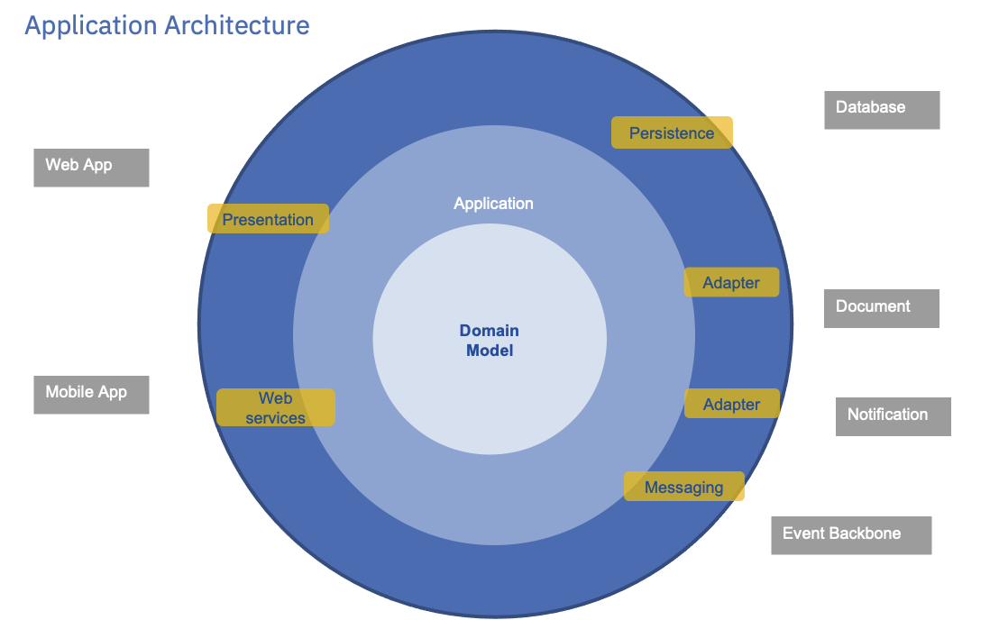
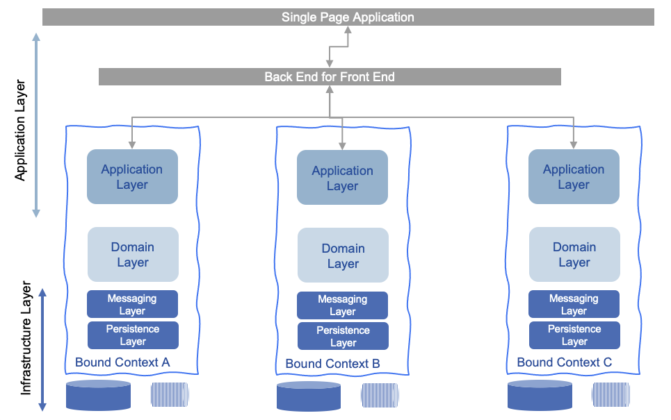

# Domain Driven Design notes

Event storming description is in [EDA web site](https://ibm-cloud-architecture.github.io/refarch-eda/methodology/event-storming/) 
with a [summary of DDD](https://ibm-cloud-architecture.github.io/refarch-eda/methodology/domain-driven-design/).

## Analysis Practices to keep in mind

### Identifying domains and core domains

Questions to consider:

* why the custom software is being written rather than opting for a commercial off-the-shelf product?
* How does it fit within the strategy of the company?
* Does part of the software give the business a competitive edge?
* What are the motivations behind a requirement? is it constrained by existing system?

Large problem domains can be partitioned into subdomains to manage complexity. Subdomains are abstract concepts. 
Subdomains are typically reflecting the business capabilities of the business organizational structure. 
Subdomains represent areas of capability, define business processes, and represent the functionality of a system.

For core domain focus on the product rather than view it as a standalone project. Your product is an evolving succession of feature enhancements and tweaks.

Distillation is used to break down a large problem domain to discover the core, supporting, and generic domains.

Consider outsourcing, buying in, on the supporting and generic domains.

A model is represented as an analysis model and a code model. They are one and the same.

A Model-Driven Design binds the analysis model and a code model through the use of the shared language.

Ubiquitous language is about collaboration and not the development team just adopting the language of the business.

### Event storming

* A **domain event** is something meaningful to the experts that happened in the domain.
* Always keep time ordering in the event discovery
* Add **commands** that cause events. A single command may actually cause multiple domain events
* Stack events arriving at the same time
* If users are not comfortable with aggregate, talk as business entity
* Classical DDD was in the OOD too, so aggregate has behavior, and handles commands and emits domain events. 
More REST oriented it can be mapped to a Resource.
* By grouping commands, events and aggregate, keep the process in time order. Repeat the aggregate sticker if the same aggregate receives a different command stimulus over time.
* Keep the time in correct order so that the time is accurately represented as things occur in your model over time
* 4th step is to derive context boundaries: from the aggregate, commands and events you realize that some of these apply to the core domain and some of them actually don't. 
Some of the commands and events will happen to entities that belong in other bounded context.

    * Within a business context every use of a given domain terms, phrases, or sentences, the Ubiquitous Language, inside the boundary has a specific contextual meaning
    * You will fail if you represent the same concept into three different context the same way: a "Insurance Policy" to cover Underwriting, Claim or Inspection. 
    * Bounded context defines the applicability of the model and ensures that its integrity is retained 

* Assess the **core domains**, that are significant and competitively advantageous to the organization.
* Whatever is supporting or generic, move off to their own bounded context
* Big problem domain is split up into subdomains for easier understanding. A model in a context is created for each subdomain.
* Context maps help you to understand the bigger picture

* 5th step is to understand certain views that are important to the user, as well as policy and process that consume events and act on command. 

If you have areas of an application that resemble the Big Ball of Mud (BBoM) pattern then the best thing to do is to put
 a boundary around them to prevent the mud spreading into new areas of the application.

An *anti-corruption layer* wraps the communication with legacy or third-party code to protect the integrity of a bounded context.
 An anti-corruption layer manages the transformation of one context’s view to another, retaining the integrity of new code and preventing it from becoming a BBoM

### Some other notes

May only use events, commands and aggregates in the event storming.

This is more the ownership of the data view that will drag the coupling back to the aggregate.

Think about developing scenario to validate the model and test cases to verify aggregate correctness

Context boundaries can be influenced by:

* Ambiguity in terminology and concepts of the domain
* Alignment to subdomains and business capabilities
* Team organization and physical location
* Legacy code base
* Third party integration

### Ensuring consistency in the Ubiquitous Language

* Ensure that you have **linguistic consistency**. If you are using a term in code that the domain expert doesn’t say, 
you need to check it with her. It could be that you have found a concept that was required,
* Create a glossary of domain terms with the domain expert to avoid confusion
* Ensure that you use one word for a specific concept.
* Avoid overloaded terms, avoid design pattern name (like DTO)
* Naming is very important. Validate your code design by speaking to your business users about classes. 
* The UL should be visible everywhere, from namespaces to classes, and from properties to method names
* Refactor your code to embrace the evolution by using more intention-revealing method names.

### Context mapping

A context map reflects the way things are right now. It provides a holistic view of the technical 
integration methods and relationships between bounded contexts. Without them, models can be 
compromised, and bounded contexts can quickly change to balls of mud as integration blurs the 
lines of a model’s applicability.

An **anti-corruption layer** provides isolation for a model when interfacing with another context. 
The layer ensures integrity is not compromised by providing translation from one context to another.

Integration using the **shared kernel** pattern is for contexts that have an overlap and shared a common model.

Integration via an **open host** service exposes an external API instead of requiring clients to transform from one model to another. 
Typically, this creates a published language for clients to work with.

The **conformist** pattern describes the relationship between an upstream and downstream team where the upstream team 
will not collaborate with the downstream team. This is often the case when the upstream team is a third-party.

## Implementation related patterns

A domain model’s structure is composed of entities and value objects that represent concepts in the problem domain.
Associations that can be traversed in more than one direction also increase complexity. Spend time to design such associations.

Aggregate represents a consistency boundary that decomposes large models into smaller clusters of domain objects that are technically easier to manage.

Bidirectional relationship adds technical complexity and obscures domain concepts. **Who own** the relationship in which context?

When defining object relationships, ask at least the following:

* What is the behavior that an association is fulfilling?
* who needs the relationship to function?
* how to qualify a relation to limit the  umber of object to be hydrated? 

### Value Objects

Value objects are DDD modeling constructs that represent descriptive quantities like *magnitudes, value and measurements*.
 (e.g. Money, Currency)
They do not have identity. Value objects are immutable; their values cannot change.

Value objects are cohesive; they can wrap multiple attributes to fully encapsulate a single concept.

Value objects can be combined to create new values without altering the original.

Value objects should never be in an invalid state

Remember that value objects in one domain might be entities in another and vice versa.

You can persist the value of value objects directly in a de-normalized form.

### Entities

Entities are domain concepts that have a unique identity in the problem domain. Choosing an identifier is a major
implementation concern. They may have a life cycle.

Entities should always be valid for the given context.

Invariants are fundamental truths about an entity, so they should always be enforced.

Be careful of modeling physical concepts as single entities. The typical Customer entity can often be logically split across multiple bounded contexts into numerous entities.

Behavior can be pushed in domain service object or value objects. For example the `HolidayBooking` entity delegates behavior and business rules to the `Stay` VO. 

Avoid bloating any classes with more than one responsibility: use Single Responsibility Principle

You should be careful about how much of your object graph to expose, because clients will couple themselves to it. (See the [law of demeter dot counting](http://haacked.com/archive/2009/07/14/law-of-demeter-dot-counting.aspx/))

Entity’s interface should expose expressive methods that communicate domain behaviors instead of exposing state

## Aggregates

Domain invariants are statements or rules that must always be adhered to. 

Aggregate is an explicit grouping of domain objects designed to support the behaviors and invariants of a domain model 
while acting as a consistency and transactional boundary. 

Aggregate is technical implementation concept that help to better manage bi-directional associations and ensure consistency. 

By effect, aggregates decompose large object graphs into small clusters of domain objects to reduce the complexity.

When all domain objects involved in an invariant reside within the same aggregate, it is easier to compare and coordinate 
them to ensure that their collective states do not violate a domain invariant.

An object reference is necessary if the association is supporting a domain invariant for a specific use case: 

  * *a Customer has Orders, but an Order only needs a Customer’s ID to meet invariants.*
  * *The order lines do not exist or make sense outside the concept of an order*

Align aggregate boundaries with domain invariants to help enforce them. 

Aggregates ensure transactional boundaries are set at the right level of granularity. 

To enforce consistency all interaction needs to go through a single entity known as the **aggregate root**. 

Domain objects outside the aggregate can only hold a reference to the aggregate root.

When an aggregate is deleted all the domain objects within it must be removed as well.

Objects outside of the aggregates can have no access to any of the internal objects of the aggregate; 
this ensures control of the domain objects and ensures consistency within the aggregate.

No parts of the aggregates can be separately pulled from the data store unless it is purely for reporting. 
This leads to eventual consistency between aggregates.

> To demonstrate an eventually consistent rule spanning multiple aggregates, consider a loyalty policy: 
If a customer has spent more than $100 in the past year, she gets 10% off all further purchases. When an order is placed, 
the Order aggregate is updated inside a transaction exclusively. At that point, the Loyalty aggregate does not have a 
consistent view of the customer’s purchase history because it was not updated in the same transaction. However, 
the Order aggregate can publish an event signalling the order was created, which the Loyalty aggregate can subscribe to.
In time the loyalty object will be able to update the customer’s loyalty when it handles the event.

When designing aggregate, try starting small and justifying the addition of each new concept to the aggregate.
An aggregate represents a concept in your domain and is not a container for items. Ensure that each object 
is required to define the behavior of the aggregate instead of just being related to the aggregate.
Why would you need to load all the items to add another?

A large aggregate is likely to have more than one responsibility, meaning it is involved in multiple business use cases. 
Subsequently, there is greater opportunity for multiple users to be making changes to a single aggregate, increasing
concurrency conflict.

If you find that you are modifying more than one aggregate in a transaction, it may be a sign that your aggregate boundaries can be better aligned with the problem domain.

Aggregates should not be designed around UIs. Instead map from multiple aggregates onto a single view model that contains all the data a page needs.
But if we need to go to 3 or more repository to build the view, then we may want to consider CQRS.

Persistence, consistency, and concurrency are all important implementation details that can be tricky to get right and may cause you to rethink your aggregate boundaries.

Only aggregate roots can be obtained directly with database queries. The domain objects that are inner components of the
 aggregate can be accessed only via the aggregate root. Each aggregate has a matching repository that abstracts the 
 underlying database and that will only allow aggregates to be persisted and hydrated

A Delete Operation Must Remove Everything within the Aggregate Boundary at Once.

Avoid lazy loading except if you really need so, and mostly for performance reason.

### Application Architecture

Application architecture structures the application to keep clear separation of concerns between  
technical capabilities from the business / domain logic.
Presentation, persistence, and domain logic concerns of an application will change at different rates.

Different pattern can be used, the layered architecture shows the domain model to be on its own layer
isolated from the rest. Domain logic focuses on domain rules, concepts, information, and work flows.
When looking at the use cases to develop the application service, it may be possible to discover
the domain model may not be required at all, if for example the behavioral logic is just to do CRUD on data.

Surrounding the domain layer is an application layer that abstracts the low-level details of the domain 
 behind a coarse-grained API.

The darker blue circle represents infrastructure layer, it adapts to the external world. 

Domain depends on nothing, application layer depends only on the domain, and adapters and integration
 dependencies face inward.

Application services operate at a higher level of abstraction than the domain objects, exposing a coarse-grained set of services
 using the **Facade** pattern.

The application service layer is responsible to coordinate the retrieval of domain objects from a data store, delegating work to them, 
and then saving the updated state.

The application service layer enables the support of disparate clients without compromising the domain layer’s integrity. 
New clients must adapt to the input defined by the application’s API.
They must also transform the output of the application service into a format that is suitable for them. 
In this way, the application layer can be thought of as an anti-corruption layer, ensuring that the domain layer stays 
pure and unaffected by external technical details.
Application logic is all about coordination and orchestration through delegation to domain and infrastructural services.

Infrastructure layer supports APIs (gateway), messaging, persistence, integration with other bounded contexts,
and supports cross-cutting concerns as logging and security...

Data transfer objects (DTOs), presentation models, and application event objects are used to communicate changes or actions in the domain.

A good isolated application architecture is validated by using unit tests for the app and domain layers
combined with mocks for external resources and integration tests for the infrastructure layer.

An application that is composed of two or more bounded contexts may have an architectural style for the user interfaces and 
different architectures for each of the bounded contexts.

The figure below illustrates that those layers can be conceptual when integrating with multiple bounded
contexts: the application layer is spread over the user interface, the back end for front end component
and over a set of other microservices / bounded contexts: 

Inside of the microservice app, we can use the layered architecture as a way to organize the code, for example, infrastructure
 supports JPA frameworks, messaging API, integrates external systems like a distributed cache, data base, document oriented DB...

 Now with Java framework with annotation mechanism the infrastructure is going into the application layer quite easily. It should  
 not be a big concern, but developers need to take care of what stays in the app layer, and when to add classes in infrastructure one.   