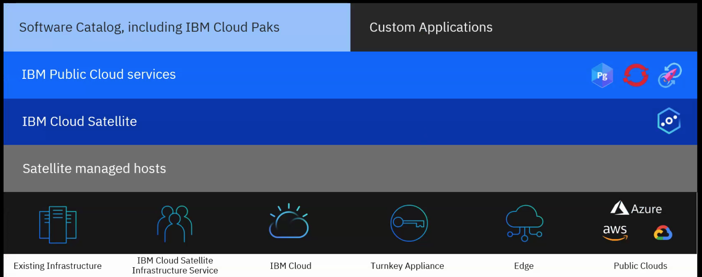

# IBM Cloud Satellite

Quick [Product Overview](https://cloud.ibm.com/satellite/overview).

## Goal 

The main goal for [Satellite](https://cloud.ibm.com/satellite/overview) is to run workloads 
where it makes the most sense. Based on kubernetes, it is a API driven 
cloud services to achieve consistent application deployment and performance 
across any environments (own data center, cloud or edge location).

Based on the concept of location that groups your data center and IBM cloud. 

* Expend the reach of IBM Cloud (management of services, and user experience) to infrastructure outside of IBM data centers.
* Bring the IBM cloud services to your data center
* Bring consistency of services and content, and security: bring your TLS certificates
* Use one control plane on IBM Cloud data center. Run day 2 operations on the same tools on IBM Cloud. 
* Consider them as mini IBM cloud regions
* It gives us a central view of all our k8s / OCP clusters

## Challenges to address:

* Latency: data processing close to te data
* Data residency: stay in country
* Lack of agility: app run across many locations
* Lack of visibility: ops operate 5 to 8 clouds and need visibility for platform and apps
* Local management
* Lack of version control
* Inconsistent talent availability
* Inability to instantly customize

K8s: maintenance is quickly becoming difficult.

## Features

* Use a single API to create a Satellite location and add host machines from your on-prem data center, edge devices, or other cloud providers. Then, the hosts power IBM Cloud services, such as IBM Cloud Databases or OpenShift clusters, anywhere you need them.
* Consistent app deployments: Create, version control, update, and review your app configurations across all your OpenShift clusters from a single pane.
* Control and audit the network traffic and communication flow between your OpenShift clusters with a built-in, application-level firewall, and use IBM Cloud monitoring and logging services to consolidate your logs, metrics, and alerts

## Use cases:

* consume cloud services butt use your data locally
* location to install small box, considered as hosts
* flexible infrastructure
* as a service consumption: Cloud database, openshift, CP4Data 
* do not need to manage those services

## Installation on Azure

Provision enough nodes at the start.

1. **Create a location**: Get minimum 9 MultiZone nodes: 3 control plane, 6 worker nodes 
1. **Create a cluster**: For example OCP 4.7 with three 16x64 work. 
1. **Update Azure**: Add public IP to one or more VMs. Create disk volumes for each worker done. Attach to the nodes
1. **Install OpenShift Data Foundation** from CLI. See [Satellite doc on setting up storage](https://cloud.ibm.com/docs/satellite?topic=satellite-sat-storage-template-ov)
1. **Install as usual**

* [Video from support and training: "How to configure log-in to a Satellite Cluster"](https://www.youtube.com/watch?v=ENiNS1kYzUQ)
* [Video from support and training: "How to configure storage for a Satellite Cluster"](https://www.youtube.com/watch?v=FeE051uE4-s)

