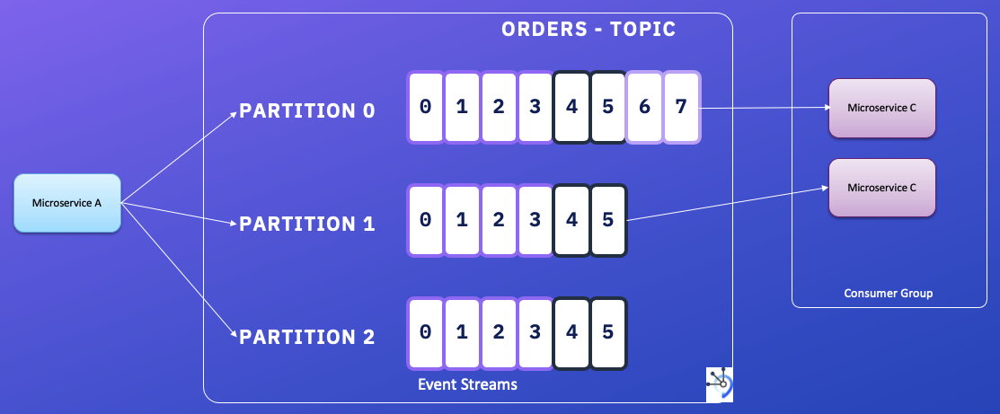

# Stream processing

This article is a summary of stream processing with links to concrete studies of specific technologies. There is a need to understand the problems related to data processing in distributed computing.

## Concepts

* **Stream processing is about processing every event as soon it happens.**
* In reality, a lot of data is unbounded because it arrives gradually over time
* The problem with daily batch processes is that changes in the input are only reflected in the output a day later
* In batch, the input and outputs are files. In stream processing a record is the event: a self contained, immutable object, representing what happened at some point in time.
* Event is produced once, and processed by multiple consumers.
* Anumber of messaging systems use direct network communication between producers and consumers without going via intermediary nodes: brokerless like [ZeroMQ](), nanomsg

## Challenges

* Using a database to keep events may work for small scale, but polling becomes expensive. Notifying consumers is one way to solve this problem, but then it means using subscription. DBs were not designed for notifications. Triggers may help but do not scale.
* Messaging system is the technology to push event to consumers. The pub/sub model support multile consumers.

### Questions to assess

* What happens if the producers send messages faster than the consumers can process them?

    * drop messages
    * buffer messages - (see later section on append log)
    * apply backpressure, or flow control to slow down the producer

* What happens if nodes crash or temporarily go offline — are any messages lost?

    * when losing messages the throughput is higher and even the latency is lower 
    * if you are counting events, it is more important that they are delivered reliably, since every lost message means incorrect counters.

## High level technology concepts

### Message brokers

* Message broker is essentially a kind of database that is optimized for handling message streams. It runs as a server, with producers and consumers connecting to it as clients. Consumers can connect at any time, and reconnect.  Producer does not wait for consumer to process the messages. Just get acknowledge the brokers got them.
* Databases usually keep data until it is explicitly deleted, whereas most message brokers automatically delete a message when it has been successfully delivered to its consumers. Such message brokers are not suitable for long-term data storage.
* Message may have filtering capability using pattern. They do not support arbitrary queries or indexing.
* Two main patterns of message delivery (and they can be combined too):

    * Load balancing: Each message is delivered to one of the consumers, so the consumers can share the work of processing the messages in the topic. 
    * Fan-out: Each message is delivered to all of the consumers.

* To ensure messages are not lost, acknowledge is used by consumers to signal end of the message processing.
* In case of not receiving an ack on time, the broker could resend the message to another consumer. when using load balancing, this means message order can be lost. A consumer B crashes while processing message m10, while consumer A is processing M11, if broker reallocate m10 to A then m10 will be done after m11. To avoid that we need one queue per consumer. (one partition per consumer in Kafka)

### Partitioned logs

With AMQP/JMS-style messaging: receiving a message is destructive if the acknowledgment causes it to be deleted from the broker, so you cannot run the same consumer again and expect to get the same result.

A log is simply an append-only sequence of records on disk. And it can be used to implement a message broker: producer append to the log, consumer read sequentially.

In order to scale to higher throughput than a single disk can offer, the log can be partitioned.

Log-based message broker support fan-out, and for load blaancing they assign one partitions to nodes with consumer group.

In situations where messages may be expensive to process and you want to parallelize processing on a message-by-message basis, and where message ordering is not so important, the JMS/AMQP style of message broker is preferable.

For high message throughput, where each message is fast to process and where message ordering is important, the log-based approach works very well.

With offset numbering schema, brokers know that all messages with an offset less than a consumer’s current offset have already been processed. But they do not to track ack at the single message, they need to get at a period or during a batch messaging ack.

Without more control, it means also that messages can be processed twice in case of consuner crashes and partition reallocation or reassignment: non ack messages are resent.

To avoid run out of disk space, the log can be circular so older messages are removed. For a 5.5TB harddisk with a write thoughput of 150MB/s it will take 10h to fill the log. 

The throughput is quite constant as it needs a disk write. While messaging systems that keep messages in memory by default and only write messages to disk if the queue grows too large, are slowing when they start writing to disk, and throughput depends on the history to retain. 

When consumer lag time is higher than retention time, then consumer will not process messages, they are lost. This is important to monitor lag and act before too late.

Read offset is under the consumer control, and it can be positioned where needed. Log-based messaging looks like batch processing where derived data is clearly separated from input data.

## CDC and log-based message broker

A log-based message broker is well suited for transporting the change events from the source database to the derived systems, since it preserves the ordering of messages.

To avoid spending a lot of time to reconstruct the state of the data change, or when you do not have the full history of change, it is relevant to start from a snapshot.

New databases are supporting change streams interface, so queries can subscribe to notifications when the results of a query change *see CouchDB, MongoDB oplog).

## Event sourcing

Event sourcing involves storing all changes to the application state as a log of change events.
Events are designed to reflect things that happened at the application level, rather than low-level state changes. Event sourcing makes it easier to evolve applications over time.

Applications that use event sourcing need to take the log of events (representing the data written to the system) and transform it into application state that is suitable for showing to a user.

For performance improvement, they have some mechanism for storing snapshots of the current state that is derived from the log of events, so they don’t need to repeatedly reprocess the full log.

When a request from a user first arrives, it is initially a **command**: at this point it may still fail, for example because some integrity condition is violated. The application must first validate that it can execute the command. If the validation is successful and the command is accepted, it becomes an **event**, which is durable and immutable.

A consumer of the event stream is not allowed to reject an event: by the time the consumer sees the event, it is already an immutable part of the log, and it may have already been seen by other consumers. Thus, any validation of a command needs to happen synchronously, before it becomes an event—for example, by using a serializable transaction that atomically validates the command and publishes the event. Alternatively, the user request to reserve a seat could be split into two events: first a tentative reservation, and then a separate confirmation event once the reservation has been validated.

Using immutable event log, we can build several different read-oriented view of the data.
Having an explicit translation step from an event log to a database makes it easier to evolve your application over time.