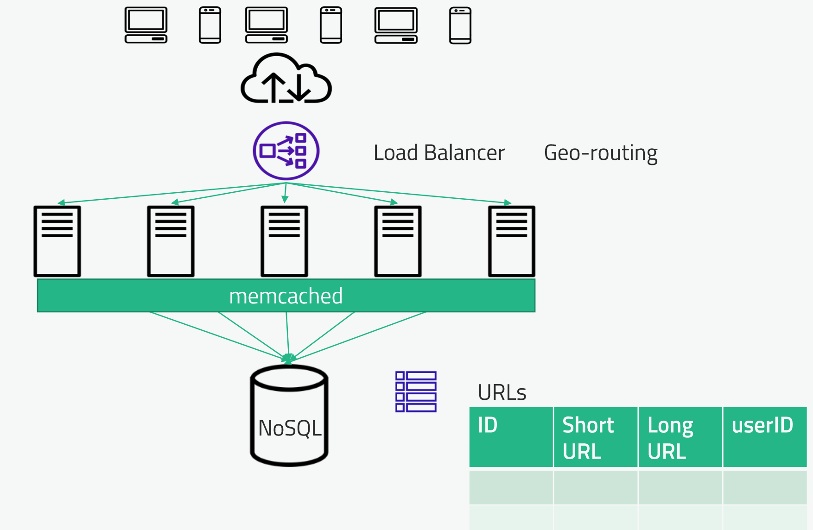
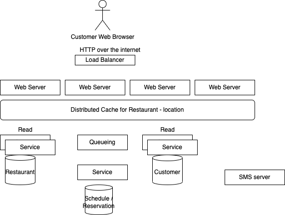
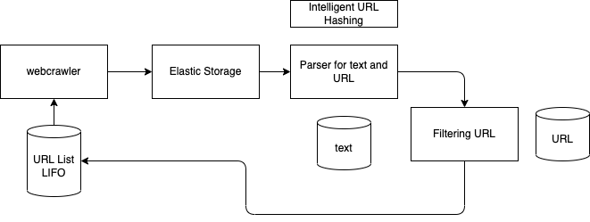
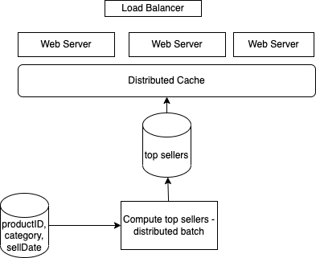
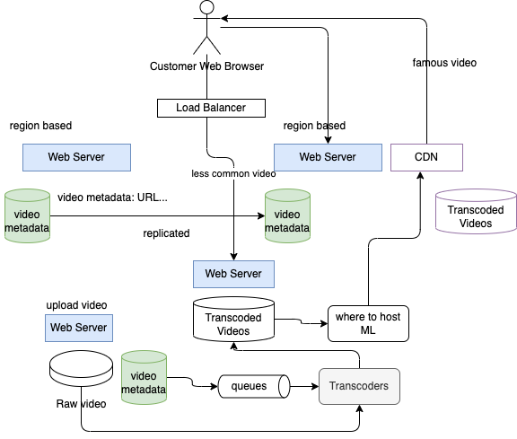
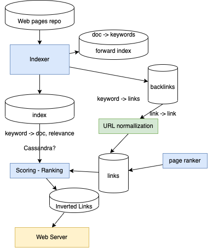
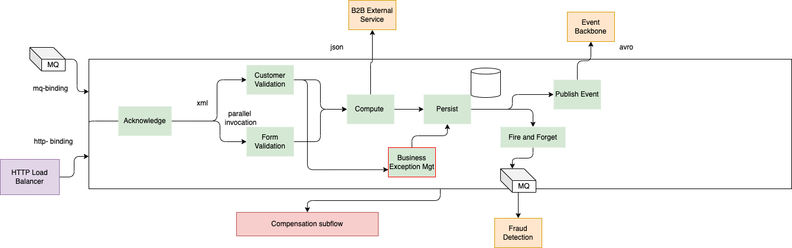

# Conduct system design

* Verify the goals

    * Why we are doing this application / solution
    * Who is the end user
    * How they will use the system and for what
    * What are the expected outcome and inputs
    * How to measure success?

* Think about end user's experience - working backward

* Establish scope

    * list some potential features
    * Are we looking at end to end experience or API design
    * type of client applications or device
    * Do we require authentication? Analytics? Integrating with existing systems?

* Design according to scale

    * What is the expected read-to-write ratio?
    * what volumes in term of transactions/ requests 
    * How many concurrent requests should we expect?
    * What’s the average expected response time?
    * What’s the limit of the data we allow users to provide?
    * De we need to expose read data in different geographys?

* Defining latency requirements

    * how fast is fast enough?
    * Try to express in SLA language: 100ms at 3-nines

* From high level to drill down

    * Cover end to end process
    * Go when necessary to detail of an API, data stores,..
    * look at potential performance bottle neck

* Review data structure and algorithms to support distributed system and scaling

* Be able to argument around

    * What type of database would you use and why?
    * What caching solutions are out there? Which would you choose and why?
    * What frameworks can we use as infrastructure in your ecosystem of choice?

* Do not be defending
* Demonstrate perceverance - determination: internal drive to search for a solution - collaboratively. 

    * Behavioral interviewing, tell the stories when you demonstrate perceverance.
    * Independent thought: getting your solution from your own
    * Independent learning
    * Never give up and never surrender

* Tech skills matter but they are just table stakes
* Demonstration self motivated: bring with your own. 
* Do not be the guy "let me google for you!"
* They do not want to see people following step by step instructions/ recipes, because it demonstrates you cannot solve new problem
* Work as no value until demonstrate to customers
## Scalability

### Single server design

* Unique server with HTTP and Database on a unique server. But single point of failure: impact is to change DNS routing with new server. Get backup
* Separate out the DB help to scale DB and server independently. 

### Vertical scaling

Use bigger server. Get a limit by hardware size. Still single point of failure.
Pros is the limited number of things to maintain.

### Horizontal scaling

Load balancer sends traffic to a farm of servers.
This is easier if your web server is stateless, that means we do not keep state of the conversation. Any server can get request at any time.

Serverless solution from AWS, Lambda, kinesis, athena

## Failover

### Cold standby

* periodic backup
* restore backup on DR site
* reconnect front end server to new DB server
* Data done after the database backup is lost
* Take time to get the new server up and running.

###  Warm Standby

* Continuous replicated: the DB is ready to get connected
* Tiny window to get data loss
* Vertical scaling still

### Hot Standby

* Write to both servers simultanuously 
* can distribute the read

## Sharding database

* Horizontal partition of the database
* Each shard has its own replicated backup
* Hashcode is used to allocate data to shard
* Combining data from shards is more complex. So need to minimize joins and complex SQL
* Organize data in key value, to easy the hashing. 
* Value can be an object and let the client being able to interpret.

For example MongoDB uses mongos on each app server to distribute the data among a replica sets. Replica sets are managed by primary server and secondary servers to manage shards.
In case of primary server, the secondary servers will elect a new primary. Primary looks like SPOF, but the recover quickly via the secondary taking the lead. Need at least 3 servers to elect a primary.
Traffic is partitioning according to a scheme, which is saved in a config servers. 

Cassandra uses node rings, a shard is replicated multiple times to other nodes, but each node is a primary of a shard. So
data needs to be fully replicated, and eventually will be consistent. 

Resharding is a challenge for the database.

NoSQL really means sharded database, as some DB can support most of SQL operations.  

**Need to address how to partition the raw data for best performance**. For example organize the bucket or folder structure
to simplify future queries: organize them by date, or entity key...
### Denormalizing

We normalize the data to use less storage and updates in one place. But need more lookups.

Denormalize duplicates data, use more storage, one lookup to get the data, and updates are hard.

To assess what is a better fit, Start with normalize, we need to think about the customer experience, depending of the type of queries.

## Data lake

Throw data into text files (json, csv...) into big distributed storage system like S3. Which his named data lake. It is used in common problem like Big Data and unstructured data. 

We can also query those data by adding an intermediate components to create schema from the data and support queries. (Amazon Glue like a schema discovery) and Amazon Athena to support queries and Redshift to do distributed warehouse with spectrum to query on top of s3.

| Product | Description |
| ---- | ---- |
| AWS S3 | [Service](https://s3.console.aws.amazon.com/s3/). [data lake with s3](https://aws.amazon.com/big-data/datalakes-and-analytics/). 11 9's% for durability. Pay as you go. Offers different level of backup with Glacier |
| Google Cloud Storage | [introduction](https://cloud.google.com/storage/docs/introduction). Use hierarchy like: organization -> project -> bucket -> object. [Tutorial](https://cloud.google.com/architecture?text=Cloud%20Storage)|
| IBM Cloud Object Storage | [doc](https://www.ibm.com/cloud/object-storage)| 
| Azure Blob | [doc](https://azure.microsoft.com/en-us/services/storage/blobs/) | 

## CAP & ACID

* **Atomicity**: either the entire transaction succeeds or the entire thing fails
* **Consistency**: All database rules are enforced, or the entire tx is rolled back. Consistency outside of ACID is really to address how quickly we get the data eventually consistent after a write. 
* **Isolation**: no tx is affected by any other tx that is still in progress.
* **Durability**: once a tx is committed, it stays, event if the system crashes.

**CAP theorem**: We can have only 2 of the 3: Consistency, Availability and Partition tolerance.
With enhanced progress CAP is becoming weaker, but still applies. A is really looking at single point of failure when something going down. So MongoDB for example may loose A for a few seconds maximum (find a new primary leader), which may be fine.

    * AC: is supported by classical DBs like mySQL
    * AP: Cassandra: C is lost because of the time to replicate
    * CP: Mongodb, HBASE, dynamoDB

Single-master designs favor consistency and partition tolerance.
## Caching

Goal: limit to access disk to get data, or go over the network.
Solution is to add a cachine layer in front of the DB to keep the most asked data, or the most recent... Caching services can be used to be able to scale horizontally.

Every cache server is managing a partition of the data, using hashing.

Approriate for applications with more reads than writes. Expiration policies dictate how long data stays in cache. Avoid data go stale.

The hotspot may bring challenge for cache efficiency, need to cache also on load distribution and not just on hash. Finally starting the cache is also a challenge, as all requests will go to the DB.

Different eviction policies can be done:

* LRU: least recently used. HashMap for key and then doubly linked-list, head points to MRU and tail points to the LRU. Evicts data that hasn't been accessed in the longest amount of time once memory for the cache fills up.
* LFU: least frequently used. 
* FIFO

Redis, Memcached, ehcache. AWS Elasticache
### Content Delivery Networks

Distribute read data geographically (css, images, js, html...), can even apply to ML model execution.

Load balancers and caching technologies such as Redis can also be parts of low-latency designs, but are not specifically for the problem of global traffic.

## Resiliency

Assess what could happen is a blade/ server, a rack, an AZ, a data center, a region goes down.  Mission critical applications should not loose data. Use 3 tiers app classification schemas.

Use Geo-location load balancer then geo LB. 

Need to plan for capacity to be able to get traffic from failed region to 'backup region'.

Secondary replicas should be spread to different servers, racks and then data centers. 

Balance budget over availability. Amazon with infinite money does over-provisioning. 

### HDFS

Files are broken into blocks. Blocks are replicated within the cluster. Replicas are rack aware. 

Clients try to read from nearest replica.

The Name node coordinate the blocks placement operations. For HA the name nodes is a 3 nodes cluster, so a single point of failure for a very short time period.

If a client app is running in the same server as HDFS the data it accesses may be moved to it.

## SLA

- durability: % chance of losing data
- latency to get the time for a service to return a response to a request. 99.9% response time is under 100ms
- 99.9999% availability is 30 s down time. 99% is 3.45 days out

## Big Data 
### Apache Spark

Goal: parallelize processing on big amount of data.

On classical HADOOP 2 - architecture for big data: 

* HDFS to distribute data
* Yarn (yet another resource negotiator) to manage access to the data in HDFS
* MapReduce processing (old google - map to extract data and reduce to combine for aggregation )or Spark.

Spark is a replacement of MapReduce. It decides how to send processing to run it in parallel. Work with in memory caching. Compute aggregation on data at rest. You can use it for interactive queries with Spark SQL. 

The drive program (or **SparkContext**) is the one who define what are the input, output, and the processing to do. They are scheduled by Spark to run within a cluster. SparkContext sends app code to **executors**.

### Flink

Scalable streaming platform for inbound and outbound data.
## Cloud computing services

|  | AWS | Google | Azure |
| --- | --- | --- | --- |
| **Storage** | s3 | cloud storage | Disk, blob, data lake |
| **Compute** | EC2 | Compute engine | VM |
| **NoSQL** | DynamoDB | BigTable | CosmosDB / Table Storage |
| **Containers** | Kubernetes / ECR / ECS |  Kubernetes | Kubernetes |
| **Data streams** | Kinesis | DataFlow | Stream Analytics |
| **Spark / Hadoop** | EMR  | Dataproc | Databricks |
| **Data warehouse** | RedShift | BigQuery | Azure SQL / Database |
| **Caching** | ElastiCache (Redis) | Memorystore (Redis or memcached) | Redis |

## Zookeeper review

## Mock interviews

### URL shortening service

* talking about bit.ly: a service where anyone can shorten an existing URL and then the service is managing redirecting the traffic.
* what sort of scale? 
* Any restriction on chars to be used?
* Are short is short?

The approach is to design the potential API, then the components, present a data model for persistence and then address the redirect.

| Verb | APIs |
| --- | --- |
| POST | New long url, user-id returns short url and status |  
| POST | Propose vanity long url, vanity URL, user-id returns status | 
| GET | mapping between long and short |
| PATCH | update:  short URL, long URL, user id, returns status |
| DELETE | short URL, user id return status |
| GET | short URL, redirect to long URL |

To redirect the HTTP response status can be 301 or 302. 301 is a permant redirect, so intermediate components will keep the mapping. But if you want to keep analytics on your web site traffic you want to know how many redirects are done per day, so 302 is a better choice. This is a temporary redirect.

### A restaurant system like OpenTable

A a customer / diner I want to

* specify my number member for the dining party
* select a time slot and a specify a location
* select a restaurant by name 
* select a type of food
* book the table for the selected timeslot, by specifying phone number and email address.
* specify how to be contacted when closer to the time
* register as a recurring user

Other customer of this application will be restaurant owners, who want to see their booking, but also get more information about the customers, the forecast, and the number of search not leading to their restaurant. may be expose their menu.

NFR: thousands of restaurants, millions of users.

Need to scale and be reliable. Cost is not an issue.

Data model: 

- search: location, time - date, party size, type of food
- list of restaurants
- reservation: restaurant, party size, time date
- list of time slots
- reservation: restaurant, party size, time slot, email, phone number, type of contact
- booking status with reservation ID to be able to cancel

So we need: 

* Restaurant to discribe physical location, # tables.., how they can group tables for bigger party.
* Customer representing physical contact, 
* A schedule per 15 mn time slots, table list per restaurant
* Reservation to link customer to restaurant by using their primary keys.
* A Search: time slot, party, location
* The reservation function need to take into account capability of the restaurant on how to organize tables.
This is a normalized data model, as it is easier and really for reservation there is one transaction on a simple object. Restaurant and customer are read model in  this context.

Out side of authentication APIs, login, password... we need few api to do reservations.

| Verb | APIs |
| --- | --- |
| GET | search with query? location, date, party | 
| POST | reservation |
| DELETE | reservation | 

Other APIs are needed to do CRUD for each business entities.

The servers are scaled horizontally, rack and AZ allocated, and even geo-routed.

DB system may be no sql based, and can be highly available and support horizontal scaling too.

## Web Crawler for a search

Need to parse html, keep text only, may be pictures in the future, billions of web pages, and run every week.
Need to do a update of existing page refs if changed. 

HTML = text + ref to URL
singleton web crawler will put links into a LIFO pile. If we consider the web crawling as a graph navigation. we want to do BFS, so we need a pile.

As we need to run every week, we can in fact runs all the time with a single instance of the crawler.
The solution is batch, and no end user per say. Except that we still need to provide metrics that display coverage: pile size, total number of page processed, link occurence.

Need to avoid looping into pages, so need to keep the visited pages.
If we need to run in parallel, then pile and visited pages tree will be shared and distributed.
So we need a partition key, may be a hash of the url.

The solution will look like

## Top sellers in e-commerce

Present the top sellers per category / sub-category. We can hace thousand of requests per second.

top seller means trending: so # of sell over a time period.
time period is variable for low sell item, so item sold few time per year, needs to be visible for a category. We can also use a weight algorithm to put less impact on older sells.

The update can be done few time a day for most active category.

customer experience, when searching and looking at a category of items, a list of top seller is proposed under the product description.

Sell is product ID, category, date of sell
batch processing compute top seller per category, save for distributed cache. 

The amount of data is massive so querying per category and sort by date of sell will put stress to SQL database. We can replicate the DB and work on the datawarehouse, or adopt s3 bucket with category being the bucket. For the job processing we could use Flink or Spark to compute the top-sell product. 
Job will run in parallel and flink will distribute data. It will compute for each product a score based in (t - purchase time) time, decaying older sells. We sort by this score.

The top-seller data store does not need to support a big amount of data, may be keep the top 20 or 50 items per category, and may be hundred of thousand of category. DynamoDB can be used.

To support scaling and low latency at the web page level, we need distributed caching, and scale web server horizontally. 

## Video sharing service

Some thing like youtube.

* anybody in the workd can upload video, and anybody can view it
* massive scale
* Users and videos in billions 
* Video upload and playing back those videos

Feel free to use existing services.

Customer centric design:

* Watching user: video search, video metadata and video player 

    * Need a web server returning video URL and metadata: name, url, length, author, thumbmail picture,
    * Big table to keep metadata. Key value pair. Easy to replicate and cache in different geographies
    * Video needs to be closed to user, like a CDN, with transcoded videos. Need distributed storage, and able to scale at billions of file. File between 50 Mb to 4 Gb may be.
    * Object Store can be used for the video persistence. The key for each video may include compression type, resolution...
    * The video play will be able to switch between resolution, or advance in the video time.  

To reduce the cost of this system as CDN and object storage are not cheap. 

    * can classify videos that will be in CDN versus one staying on own servers.
    * Long tail meaning faming - popularity - 
    * predict a likelihood to get a video watch today so it can be pushed to the CDN
    * CDN per region per language.

* for uploading video, user create metadata, and then the upload the raw video in a distributed storage, then it needs to be transcoded to the different format. We can apply queueing to let the transcoders always feeded and also being able to run in parallel.
* Metadata needs to keep the state of if the video transcoding is complete or not, to avoid publishing reference to video not yet transcoded.

## Designing search engine

* Like google, billions of people and billions of page
* The problem is really how to get accurate results for a query.
* Start from a reporting database with URL of pages 

* Need to avoid people adding thousand of the same keyword in a unique page to get the hit.
* Accurate result means the search will return a list of most likely what the user's expects. So need to get metrics on page accuracy. 
* we can compute how many times a user reperform a search after page results were displayed within a specific time window.

Elaborate an algorithm:

* TF/IDF : term frequency / document frequency to assess how a term is relevant cross document.  is ok for a small document base. With internet scale the denominator is mostly impossible to compute.
* To address a better solution we need to thing about what to present to the user: a list of top 10 hits. So we need an inverted index: searched keyword -> list of pages sorted by relevance.
* Page rank was developed for Google to assign a rank based on number of link to the page.
* How to evaluate relevance of a term within a doc: terms in the documentation, the position, the title, the font size, heading, formatting, metadata attached to the document.

* Starting for the repository of web pages
* Need to build a forward indexing to extract word count in document, then reverse it to build for word -> documents list
* Then compute backlinks: the link reaching a given page

## BPEL to microservices

Taking into source a BPEL flow like the one below, how do you migrate to a microservices, may be event-driven?

* Input can come from HTTP SOAP requests or messages in queue
* Green components are SCA services
* Customer validation, and persistence can be retried multiple times
* With BPEL engine state transfer will be persisted to process server database.
* The big white rectangle represents an orchestrator
* Acknowledgement service is to send the customer a message, so we do not want to send duplicate message
* B2B call is idempotent
* Generate a unique id as part of the response: tx_id
* Exception is about business exception so will be defined inside of any business service.
* Exception management may trigger human activities to clean the data, gather more information
* Compensation flow: if persistence fails, we want to roll back the exception message persistence and restarts from the point before the parallel processing. There are points in the process where we can restart a process, but they are points where the only solution is to cancel the full case.
* 

*There is no mention that the flow is part of an external transaction, so to avoid loosing message as soon as the flow gets http soap request or message from MQ, it needs to persist those messages and starts the process of customer validation, form validation... If this STP takes 5 seconds to run, it is possible to loose data.*

HTTP response needs to be returned, so is this flow needs to be terminated before sending the response? If not it means the process will take more time, and so there is a need to be able to contact the person / submitter that something went wrong.

One of the question is is this white big rectangle could be part of a 'transaction' so needs to offer rolling back state controlled by other.

Saga: is the solution for distributed long running transaction. In Saga, a compensating transaction must be idempotent and retryable.

Saga as atomicity, consistency, durability but is not isolated. Kafka and event sourcing can be user to implement the SAGA. The event is the source of trust. Kafka is the data base for this saga transaction.
What does it mean to be consistent with event sourcing? 

The Saga Execution Coordinator is the central component to implement a Saga flow. It contains a Saga log that captures the sequence of events of a distributed transaction. For any failure, the SEC component inspects the Saga log to identify the components impacted and the sequence in which the compensating transactions should execute.

For any failure in the SEC component, it can read the Saga log once it’s coming back up. It can then identify the transactions successfully rolled back, which ones are pending, and can take appropriate actions:

In the Saga Choreography pattern, each microservices that is part of the transaction publishes an event that is processed by the next microservice. To use this pattern, one needs to make a decision whether the microservice will be part of the Saga.
The Choreography pattern is suitable for greenfield microservice application development. 

With [Camel SAGA](https://camel.apache.org/components/3.16.x/eips/saga-eip.html) the Saga EIP implementation based on the MicroProfile sandbox spec (see camel-lra) is indeed called LRA that stands for "Long Running Action".

There is another solution that it is purely on top of Kafka: [the Simple source is an open source project for event sourcing with Kafka](https://simplesource.io/simple_sourcing_docs_home.html) and Kafka Streams which can be used for SAGA. 

Microprofile Long Running Action is the supported approach in Java to do SAGA. [This project](https://github.com/jbcodeforce/saga-lra-quarkus) presents how to use it in the context of kc-solution.

