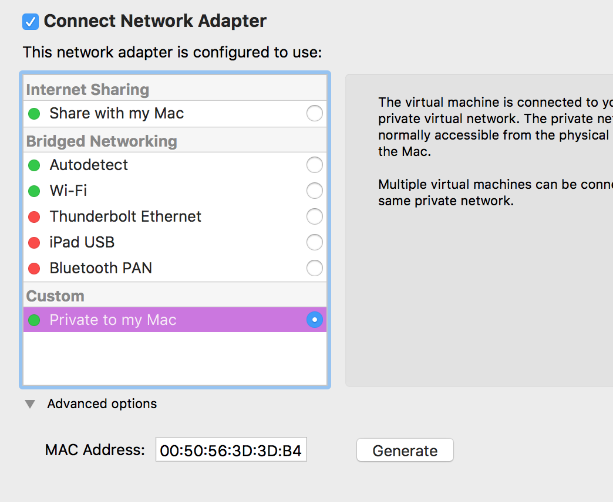

# TCP/IP summary

Transmission Control Protocol (TCP) and the Internet Protocol (IP), TCP/IP provides end-to-end connectivity specifying how data should be formatted, addressed, transmitted, routed and received at the destination. This functionality has been organized into four abstraction layers which are used to sort all related protocols according to the scope of networking involved.

1. **application layer**: user data and communicate this data to other applications on another or the same host. HTTP, SMTP, FTP, SSH are applications.
1. **transport layer**: The transport layer constitutes the networking regime between two network processes, on either the same or different hosts and on either the local network or remote networks separated by routers. Processes are addressed via "ports," and the transport layer header contains the port numbers. UDP is the basic transport layer protocol, providing communication between processes via port addresses in the header. While TCP provides flow-control, connection establishment, and reliable transmission of data
1. **internet layer**: It has the task of exchanging datagrams across network boundaries. It provides a uniform networking interface that hides the actual topology of the underlying network connections. This layer defines the addressing and routing structures used for the TCP/IP protocol suite. IP addresses are defined in this layer. Its function in routing is to transport datagrams to the next IP router that has the connectivity to a network closer to the final data destination.
1. **link layer**:  protocols used to describe the local network topology and the interfaces needed to effect transmission of Internet layer datagrams to next-neighbor hosts. Ethernet is part of the link layer. 

## FAQ

### What is the difference between TCP and UDP? When would you use each of them?

* UDP  provides data integrity via a checksum but does not guarantee delivery.
* TCP provides both data integrity and delivery guarantee by retransmitting until the receiver acknowledges the reception of the packet.

UDP is typically used for applications such as streaming media: less reliable but performance is important. Calls to DNS are done in UDP

### what is a subnet?

A subnet is an identifiably separate part of an organization's network. Typically, a subnet may represent all the machines at one geographic location, in one building, or on the same local area network (LAN). Having an organization's network divided into subnets allows it to be connected to the Internet with a single shared network address.

### what is subnet mask?

hosts are uniquely identified by their address. IP address is divided into two logical parts, the network prefix and the host identifier field. The network prefix is determining by using the subnet mask and the ip address. So 9.48.85.99 AND 255.255.255.0 gives a network prefix of  9.48.85 and 254 potential hosts in this network (256 - 2).

Routers constitute logical or physical borders between the subnets, and manage traffic between them. Each subnet is served by a designated default router.

### What the /24 number means after an ip address? 

Instead of writing out a full subnet mask such as 255.255.255.0, we can shorten this to /24. To come to this number, we simply add the number of subnet bits (1's) in the subnet mask. /24 specifies the number of bits that do not change. So with 192.128.0.0/24 only the last 2^8 bit can be used to assign IP addresses. 

* 192.128.23.31/32 means one IP @.
* 192.128.23.0/31 means we have 192.128.23.0 and 192.128.23.1 possible IP addresses.
* 0.0.0.0/0 means all IP @.

[https://www.ipaddressguide.com/cidr](http://www.ipaddressguide.com/cidr)

### what is CIDR?

Classless inter-domain routing (CIDR) is a set of Internet protocol (IP) standards that is used to create unique identifiers for networks and individual devices.  CIDR uses variable length subnet masking (VLSM) to divide networks into subnets of various size: the first part of an IP address is a prefix, which identifies the network. The prefix is followed by the host identifier so that information packets can be sent to particular computers within the network. It helps to group blocks of addresses into a single routing network: 192.0.1.0/24, the prefix is 192.0.1.0, and the total number of bits in the address is 24 so it is possible to have 256 hosts. With a.b.0.0/16 we can have 65536 hosts.


### How to interpret routing table?

In linux `route -n` displays IP routing table: the host is on 172.16 network. The router/gateway is on 251.2 

```sh
Kernel IP routing table
Destination     Gateway         Genmask         Flags Metric Ref    Use Iface
0.0.0.0            172.16.251.2    0.0.0.0             UG    100    0        0 ens33
169.254.0.0     0.0.0.0            255.255.0.0     U     1000   0        0 ens33
172.16.251.0   0.0.0.0            255.255.255.0   U     100    0        0 ens33
172.17.0.0       0.0.0.0            255.255.0.0     U     0      0        0 docker0
```

`netstat -nr` works the same. 


### What does a default gateway do?

- serves as an access point to another network
- is a node that routes the traffic from a workstation to another network segment. 
- it commonly connects the internal networks and the outside network (Internet).
- The gateway is also associated with both a router, which uses headers and forwarding tables to determine where packets are sent, and a switch, which provides the actual path for the packet in and out of the gateway.

### What is the difference between broadcast and multicast?

**multicast** is the delivery of a message or information to a group of destination computers simultaneously in a single transmission from the source. source sends a packet only once, nodes in the network take care of replicating the packet to reach multiple receivers

### How does ping work?

used to test if a host can reach an ip address on the network. It sends ICMP, an echo request packet, to the target.  It measures the time from transmission to reception (round-trip time) and records any packet loss. 


IPV4 use a 32 bits addressing schema
IPV6 uses 128 bits

### What is NAT? Where would you use it? How does it work? What are some limitations?

Network address translation (NAT) is a methodology of modifying network address information in Internet Protocol (IP) datagram packet headers while they are in transit across a traffic routing device for the purpose of remapping one IP address space into another.

### What is DHCP?

Dynamic Host Configuration Protocol (DHCP) is a client/server protocol that automatically provides an Internet Protocol (IP) host with its IP address and other related configuration information such as the subnet mask and default gateway.
Local router has an IP address assigned by the Internet Service Provider.

Within a local network, a DHCP server assigns a local IP address to each device connected to the network.
For example at home with AT&T ISP router is on 192.168.1.254 all devices in the home network are under  192.168.1.xx the subnet mask 255.255.255.0. The public API address is 108.199.129.124

### How does web browser communicate to http server?

- user enters a URL, the port number can be 80 or something else specified
- browser does a NS lookup to get IP address for the specified host. The DNS server returns IP addresses of the load balancers which will route to the target backend apps.
- browser initiates a TCP connection to the web server
- After the server completes acknowledgment of its side of the TCP connection, the browser sends HTTP requests to the server to retrieve the content
- To avoid re-initializing the HTTP connection, HTTP offers the keep-alive protocol. HTTP 1.1 supports persistent connections by default. 
- the browser may also save temporary information about its connections to local files on the client computer called cookies

### What is HTTP pipelining?

Because HTTP 1.1 relies on persistent connections, you can use it to send multiple queries in a row and expect responses in the same order. This is called **HTTP pipelining**.

 However, the drawback is that requests must queue up on the connection until the requests in front of them complete. This is called **head-of-line blocking**.

### HTTP/2

HTTP/2 is a redesign of HTTP to support low latency with full request and response multiplexing. Connection header is now forbidden and all clients and servers must persist connections. 

A client can send multiple requests in parallel on the same connection, which is called **multiplexing**.

It supports the notion of a **stream**, which allows a bidirectional flow of bytes to be exchanged over a persistent TCP connection. Each stream can carry one or more messages. A message is a complete sequence of frames that map to a logical request or response.

### How to setup static IP address with a Guest ubuntu running on Mac using VMfusion?

By default, a new VMware Fusion guest will have a single NIC (Network Interface Card) configured to use Internet Sharing (e.g., “Share with my Mac”)
This allows the guest to communicate with the outside world — resolve DNS records, download operating system updates, access arbitrary Internet resources — using network address translation (NAT). Through an internal DHCP service, the guest is assigned a private, RFC1918 address, which VMware translates to the host’s IP address before forwarding along to the appropriate gateway (typically, the “default gateway”, i.e., the upstream router).

When the guest serves a set of services, then it does not work well, and you need a static address for clients to connect.

The solution is to add a second NIC to your VMware guest, configure it to use a static IP address, and configure your Mac to resolve all hostnames that match a particular pattern (e.g., “.dev”) to that IP address

- Add a device in the VM settings, select ‘Private to my mac’ and generate a MAC address.

    

- keep the mac address 00:50:56:3D:3D:B4
- Once done do a `ifconfig` on the MAC and we can see that VM fusion use vmnet1 for “host-only” networking and use vmnet8 for NAT/shared connections

```
vmnet1: flags=8863<UP,BROADCAST,SMART,RUNNING,SIMPLEX,MULTICAST> mtu 1500
ether 00:50:56:c0:00:01 
inet 192.168.65.1 netmask 0xffffff00 broadcast 192.168.65.255
vmnet8: flags=8863<UP,BROADCAST,SMART,RUNNING,SIMPLEX,MULTICAST> mtu 1500
ether 00:50:56:c0:00:08 
inet 172.16.251.1 netmask 0xffffff00 broadcast 172.16.251.255
```

the vmnet1 network is using the 192.168.65.0/255 network
- Check which IPs may be automatically given out by the VMware DHCP server, so that we can avoid an overlapping

```
grep range /Library/Preferences/VMware\ Fusion/vmnet1/dhcpd.conf
range 192.168.65.128 192.168.65.254;
```

You should choose an IP outside this range, but not .1 as that’s assigned to the vmnet1 NIC itself; for this example, I’ve chosen 192.168.65.100 for my “ubuntu” VMware guest.

- Edit /Library/Preferences/VMware Fusion/vmnet1/dhcpd.conf to add the host static address.

```
host ubuntu {
        hardware ethernet 00:50:56:3D:3D:B4
        fixed-address 192.168.65.100;
        option domain-name-servers 0.0.0.0;
        option domain-name "";
}
```

- Configure the DHCP server of the vmware

```sh
sudo /Applications/VMware\ Fusion.app/Contents/Library/vmnet-cli —configure

sudo /Applications/VMware\ Fusion.app/Contents/Library/vmnet-cli —stop

sudo /Applications/VMware\ Fusion.app/Contents/Library/vmnet-cli --start
```

- Boot the vm and verify the IP address

### What is QoS? How does it work? Where would you apply it? When is it enforced?

Quality of service comprises requirements on all the aspects of a connection, In packet switching, QOS is the ability to provide different priority to different applications, users, or data flows, or to guarantee a certain level of performance to a data flow.

To quantitatively measure quality of service, several related aspects of the network service are often considered, such as error rates, bandwidth, throughput, transmission delay, availability, jitter...

A best-effort network or service does not support quality of service. An alternative to complex QoS control mechanisms is to provide high quality communication over a best-effort network by over-provisioning the capacity so that it is sufficient for the expected peak traffic load.
