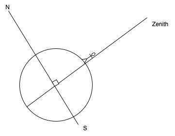

# Astronomy Introduction

## Position

There are 88 constellations. 
The sky changes with time and season, some constellations could be seen only during a period of the year.
Relative positions of stars do	not change,

## Celestial Sphere 

Celestial Sphere  is an imaginary sphere of infinitely large radius enclosing the universe so that all celestial bodies appear to be projected onto its surface. 

**Meridian**: is a great circle passing through the two poles of the celestial sphere and the zenith of a given observer.

Position of the stars are fixed in the celestial sphere from the earth point of view. Celestial Sphere	 rotates daily about axis through poles from East to West. Inside the celestial sphere the earth rotates from west to east.

On earth : latitude is the angle from the equator to the observed position. Longitude is the angle from meridian 0, Greenwich, to that position. The position on earth determines the visible sky: the horizon is perpendicular to the zenith line. Extending the axis of earth, we can find the axis of the relative rotation of the celestial sphere.

If we project the earth equator to the celestial sphere, we can have the celestial equator, so it is possible to measure the height of a star in the sky from its angle to this equator. This is the declination or celestial latitude. Declination 0 is the celestial equator, 90 is the north celestial pole, and -90 the south one.

The **right ascension**, RA, is the celestial longitude measured in hours instead of degrees. The full circle being 24h. 1 h = 15 degrees. The hour makes sense, as if we let the earth turns, it takes 2 hour to see a star at longitude that was 30 degrees East earlier.
The zero longitude meets the equator in pisces: it represents the celestial meridian= the 0 hour of right ascension. 

## Local view

Any celestial body can be identified by the two coordinates **altitude h** and **azimuth alpha** (horizontal coordinates). Altitude is the angle above the horizon.
The zenith is the point above our head perpendicular to our horizon line.

zenith angle: 90 - altitude. 

**Azimuth**: angle between the north vector and the perpendicular projection of the star down onto the horizon.
To an observer on Earth sky	appears to rotate around celestial pole.

Stars near north celestial pole never set: an example is Big dipper. Stars near celestial equator rise, move from East to West and set. Orion is such constellation.

Reference: [http://www.jgiesen.de/elevaz/basics/index.htm](http://www.jgiesen.de/elevaz/basics/index.htm)

Here is a simple schema to present the relation between zenith, star declination and altitude

Another view of the relation between declination, altitude and latitude on earth.

When the star is at zenith the latitude of the observer on earth = the star declination. 
interesting exercise; knowing two star declinations and right ascensions when one star is at zenith for an observer, where on earth another observer will see the other star at zenith?
Consider two stars, star 1 and star 2, with right ascensions RA1 and RA2 where RA2 > RA1. Let say star 1 is on your meridian right now, star 2 will cross your meridian in (RA2 - RA1) hours later. 

1h of right ascension is 15°

To compute latitude and longitude of the second observer; the latitude is the declination of the second star (hypothesis star at zenith), and the difference of longitudes between the two points on earth is the RA2-RA1 which should be in minutes brought back to degree using the conversion 60 minutes = 1 degree (longitude point 1 - this delta) = longitude difference point 2 => still need to see where it is from 0 meridian.

If Aldebaran is crossing your local meridian, how long would you need to wait to see Regulus cross the meridian? 
convert the RA in minutes and then do the difference between aldebaran and regulus, convert back in hour: 5h 32 mn

If Aldebaran (d=16d 31’).is crossing the local meridian in Saint Petersburg (l=59d 56’), Russia, what are its azimuth and altitude, in degrees?
altitude= declination + 90- latitude
a=16 + 90-59 = 46 d  -> transform each value in minutes then back to degree
for azimuth
A star's azimuth is only either north (0deg) or south (180deg) if it's crossing the observer's meridian. If it's not on the meridian, the azimuth could be another angle.

At Sao Paulo, the latitude is -23 so the zenith is -23. The closest star is at -23 - (altitude) -> Regulus
Zenith angle = |Declination - Latitude|. To derive what star is the closed to the zenith of sao paulo

http://www.jgiesen.de/elevaz/basics/index.htm
