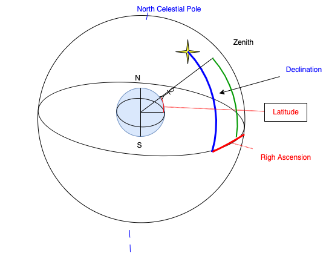

# Astronomy Introduction

## Position

There are 88 constellations to map stars in our sky. 
The night sky changes with time and season, some constellations could be seen only during a certain period of the year.
The relative positions of the stars do not change,

## Celestial Sphere 

**Celestial Sphere**  is an imaginary sphere of infinitely large radius enclosing the visible universe so that all celestial bodies appear to be projected onto its surface. The two points projected onto the celestial sphere by the extension of the Earth's `axis of rotation` are called the celestial poles (North Celestial Pole and South Celestial Pole). It is easy to find the North Celestial Pole in the sky, as the relatively bright Pole Star is located very close to this place.

**Meridian**: is a great circle passing through the two poles of the celestial sphere and the zenith of a given observer.

Position of the stars are fixed in the celestial sphere from the Earth point of view. Celestial Sphere rotates daily around the axis through the poles from East to West. Inside the celestial sphere the Earth rotates from west to east. The stars (apparently) rotate about the NSP counter-clockwise.

{ width=500 }

See this [detailed explanations](https://www.walter-fendt.de/html5/aen/celestialpoles_en.htm) for NSP, horizon, zenith...

On Earth : latitude is the angle from the equator to the observed position. Longitude is the angle from meridian 0, Greenwich, to that position. 

{ width=300 }

The position on Earth determines the visible sky: the horizon is perpendicular to the zenith line. Extending the axis of Earth, we can find the axis of the relative rotation of the celestial sphere.

If we project the Earth equator to the celestial sphere, we can have the **Celestial equator**, so it is possible to measure the height of a star in the sky from its angle to this equator. This is the **Declination** or celestial latitude. Declination 0 is the celestial equator, 90 is the north celestial pole, and -90 the south celestial pole.

The **right ascension**, RA, is the celestial longitude measured in hours instead of degrees. The full circle being 24h. 1 h = 15 degrees. The hour makes sense, as if we let the Earth turns, it takes 2 hour to see a star at a longitude that was 30 degrees East earlier.

The zero longitude meets the equator in pisces: it represents the celestial meridian= the 0 hour of right ascension. 

## Local view

Any celestial body can be identified by the two coordinates **altitude h** and **azimuth alpha** (horizontal coordinates). The **Altitude** of a star is its angle from the horizon of the observer on Earth.

The zenith is the point above our head perpendicular to our horizon line.

The zenith angle: 90 - altitude. 

**Azimuth**: angle between the north vector and the perpendicular projection of the star down onto the horizon.
To an observer on Earth sky	appears to rotate around celestial pole.

Stars near north celestial pole never set: an example is Big Dipper. Stars near celestial equator rise, move from East to West and set. Orion is such constellation.

See details in this reference: [http://www.jgiesen.de/elevaz/basics/index.htm](http://www.jgiesen.de/elevaz/basics/index.htm)

Here is a simple schema to present the relation between zenith, Latitude star declination and the Right Ascension:

When the star is at zenith, the latitude of the observer on Earth = the star declination. 

[The star position simulation applet](https://www.walter-fendt.de/html5/aen/starposition_en.htm).

!!! Question "Knowing two star declinations and right ascensions when one star is at zenith for an observer, where on Earth another observer will see the other star at zenith?"
    Consider two stars, star 1 and star 2, with right ascensions RA1 and RA2 where RA2 > RA1. Let say star 1 is on your meridian right now, star 2 will cross your meridian in (RA2 - RA1) hours later. 
    1h of right ascension is 15°
    To compute latitude and longitude of the second observer; the latitude is the declination of the second star (hypothesis star at zenith), and the difference of longitudes between the two points on Earth is the RA2-RA1 which should be in minutes brought back to degree using the conversion 60 minutes = 1 degree (longitude point 1 - this delta) = longitude difference point 2 => still need to see where it is from 0 meridian.

!!! Question "If Aldebaran is crossing our local meridian, how long would we need to wait to see Regulus cross the meridian?"
    Convert the RA in minutes and then do the difference between aldebaran and regulus RA, convert back in hour: 5h 32 mn
    
!!! Question "Altitude and Azimuth of a Star at a location?"
    If Aldebaran (d=16d 31’) is crossing the local meridian in Saint Petersburg (l=59d 56’).
    `altitude= declination + 90 - latitude` -> a=16 + 90 - 59 = 46 degres  -> transform each value in minutes then back to degree for azimuth.

A star's azimuth is only either north (0deg) or south (180deg) if it's crossing the observer's meridian. If it's not on the meridian, the azimuth could be another angle.

At Sao Paulo, the latitude is -23 so the zenith is -23. The closest star is at -23 - (altitude) -> Regulus
Zenith angle = |Declination - Latitude|. To derive what star is the closed to the zenith of sao paulo

## Sidereal Time

Sidereal time is the celestial meridian coinciding with local meridien. 24 sidereal time hours is one full rotation of Earth. It changes with longitude: 1 h = 15 degrees.

1 sidereal day is one rotation with respect to the stars = 23h 56 minutes

One solar day is 24h and equal to one rotation/sun.

!!! Question "Which of the stars would be visible in the early evening sky (around sunset) on September 21 in Sao Paulo, Brazil?"
    On September 21, Sidereal Time = Local Time. The position of 0RA is defined as one of the points at which the celestial equator intersects the ecliptic. This happens twice a year, in the Spring and in the Fall. The Vernal Equinox is when this occurs in the Spring, and the Sun overhead on the Celestial Equator.  That is defined as 0RA, and occurs at noon local time. Therefore 12:00 local on the Vernal Equinox is 0RA. So Sidereal Time is LT + 12 on the Vernal Equinox. Six months later, on the Autumnal Equinox, the Sun is 12 hours opposite the position at the Vernal Equinox. And at noon, 12:00, the Sun is at 12RA. Therefore LT = ST, on the Autumnal Equinox.

In the early evening, LT = 18.00 = ST. LT “lies” on the zero meridian. At the eastern horizon (at azimuth 90⁰), we can see the right ascension 18.00+06.00 = 24.00, and at the western horizon (at azimuth - 90⁰), we can see the right ascension 18.00-06.00 = 12.00.

An observer will see locally stars whose RA lies between 12.00 and 24.00 + the stars always visible, as always set.

## Tilt and seasons

Earth is tilted by 23.5 degrees from its ecliptic plane: the plane on which earth orbits the sun. From an earth centric view, the sun is following a circle not on the celestial equator, but a circle 23.5d tilted.
Ecliptic meets equator at vernal (3/21) & autumnal (9/21) equinox by convention 0h and 12h RA. At that time the earth tilt is perpendicular to the direction of the sun rays. The line separating the night and the day pass by the pole. all location on earth has the same amount of time on day and night.

The sun declination changes from 23.5 max (6/21) to - 23.5 (12/21)

[See this Season simulator.](http://astro.unl.edu/naap/motion1/animations/seasons_ecliptic.html)

## Moon

Moon moves around the celestial sphere as, it orbits Earth, from west to east, in 27.32 days. RA increases by 52 min per day. As the spin is locked to orbit we see the same side of the moon.

The moon rises 48 mn later than it does the day before.

The synodic month is 29.52 day. It is a full moon rotation to the sun. The moon position controls the phases and the rise/set times. Full moon when moon rises 12 h after the sun.

The moon orbits in the plane of the ecliptic but with a tilt of 5 degrees. The intersections between the orbit circle of the moon and the ecliptic is called the node. When both the moon and the sun are on the nodes then there is an eclipse: twice a year of 346.6 days (roughly every 173.3 days) it is the eclipse season: new moon -> solar eclipse, full moon -> moon eclipse.

At new moon, it is zero and the Moon is said to be in conjonction. At full moon, the elongation is 180° and it is said to be in opposition. 

The lunar equator is not in the plane of its orbit, but is inclined to it by a constant value of 6.688°.

Moon has almost same angular size as sun. When the alignment is perfect the moon completely obscures Sun on a 250 km shadow projected on earth.

When the moon is little bit farther this is an annular eclipse.

The reddish color of the moon during a moon eclipse is due to the earth atmosphere. At the beginning of moon croissant it is possible to see the part that is in shadow. This is due to the reflection of the light from earth.

[Moon animation](http://astro.unl.edu/naap/lps/animations/lps.html)

## Mathematical recall

* arc second = 1/3600 degree
* arc minute = 1/ 60 degree
* tan = sin / cos = opposed / adjacent
* radian to degree: 180 d = pi radian
* arcsecond to radian = n arcseconds => n/ 206265 radians.  

