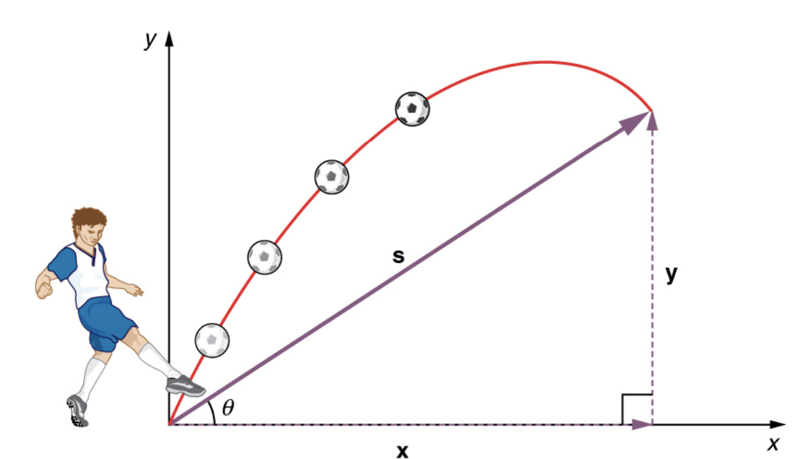
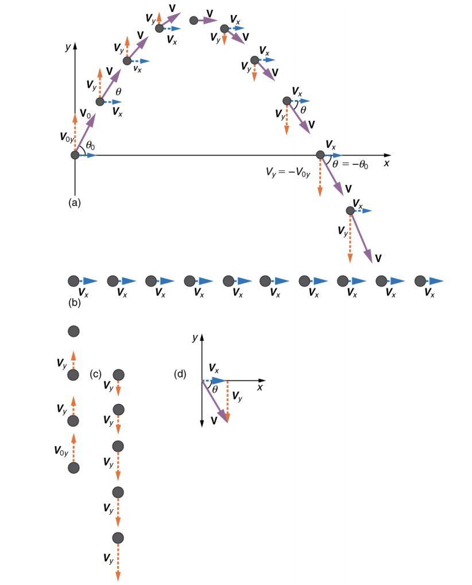

# Physics summary

## Kinematics

Kinematics describes the way objects move with their velocity and their acceleration. Their positions are relative to a reference frame.

A displacement is the change in position of an object = Xf - Xo. Displacement is defined by both direction and magnitude: it is a vector quantity. Distance is the magnitude or size of displacement between two positions. It has no sign.

The distance traveled can be greater than the magnitude of the displacement. 

A scalar is any quantity that has a magnitude, but no direction. Speed is a scalar quantity. It does not change at all with direction changes. 

Time is related to motion by looking at elapsed time for a particular motion:

)

The average velocity is the displacement (change in position) divided by the time of travel:

When arriving at the same position as the beginning: 

then average velocity is zero.

- Instantaneous velocity v is the average velocity at a specific instant in time or an infinitesimally small time interval.
- Instantaneous speed is the magnitude of instantaneous velocity
- Average speed is the distance traveled divided by elapsed time.
- Average Acceleration is the rate at which velocity changes, 

- Acceleration is a vector in the same direction as the change in velocity, Δv.

 
 
 which gives insight into the relationship between displacement, average velocity, and time.

  gives us insight into the relationships among velocity, acceleration, and time

)

## Physic problem solving

- Examine the situation to determine which physical principles are involved. Uses sketch to clarify the elements.
- Make a list of what is given or can be inferred from the problem as stated (identify the knowns).
- Identify exactly what needs to be determined in the problem (identify the unknowns).
- Find an equation or set of equations that can help you solve the problem.
- Substitute the knowns along with their units into the appropriate equation, and obtain numerical solutions complete with units.
- Check the answer to see if it is reasonable: Does it make sense? 

## Gravity

- Falling objects, if air resistance and friction are negligible, fall toward the center of Earth with the same constant acceleration, independent of their mass. 

    

- Air resistance opposes the motion of an object through the air, while friction opposes the motion between objects.
- Acceleration due to gravity 
 varies from 9.78 to 9.83, depending on latitude, altitude, underlying geological formations, and local topography.

## Projectile motion

Projectile motion is the motion of an object thrown or projected into the air, subject to only the acceleration of gravity.

Motions along perpendicular axes are independent and thus can be analyzed separately.

The total displacement of a soccer ball at a point along its path. The vector `s` has components `x` and `y` along the horizontal and vertical axes. Its magnitude is `s` , and it makes an angle `θ` with the horizontal.

## Newton's laws of motion

Dynamics considers the forces that affect the motion of moving objects and systems. Newton’s laws of motion are the foundation of dynamics.

1. Objects and systems have properties such as mass and charge. Systems may have internal structure.
1. Fields existing in space can be used to explain interactions.
1. The interactions of an object with other objects can be described by forces.
1. Interactions between systems can result in changes in those systems.
1. Changes that occur as a result of interactions are constrained by conservation laws. 

Force is a push or pull that can be defined in terms of various standards, and it is a vector having both magnitude and direction. External forces are any outside forces that act on a body. A free-body diagram is a drawing of all external forces acting on a body. 

**Newton’s first law of motion** states that in an inertial frame of reference a body at rest remains at rest, or, if in motion, remains in motion at a constant velocity unless acted on by a net external force. This is also known as the **law of inertia**. We can think of this law as preserving the status quo of motion. 

**Inertia** is the tendency of an object to remain at rest or remain in motion. Inertia is related to an object’s mass. The inertia of an object is measured by its mass. **Mass** is the quantity of matter in a substance. Unlike weight, mass does not vary with location, it is the same on Earth, in orbit, or on the surface of the Moon.

Change in motion is equivalent to a change in velocity -> A change in velocity means, by definition, that there is an acceleration. 

- The net external force is the vector sum of  all external forces
- Acceleration is directly proportional to the net external force
- Acceleration should be inversely proportional to the mass of the system : the larger the mass (the inertia), the smaller the acceleration produced by a given force:
- **Newton’s second law of motion** is:  

      or 

The unit is the Newton:  is the force needed to accelerate a 1-kg system at the rate of 1m/s/s.

The equation for an object weight is 

it is the gravitational force applied to the object from the nearest large body.

- The **third law** stipulates: Whenever one body exerts a force on a second body, the first body experiences a force that is equal in magnitude and opposite in direction to the force that it exerts.  

Normal force is perpendicular to the surface of the contact and is supporting the  load of  the weight applied to this surface. A **tension** is a force along the length of a medium, especially a force carried by a flexible medium, such as a rope or cable.

### Problem solving
	
- Draw a sketch of the problem.
- Identify known and unknown quantities, and identify the system of interest.
- Write Newton’s second law in the horizontal and vertical directions and add the forces acting on the object. If the object does not accelerate in a particular direction (for example, the x -direction) then Fnet x = 0 . If the object does accelerate in that direction, Fnet x = ma
- Verify result is reasonable.

- Only four distinct forces account for all known phenomena: the gravitational force, the electromagnetic force, the weak nuclear force, and the strong nuclear force.

* What is it that carries forces between objects? 

	- Imagine that a force field surrounds whatever object creates the force.
	- The field itself is the “thing” that carries the force from one object to another.
	- These fields may be either scalar or vector fields. Gravity and electromagnetism are examples of vector fields.

- Gravitational waves are created during the collision of massive stars, in black holes, or in supernova explosions, like shock wave. Waves move at the speed of light.

	- The Laser Interferometer Gravitational-Wave Observatory (LIGO) is the instrument to try to catch gravitational waves.
	- It uses optical lasers to examine any slight shift in the relative positions of two masses due to the effect of gravity waves.
	- Laser Interferometer Space Antenna will be the antenna in space. The system will measure the relative positions of each satellite to detect passing gravitational waves. Accuracy to within 10% of the size of an atom will be needed to detect any waves.

## Friction

Friction is a force that opposes relative motion between systems in contact. When objects move then the friction between them is called kinetic friction. If they do not move, friction = static friction = fs

Static friction is a responsive force that increases to be equal and opposite to whatever force is exerted, up to its maximum limit. Once the applied force exceeds fs(max), the object will move. 

Then the friction is:

The motion of the skier and friction are parallel to the slope and so it is most convenient to project all forces onto a coordinate system where one axis is parallel to the slope and the other is perpendicular.

)

)

An object will slide down an inclined plane at a constant velocity if the net force on the object is zero.

## Rotation Angle and Angular Velocity

Rotation angle Δθ to be the ratio of the arc length to the radius of curvature: 

The arc length Δs is the distance traveled along a circular path.

Angular velocity ω as the rate of change of an angle. In symbols, this is ω = Δθ/ Δt. The greater the  rotation angle in a given amount of time, the greater the angular velocity. The units for angular velocity are radians per second (rad/s).  Angular velocity ω is analogous to linear velocity v. To get the precise relationship between angular and linear velocity:

## Centripetal Acceleration

Centripetal acceleration is the acceleration of an object moving in uniform circular motion.
Acceleration is in the direction of the change in velocity, which points directly toward the center of rotation.

The magnitude is:

Always convert in rad/s

## Centripetal Force 

Any net force causing uniform circular motion is called a centripetal force. The direction of a centripetal force is toward the center of curvature.

## Work and Kinetic Energy

We can loosely define energy as the ability to do work. An important aspect of energy is that the total amount of energy in the universe is constant. Energy can change forms, but it cannot appear from nothing or disappear without a trace.

Energy may be transferred into or out of the system, and the change must be equal to the amount transferred. Kinetic energy is introduced as an energy of motion that can be changed by the amount of work done by an external force.

Potential energy can only exist when objects interact with each other via conservative forces according to classical physics. It works for a constant force: 

.|d|)  

d represents the displacement of the system, the Force applied at angle θ. Work and energy are measured in newton-meters  or Joule. One calorie (1 cal) of heat is the amount required to warm 1 g of water by 1 C degree, and is equivalent to 4.184 Joules.

The net work on a system equals the change in the kinetic energy for transactional motion. 

)

- What is the Work to accelerate a 30 kg package by pushing at constant force = 120 N through a distance of 0.8 m (friction force is 5 N):

	-  The force of gravity and the normal force acting on the package are perpendicular to the displacement and do no work.
	- The net force arises solely from the horizontal applied force Fapp and the horizontal friction force Fc 
	- Net force is // to the displacement so θ = 0o and cos(θ) = 1 
	- Fnet = 120 - 5 = 115 N
	- The effect of Fnet is to accelerate the package from V0 to V.
	- The kinetic energy increases, the net work done on the system is positive
	- Wnet = Fnet .d = m.a.d   (from newton 2nd law Fnet = m.a)  Wnet = 115 * 0.8 = 92
	- V^2 = Vo^2 + 2.a.d  => a = (V^2  - Vo^2) / 2d
	- Wnet = m/2 . (V^2  - Vo^2)
	- By looking at the work only: W total = Wapp + Wgr + Wn + Wfr   => W total = 115 . cos(0) . 0.8 + 0 + 0 + 5 . cos(180) . 0.8 = 96 - 4 = 92
	

## gravitational potential energy

The gravitational potential energy:

This energy is associated with the state of separation between two objects that attract each other by the gravitational force. Because gravitational potential energy depends on relative position, we need a reference level (earth surface) at which to set the potential energy equal to 0. What is important is the difference in gravitational potential energy, because this difference is what relates to the work done.

If we release the mass, gravitational force will do an amount of work equal to `mgh` on it, thereby increasing its kinetic energy by that same amount:

- ΔPEg = mgh applies for any path that has a change in height of h  

- At the start of a roller coaster its PE is max and it will lose it as it goes downhill. The net work on the roller is the gravity one so:  

So 

When friction is negligible, the speed of a falling body depends only on its initial speed and height, and not on its mass or the path taken.

## Conservative Forces and Potential Energy

The potential energy is the energy a system has due to position, shape, or configuration. It is stored energy that is completely recoverable. We can define a potential energy (PE) for any conservative force. The work done against a conservative force to reach a final configuration depends on the configuration, not the path followed, and is the potential energy added. Potential energy comes from the interaction between the bowling ball and the ground.

- For a spring the Hooke's law says:

 the amount of deformation produced by a force F , k is the spring’s force constant. 
 
The average force is:

From the  Kinetic Energy and the Work-Energy Theorem, we note the area under a graph of F vs. ΔL is the work done by the force so:

x is ΔL =  distance that the spring is stretched.

The conservation of mechanical energy :  KE_initial + PE_initial = KE_final + PE_final   for conservative force only.

## Non conservative forces

A non-conservative force is one for which work depends on the path taken. The work done by a non-conservative force adds or removes mechanical energy from a system. Friction creates Thermal energy.

The net work is the sum of the work by non-conservative forces plus the work by conservative forces.

The work and energy theorem works as:

KE_initial + PE_initial + Wnc = KE_final + PE_final 

the amount of non-conservative work equals the change in mechanical energy.

## Conservation of Energy

The total energy is constant in any process. It may change in form or be transferred from one system to another, but the total  remains the same. 

**KEi + PEi + Wnc + OEi = KEf + PEf + OEf**

OE is for other energies.

- Electrical energy is a common form that is converted to many other forms.
- Fuels, such as gasoline and food, carry chemical energy that can be transferred to a system through oxidation.
- Chemical fuel can also produce electrical energy, such as in batteries. Batteries can in turn produce light, which is a very pure form of energy.
- Nuclear energy comes from processes that convert measurable amounts of mass into energy. Nuclear energy is transformed into the energy of sunlight, into electrical energy in power plants, and into the energy of the heat transfer and blast in weapons.
- Atoms and molecules inside all objects are in random motion. This internal mechanical energy from the random motions is called thermal energy, because it is related to the temperature of the object. These and all other forms of energy can be converted into one another and can do work.
- A car is not a closed system. You add energy in the form of more gas in the tank (or charging the batteries), and energy is lost due to air resistance and friction.
-  The efficiency Eff of an energy conversion process is defined as work output / total energy input

## Power

- **P = W / t**   1 Watt = 1 Joule / s
- Because work is energy transfer, power is also the rate at which energy is expended. 
- Sunlight reaching Earth’s surface carries a maximum power of about 1.3 kilowatts per square meter  
- Energy consumed E = P . t

## Energy Conversion in Human

Our own bodies, like all living organisms, are energy conversion machines. Conservation of energy implies that the chemical energy stored in food is converted into work, thermal energy, and/or stored as chemical energy in fatty tissue. The rate at which the body uses food energy to sustain life and to do different activities is called the metabolic rate.

Energy consumption is directly proportional to oxygen consumption because the digestive process is basically one of oxidizing food.

Approximately 20 kJ of energy are produced for each liter of oxygen consumed.
