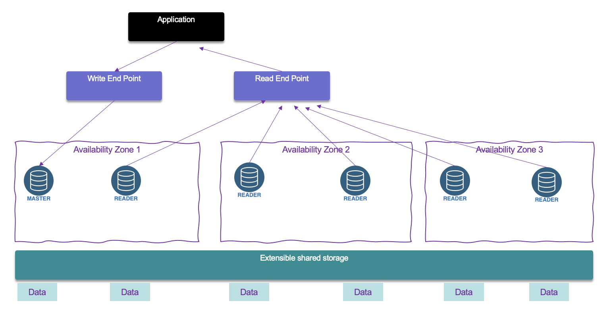

# Amazon Web Service studies

## Organization

24 regions -> 2 to 6 availability zones per region: us-west-1-2a  [Global infrastructure](https://aws.amazon.com/about-aws/global-infrastructure/)
AZ is one or more DC with redundant power, networking and connectivity. Isolated from disasters. Interconnected with low latency. 

* EC2 is a regional service.
* IAM is a global service

## IAM Identity and Access Management

* Definer user (physical person), group and roles, and permissions
* One role per application
* Users are defined as global service encompasses all regions
* Policies are written in JSON, to define permissions for user and group and role
* Least privilege permission: Give user the minimal amount of permissions they need to do their job
* Assign users to groups and assign policies to groups and not to individual user.
* For identity federation SAML standard is used

## EC2

* Renting machine EC2
* Storing data on virtual drives EBS
* Distribute load across machines ELB
* Auto scale the service ASG

Amazon Machine Image: AMI, image for OS and preinstalled soft. Amazon Linux 2

 

When creating an instance, we can select the VPC and the AZ subnet, and the storage (EBS) for root folder to get OS. The security group helps to isolate the instance for example authorizing ssh on port 22.
Get the public ssh key, and once instance started: `ssh -i EC2key.pem  ec2-user@ec2-52-8-75-8.us-west-1.compute.amazonaws.com `
Can use **EC2 Instance Connect** to open a terminal in the web browser. Need to get SSH port open.

EC2 has a section to add `User data`, which could be used to define a bash script to install dependent software and start some services.

EC2 instance types see [ec2instances.info](https://www.ec2instances.info)

* R: applications that needs a lot of RAM – in-memory caches
* C: applications that needs good CPU – compute / databases
* M: applications that are balanced (think “medium”) – general / web app
* I: applications that need good local I/O (instance storage) – databases
* G: applications that need a GPU –
* T2/T3 for burstable instance: When the machine needs to process something unexpected (a spike in
load for example), it can burst. Use burst credits to control CPU usage.

### Launch types

* **On demand**: short workload, predictable pricing, pay per second after first minute
* **Reserved** for at least for one year, used for long workloads like database. Get discounted rate from on-demand.
* **Convertible reserved** instance for changing resource capacity
* **Scheduled reserved** instance for job based workload for example
* **Spot instance** for very short - 90% discount on on-demand - used for work resilient to failure like batch job, data analysis, image processing,..
    * Define a max spot price and get the instance while the current spot price < max. The hourly spot price varies base on offer and capacity. 
    * if the current spot price > max, then instance will be stopped
    * with spot block we can a time frame without interruptions.
    * The expected state is defined in a 'spot request' which can be cancelled. one time or persistent request types are supported. Cancel a spot request does not terminate instances, but need to be the first thing to do and then terminate the instances.
    * Spot fleets allow to automatically request spot instance with the lowest price.    
* Dedicated instance not shared with other
* **Dedicated hosts** to book entire physical server and control instance placement. # years. BYOL. 

Use **EC2 launch templates** to automate instance launches, simplify permission policies, and enforce best practices across your organization. (Look very similar than docker image)

### AMI

Bring your own image. Shareable on amazon marketplace. Can be saved on S3 storage. By default, your AMIs are private, and locked for your account / region.

AMI are built for a specific AWS region. But they can be copied and shared [See AWS doc - copying an AMI](https://docs.aws.amazon.com/AWSEC2/latest/UserGuide/CopyingAMIs.html).

### EC2 Hibernate

The in memory state is preserved, persisted to a file in the root EBS volume. It helps to make the start quicker. The root EBS volume is encrypted.
Constrained by 150GB RAM. No more than 60 days. 

## Security group

Define inbound and outbound security rules.  They regulate access to ports, authorized IP ranges, control inbound and outbound network. By default all inbound traffic is denied and outbound authorized.

* can be attached to multiple EC2 instances and to load balancers
* locked down to a region / VPC combination
* Live outside of the EC2
* Define one security group for SSH access
* application not accessible is a security group
* connect refused in an application error or is not launched
* Instances with the same security group can access each other
* Security group can reference other security groups, IP address, CIDR but no DNS server

 

## Networking

IPv4 allows 3.7 billions of different addresses. Private IP @ is for private network connections. Internet gateway has public and private connections. Public IP can be geo-located. When connected to an EC2 the prompt lists the private IP (`ec2-user@ip-172-31-18-48`). Private IP stays stable on instance restart, while public may change.

With Elastic IP address we can mask an EC2 instance failure by rapidly remapping the address to another instance. But better to use DNS.

### Playing with Apache HTTP

```shell
# Swap to roo
sudo su
# update OS
yum update -y
# Get Apache HTTPd
yum install -y httpd.x86_64
# Start the service
systemctl start httpd.service
# Enable it cross restart
systemctl enable httpd.service
> Created symlink from /etc/systemd/system/multi-user.target.wants/httpd.service to /usr/lib/systemd/system/httpd.service
# Change the home page by changing /var/www/html/index.html
echo "Hello World from $(hostname -f)" > /var/www/html/index.html
```

This script can be added as User Data (Under Advanced Details while configuring new instance) so when the instance starts it executes this code.

### Elastic Network Instances

ENI is a logical component in a VPC that represents a virtual network card. It has the following attributes:

* Primary private IPv4, one or more secondary IPv4
* One Elastic IP (IPv4) per private IPv4
* One Public IPv4
* One or more security groups
* A MAC address
* You can create ENI independently and attach them on the fly (move them) on EC2 instances for failover 
* Bound to a specific availability zone (AZ)

[New ENI doc.](https://aws.amazon.com/blogs/aws/new-elastic-network-interfaces-in-the-virtual-private-cloud/)

## Placement groups

Define strategy to place EC2 instances:

* **Cluster**: groups instances into a low-latency group in a single Availability Zone

    * highest performance while talking to each other as you're performing big data analysis
* **Spread**: groups across underlying hardware (max 7 instances per group per AZ)
    * Reduced risk is simultaneous failure
    * EC2 Instances are on different physical hardware
    * Application that needs to maximize high availability
    * Critical Applications where each instance must be isolated from failure from each other
* **Partition**: spreads instances across many different partitions (which rely on different sets of racks) within an AZ.
    * Partition is a set of racks
    * Up to 100s of EC2 instances
    * The instances in a partition do not share racks with the instances in the other partitions
    * A partition failure can affect many EC2 but won’t affect other partitions
    * EC2 instances get access to the partition information as metadata
    * HDFS, HBase, Cassandra, Kafka

Access from network and policies menu, define the group with expected strategy, and then it is used when creating the EC2 instance by adding the instance to a placement group.

## Load balancer

Route traffic into the different EC2 instances. It also exposes a single point of access (DNS) to the deployed application. In case of failure, it can route to a new instance, transparently and cross multiple AZ. It uses health check (/health on the app called the `ping path`) to asses instance availability. It provides SSL termination. It supports to separate private (internal) to public (external) traffic.

 

ELB: EC2 load balancer is the managed service by Amazon. Three types supported:

* Classic load balancer: older generation. For each instance created, update the load balancer configuration so it can route the traffic.
* **Application load balancer**: HTTP, HTTPS (layer 7), Web Socket. 
    * It specifies availability zones: it routes traffic to the targets in these Availability Zones. Each AZ has one subnet. To increase availability, we need at least two AZs.
    * It uses target groups, to group applications
    * route on URL, hostname and query string
    * Get a fixed hostname
    * the application do not see the IP address of the client directly (ELB does a connection termination), but ELB put it in the header `X-Forwarded-For`, `X-Forwarded-Port` and `X-Forwarded-Proto`.
* **Network load balancer**: TCP, UDP (layer 4), TLS
    * handle millions request/s
    * use to get a public static IP address

To control that only the load balancer is sending traffic to the application, we need to set up an application security group on HTTP, and HTTPS with the source behind the security group id of the ELB. LBs can scale but need to engage AWS operational team.

HTTP 503 means LB is at capacity or not register target. Verify security group in case of no communication between LB and app.

Target group defines protocol to use, health check checking and what applications to reach (instance, IP or lambda). 

Example of listener rule for an ALB:

 

### Load balancer stickiness

Used when the same client needs to interact with the same backend instance. A cookie, with expiration date, is used to identify the client. The classical or ALB manage the routing. This could lead to inbalance traffic so overloading one instance. 
With ALB it is configured in the target group properties.

### Cross Zone Load Balancing

Each load balancer instance distributes traffic evenly across all registered instances in all availability zones. This is the default setting for ALB and free of charge. It is disabled by default for NLB.

### TLS - Transport Layer Security,

An SSL/TLS Certificate allows traffic between your clients and your load balancer to be encrypted in transit (in-flight encryption).

* Load balancer uses an X.509 certificate (SSL/TLS server certificate). 
* Manage certificates using ACM (AWS Certificate Manager)
* When defining a HTTPS listener in a LB, we must specify a default certificate for the HTTPS protocol, while defining the routing rule to a given target group. Need multiple certs to support multiple domains. 
* Clients can use SNI (Server Name Indication) to specify the hostname they reach. The ALB or NLB will get the certificate for this host to support the TLS handshake. 

### Connection draining

This is a setting to control connection timeout and reconnect when an instance is not responding. It is to set up the time to complete “in-flight requests”. When an instance is "draining", ELB stops sending new requests to the instance. THe time out can be adjusted, depending of the application, from 1 to 3600 seconds, default is 300
seconds, or disabled (set value to 0).

### Auto Scaling Group (ASG)

The goal of an ASG is to scale out (add EC2 instances) to match an increased load, or scale in (remove EC2 instances) to match a decreased load. It helps to provision and balance capacity across Availability Zones to optimize availability.
It can also ensure we have a minimum and a maximum number of machines running. It detects when an instance is unhealthy. 

Automatically Register new instances to a load balancer.

[ASG](https://us-west-1.console.aws.amazon.com/ec2autoscaling/home?region=us-west-1#/) has the following attributes:

* AMI + Instance Type with EC2 User Data (Can use template to define instances)
* EBS Volumes
* Security Groups
* SSH Key Pair
* Min Size / Max Size / Initial Capacity to control number of instances 
* Network + Subnets Information to specify where to run the EC2 instances.
* Load Balancer Information, with target groups to be used as a grouping of the newly created instances
* Scaling Policies help to define rules to manage instance life cycle, based for example on CPU usage or network bandwidth used. 

 

* when creating scaling policies, **CloudWatch** alarms are created. Ex: "Create an alarm if: CPUUtilization < 36 for 15 datapoints within 15 minutes".
* ASG tries the balance the number of instances across AZ by default, and then delete based on the age of the launch configuration
* The capacity of your ASG cannot go over the maximum capacity you have allocated during scale out events
* when an ALB validate an health check issue it terminate the EC2 instance.

## EBS Volume

Elastic Block Store Volume is a network drive attached to the instance. It is locked to an AZ, and uses provisioned capacity in GBs and IOPS.

* Create a EBS while creating the EC2 instance and keep it not deleted on shutdown
* Once logged, add a filesystem, mount to a folder and modify boot so the volume is mounted at start time. Which looks like:

```shell
# List existing block storage, verify your created storage is present
lsblk
# Verify file system type
sudo file -s /dev/xdvf
# Create a ext4 file system on the device 
sudo mkfs -t ext4 /dev/xvdb
# make a mount point
sudo mkdir /data
sudo mount  /dev/xvdb /data
# Add entry in /etc/fstab with line like:
/dev/xvdb /data ext4 default,nofail 0 2
```

* EBS is already a redundant storage, replicated within an AZ.
* EC2 instance has a logical volume that can be attached to two or more EBS RAID 0 volumes, where write operations are distributed among them. It is used to increate IOPS without any fault tolerance. If one fails, we lost data. It could be used for database with built-in replication or Kafka.
* RAID 1 is for better fault tolerance: a write operation is going to all attached volumes.

### Volume types

* GP2: used for most workload up to 16 TB at 16000 IOPS max  (3 IOPS per GB brustable to 3000)
* io 1: critical app with large database workloads. max ratio 50:1 IOPS/GB. Min 100 iops and 4G to 16T
* st 1: Streaming workloads requiring consistent, fast throughput at a low price. For Big data, Data warehouses, Log processing, Apache Kafka
* sc 1: throughput oriented storage.  500G- 16T, 500MiB/s. Max IOPs at 250. Used for cold HDD, and infrequently accessed data.

Encryption has a minimum impact on latency. It encrypts data at rest and during snapshots.

Instance store is a volume attached to the instance, used for root folder. It is a ephemeral storage but has millions read per s and 700k write IOPS. It provides the best disk performance and can be used to have high performance cache for your application.


If we need to run a high-performance database that requires an IOPS of 210,000 for its underlying filesystem, we need instance store and DB replication in place.

### Snapshots

Used to backup disk and stored on S3.
Snapshot Lifecycle policies helps to create snapshot with scheduling it by defining policies.
To move a volume to another AZ or data center we can create a volume from a snapshot.

### Elastic File System

Managed Network FS for multi AZs. (3x gp2 cost), controlled by using security group. This security group needs to add in bound rule of type NFS connected / linked to the SG of the EC2.
Only Linux based AMI. Encryption is supported using KMS.
1000 concurrent clients
10GB+/s throughput, bursting or provisioned.
Support different performance mode, like max I/O or general purpose
Support storage tiers to move files after n days, infrequent EFS-IA for files rarely accessed.
Use amazon EFS util tool in each EC2 instance to mount the EFS to a target mount point.

## Relational Database Service

Managed service for SQL based database. Support multi AZs for DR with automatic failover to standby, app uses one unique DNS name. Continuous backup and restore to specific point of time restore. It uses gp2 or io1 EBS. Transaction logs are backed-up every 5 minutes.
Support user triggered snapshot.

* Read replicas: helps to scale the read operations. Can create up to 5 replicas within AZ, cross AZ and cross region. Replication is asynch. Use cases include, reporting, analytics, ML model
* AWS charge for network when for example data goes from one AZ to another.
* Support at rest Encryption. Master needs to be encrypted to get encrypted replicas. 
* We can create a snapshot from unencrypted DB and then copy it by enabling the encryption for this snapshot. From there you can create an Encrypted DB

Your responsibility:
* Check the ports / IP / security group inbound rules in DB’s SG
* In-database user creation and permissions or manage through IAM
* Creating a database with or without public access
* Ensure parameter groups or DB is configured to only allow SSL connections

### Aurora

Proprietary SQL database, work on postgresql and mysql driver. It is cloud optimized and claims 5x performance improvement over mySQL on RDS, and 3x for postgresql.

Can grow up to 64 TB. Sub 10ms replica lag, up to 15 replicas.

Failover in Aurora is instantaneous. It’s HA (High Availability) native. Use 1 master - 5 readers to create 6 copies over 3 AZs. 3 copies of 6 need for reads. Peer to peer replication. Use 100s volumes. Autoscaling on the read operation. 

 

It is CQRS at DB level. Use writer end point and reader endpoint.

It also supports one write with multiple reader and parallel query, multiple writes and serverless to automate scaling down to zero (No capacity planning needed and pay per second).

With Aurora global database one primary region is used for write and then up to 5 read only regions with replica lag up to 1 s. Promoting another region (for disaster recovery) has an RTO of < 1 minute

## ElastiCache

Get a managed Redis or Memcached cluster. Applications queries ElastiCache, if not available, get from RDS and store in ElastiCache. 
It can be used for user session store so user interaction can got to different application instances.

**Redis** is a multi AZ with Auto-Failover, supports read replicas to scale and for high availability. It can persist data using AOF persistence, and has backup and restore features.

**Memcached** is a multi-node for partitioning of data (sharding), and no persistence, no backup and restore. It is based on a multi-threaded architecture.

Some patterns for ElastiCache:
* Lazy Loading: all the read data is cached, data can become stale in cache
* Write Through: Adds or update data in the cache when written to a DB (no stale data)
* Session Store: store temporary session data in a cache (using TTL features)