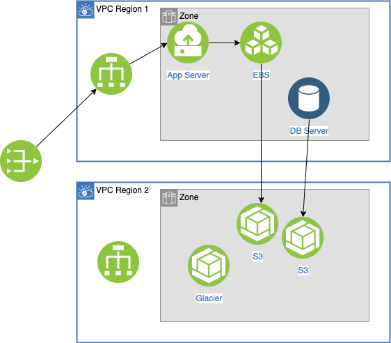
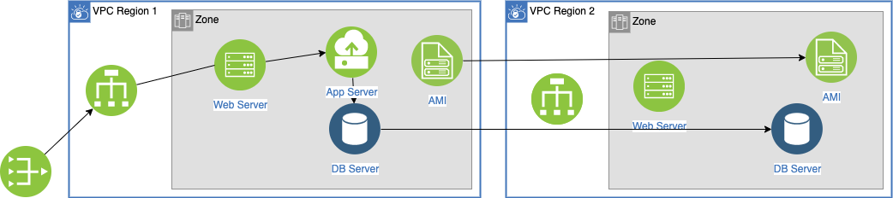

# Solution design with AWS services

We try to address disaster and recovery for different needs, knowing that not all applications need active/active deployment.

## Backup multi-regions

The simplest resilience solution is to use backup and restore mechanism. Data and configuration can be moved to S3 in the second region. For even longer time we can use Glacier. Use database service to ensure HA at the zone level, and replicate data within AZ.

RPO will be average time between snapshots - and RTO at the day level.

## Warm region

For applications, where we want to limit out of services time, the approach is to replicate AMI images so app servers, in DR region, can be restarted quickly. And Database are replicated and warm on the second region. Web servers are also warm but not receiving traffic.

If something go down in region 1, the internet facing router (53) will route to local balancers in second region.

RTO is now in minutes, and RPO average time between DB snapshots. 

## Active - Active between multi regions

### Write global - read local pattern

Users close to one region will read from this region and all write operations go to a global service / region.

Database replications and snapshot replications are done to keep data eventually consistent between regions. Those synchronisations are in sub second.

### Write to origin - read local pattern

To increase in complexity, R/W can go the local region. So when a user writes new records, he/she is associated to a region, so the application is sharding the data. When the user moved to another region, write operation will still go to the first region, while read could happened on the region close to him.

This applies to applications with write to read ratio around 50%.

### Write / read local (anti) pattern

This pattern uses two master DB, one in each region so user can write and read locally. Dual writes, in each region, at the same time may generate the same key but record will have different data. 
You have inconsistency, and it is difficult to figure out, and rollback.
So use this pattern only if you cannot do the two previous patterns.

### AWS Services supporting HA and DR multi-regions

* [S3](/aws/#s3)
* [EBS](/aws/#ebs-volume)
* [dynamoDB](/aws/#dynamodb)