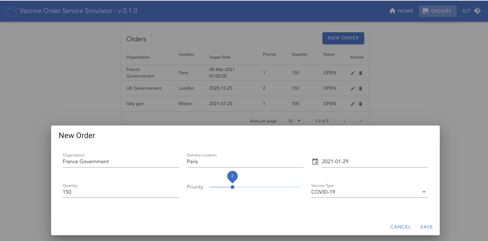

# 01/10/2021 - Transactional Outbox pattern with Debezium, Quarkus and Postgresql


The [Transactional outbox pattern](https://ibm-cloud-architecture.github.io/refarch-eda/patterns/intro/#transactional-outbox) helps to save within the same database transaction, the event you want to publish to the messaging middleware, like Kafka. I just finalized an example of [Order management microservice](https://github.com/ibm-cloud-architecture/vaccine-order-mgr-pg.git) in the context of the [Vaccine at scale demo](https://ibm-cloud-architecture.github.io/vaccine-solution-main/).

The implementation uses [Quarkus](https://quarkus.io) with Reactive Messaging, OpenAPI, JAXRS and the[Debezium outbox pattern](https://debezium.io/documentation/reference/integrations/outbox.html) with Debezium [change data capture  for Postgresl](https://debezium.io/documentation/reference/connectors/postgresql.html) to Kafka.

The main classes in this project is the [OrderService.java class](https://github.com/ibm-cloud-architecture/vaccine-order-mgr-pg/blob/main/src/main/java/ibm/gse/eda/vaccines/domain/OrderService.java) which use the following code approach. Get the Order entity persist it in the same transaction as 'emitting the event', which is not really emitting an event, but save to the `orderevents` table.

```java

 @Inject
    Event<ExportedEvent<?, ?>> event;

@Transactional
public VaccineOrderEntity saveNewOrder(VaccineOrderEntity orderEntity) {
    orderEntity.status = OrderStatus.OPEN;
    orderEntity.creationDate = simpleDateFormat.format(new Date());
    orderRepository.persist(orderEntity);
    event.fire(OrderCreatedEvent.of(orderEntity));
    return orderEntity;
}
```

So the trick is coming from the [OrderCreateEvent](https://github.com/ibm-cloud-architecture/vaccine-order-mgr-pg/blob/main/src/main/java/ibm/gse/eda/vaccines/domain/events/OrderCreatedEvent.java) which is a [io.debezium.outbox.quarkus.ExportedEvent](). 

```java
@Entity
public class OrderCreatedEvent implements ExportedEvent<String, JsonNode> {
    ....
}
```

The [application](https://github.com/ibm-cloud-architecture/vaccine-order-mgr-pg/blob/main/src/main/resources/application.properties) is configured to specify what table to use, and what will be the key and value of the future Kafka records.

```
quarkus.debezium-outbox.id.name=aggregateid
quarkus.debezium-outbox.id.column-definition="DECIMAL NOT NULL"
quarkus.index-dependency.outbox.group-id=io.debezium
quarkus.debezium-outbox.aggregate-id.name=aggregateid
quarkus.debezium-outbox.aggregate-id.column-definition="DECIMAL NOT NULL"
quarkus.index-dependency.outbox.artifact-id=debezium-quarkus-outbox
quarkus.debezium-outbox.table-name=orderevents
```

The deployment of this service to Kubernetes is [explained in this section](https://ibm-cloud-architecture.github.io/vaccine-solution-main/use-cases/order/#deploy-the-vaccine-order-service). And for the Debezium Change data Capture component, as it is a Kafka Connector, I use the Strimzi source to image approach, as described [here](https://ibm-cloud-architecture.github.io/vaccine-solution-main/use-cases/order/#deploy-debezium-cdc-connector).

A new added Order 



is now visible in the entity table 


and the orderevents table.