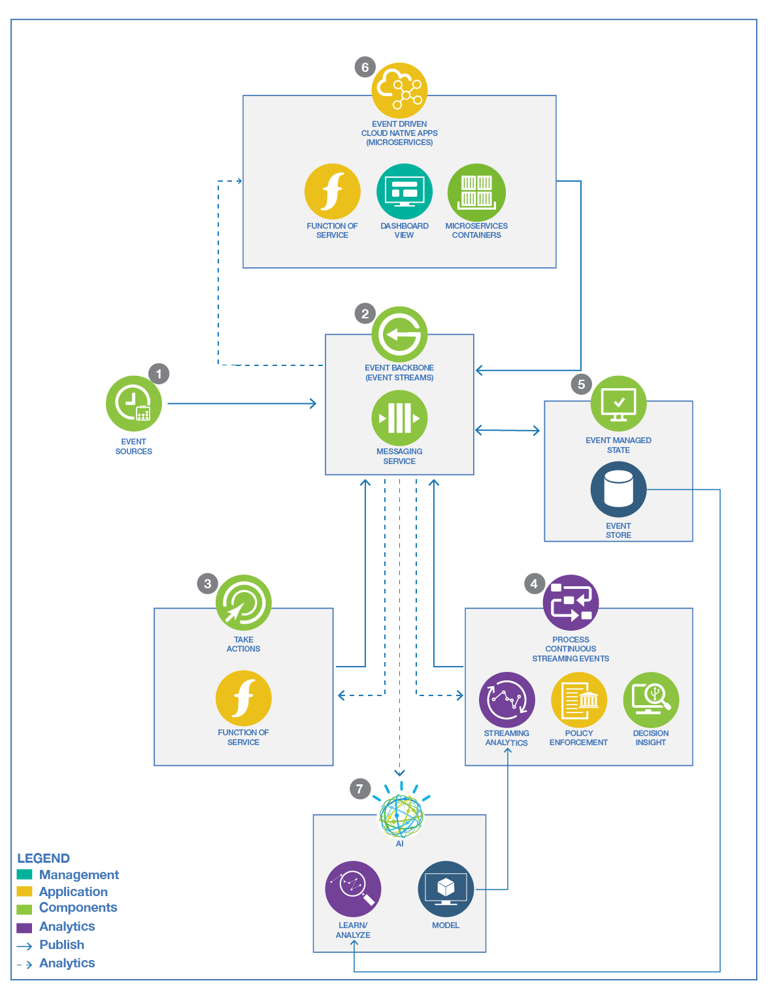

# Event Driven Architecture still hot

Recently I have to justify why Event-Driven Architecture is still a hot topic on the current market: 
as I work with a lot
of enterprises in financial, healthcare or retailer industries, I could see a strong adoption of loosely coupled, event-driven microservice solutions,
or new data pipeline to modern data lake an the adoption of event backbone technology like Apache Kafka, or Apache Pulsar. 

With my team we are working on reference architectures, reference implementations, first of a kind around event-driven solution,
and this space is evolving a lot with the adoption of serverless, cloud native technologies. 

In this blog, I want to present some references with quick summary of such trends and technologies.

Event-driven architecture (EDA) is an architecture pattern that promotes the production, detection, consumption of, and reaction to events. 
This architectural pattern can be applied to the systems that transmit data as events among loosely coupled software components and services.

The business value of adopting this architecture is that you can easily extend EDA with new components that are ready to 
produce or consume events that are already present in the overall system. 

## The main use cases

At the high level the main business motivations to use event based solution is to respond on data creation or update in real time,
as they happen, which means assessing what those changes are, to deliver responsive customer experiences or to assess business risks and opportunities.
The adoption of AI and predictive scoring can also being integrated into the real time data pipeline to build more intelligent applications.

At the technical level we can see three adoptions of event-driven solution:

1. **Modern data pipeline** to move the classical batch processing of extract, transform and load job to real time ingestion, where data
are visible in a central integration, messaging backbone. The data sources can be databases, queues, or specific producer applications,
while the consumers can be applications, streaming flow, long storage bucket, queues, databases...
1. Adopt **asynchronous, publish-subscribe communication** between cloud-native microservices to help scaling and decoupling: the adoption
of microservices for developing business application has help addressing maintenance and scalability, but pure RESTful or SOAP based solutions
have brought integration and coupling challenges that inhibited the agility promised by microservice architecture. Pub/sub  helps to 
improve decoupling, but design good practices are very important. (I will elaborate on that in future blogs)
1. **Real time analytics**: this embraces pure analytic computations like aggregate on the data streams but also complex event processing,
time window based reasoning, or AI scoring integration on the data streams. 

## Reference architecture

With those main drivers in place, we have defined reference architectures to assess what are the common components involved in such
event-driven solutions. At IBM, we have developed two architecture diagrams, but I am using the [extended one](https://www.ibm.com/cloud/architecture/architectures/eventDrivenArchitecture/reference-architecture)
in most of my customer's engagements as it includes how to leverage data in the event backbone to develop AI model, which is, I think,
an important pattern to adopt.

I encourage you to read more about those components and capabilities from [this web site](https://www.ibm.com/cloud/architecture/architectures/eventDrivenArchitecture/reference-architecture).

## Event-driven patterns

Coming with the adoption of event-driven solution, developers and architects need to assess the different design pattern we have 
in our toolbox, like [Event Sourcing](https://www.ibm.com/cloud/architecture/architectures/event-driven-event-sourcing-pattern) to persist the state of a business entity as a sequence of state-changing events,
[Command Query Responsibility Segregation (CQRS)](https://www.ibm.com/cloud/architecture/architectures/event-driven-cqrs-pattern)  to segregate the APIs for accessing data, the models for managing data, or the database itself, 
[SAGA](https://www.ibm.com/cloud/architecture/architectures/event-driven-saga-pattern) to support long-runnning transactions that span multiple microservices with potentil compensation process,
[Transactional Outbox](https://microservices.io/patterns/data/transactional-outbox.html) to get data from data base table and to send messages to topic or queue, 
and [other patterns.](https://www.ibm.com/cloud/architecture/architectures/eventDrivenArchitecture/patterns)

Those patterns help to better design event-driven microservices, but common sense prevail for selecting such pattern when really needed. We have done different implementations of those patterns to get
some starting code and practice for your own implementation:

* [CQRS for an order management service](https://github.com/ibm-cloud-architecture/refarch-kc-order-ms)
* [Saga to support shipping order, with boat allocation, and refrigerator container assignment](https://ibm-cloud-architecture.github.io/refarch-kc/implementation/saga-patterns/)
* [Transactional outbox on another order management service](https://github.com/ibm-cloud-architecture/vaccine-order-mgr-pg), this one on vaccine order. It uses Quarkus Debezium plugin, Postgresql
 and Kafka Connector

## How to get started

From the methodology point of view, the event storming method was introduced and publicized by Alberto Brandolini in ["Introducing event storming book”](https://www.eventstorming.com/book/) 
for rapid capture of a solution design and improved team understanding of the domain. We extended the workshop to assess for
events relationship and insights that can be derived from the data stream: this will help to design intelligent agents that
continuously process event streams.

As we use Lean startup and agile development practices, event storming and domain driven design, help us to start on good foundations for
our event-driven solution. This is not simple exercise and it is easy to go wrong. But it is important to be able to pivot, refactor
and adapt the boundary of the microservice when we discover major implementation issues, like coupling by the service and the event schemas, ...

We go into the detail on how to conduct an [event storming workshop in this article](https://ibm-cloud-architecture.github.io/refarch-eda/methodology/event-storming/) 
with a [quick summary of the domain driven design concepts and constructs](https://ibm-cloud-architecture.github.io/refarch-eda/methodology/domain-driven-design/).

For a developer point of view, I want to provide some simple sample starting code based on the same microservice scope: an order management service, but in different languages, and
by using domain driven design and elements like Asynch API, Avro schemas....
The github repository is [eda-quickstarts](https://github.com/ibm-cloud-architecture/eda-quickstarts) where you can find Quarkus 2.x producer and consumer, Spring cloud projects: it
still needs work and I welcome contributor. 

## Technology trends

Apache Kafka is the current leader to support the event-backbone component of our reference architectures, we have extensive studies to summarize
the [key concepts](https://ibm-cloud-architecture.github.io/refarch-eda/technology/kafka-overview/) and best practices to implement [producer and consumer](https://ibm-cloud-architecture.github.io/refarch-eda/technology/kafka-producers-consumers/) code,
and a lot of hands-on labs we are packaging as use cases.

Deploying and managing Kafka is greatly facilitated if it runs on Kubernetes, and for the best deployment approach, use the [Strimzi Operator](https://strimzi.io/docs/operators/latest/using.html).

As a nice competitor to Kafka, [Apache Pulsar](https://pulsar.apache.org/) addresses all the expected event-backone features but add more interesting feature.

A new player in the Kafka field is [Redpanda from Vectorized](https://vectorized.io) which delivers a lot of very nice features to overcome some of the Kafka's issues: Kafka is a 10+ years old
technology designed with hardware constraints that are now legacy.

When you want to look at implementing streaming logic, Kafka uses Kafka Streams API or kSQL to support it. It is really Kafka oriented and may
address most of the stream processing needs but there are alternate. In 2022, I think adopting [Apache Flink](https://flink.apache.org/) as your tool to support data streaming may be a better solution and investment
as it is really an universal tool, well designed, able to scale independently of Kafka, and can be used with different data sources.
Flink has a lot of features that will help you to address streaming use cases, but also SQL ones, data at rest processing ones, and complex event processing.
Combining event backbone and data streaming with AI is the way to go and we need to ramp up our skill set on all of that.

## Important EDA links

* [IBM event-driven reference architecture](https://www.ibm.com/cloud/architecture/architectures/eventDrivenArchitecture/overview)
* [EDA field guide](https://www.ibm.com/cloud/architecture/content/field-guide/event-driven-field-guide/)
* [Event-driven architecture body of knowledge (Always work in progress)](https://ibm-cloud-architecture.github.io/refarch-eda/)
* [Event storming methodology](https://ibm-cloud-architecture.github.io/refarch-eda/methodology/event-storming/)