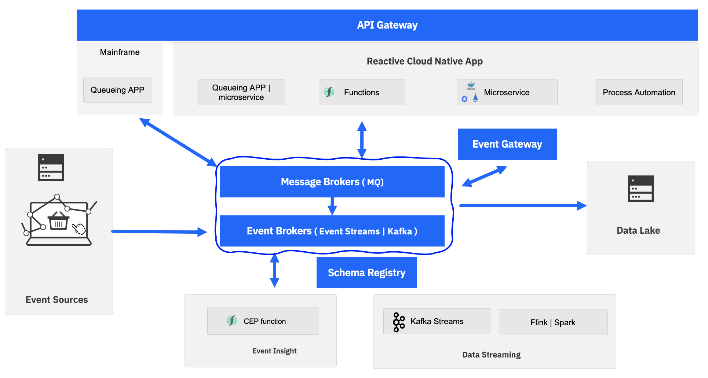
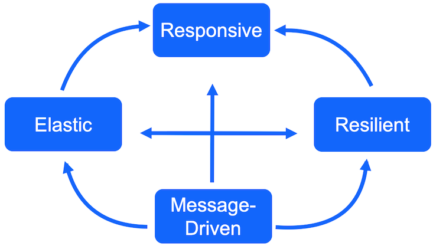
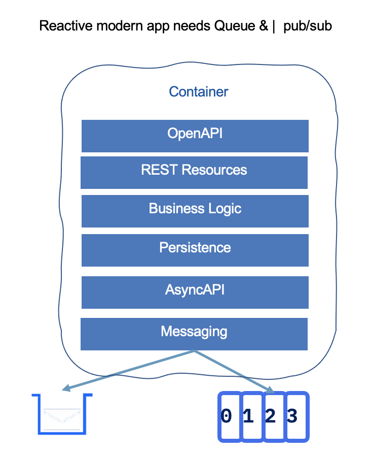

# Updated EDA reference architecture

Last three years I spent my time designing event-driven architecture for customers and develop best practices around it. 
From my last engagements I have to update the EDA reference architecture and really talk about message brokers more than event backbone… let see why.

**Figure 1: EDA reference architecture**

One of the common discussions I have with architects, is around "messaging versus eventing", or "queueing versus pub/sub", which quickly leads to product comparison Kafka versus MQ.
Some IT architects, who want to go full Kafka, or some biased marketing campaign are claiming " 'Queue' is an old stuff, you do not need them anymore" or "with Kafka, you can address all your messaging requirements in one platform".

Obviously, we have to go over the buzz, and always go back to the 'fit for purpose' discussion and analyze the needed semantic: when developing digital business applications we need different tools to address different requirements, but what we know for multiple years is that "messages are keys to develop a scalable, resilient, elastic solution".

## Context

A few years ago, experts defined classification for eventing versus messaging:  Even if most of the presented arguments are still relevant today, it is important to note that applications are exchanging an array of bytes, representing messages to be shared between components. 'Event' was considered in different programming languages or frameworks, for more than 20 years, as a way to support asynchronous communication.
So in the end, what is really important, is to consider the following requirements:

* send an **asynchronous request to another app** to expect it to send a **response** back, and to perform an action.
* send **asynchronous** messages to broadcast to the world about its data changes. These represent 
facts about its data, which, in Domain Driven Design, are **events**.

In both cases, messages are persisted in a middleware product for other applications to consume. 
The request/response model brings requirements like exactly-once delivery, transactionality, consistency,
 and resilience until consumed. The second approach may use at least delivery, support scaling for multiple 
 consumers, and accept eventual consistency. At the middleware product level, some design decision needs to 
 occur to support each of those requirements, and this is why, today, IT architects should consider different 
 products to address the business application needs around:

* **point-to-point communication**, with queue to persist the messages. Messages in the queue are removed once consumed: this is perfect to support
request/response communication. We do that since 40 years of implementing business applications.
* **pub/sub communication**, with topics to persist the messages. There is a temporal decoupling, and what Kafka added to the 
classical JMS topic based middleware, is the fact that messages can be persisted for a long time period, 
within an append log, and are not removed by the middleware once they are consumed by all subscribers, but by administrator configuration. There is no more concept of "all subscribers".
Consumers consume when they want, for the last message read or from any offset.

With append log, applications can do data streaming, continuously consuming messages, processing them, and publishing new ones to different topics. Those new capabilities offer new real-time processing of data in motion.

Now that we have the core of the major difference between queues and topic middlewares,
we want to identify a set of key requirements an architect needs to address:

* get visibility of the new data created by existing and old applications in real time to get better business insights and propose new business opportunities to the end-users / customers.
This means adopting data streaming, and intelligent query solutions.
* integrate with existing transactional systems, and continue to do transaction processing while adopting eventual consistency, characteristics of distributed systems. (Cloud native serverless or microservices are distributed systems)
* move to asynchronous communication between serverless and microservices, to be responsive, resilient, and scalable (characteristics of 'Reactive applications').
* get loosely coupled but still understand the API contracts. API being synchronous (RES, SOAP) or async (queue and topic).
* get clear visibility of data governance, with cataloging applications to be able to continuously assess which apps securely access what, and to do what.

In the [Gartner's Maturity Model for EDA](https://www.gartner.com/en/documents/3942102/maturity-model-for-event-driven-architecture), we see the evolution an enterprise needs to follow to grow from 'Incidental' EDA model to 'Advanced or Pervasive' where EDA is part of the business portfolio, and the requirements listed above are becoming strong considerations to help to move to the 'Advanced' stage.

## EDA reference architecture

Our [EDA reference architecture](https://ibm-cloud-architecture.github.io/refarch-eda/introduction/reference-architecture/#event-driven-architecture) was defined more than two years ago,
and as new requirements are coming over time, we always need to revisit it. The figure 1 will be the new
base to support our discussion.

On the **queue side** (top left corner of figure 1), we need to have modern microservices or function as service, as well as legacy applications, being able to write and read to/from queues. This has to be
the way to code asynchronous request / response communication. I defended [Command Query Responsibility Segregation](https://ibm-cloud-architecture.github.io/refarch-eda/patterns/cqrs/) 
and [Saga](https://ibm-cloud-architecture.github.io/refarch-eda/patterns/saga/) patterns to be very important design patterns in modern microservice solution, 
but those patterns need to be implemented with queues, a mix of queue and topic and not just topics. 

Queueing product, like IBM MQ, supports XA transactions, and this is a key feature to keep in any modern architecture: we want to publish messages while writing to the database in the same transaction.
Also, mainframes are still excellent citizens in any hybrid cloud architecture. 
They support transactional processing and most of the time at a lower total cost of ownership than distributed systems.
But I will not extend on TCO in this article. Most mainframes are integrated with MQ to support asynchronous request / response communication and in EDA we want to get
visibility of those messages. Therefore it makes a lot of sense to get data replicated in queues and then injected from queue to Kafka topic. This is the arrow
between MQ and Kafka and the Kafka connector framework is used to support this injection.

On the **Reactive cloud-native app** side, developers need to adopt domain-driven design to better identify bounded contexts, aggregates, events and commands to
be developed in the microservice context. Commands are most of the time, verbs defined in the OpenAPI contract. Entities and aggregates will serve
to define what the service will manage and expose APIs to.

To be reactive, those microservice are message driven, and will have to integrate with messaging middleware.

In DDD, events are immutable facts so discovered events are good candidates for messages in queues and topics. 
As seen at the beginning of this article the semantic of the communication will help decide if we need queue or topic or both.
[Event sourcing](https://ibm-cloud-architecture.github.io/refarch-eda/patterns/event-sourcing/) is another pattern that may influence such decision.

To keep the best practices of contract testing and contract management, AsyncAPI specification helps developers
to define the schema structure of the messages to exchange asynchronously between components. 
It uses bindings construct to define on which middleware to send messages to.

OpenAPI can be developed top-down, or bottom-up by using microprofile openApi inside your Java app, 
for example. When adopting API management this openAPI definition is also deployed in an **API gateway**
 to control the traffic and security access of each cloud-native apps. HTTP communications between RESTful endpoints are going to the API gateway. 
 Now when communication is via queue or topic, AsyncAPI definitions are used and can be defined in the **Event Gateway** which acts as a middle proxy between message brokers and consumers. We are at the beginning of such technologies adoption but it will help the traffic monitoring and application governance.

If OpenAPIs are defining API data schema in the form of JSON schema for REST endpoint, the **Schema registry**, is adding schema management and versioning
so Kafka-based applications can get their data contract. This was the first piece of the asynchronous contract definition, asyncAPI is adding more
specifications to it, but schema registries are not yet fully integrated with API management. 
[Apicurio](https://www.apicur.io/) is an open-source project which supports API and schema registry.

Cloud-native developers need to consider [microprofile messaging](https://download.eclipse.org/microprofile/microprofile-reactive-messaging-1.0/microprofile-reactive-messaging-spec.pdf), [knative eventing](https://knative.dev/docs/eventing/) or any actor framework (like [IBM KAR](https://github.com/IBM/kar))
to support the implementation of their services. 

The following figure presents a potential structure for such a service: APIs are defined using [microprofile OpenAPI](https://github.com/eclipse/microprofile-open-api) annotations
in one or more JAXRS resource classes.  Those APIs can then be managed within an API management product as IBM App connect.

The rest of the application structure reflects the DDD approach of onion architecture.
The business logic is in its own layer with DDD aggregate concepts, ubiquitous language, service, business rules, etc... 
The repository layer supports persisting those aggregates to an external, document-oriented or SQL-based database. 

As most of the new microservices are message-driven, we are adding a messaging layer which
may use queues or topics. In Java, the [microprofile reactive messaging](https://download.eclipse.org/microprofile/microprofile-reactive-messaging-1.0/microprofile-reactive-messaging-spec.pdf) 
may be used to define the different publishing channels, being queue, topic or both.
From the JSON or Avro schema defining the messages or events structure, developers can build an asyncAPI specification which may also be
managed by an API product.

I will present some code templates for
such applications using continuous integration and deployment to Kubernetes platform in a separate blog.

The last piece of any cloud-native applications, is the migration of long-running, stateful applications, which used to be developed in Business Process Management platform, to microservice: the retooling and modernization of such monolithic product suite, is based on microservices and even serverless architecture. Business application that needs long-running, human-centric workflow, will run on top of message brokers, to consume business events or produce such events at intermediate steps within the process. Those are very important elements of EDA and modern digital enterprise.

On the left side of figure 1, we can see different data sources: those data need to be injected 
to the event backbone so data can be visible to any consumers. 
Different solutions can be used to inject such data, and **Change Data Capture** technologies should be considered as a solution
to get non-green field apps into modern distributed and event centric world. 

On the right side of figure 1, there is a very important element to take into consideration: the cloud data lake. 
This where big data processing is done, AI models are built,
and all the featuring engineering occur. This is a highly scalable environment, supporting a large amount of data, structured or unstructured.
Event backbones, like Kafka, are used as data injection to a modern data lake, but also to support real-time analytics on the data stream.

Mature adoption of event-driven architecture integrates with stream analytics, AI, and API marketplaces, to help business teams 
enable new leading-edge solutions. These include continuous intelligence, contextual decision making, global ecosystems operations, and monetizing of event-derived insights.

The lower row of the architecture diagram presents such capabilities: AI model and predictive scoring developed on the big data platform can be used to score
event notifications in near-real-time. Different technologies can be used, we are using Apache Flink or Apache Spark to support these analytics. Kafka
Stream may also be used, but it is strongly coupled to Kafka, so applying clear separation of concern principles,
it is interesting to consider Flink as a better alternative.

Finally, there are also new sets of applications that can be integrated into this architecture, with the goal to support complex event processing semantic.
Apache Flink has a [CEP engine](https://ci.apache.org/projects/flink/flink-docs-release-1.13/docs/libs/cep/) to be able to work on event sequencing and derive new synthetic events from event patterns or to trigger business actions.
Flink is a very nice platform to support your event streaming and CEP independently to Kafka. 

I think I cover all the elements of this new EDA reference architecture. More to come...
