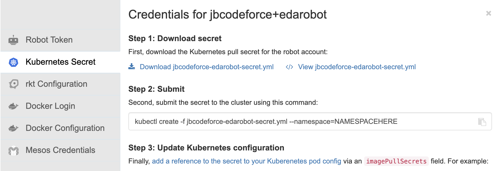

# Developer experience for an event-driven microservice

Event-driven solutions are complex to implement, a lot of parts need to be considered, and I did not find any article that goes into
how to do things with the last technology available to us ('last' meaning August 2021). 

I want to propose a set of articles to address this developer's experience, not fully in the perfect order of developer's activities, as normally  we should start by event-storming and DDD.

So here is how I see the different high level task developers may need to follow:

* Use [Domain-driven design](https://ibm-cloud-architecture.github.io/refarch-eda/methodology/domain-driven-design/) and [event storming](https://ibm-cloud-architecture.github.io/refarch-eda/methodology/event-storming/) to discover the business process to support 
and discover the different bounded contexts which will be mapped to microservices.
* Use a code template as a base for the event-driven microservice: to avoid reinventing configuration definitions for the different messaging used (MQ or Kafka or other). Those templates
use the DDD Onion architecture, and are based on Quarkus. The code also assumes the services are containerized and deployed to Kubernetes or OpenShift.
* Create a GitOps repository with [KAM](https://github.com/redhat-developer/kam), deploy the pipelines and GitOps to manage the solution and the different 
deployment environments (`dev` and `staging`). Define specific pipelines tasks and pipeline flowto build the code and docker images. Connect git repository  via webhook to the pipeline tool (Tekton)
* Define message structure using AVRO or JSON schemas, generate Java Beans from the event definitions using maven or other tool.
* Connect and upload schemas to schema registry
* Define REST end point and OpenAPI, then manage those APIs in API management
* Apply test driven development for the business logic, assess integration tests scope and tune development environment accordingly. 
* Ensure continuous deployment with ArgoCD 

In this article, I propose to do a simple implementation of the Command Query Responsibility Segregation pattern for an Loan Application Entity
which will be managed by a command microservice, and uses a decision service to score the risk on the loan.


**Figure 1: a complete solution diagram**

## From Domain Driven Design...

The journey starts from an [event storming](https://ibm-cloud-architecture.github.io/refarch-eda/methodology/event-storming/) workshop where architect, Subject Matter Experts, analysts and developers work together
to discover the business process with an event focus. Then applying domain-driven design practices, they should identify
bounded contexts and context map. The last part of the architecture decision activity will be to map bounded contexts to microservices.
This is not a one to one mapping, but the classical approach is to manage  big entity in its own microservices.

So if we take the traditional order processing domain, wee will discover events about the Order entity life cycle
and the Order entities with its value objects and references to other services. The figure below presents
some basic DDD elements: Commands in blue, Entity-aggregate in dark green, value-objects in light green, and events in orange.


The right side of the diagram presents a DDD approach of the application architecture, described in layers. 
We can use also the onion architecture, but the important development practice is to isolate the layers.

Commands will help to define APIs and REST resources and may be the service layer. Root aggregate defines what will
be persisted in the repository, but also what will be exposed via the APIs. In fact it is immediately important
to enforce avoiding designing a data model with a canonical model approach, as it will expose a complex data model in the APIs, where
we may need to have APIs designed for the service and the clients.

Finally Events will define Avro schemas that will be used in the messaging layer. 

I will detail OpenAPI and AsyncAPI elements, and the different layer later in this article.

## ... To code repositories

Developer starts to create a code repository in its preferred Software Configuration Manager, 
I will use GitHub (See [this repo for the command loan application microservice](https://github.com/jbcodeforce/loan-origin-cmd-ms)) code
and [the separate GitOps repository](https://github.com/jbcodeforce/eda-order-gitops) for CI/CD 
and environment deployments.

As presented in [this note](https://ibm-cloud-architecture.github.io/refarch-eda/patterns/cqrs/), CQRS is implemented in two separate code units, in our case two separate microservices, and so two Git repositories. 
As the subject of this article is about starting on strong foundations for developing event-driven microservices,
I will address the Command part of the CQRS which will use Kafka Consumer, and MQ producer.

To support a GitOps approach for development and deployment, Red Hat has delivered two operators around [Tekton / OpenShift Pipelines](https://docs.openshift.com/container-platform/4.7/cicd/pipelines/understanding-openshift-pipelines.html)
for continuous integration, and [ArgoCD / OpenShift GitOps](https://docs.openshift.com/container-platform/4.7/cicd/gitops/understanding-openshift-gitops.html) for continuous deployment. 
As part of the OpenShift GitOps, there is also the [KAM CLI](https://github.com/redhat-developer/kam) tool
 to help developer to start on the good track for structuring the different deployment configurations and ArgoCD app configurations.

The core idea of GitOps is having a Git repository that always contains declarative descriptions 
of the infrastructure currently desired in the production environment and an automated process 
to make the production environment match the described state in the repository.

To get the basic knowledge related to this article, I recommend reading the following documentations:

* [Understand GitOps](https://www.gitops.tech/)
* [Study KAM](https://github.com/redhat-developer/kam)

From the Figure 1, and using the KAM's [Day 1 Operations](https://github.com/redhat-developer/kam/tree/master/docs/journey/day1) practices, 
we will need to create the following git repositories:

* One repository for the Command microservice
* One repository for the automation decision service
* One repository for GitOps of the solution, to control application  configuration and continuous deployment
* One repository for integration tests


## Getting Started

We assume you have access to an OpenShift 4.7 Cluster: if not you can use [IBM OpenLab](https://developer.ibm.com/openlabs) to get a free cluster for one hour. 

Login to your cluster, and create a project.

```sh
oc login --token=.... --server=....
```

### Install pre-requisites

The first thing to do, is to install the different services / middleware operators, and then create one or more
instance of those 'services'. I will combine Open Source and IBM products for this solution. 
The products I'm using for the order microservices are:

>   * IBM MQ
>   * IBM Event Streams on OpenShift for Kafka
>   * Postgresql
>   * Elastic Search

1. Clone the [eda-gitops-catalog repository](https://github.com/ibm-cloud-architecture/eda-gitops-catalog.git) to get the
operators definitions of the products used: 

    ```sh
    git clone https://github.com/ibm-cloud-architecture/eda-gitops-catalog.git
    cd eda-gitops-catalog
    ```

1. Add the IBM product catalog references to your OpenShift cluster

    ```sh
    # List existing catalog
    oc get catalogsource -n openshift-marketplace
    # If you do not see any IBM operators then install IBM Catalog definition
    # In the eda-gitops-catalog project
    oc apply -k ./ibm-catalog/
    ```

1. Deploy GitOps and Pipeline Operators: See the [install the openShift GitOps Operator article](https://docs.openshift.com/container-platform/4.7/cicd/gitops/installing-openshift-gitops.html#installing-gitops-operator-in-web-console_getting-started-with-openshift-gitops) or
use the following command:

    ```sh
    # for OpenShift 4.7+
    # GitOps for solution deployment
    oc apply -k ./openshift-gitops/operators/overlays/stable
    # and Pipeline for building solution
    oc apply -k ./openshift-pipelines-operator/overlays/stable
    # To verify they are not already installed use:
    oc get operators
    # for OpenShift 4.6
    oc apply -k ./openshift-gitops/operators/overlays/preview
    oc apply -k ./openshift-pipelines-operator/overlays/preview
    ```

1. Obtain [IBM license entitlement key](https://github.com/IBM/cloudpak-gitops/blob/main/docs/install.md#obtain-an-entitlement-key)

1. Update the [OCP global pull secret of the `openshift-gitops` project](https://github.com/IBM/cloudpak-gitops/blob/main/docs/install.md#update-the-ocp-global-pull-secret)
with the entitlement key

    ```sh
    oc create secret docker-registry ibm-entitlement-key \
        --docker-username=cp \
        --docker-server=cp.icr.io \
        --namespace=openshift-gitops \
        --docker-password=your_entitlement_key 
    ```

1. If not already done, install [Quarkus CLI](https://quarkus.io/guides/cli-tooling)

    ```sh
    curl -Ls https://sh.jbang.dev | bash -s - app install --fresh --force quarkus@quarkusio
    ```

1. Install [KAM](https://github.com/redhat-developer/kam/releases/latest) and put the downloaded binary into your `$PATH`

1. If you are using an external image repository, get its secret to authenticate the `pipeline` service account to push image on successful pipeline execution. For Quay.io see [this note](https://github.com/redhat-developer/kam/blob/master/docs/journey/day1/prerequisites/quay.md)
on how to create a Robot Account with Write permission.

    

    download the Kubernetes Secret definition to be defined in your cicd project.

    

1. Get Github access token, to be used in the KAM bootstrap command, in future steps.

    

### Create foundation for the first microservice

Using the new Quarkus CLI to create a basic project:

```sh
# Get the help
quarkus create app --help
# create a loan-origination bff app
quarkus create app  -x openapi,metrics, ibm.gtm.dba:loan-origin-cmd-ms:1.0.0
# Verify the app works
cd loan-origin-cmd-ms
quarkus dev
curl localhost:8080
```

Push to a github repository that you need to create in github. I will use `loan-origin-cmd-ms.git`.

```sh
git init
git commit -m "first commit"
git branch -M main
git remote add origin https://github.com/jbcodeforce/loan-origin-cmd-ms.git
git push -u origin main
```

Be sure to have an Access Token defined in your github account so application can access your repositories.

### Bootstrap GitOps

1. Use kam cli to create the gitops project for our solution with reference to our first microservice

    ```sh
    kam bootstrap \
    --service-repo-url https://github.com/jbcodeforce/loan-origin-cmd-ms \
    --gitops-repo-url  https://github.com/jbcodeforce/loan-origin-gitops \
    --image-repo quay.io/jbcodforce/loan-origin-cmd-ms \
    --git-host-access-token <your-github-token> \
    --prefix los --push-to-git=true
    ```

1. Add a `bootstrap` folder and define argoCD project descriptor. 
See [this file, as one example of ArgoCD project](https://raw.githubusercontent.com/jbcodeforce/ads-risk-scoring-gitops/main/bootstrap/risk-scoring/argo-project.yaml) definition: the structure looks like below: 

    ```yaml
    apiVersion: argoproj.io/v1alpha1
    kind: AppProject
    metadata:
    name: loan-origination
    namespace: openshift-gitops
    spec:
    sourceRepos: []
    destinations: []
    roles: []
    ```

    ```sh
    oc apply -k bootstrap/risk-scoring
    ```

1. Bootstrap the ArgoCD apps to deploy CI/CD and the different application's services

    ```sh
    oc apply -k config/argocd 
    ```

1. Get ArgoCD admin password and Console URL

    ```sh
    oc describe route openshift-gitops-server  -n openshift-gitops
    oc extract secret/openshift-gitops-cluster -n openshift-gitops --to=-
    ```

1. deploy IBM Event Streams operator

    ```sh
    # In the eda-gitops-catalog project
    oc apply -f ./cp4i-operators/common-services.yaml

    oc apply -f ./cp4i-operators/event-streams/subscription.yaml   
    ```


1. [Optional] If you want to use Kafka open source uses the Strimzi operator

    ```sh
    # Install Strimzi Kafka Operator - It will listen to any namespaces
    oc apply -k ./kafka-strimzi/operator/overlays/stable
    ```
    
    Then install Apicurio Registry Operator. 

    ```sh
    oc apply -k apicurio/operator/overlays/stable
    ```

```sh
# Install MQ Operator, which may also deploy IBM Cloud Pak foundational services 
oc apply -f operators/mq/subscription.yaml
# Verify installed operators
oc get operators

NAME                                               AGE
apicurio-registry.openshift-operators              5m34s
ibm-common-service-operator.openshift-operators    6m41s
ibm-mq.openshift-operators                         8m10s
ibm-namespace-scope-operator.ibm-common-services   4m47s
ibm-odlm.ibm-common-services                       3m27s
strimzi-kafka-operator.openshift-operators         7m38s
```

Once done we will create Kafka Cluster, a MQ broker for development, Apicurio

#### Instances

##### Kafka via Strimzi

```sh
# Create Kafka Cluster instance and a scram user and tls user
oc apply -k  instances/strimzi-kafka/kustomization.yaml 
# Verify Kafka cluster runs
oc get kafka
oc get kafkauser 
```

The SCRAM and TLS users are defined to get different ways to authenticate to Kafka. 
For detail explanations on how Kafka authentication mechanism works, I recommend [reading Rick Osowski's article](https://rosowski.medium.com/kafka-security-fundamentals-the-rosetta-stone-to-your-event-streaming-infrastructure-518f49640db4).

The installation of th Kafka Cluster has generated a set of secrets for TLS certificates, that we will need:

```sh
oc get secrets
NAME                                        TYPE     
eda-kafka-cluster-ca-cert                   Opaque
...
```

##### IBM MQ

```sh
# Create an instance named QM1
oc apply -f instances/mq/mq-qm1.yaml 
# Verify and get the Console URL
oc describe queuemanager qm1
```

## Develop the event-driven service

I will focus on the way to prepare the different elements of the service to ensure keeping the coupling to the minimum.

I will use [Quarkus](https://quarkus.io) to develop the Microprofile based services. I recommend to use the [quarkus CLI](https://quarkus.io/guides/cli-tooling)
to start your project on good foundations:

```sh
quarkus create ibm.eda.demo:kc-freezer-cmd-ms:0.0.1 -x reactive-messaging-kafka,metrics,smallrye-openapi
# Add needed extensions
quarkus ext add qpid-jms, openshift
```

### Defining the API from JAXRS Resource and OpenAPI annotation

The demo is a proof of concepts, so we will have on OrderDTO as a bean to support
getting the data about the order at the API level.


## Clean your gitops environment

* Delete the pipeline custom resources: [see this note](https://docs.openshift.com/container-platform/4.7/cicd/pipelines/uninstalling-pipelines.html)

## Related product documentation

* [Cloud Native PostgreSQL Operator](https://docs.enterprisedb.io/cloud-native-postgresql/1.8.0/)
* [Step by step quarkus app dev with pipeline and gitops](/bloggs/08-27-21/steps-to-dev-ms/)