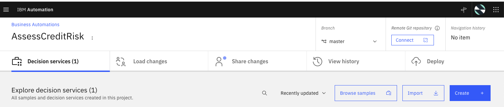

# Develop a loan risk scoring decision service

In this article I am covering how to develop a decision service with the new IBM Automation
Decision Service product using Decision Model Notation and a Quarkus app to call the
service. 

To get started there is a [nice tutorial in product documentation](https://www.ibm.com/docs/en/cloud-paks/cp-biz-automation/21.0.x?topic=resources-getting-started-tutorial)

## Pre-requisites

* Maven
* Quarkus CLI
* Access to an OpenShift Cluster. For example using Red Hat OpenShift on IBM Cloud

 

 Open the Openshift Console

  ```sh
  oc login --token=..... --server=https://...
  ```

* Get Cloud Pak for Automation deployed with ADS configured

## Connect to Automation Studio

To get visibility of the different access points, and user credentials of the Cloud Pak for Automation components
use the `icp4adeploy-cp4ba-access-info` config map:

```sh
oc describe cm icp4adeploy-cp4ba-access-info 
```

Look at the `bastudio-access-info`. The address may start with `https://cpd-`




## Future Reading