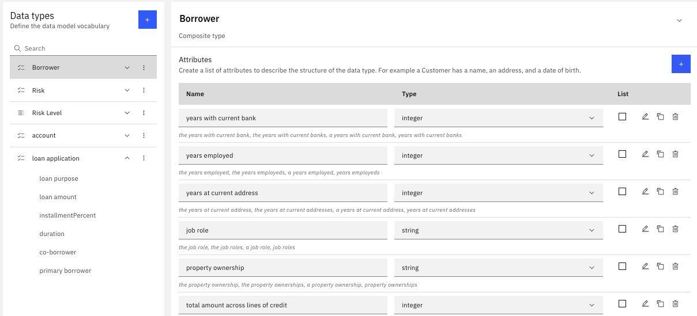
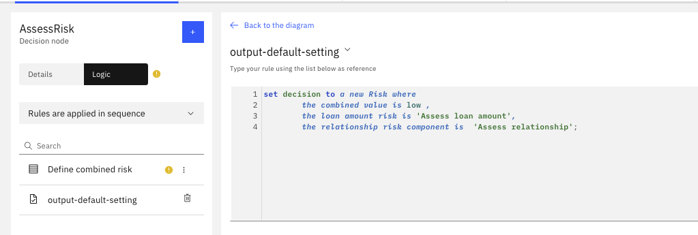
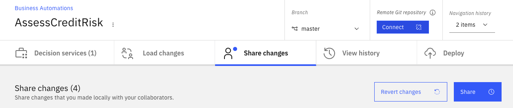

# Develop a credit risk scoring simple solution

In this article I am covering how to develop a simple decision service with the new IBM Automation
Decision Service product using Decision Model Notation, a Quarkus app to call the deployed
service and a Watson ML predictive scoring model. This article is inspired from the work done by [Pierre Berlandier](https://www.linkedin.com/in/pierreberlandier/) on that subject.

At the highest level the solution looks like in the system context diagram:


But we are more interested by the components involved in the demo:


To get started with ADS product, I recommend to follow the [ADS product documentation Getting Started tutorial](https://www.ibm.com/docs/en/cloud-paks/cp-biz-automation/21.0.x?topic=resources-getting-started-tutorial).
I am detailing some parts of this tutorial and add other development practices like Quarkus integration,
adopting event processing and Predictive scoring.

The business use case is quite simple as it is based on a person asking for a credit to his/her bank.
Each person is classified as good or bad and then rules defined combined risk score from other business rules and a predictive score.


## Pre-requisites

You need to get the following available to your development environment

* Maven
* [Quarkus CLI](https://quarkus.io/guides/cli-tooling)
* Access to an [OpenShift Cluster](https://cloud.ibm.com/kubernetes/catalog/create?platformType=openshift). For example using Red Hat OpenShift on IBM Cloud.

 

 Open the OpenShift Console and get access to the login CLI

  ```sh
  oc login --token=..... --server=https://...
  ```

* Get [Cloud Pak for Automation]() deployed with ADS configured. We recommend to follow this gi
* Get one Waston Studio instance on IBM Cloud

## Too long to read

If you just want to see the code, go to [this repository](https://github.com/jbcodeforce/assess-loan-application-ds) and browse the solution, or import
it in your own Automation Studio: to do so perform the following steps:

1. Clone this git repository `git clone https://github.com/jbcodeforce/assess-loan-application-ds`
1. Connect to Automation Decision Designer (See [this section](#connect-to-automation-studio) for instruction summary)
1. Add Decision Automation Service project, see [this section](#create-a-new-decision-automation)) for detail but come back here once done.
1. Import the decision model
1. Navigate into the decision model using the Designer.

## Connect to Automation Studio

To get visibility of the different access points, and user credentials of the Cloud Pak for Automation components
use the `icp4adeploy-cp4ba-access-info` config map:

```sh
# under the project where the common services are deployed
oc describe cm icp4adeploy-cp4ba-access-info 
```

Look at the `bastudio-access-info`. The address may start with `https://cpd-<projectname>-<clustername>`

* Once logged in, the IBM Automation, go to the Navigation bar.

  

* Select Business Automation Studio app, on the left menu:

  

## Work on the Automation Decision Service

### Create a new decision automation

* Select the `Create` button and the `Decision Automation` choice, 

  

  Define a name according to the business intent: 
  
   

* From the home page for the decision automation, we need  to add decision service, define decisions, model...


### Create Decision Services

Create a decision service to start creating all the artifacts you need to capture your decision.

 

In the Decision Service page, start by adding model:

  

### Define Decision Model

This is where the analysis work done before by the business analysts will help define the elements of the decision model.

* First we create the DMN model:

  

  Which leads us to the DMN designer:

   

  With decision model, we do not want to define complex data model, but focus only on the relevant attributes needed to take business decisions.

  Once we renamed the decision (to `AssessRisk`) and select the `Output type` to change the type to be a Risk instead of a String. 

   
 
When we first open the data modeler, we need to specify a model name `LoanModel`.

   


#### Define the decision output

* The we can define enumeration type (Like a `RiskLevel` with `low, medium, high` values):

   

* And define the `Risk` composite type:

The Business Analysts and load underwriter defined the following requirements:

   * The Risk aggregates a set of sub risk assessments and scoring: predictive, relationship to derive a combined value.

  

* Once the Risk and Risk Level are defined we can change the output of the decision to be a Risk, using the `Output Type`
combo-list.

#### Some business decision analysis

What kind of input do we need to use to compute a risk?. In this example we will make it simply
by looking at the following requirements:

* A loan application has borrower and co-borrowers. 
* A borrower has Accounts, each with a balance and a type. This will help to compute current assets.
* A borrower has classical human characteristics but also the information about the number of years with employers,
type of employment, and the number of years with the same bank.
* Finally the loan application, the expected duration, type, amount to borrow, and property value.
* The loan to value ratio can be computed if not set by the decision service client.

#### Extend the input model 

So we need Borrower, LoanApplication, Account as Composite types. We do not need to detail all attributes
for each entities. Later as we will connect to a git repository, the model will be persisted
in different model files. Those files can be seen [here]() and you can get inspiration from
those class definitions to develop your model. 

 

### Defining the business logic

We want to use two sud-decisions and then combined them to build a combined risk. So in the Editor,
we select the Assess Risk and add two decisions. We defined the Risk Level to be the output of
both decisions, and then link the Loan Application input to those two decisions. The final model looks like:

 


#### Assess loan amount risk

Select the `Assess loan amount` node and add a decision table using the `logic` button:

  


#### Assess relationship to the bank risk

To add some of the business rules or tables, we select the decision node and then the `logic` choice,
and then select 'Decision table`:

 You select the years with current bank attribute and populate min, max values for three rows.
  
  

#### Combine the two risks

To combine the two risk, we build another decision table:

 

Add a default rule

  

### Change the terms so they can be more readable and reflect ubiquitous language
 
The default rules is showing use that the current 'verbalization' is not perfect, so we need
to change some working on the decision names:

* Rename `Assess relationship` decision node to `Assess bank relationship risk decision`.
* Rename `Assess loan amount` node to `Assess loan amount risk decision`

### Test locally

Using the `Run` tab we reach a panel where we can enter some test data and then run:

  

Most likely it will fail.  Need to look into the data and the rules. The `Run history` provides some
hints on what went wrong.

In the previous screen, I forgot to add a default rule on the final decision so at least when conditions are not met
something is returned. 

Normally we need to do more testing, and also extract to json input documents to be able to use
them with deployed code.

### Deploy 

The next step is to deploy to an ADS run time. To deploy a decision service, we must define an operation that is used to call the service.

* Define an operation based on the decision model define


Then use `Deploy` tab

./images/deploy-ds-0.png)

* define a version number (`v0.0.1`), then select the service and the deploy command.

 

The deployment is using Jenkins pipeline, and will build from the github repository, so ensure to always
commit your last changes. 
Looking at the trace the build process should be successful, it should build a jar file like
`.m2/repository/decisions/assessloadrisk/assess_loan_risk/assess-Loan-RiskDecisionService/v0.0.1/assess-Loan-RiskDecisionService-v0.0.1.jar`

```
[INFO] Reactor Summary:
[INFO] 
[INFO] assess-Loan-Risk v0.0.1 ............................ SUCCESS [  1.930 s]
[INFO] loanModel LATEST-SNAPSHOT .......................... SUCCESS [ 10.267 s]
[INFO] assessLoanRisk LATEST-SNAPSHOT ..................... SUCCESS [ 12.905 s]
[INFO] assess-Loan-RiskDecisionService v0.0.1 ............. SUCCESS [ 37.442 s]
[INFO] ------------------------------------------------------------------------
[INFO] BUILD SUCCESS
```

### Share with Git

In gitHub, create a public repository, for example `assess-loan-application-ds`. The suffix `-ds` for decision
service. Be sure to have defined a git access Token on your github account to let the Automation Studio
being able to push code to this new repository.

Select the Share change tab 

  

Then select the Repository `Connect` button to define the git connection parameters (use the access token as API Key):

  

Once connected you should get the following output:

  

The next step is to go to the `Share changes` tab and share the changes proposed, which should update
the Git repository content. It is important to have no content in the newly created git repository
for the first sharing operation. 

  

 Which includes folder for the data model and the decision model:
 
  


## Predictive scoring development

This section is inspired by the work done by [Pierre Berlandier]() on the Kaggle Risk Data.

## Credit application client development


## Future Readings

* [German Credit Risk - Credit Classification - Kaggle project](https://www.kaggle.com/uciml/german-credit)