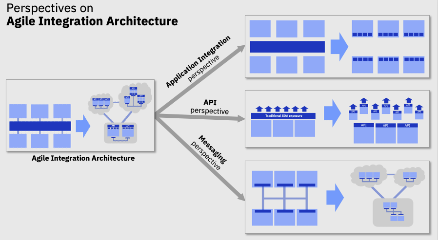

# 10-11/2020 - Take advantage of the best integration approaches

*Digital transformation, microservices adoption, and cloud deployment include integration 
modernization. When you design solutions, you need to think end-to-end and not just 
cover microservices boundaries. Integration defines reusable and managed APIs, develops modern 
integration flows that can be deployed inside microservice, or addresses the data pipeline at 
scale with a high-throughput, low-latency messaging platform. You can continue transactional 
support with IBM® MQ while you adopt event sourcing for resiliency, auditing, or to apply 
AI models on real time flows. With high-volume data transfer, you can inject unstructured 
data to your data lake for developing new AI models. Integration stays at the core of the IT 
infrastructure with a new containerized deployment model to integrate your modern development 
practices. This is an exciting time to think about and adopt the next integration reference 
architecture*
 
The [IBM integration reference architecture introduction](https://www.ibm.com/cloud/architecture/architectures/modern-integration) outlines how to transform your integration platform to a more modern architecture, with fine grained deployment, decentralized integration ownership and cloud native infrastructure.  To start the journey you have to assess where the integration modernization will make more impact, and you can see three major perspectives:

1. Application integration
1. API exposure: Consumer-centric, channel optimized, adopting distributed gateways, with self-service discovery, developer portals to subscribe to API, and manage versioning. APIs can be internal and external
1. Messaging, and as part of the messaging the event driven architecture with technology like Kafka, Pulsar, NATS, or RedPanda.

Read more [from the IBM integration reference architecture](https://www.ibm.com/cloud/architecture/architectures/modern-integration) and listen to [Kim Clark's video on breaking the ESB](https://www.youtube.com/watch?v=LSU1I0uBMug) starting at 3 minutes.

The Booklet referenced in this video, is [in this page](https://www.ibm.com/cloud/integration/agile-integration/).

