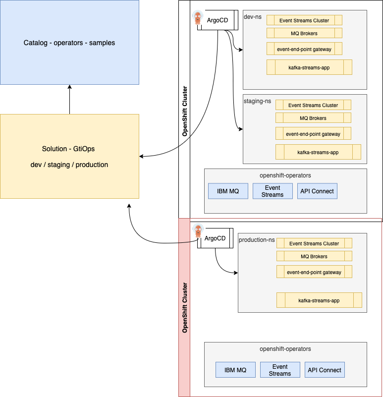

# Developer's experience with an event-driven solution implementation

Event-driven solutions are complex to implement, a lot of parts need to be considered, and I did 
not find any articles that present an end-to-end discussion on how to do things with the last technologies available 
to us ('last' meaning March 2022). 

I want to propose a set of articles to address this end-to-end developer's experience, not 
fully in the perfect order of developer's activities, 
as normally  we should start by doing an event-storming workshop with the business subject matter experts 
and apply Domain Driven Design approach to design the different event-driven microservices. I assume this work is already done and bounded contexts have defined the microservice's scope.

At the minimum level, an event-driven solution will have producer applications, event brokers, consumer applications for event processing and sinks to keep data for the longer term or do other functions such as indexing and querying. As we want governance to understand how to consume
data and who is doing what in this distributed solution, we need to add schema registry, 
[OpenAPI](https://www.openapis.org/) and [AsyncAPI](https://www.asyncapi.com/) management, complemented with application metadata management. 

So we have a lot to cover, but three parts should be enough to swallow.

* Part 1: is about reviewing the components to consider and getting started with GitOps to deploy all those components
* Part 2: addresses producer code development with OpenAPI and AsyncAPI
* Part 3: covers consumer code, starting from AsyncAPI and working with streaming. 

---

## Part 1: Event-driven solution components and getting started

I will take a real-time inventory use case, and use a simulator to generate [TLOG transactions](https://www.ibm.com/docs/en/fulfillmentoptimizer?topic=types-transaction-log-data-type-tlog) coming from cashing machines. From the software components
that we will install, we use IBM Event Streams, IBM MQ and API Connect, the API management product, all running on Red Hat OpenShift as our Kubernetes platform.

The figure below represents all the components deployed:


**Figure 1: the product view of a simple solution**

The blue components are product operators and operands and the green components will be solution-oriented. To support the deployment of such components, I will use
a GitOps approach where Day 1 operations are defined in one repository to bootstrap the deployment, and Day 2 operations will be controlled with the Git operating model, which developers know very well, based on Pull Request, commit, release... The GitOps repository for this real-time inventory is [here](https://github.com/ibm-cloud-architecture/eda-rt-inventory-gitops) and the readme guides you on how to deploy the solution on your OpenShift Cluster.

The GitOps approach is using the [catalog repository](https://github.com/ibm-cloud-architecture/eda-gitops-catalog) to keep product-specific operator subscription definitions, where product instance definitions are part of the [real-time inventory solution GitOps](https://github.com/ibm-cloud-architecture/eda-rt-inventory-gitops) repository. This corresponds to the yellow rectangles in the figure below:



**Figure 2: GitOps approach**

### High-level developer's activities

At the high level, developers need to address the following tasks:

* Use [domain-driven design](https://ibm-cloud-architecture.github.io/refarch-eda/methodology/domain-driven-design/) and [event storming](https://ibm-cloud-architecture.github.io/refarch-eda/methodology/event-storming/) to discover the business process to support 
and discover the different bounded contexts which will be mapped to microservices.
* Use a code template as a base for the event-driven microservice: to avoid reinventing configuration definitions for the different messaging used (MQ or Kafka or other). Those templates
use the DDD Onion architecture, and are based on [Quarkus](https://quarkus.io/), Nodejs, Python, or Spring cloud.. 
The code templates also assume the services are containerized and deployed to Kubernetes or OpenShift.
* Create a GitOps repository with [KAM](https://github.com/redhat-developer/kam), deploy the pipelines and GitOps to manage the solution and the different deployment environments (`dev`, `staging`, `prod`). Define specific pipelines tasks and pipeline flows to build the code and the docker images. Connect git repository  via webhook to the pipeline tool (e.g. Tekton)
* Define message structure using AVRO or JSON schemas, generate Java Beans from the event definitions using maven or other tools (Quarkus Apicurio plugin supports bean autogeneration).
* Connect and upload schemas to the schema registry.
* Define REST endpoints and OpenAPI documents, then upload them to API management tool.
* Apply test-driven development for the business logic, assess integration tests scope,  and tune development environment accordingly. 
* Ensure continuous deployment with ArgoCD
* Create the consumer application, get AsyncAPI document from API management portal. (To learn more from AsyncAPI see the videos from Dale Lane [here](https://dalelane.co.uk/blog/?p=4380))

In this series, I propose to reuse our reactive messaging Quarkus producer and consumer code templates from
[the eda-quickstarts repository](https://github.com/ibm-cloud-architecture/eda-quickstarts). This is
not a step-by-step tutorial, but more a see journey of developing and deploying a basic solution.

The following figure illustrates part of the above task, related to the components used in any event-driven solution:


**Figure 3: a component view of a simple solution**

* On the left, the first green box is a microservice that exposes REST APIs to be used by a single page webapp or a mobile app. The service produces records to Kafka topic to represent facts about the main business entity (Order Entity): OrderCreated, OrderUpdated, OrderDelivered, OrderCancelled…
* A Kafka Broker cluster, in this series, I will use IBM Event Streams which is an open-source Kafka packaging with enhanced features.
* A schema registry, based on the [apicur.io](https://www.apicur.io/) Red Hat led open-source project which is also included in IBM Event Streams.
* One or more consumers (green boxes on the right), can consume order events, using streaming processing. For the real-time inventory, I will do a simple Kafka Stream app as a consumer, and a stateful streaming processing with Apache Flink.
* Integrated API management (IBM API connect) to manage both REST endpoints and asyncAPI definitions. The AsyncAPI is defined for Kafka binding by connecting to the Event Stream Kafka Topic. It will work for any Kafka brokers.
* Event end-point gateway to control the communication between consumers and Kafka brokers, and an API gateway is controlling REST APIs traffic. I will not deploy OpenAPI gateway as there is already a lot of content available on this subject.
* S3 sink Kafka connector to move events to a long-term storage capability like S3 buckets. We will use IBM Cloud Object Storage in this demonstration.
* Elastic Search sink Kafka connector to move events to indices in Elastic Search.
* The open-source project, Apache Atlas, is used to keep metadata about brokers, topics, producers, streaming, and consumer apps.

The numbers highlight some top-level developer's activities:

1. Step 1. The producer application is defined with JAXRS, reactive messaging, and the OpenAPI document is created from JAXRS annotations, and then pushed to the API management tool. 
1. Step 2. When the application starts to be deployed, it produces events to the `orders` topic, the schemas defined for those messages are pushed to a schema registry at mostly the same time as the message is published. For the real-time inventory with we use items.
1. Step 3.  To make this topic and schema governed and known, it is possible to connect IBM API Connect to the Kafka  topic to build the AsyncAPI documentation, and then add any metadata to it.
1. Step 4. Now the developer of the consumer applications will get the list of topics and their metadata inside the developer Portal of the API management tool. He downloads the asyncAPI and gets the contract with Avro schemas. 
1. Step 5. When the application starts, it will consume from a topic, get the schema identifier from the record header, and will download the schema definition from the schema registry.

The application is using Kafka API / reactive messaging to access Kafka brokers. But in fact, the URL is proxied by the event gateway service. This event gateway can enforce traffic and access policies.


### From Domain-Driven Design...

In real life project, the journey starts from an [event storming](https://ibm-cloud-architecture.github.io/refarch-eda/methodology/event-storming/) workshop where architects, Subject Matter Experts, analysts and developers work together to discover the business process in scope with an event focus. They apply domain-driven design practices, to identify bounded contexts and context maps. As part of the solution design, a challenging architecture decision is to map bounded contexts to microservices. This is not a one-to-one mapping, but the classical approach is to manage a DDD aggregate in its own microservices. We have documented a set of DDD principles in [this DDD article](https://ibm-cloud-architecture.github.io/refarch-eda/methodology/domain-driven-design/).

So if we take the traditional order processing domain, we will discover events about the 
Order business entity's life cycle and the Order entity information with its attached value objects. 
The figure below presents
some basic DDD elements: Commands are in blue rectangles, 
Entity-aggregate in dark green, value-objects in light green, and events in orange.


**Figure 4: from DDD to microservice**

The right side of the diagram presents a DDD approach to the application architecture, described in layers. We could have used the onion architecture, but the important development practice is to apply clear separation of concern principles and isolate the layers so for example code to produce messages are not in the business logic layer.

Commands will help to define APIs and REST resources and maybe the service layer. 
Root aggregate defines what will be persisted in the repository, but also what will be exposed via the APIs. In fact, it is 
important to enforce avoiding designing a data model with a canonical model approach, as it will expose a complex data model at the API level, where
we may need to have APIs designed for the service and the client contexts. 
The old [Data Transfer Object pattern](https://www.baeldung.com/java-dto-pattern) should be used
 to present a view of the complex data model.

Events are defined with Avro schemas that are used in the messaging layer, schema registry, and AsyncAPI definition. 

### ... To code repositories and GitOps

Developer starts to create a code repository in its preferred Software Configuration Manager, for the real-time solution we use public gitHub.

* The [store simulator application](https://github.com/ibm-cloud-architecture/refarch-eda-store-simulator) is a Quarkus app, which generates item sales (a simplified version of a TLOG transaction) to different possible messaging middlewares ( MQ or Kafka). If you want to browse the code, the main readme of this project includes how to package and run this app with docker compose, and explains how the code works. 
The docker image is [quay.io/ibmcase/eda-store-simulator/](https://quay.io/ibmcase/eda-store-simulator)
* The item inventory aggregator is a Kafka Stream Quarkus application, done with Kafka Stream API. The source code is in [the refarch-eda-item-inventory project](https://github.com/ibm-cloud-architecture/refarch-eda-item-inventory). 
Consider this more as a black box in the context of the scenario, it consumes items events, aggregates them, exposes APIs on top of Kafka Streams interactive queries, and publishes inventory events on `item.inventory` topic. 
* The store inventory aggregator is a Kafka Stream Quarkus application, done with Kafka Stream API. The source code is in [the refarch-eda-store-inventory project](https://github.com/ibm-cloud-architecture/refarch-eda-store-inventory) the output is in `store.inventory` topic. 

To support a GitOps approach for development and deployment, Red Hat has delivered two operators: 

* [Tekton / OpenShift Pipelines](https://docs.openshift.com/container-platform/4.7/cicd/pipelines/understanding-openshift-pipelines.html)
for continuous integration
* [ArgoCD / OpenShift GitOps](https://docs.openshift.com/container-platform/4.7/cicd/gitops/understanding-openshift-gitops.html) for continuous deployment. 

As part of the OpenShift GitOps, there is also the [KAM CLI](https://github.com/redhat-developer/kam) tool
 to help developers to start on the good track for structuring the different deployment 
 configurations and ArgoCD app configurations. The [Order GitOps repository](https://github.com/jbcodeforce/eda-order-gitops) was
 created with kam. See the repository main readme for more details.

The core idea of GitOps is to have a Git repository that always contains declarative descriptions 
of the infrastructure currently desired in the production environment and an automated process 
to make the production environment match the described state in the repository.

To get the basic GitOps knowledge related to this article, I recommend reading the following documentations:

* [Understand GitOps](https://www.gitops.tech/)
* [KAM presentation](https://github.com/redhat-developer/kam)


## Part 2: Create the producer app  

As we use Quarkus for our implementation of event-driven, reactive microservice we can use the `quarkus cli` to
create the application. It will be too long to go over everything in this blog and 
the subject is well covered in [Quarkus guides](https://quarkus.io/guides/). The [order management microservice](https://github.com/jbcodeforce/eda-demo-order-ms) readme
file explains how the service was created.

You can fork and clone this repo to try running the producer code locally with `quarkus dev`.

> The application created with quarkus CLI may be deployed to OpenShift, and Tekton pipeline
can be defined to manage the continuous integration, as well as ArgoCD application can also be defined to
deploy the application. 

The [Order GitOps repository](https://github.com/jbcodeforce/eda-order-gitops) includes
such elements:

 * ArgoCD for continuous deployment of the application (dev-app-eda-demo-order-ms-app.yaml): [config/argocd/ folder](https://github.com/jbcodeforce/eda-demo-order-gitops/blob/main/config/argocd/edademo-dev-app-eda-demo-order-ms-app.yaml)
 * application deployment: `` folder
 * service deployment
 * Pipeline 

We will go over how to use and build those elements in next sections.

### Environment Setup

From the GitOps, developers have to define the different target environment and how to build
and deploy each applications. First let define Event Streams Cluster and API Connect end point management.

We assume, you have access to an OpenShift 4.7 or newer version cluster, we used cluster version 4.8. Login to your cluster.

#### Install pre-requisites

The first thing to do, is to install the different services / middleware operators, and then create one or more
instance of those 'services'. I will combine Open Source and IBM products for this solution. 
The products I'm using for the order microservices are:

>   * IBM Event Streams on OpenShift for Kafka
>   * IBM API Connect to manage API definitions

We have defined a public github repository to define operator subscriptions with some examples of 
cluster instances (operandes) for Event Streams, MQ and other IBM Automation products. 
See [the eda-gitops-catalog repository](https://github.com/ibm-cloud-architecture/eda-gitops-catalog.git) readme to get more information on the catalog.

The GitOps repository for the solution will reuse the catalog.

* Clone the [Order GitOps repository](https://github.com/jbcodeforce/eda-order-gitops)

    ```sh
    git clone https://github.com/jbcodeforce/eda-order-gitops
    cd eda-order-gitops
    ```

    Then bootstrap GitOps and Pipelines, and the different operators needed for the solution. See
the `how to use` explanations in the repository Readme if you want to run it.


* If not already done, install [Quarkus CLI](https://quarkus.io/guides/cli-tooling)

    ```sh
    curl -Ls https://sh.jbang.dev | bash -s - app install --fresh --force quarkus@quarkusio
    ```

* Install [KAM](https://github.com/redhat-developer/kam/releases/latest) and put the 
downloaded binary into a folder of your `$PATH`

* If you are using an external image repository, get its secret to authenticate the `pipeline` service account 
to push image on successful pipeline execution. For Quay.io see [this note](https://github.com/redhat-developer/kam/blob/master/docs/journey/day1/prerequisites/quay.md)
on how to create a Robot Account with Write permission. Below is an example of robot account for quay.io:


Download the Kubernetes Secret definition to be defined in your cicd project.


#### Environment up and running

The GitOps repository define two namespaces to run the solution, one for development, one for staging. 
The ArgoCD project includes the following applications:

### Defining the API from JAXRS Resource and OpenAPI annotation

API can be defined top down with a Swagger UI or API Connect. Applying test driven development, we develop
the business entities while implementing the requirements, and expose data transfer objects during integration
tests. This leads to have the OpenAPI definition evolving over time before a specific synchronization point
with the first consumers of the API. Contract testing is used too. 
So having a bottom-up definition of the OpenAPI document makes a lot of sense in this context. Which
means that we may export the OpenAPI document from code execution and then keep a first version in the
project git repository under `src/main/apis` folder.


### Push the OpenAPI document to API management

### Manage AsyncAPI from Kafka Topic


## Part 3: Develop a consumer app

## Clean your gitops environment

* Delete the pipeline custom resources: [see this note](https://docs.openshift.com/container-platform/4.7/cicd/pipelines/uninstalling-pipelines.html)

## Related product documentation

* [Cloud Native PostgreSQL Operator](https://docs.enterprisedb.io/cloud-native-postgresql/1.8.0/)
* [Step by step quarkus app dev with pipeline and gitops](/blogs/08-27-21/steps-to-dev-ms/)