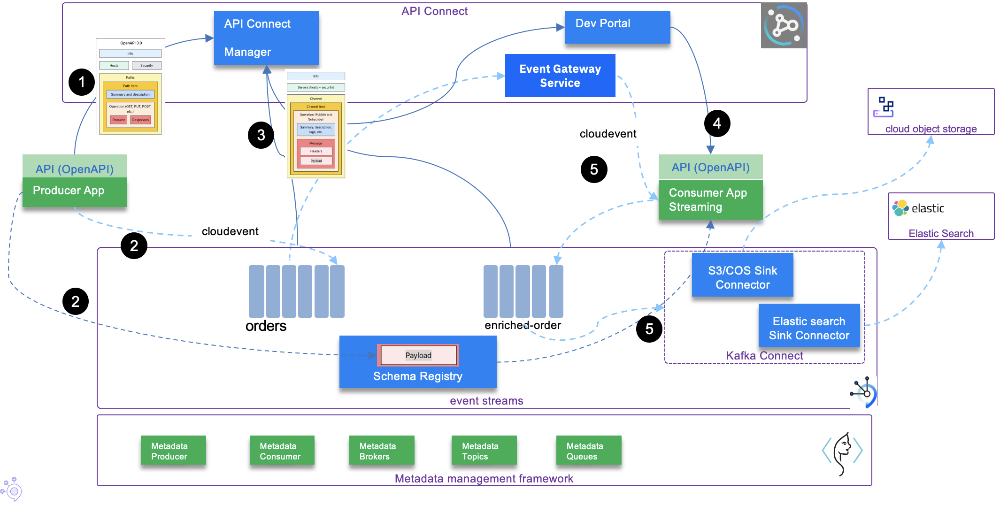

# Developer experience for an event-driven solution

Event-driven solutions are complex to implement, a lot of parts need to be considered, and I did 
not find any article that goes into how to do things with the last technology available 
to us ('last' meaning November 2021). 

I want to propose a set of articles to address this end-to-end developer's experience, not 
fully in the perfect order of developer's activities, 
as normally  we should start by event-storming workshop with the business subject matter experts 
and apply Domain Driven Design approach, but with enough content, tools and practices to let
you start your journey.

At the minimum level an event-driven solution will have producer applications, event brokers, 
consumer applications for event processing and 
sinks to keep data for longer term. As we want governance to understand how to consume
data and who is doing what in this distributed solution, we need to add schema registry, 
[OpenAPI](https://www.openapis.org/) and [AsyncAPI](https://www.asyncapi.com/) management complemented with metadata management. 

So we have a lot to cover.

The following figure illustrates a minimum set of components, we will need to consider 
in any event-driven solution:


**Figure 1: a component view of a simple solution**

* Kafka producer(s) exposing REST API to get data from a IoT, mobile or webapp. 
* Kafka Brokers, in this article I will use IBM Event Streams
* A schema registry, [apicur.io](https://www.apicur.io/) which is in IBM Event Streams
* One to many consumers, here an example of consumer using streaming processing to consume, 
process, and publish events.
* Integrate API management for both REST end points and asyncAPI definitions. The AsyncAPI is defined
for Kafka binding.
* Event end point gateway to control communication between consumers and kafka brokers 
* S3 sink Kafka connector to move events for longer term storage like S3 buckets. We will use IBM cloud object storage.

The numbered flows highlight :

1. We should consider the developer of the producer application. This application can take different form, but let
assume it will be a Java microprofile, reactive messaging app. The application exposes REST resources defined
via OpenApi document. During the development process the OpenAPI document will be pushed to an API management,
and deployed to an API gateway (Step 1 in figure above). 
1. When the application starts to be deployed, it produces events to the `orders` topic, the schemas defined
for this messages, is pushed to a schema registry at mostly the same time as the message is published (Step 2). 
The schema could also have been pushed via API or user interface. We will address DevOps avro schema deployment later.
1. To make this topic and schema governed and known, it is possible to connect API management to the kafka topic
 and add metadata to document who own the "contract" of this topic. The asyncAPI document is then managed inside 
 the API management (IBM App Connect) (Step 3). 
1. Now the developer of the consumer application will get the list of topics and their metadata inside the developer
portal of the API management. He downloads the asyncAPI (Step 4) and get the contract and avro schemas. 
1. When the application starts, it will consume from a topic, get the schema identifier
from the record header and will download the schema definition from the schema registry (Step 5). 

The application is using Kafka API / reactive messaging to access Kafka broker. But in fact the URL is proxied by
the event gateway service. This event gateway can enforce traffic and access policies.

## High level developer's tasks

So here is how I see the different high level developer tasks may look like:

* Use [domain-driven design](https://ibm-cloud-architecture.github.io/refarch-eda/methodology/domain-driven-design/) and [event storming](https://ibm-cloud-architecture.github.io/refarch-eda/methodology/event-storming/) to discover the business process to support 
and discover the different bounded contexts which will be mapped to microservices.
* Use a code template as a base for the event-driven microservice: to avoid reinventing configuration definitions for the different messaging used (MQ or Kafka or other). Those templates
use the DDD Onion architecture, and are based on [Quarkus](https://quarkus.io/) or Spring cloud. 
The code templates also assume the services are containerized and deployed to Kubernetes or OpenShift.
* Create a GitOps repository with [KAM](https://github.com/redhat-developer/kam), deploy the pipelines and GitOps to manage the solution and the different 
deployment environments (`dev`, `staging`, `prod`). Define specific pipelines tasks and pipeline flows to build the code and the docker images. 
Connect git repository  via webhook to the pipeline tool (e.g. Tekton)
* Define message structure using AVRO or JSON schemas, generate Java Beans from the event definitions using maven or other tool.
* Connect and upload schemas to schema registry
* Define REST end point and OpenAPI and upload them to API management
* Apply test driven development for the business logic, assess integration tests scope and 
tune development environment accordingly. 
* Ensure continuous deployment with ArgoCD
* Create the consumer application, get AsyncAPI document from API management portal. (To learn more from AsyncAPI see the videos from Dale Lane [here](https://dalelane.co.uk/blog/?p=4380))

In this article, I propose to reuse our reactive messaging Quarkus producer and consumer code templates from
[the eda-quickstarts repository](https://github.com/ibm-cloud-architecture/eda-quickstarts). This is
not a step-by-step tutorial, but more a see journey of developing and deploying a basic solution.

## From Domain Driven Design...

In real life project, the journey starts from an [event storming](https://ibm-cloud-architecture.github.io/refarch-eda/methodology/event-storming/) workshop where architect, 
Subject Matter Experts, analysts and developers work together
to discover the business process in scope with an event focus. They apply domain-driven design 
practices, to identify
bounded contexts and context map. As part of the solution design, a challenging architecture 
decision is to map bounded contexts to microservices. This is not a one to one mapping, 
but the classical approach is to manage a DDD aggregate in its own microservices. We have 
documented a set of DDD principles in [this DDD article](https://ibm-cloud-architecture.github.io/refarch-eda/methodology/domain-driven-design/).

So if we take the traditional order processing domain, we will discover events about the 
Order business entity's life cycle and the Order entity information with its attached value objects. 
The figure below presents
some basic DDD elements: Commands are in blue rectangles, 
Entity-aggregate in dark green, value-objects in light green, and events in orange.


**Figure 2: from DDD to microservice**

The right side of the diagram presents a DDD approach of the application architecture, 
described in layers. 
We could have use the onion architecture, but the important development practice is to apply 
clear separation of concerns 
and isolate the layers so for example code to produce messages are not in the business logic layer.

Commands will help to define APIs and REST resources and may be the service layer. 
Root aggregate defines what will
be persisted in the repository, but also what will be exposed via the APIs. In fact it is 
important to enforce avoiding designing a data model with a canonical model approach, as it 
will expose a complex data model at the API level, where
we may need to have APIs designed for the service and the client contexts. 
The old [Data Transfer Object pattern](https://www.baeldung.com/java-dto-pattern) should be used
 to present view of the complex data model.

Events are defined with Avro schemas that are used in the messaging layer, schema registry, and AsyncAPI definition. 

## ... To code repositories and GitOps

Developer starts to create a code repository in its preferred Software Configuration Manager, 
I will use GitHub (See [this repo for the command order application microservice](https://github.com/jbcodeforce/eda-demo-order-ms)) code
and [the separate GitOps repository](https://github.com/jbcodeforce/eda-order-gitops) to define pipelines
and environment deployments. 

To support a GitOps approach for development and deployment, Red Hat has delivered two operators: 

* [Tekton / OpenShift Pipelines](https://docs.openshift.com/container-platform/4.7/cicd/pipelines/understanding-openshift-pipelines.html)
for continuous integration
* [ArgoCD / OpenShift GitOps](https://docs.openshift.com/container-platform/4.7/cicd/gitops/understanding-openshift-gitops.html) for continuous deployment. 

As part of the OpenShift GitOps, there is also the [KAM CLI](https://github.com/redhat-developer/kam) tool
 to help developers to start on the good track for structuring the different deployment 
 configurations and ArgoCD app configurations. The [Order GitOps repository](https://github.com/jbcodeforce/eda-order-gitops) was
 created with kam. See the repository main readme for more details.

The core idea of GitOps is having a Git repository that always contains declarative descriptions 
of the infrastructure currently desired in the production environment and an automated process 
to make the production environment match the described state in the repository.

To get the basic GitOps knowledge related to this article, I recommend reading the following documentations:

* [Understand GitOps](https://www.gitops.tech/)
* [KAM presentation](https://github.com/redhat-developer/kam)

From the Figure 1 above , and using the KAM's [Day 1 Operations](https://github.com/redhat-developer/kam/tree/master/docs/journey/day1) practices, 
we will need to create the following git repositories:

* One repository for the Order management microservice, producer of Order Events
* One repository for GitOps of the solution, to control application configuration and continuous deployment
* One repository for the consumer of the order events.


* The Kafka connector configurations are in services in the GitOps repo.

### Create the producer app code based

As we use Quarkus for our implementation of event-driven, reactive microservice we can use the `quarkus cli` to
create the application. It will be too long to go over everything in this blog and 
the subject is well covered in [Quarkus guides](https://quarkus.io/guides/). The [order management microservice](https://github.com/jbcodeforce/eda-demo-order-ms) readme
file explains how the service was created.

You can fork and clone this repo to try running this solution.

> The application created with quarkus CLI may be deployed to OpenShift, and Tekton pipeline
can be defined to manage the continuous integration, as well as ArgoCD application can also be defined to
deploy the application. 

The [Order GitOps repository](https://github.com/jbcodeforce/eda-order-gitops) includes
such elements:

 * ArgoCD for continuous deployment of the application (dev-app-eda-demo-order-ms-app.yaml): [config/argocd/ folder](https://github.com/jbcodeforce/eda-demo-order-gitops/blob/main/config/argocd/edademo-dev-app-eda-demo-order-ms-app.yaml)
 * application deployment: `` folder
 * service deployment
 * Pipeline 

We will go over how to use and build those elements in next sections.

## Environment Setup

From the GitOps, developers have to define the different target environment and how to build
and deploy each applications. First let define Event Streams Cluster and API Connect end point management.

We assume, you have access to an OpenShift 4.7 or newer version cluster, we used cluster version 4.8. Login to your cluster.

### Install pre-requisites

The first thing to do, is to install the different services / middleware operators, and then create one or more
instance of those 'services'. I will combine Open Source and IBM products for this solution. 
The products I'm using for the order microservices are:

>   * IBM Event Streams on OpenShift for Kafka
>   * IBM API Connect to manage API definitions

We have defined a public github repository to define operator subscriptions with some examples of 
cluster instances (operandes) for Event Streams, MQ and other IBM Automation products. 
See [the eda-gitops-catalog repository](https://github.com/ibm-cloud-architecture/eda-gitops-catalog.git) readme to get more information on the catalog.

The GitOps repository for the solution will reuse the catalog.

1. Clone the [Order GitOps repository](https://github.com/jbcodeforce/eda-order-gitops)

    ```sh
    git clone https://github.com/jbcodeforce/eda-order-gitops
    cd eda-order-gitops
    ```

    Then to install the IBM Event Streams and bootstrap GitOps and Pipelines, follow the `how to use` explanations in the repository Readme.


1. If not already done, install [Quarkus CLI](https://quarkus.io/guides/cli-tooling)

    ```sh
    curl -Ls https://sh.jbang.dev | bash -s - app install --fresh --force quarkus@quarkusio
    ```

1. Install [KAM](https://github.com/redhat-developer/kam/releases/latest) and put the downloaded binary into your `$PATH`

1. If you are using an external image repository, get its secret to authenticate the `pipeline` service account 
to push image on successful pipeline execution. For Quay.io see [this note](https://github.com/redhat-developer/kam/blob/master/docs/journey/day1/prerequisites/quay.md)
on how to create a Robot Account with Write permission.

    

    download the Kubernetes Secret definition to be defined in your cicd project.

    


### Create foundation for the first microservice

Using the new Quarkus CLI to create a basic project:

```sh
# Get the help
quarkus create app --help
# create a loan-origination bff app
quarkus create app  -x openapi,metrics, ibm.gtm.dba:loan-origin-cmd-ms:1.0.0
# Verify the app works
cd loan-origin-cmd-ms
quarkus dev
curl localhost:8080
```

Push to a github repository that you need to create in github. I will use `loan-origin-cmd-ms.git`.

```sh
git init
git commit -m "first commit"
git branch -M main
git remote add origin https://github.com/jbcodeforce/loan-origin-cmd-ms.git
git push -u origin main
```

Be sure to have an Access Token defined in your github account so application can access your repositories.

### Bootstrap GitOps

1. Use kam cli to create the gitops project for our solution with reference to our first microservice

    ```sh
    kam bootstrap \
    --service-repo-url https://github.com/jbcodeforce/loan-origin-cmd-ms \
    --gitops-repo-url  https://github.com/jbcodeforce/loan-origin-gitops \
    --image-repo quay.io/jbcodforce/loan-origin-cmd-ms \
    --git-host-access-token <your-github-token> \
    --prefix los --push-to-git=true
    ```

1. Add a `bootstrap` folder and define argoCD project descriptor. 
See [this file, as one example of ArgoCD project](https://raw.githubusercontent.com/jbcodeforce/ads-risk-scoring-gitops/main/bootstrap/risk-scoring/argo-project.yaml) definition: the structure looks like below: 

    ```yaml
    apiVersion: argoproj.io/v1alpha1
    kind: AppProject
    metadata:
    name: loan-origination
    namespace: openshift-gitops
    spec:
    sourceRepos: []
    destinations: []
    roles: []
    ```

    ```sh
    oc apply -k bootstrap/risk-scoring
    ```

1. Bootstrap the ArgoCD apps to deploy CI/CD and the different application's services

    ```sh
    oc apply -k config/argocd 
    ```

1. Get ArgoCD admin password and Console URL

    ```sh
    oc describe route openshift-gitops-server  -n openshift-gitops
    oc extract secret/openshift-gitops-cluster -n openshift-gitops --to=-
    ```

1. deploy IBM Event Streams operator

    ```sh
    # In the eda-gitops-catalog project
    oc apply -f ./cp4i-operators/common-services.yaml

    oc apply -f ./cp4i-operators/event-streams/subscription.yaml   
    ```


1. [Optional] If you want to use Kafka open source uses the Strimzi operator

    ```sh
    # Install Strimzi Kafka Operator - It will listen to any namespaces
    oc apply -k ./kafka-strimzi/operator/overlays/stable
    ```
    
    Then install Apicurio Registry Operator. 

    ```sh
    oc apply -k apicurio/operator/overlays/stable
    ```

```sh
# Install MQ Operator, which may also deploy IBM Cloud Pak foundational services 
oc apply -f operators/mq/subscription.yaml
# Verify installed operators
oc get operators

NAME                                               AGE
apicurio-registry.openshift-operators              5m34s
ibm-common-service-operator.openshift-operators    6m41s
ibm-mq.openshift-operators                         8m10s
ibm-namespace-scope-operator.ibm-common-services   4m47s
ibm-odlm.ibm-common-services                       3m27s
strimzi-kafka-operator.openshift-operators         7m38s
```

Once done we will create Kafka Cluster, a MQ broker for development, Apicurio

#### Instances

##### Kafka via Strimzi

```sh
# Create Kafka Cluster instance and a scram user and tls user
oc apply -k  instances/strimzi-kafka/kustomization.yaml 
# Verify Kafka cluster runs
oc get kafka
oc get kafkauser 
```

The SCRAM and TLS users are defined to get different ways to authenticate to Kafka. 
For detail explanations on how Kafka authentication mechanism works, I recommend [reading Rick Osowski's article](https://rosowski.medium.com/kafka-security-fundamentals-the-rosetta-stone-to-your-event-streaming-infrastructure-518f49640db4).

The installation of th Kafka Cluster has generated a set of secrets for TLS certificates, that we will need:

```sh
oc get secrets
NAME                                        TYPE     
eda-kafka-cluster-ca-cert                   Opaque
...
```

##### IBM MQ

```sh
# Create an instance named QM1
oc apply -f instances/mq/mq-qm1.yaml 
# Verify and get the Console URL
oc describe queuemanager qm1
```

## Develop the event-driven service

I will focus on the way to prepare the different elements of the service to ensure keeping the coupling to the minimum.

I will use [Quarkus](https://quarkus.io) to develop the Microprofile based services. I recommend to use the [quarkus CLI](https://quarkus.io/guides/cli-tooling)
to start your project on good foundations:

```sh
quarkus create ibm.eda.demo:kc-freezer-cmd-ms:0.0.1 -x reactive-messaging-kafka,metrics,smallrye-openapi
# Add needed extensions
quarkus ext add qpid-jms, openshift
```

### Defining the API from JAXRS Resource and OpenAPI annotation

### Push the OpenAPI document to API management

### 

## Clean your gitops environment

* Delete the pipeline custom resources: [see this note](https://docs.openshift.com/container-platform/4.7/cicd/pipelines/uninstalling-pipelines.html)

## Related product documentation

* [Cloud Native PostgreSQL Operator](https://docs.enterprisedb.io/cloud-native-postgresql/1.8.0/)
* [Step by step quarkus app dev with pipeline and gitops](/bloggs/08-27-21/steps-to-dev-ms/)