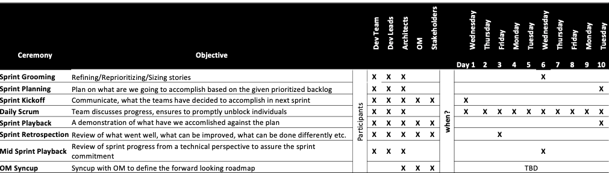

# Embracing Agile

quick summary of agile practices

## Definitions

### Product backlog

* Features we want to implement but not yet prioritized for the release
* Often decided by the product manager/offering manager

### Release backlog

* Features that we want to implement for a particular release
* Offering management along with engineering team collaborates to set the scope of a release

### Sprint backlog

* User stories, specific tasks that need to be completed during a specific period of time
* Decided by the development team depending on the velocity and capacity

### Epic

* Large body of work that can be broken down to a number of smaller stories
* Spanning across multiple sprints
* Commitment tracked over a release
* Evolves based on customer feedback and development progress
* No Pull Requests are made against an Epic

### User Stories

* Informal, general explanation of a software feature/end goal written from the perspective of the end user or customer
* Spans across multiple days
* Commitment tracked over a sprint
* Does not change over a sprint

### Sub tasks

* A set of specific outcome focussed activities that contribute to a Story's progress
* Spans across a few hours to a couple of days
* Commitment tracked over days
* Does not change over a sprint 

### Definition of ready

The criteria to move from new-issue to backlog:

* requirement is well defined in the user story following INVEST criteria
* Dev lead and dev team must have talked about the story at least once
* A least one acceptance criterio is explicitly defined
* Story is sized and prioritized
* Story must be brokent down enough to fit single sprint

### Definition of Done

Describes the requirements that must be met in order for a story to move from In Progress/Review/QA to Done/Closed

Criteria
	
* Code is refactored and reviewed
* Code is integrated with master/main branch
* Automated tests (UT+FVT) are written and all tests are green
* Documentation changes are incorporated

## Ceremonies

## Zenhub practices

| Objectives | Best Practice |
| --- | --- |
| Backlog Grooming | * New Issues are created/reviewed based on OM/Customer inputs |
| | * 'Move' the issues under 'New Issues' to 'Backlog' observing DoR |
| | * 'Move' the issues under 'Backlog' to 'Sprint Backlog' upon prioritization |
| | * Appropriate 'tags' are added for easy classification/tracking |
| Backlog' Actions | * Issues are visually ordered according to the priority (Highest priority always at the top) |
|  | * Prioritized issues are tagged to the targetted 'Release'|
|Sprint Backlog' Actions| * Only those issues are present that are planned for the current sprint
| | * Team commits the Sprint Backlog according to the capacity| 
| | * Each issue is tagged to the associated 'Milestone' (Sprint 1, Sprint 2 etc.)
| | * Each issue has potentially identified an owner(s)
| In Progress' Actions | * 'Move' the issues from 'Sprint Backlog' to 'In Progress' once the team start working on the particular story
| | * Only those issues are present that are actively worked upon by an individual (and vice versa) |
| | * Has at least one owner |
| | * Regular updates on the progress made in 'Comments' section of the issue |
| QA/Review' Actions | * 'Move' the issues from 'In Progress' to 'QA/Review' to indicate the development completion |
| | * DoD is observed before marking as 'Done'/'Closed' |
| | * Regular updates on the progress made in 'Comments' section of the issue |
| Reporting Defects | * The defect description follows the defect template |
| | * Severity/Priority is rightly identified and updated in the github issue |
| | * Targetted release is identified and updated |
| | * Ensure appropriate engineering priority is observed for addressing the defect |
| Daily Scrum | * Issues "In Progress" are iterated through |
| | * Respective owner of the issue updates the progress, potential blockers, need for help explicitily |
| | * Blockers, Need for Help etc. which require extensive discussion are parked and taken up after the scrum |
