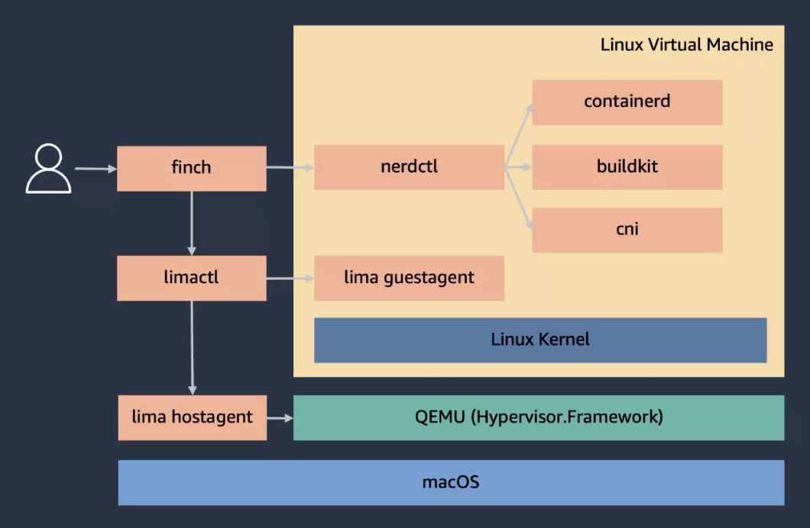

# Open source Finch for container development

[Finch](https://github.com/runfinch/finch) is a an open source client for container development with nice integration with AWS.

Architecture:

{ width=600 }

It does not share the local image registry of docker. And as `sam cli` has dependencies on docker v7.0 API, sam does not work yet with Finch.

## Value propositions

* Use containerd (with [nerdctl](https://github.com/containerd/nerdctl#command-reference) CLI), buildKit to support OCI image builds, and run within a VM managed by [Lima](https://github.com/lima-vm/lima).
* Replace the `docker cli`.
* Address that local environment does not match production architecture, like AWS Graviton. 
* Support docker compose.
* Can emulate different linux architecture within the same vm.

## Quick command summary

* once install, set up the underlying system

```sh
finch vm init 
```

* Reboot or restart the vm

```sh
finch vm start 
```

* Run an image

```sh
finch run 
```

* Select the architecture of the vm: (The --platform option can be used for builds as well)

```sh
finch run --platform linux/amd64 ubuntu /bin/bash
```

* build an image

```sh
finch build -t jbcodeforce/python .
```

* 
# Resources

* [AWS Blog on Finch](https://aws.amazon.com/blogs/opensource/introducing-finch-an-open-source-client-for-container-development/)