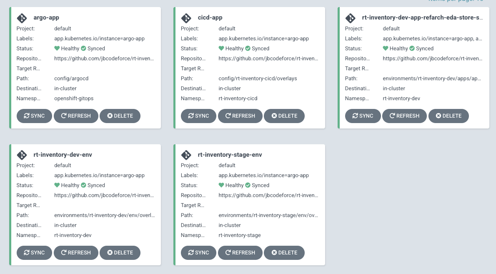

# GitOps

[Gitops](https://www.gitops.tech/)  is a way of implementing Continuous Deployment for containerized applications.

The core idea of GitOps is having a Git repository that always contains declarative descriptions 
of the infrastructure currently desired in the production environment and an automated process 
to make the production environment matches the described state in the repository.

From the infrastructure point of view, we want to control the governance of the infrastructure and be 
sure that what is expected, is what happened.

## Needs

Developer and operation teams want to:

* Audit all changes made to pipelines, infrastructure, and application configuration.
* Roll forward/backward to desired state in case of issues.
* Consistently configure all deployment environments.
* Reduce manual effort by automating application and environment setup and remediation.
* Have an easy way to manage application and infrastructure state across clusters/environments

GitOps is a natural evolution of DevOps and Infrastructure-as-Code.

## Core principles

* Git is the source of truth for both application code, application configuration, dependant service/product deployments, infrastructure config and deployment.
* Separate application source code (Java/Go) from deployment manifests i.e the application source code and the GitOps configuration reside in separate git repositories.
* Deployment manifests are standard Kubernetes (k8s) manifests i.e Kubernetes manifests in the GitOps repository can be simply applied with nothing more than a `oc apply`.
* [Kustomize.io](https://kustomize.io/) is used as template engine for defining the differences between environments i.e reusable parameters with extra resources described using `kustomization.yaml`.
* Minimize yaml duplication - no copy/paste
* Support two axis of configuration: clusters and environments: prod, test, dev. (Accept separating production repo if organization is willing to do so).
* Prefer a multi-folder and/or multi-repo structure over multi-branch. Avoid dev or test configuration in different branches. 
In a microservices world, a one branch per environment will quickly lead to an explosion of branches 
which again becomes difficult and cumbersome to maintain.
* Minimize specific gitops tool dependencies: (Try to converge to Tekton and ArgoCD)
* Do not put independent applications or applications managed by different teams in the same repo. 

* [Day 1 Operations](https://github.com/redhat-developer/kam/tree/master/docs/journey/day1) are actions that users take to bootstrap a GitOps 
configuration and on how to set up GitOps and Sealed Secret.
* [Day 2 Operations](https://github.com/redhat-developer/kam/tree/master/docs/journey/day2) are actions that users take to change a GitOps system.

Using continuous delivery approach and tool like ArgoCD, the deployment of all the components is controlled 
by the tool from the Gitops repositories.

## Supporting tools

* [KAM CLI from the Red Hat gitops team ](https://github.com/redhat-developer/kam)
* [Tekton](/coding/tekton) for continuous integration and even deployment
* [ArgoCD | Openshift Gitops](#openshift-gitops) for continuous deployment
* [Kustomize.io](https://kustomize.io/) to templatize the deployment and support overlay mechanisms.

## OpenShift GitOps

[OpenShift GitOps](https://docs.openshift.com/container-platform/4.7/cicd/gitops/understanding-openshift-gitops.html)
is the operator and configuration to run ArgoCD, as a controller inside OpenShift.

The environment configuration repository defines the desired state of the application/solution.

See [installation instructions]() via the console.

### Proposed git repository structure

There are different ways to organize projects: The [KAM tool](#kam-gitops-application-manager-cli) proposes to
create one gitops repository to control the configuration and
 deployment of each services and apps of the solution.

Another solution is to use a three repositories structure, that will match team structure and persona: dev, SRE.

* **application**: deployment.yaml, config map... for each application. Developers lead this one
* shared, reusable **services** like Kafka, Database, LDAP,... as reusable services between environments: Dev and operations ownership
* Cluster and **infrastructure**: network, cluster, storage, policies... owned by operation

With three level structure, each "solution" will have 3 separate repositories:

* solution_name-gitops-apps
* solution_name-gitops-services
* solution_name-gitops-infra

Now the different deployment environments can be using different k8s clusters or the same cluster with different namespaces.

With the adoption of ArgoCD we can have one bootstrap app that starts other apps to monitor each of those layers.
See detail in [this separate note](/coding/tekton/).

### OpenShift Projects

For each solution we may use a number of different projects: 

* one projectname-cicd for Tekton pipeline run... 
* one projectname-dev for the application instances in a development mode.
* one projectname-staging for pre-production tests
* one projectname-prod for production deployment. This can be in the same OCP cluster or in different one.

Within the `-dev` project we can isolate the dependant applications, like Kafka cluster, or postgresql,
where with Staging and production we can use multi tenant deployment of such applications.

Those projects are defined in an environment context. See below the KAM tool that supports this approach.

### Services 

For the Service level, try to adopt catalog repositories to hold common elements that will be 
re-used across teams and other repositories. 
See example in [Red Hat Canada Catalog git repo](https://github.com/redhat-canada-gitops/catalog)
and our [Business automation](https://github.com/jbcodeforce/dba-gitops-catalog) one or [EDA one](https://github.com/jbcodeforce/eda-gitops-catalog). 

Use Kustomization to reference remote repositories as a base and then patch it 
as needed to meet your specific requirements.

```yaml
bases:
 - github.com/jbcodeforce/eda-gitops-catalog/kafka-strimzi/operator/overlay/stable?ref=main
 - ../base
```

Reference the common repository via a tag or commit ID.

### Application

For Application repositories, align your repositories along application and team boundaries: one gitops
repo per application, different folders for microservices and deployable components. 

Use bootstrap folder to load the application components into the cluster: this will be an ArdoCD app.

Namespaces should be created in environment or cluster folders.

Use Overlay for the different app configuration depending of the target environment.

Dedicated a folder (tekton) for pipelines, tasks.

If you find you are duplicating argoCD manifests in the bootstrap folder, then create a separate high 
level `argocd` folder.

* [Cluster Configuration](https://github.com/gnunn-gitops/cluster-config). This repo shows how Gerald Nunn configures OpenShift clusters using GitOps with ArgoCD.
* [Product Catalog](https://github.com/gnunn-gitops/product-catalog) example of a 3 tier app with ArgoCD, tekton and kustomize. (From Gerald Nunn )
* [real time inventory demo gitops](https://github.com/ibm-cloud-architecture/rt-inventory-gitops)
* [ADS GitOps example for a risk scoring app]()

### Process

A key question in any gitops scenario is, how to manage promotion of changes in manifests between different environments and clusters. 

Some principles to observe:

* Every change in the manifests needs to flow through the environments in hierarchical order, i.e. (dev > test > prod)
* We do not want a change to the base flowing to all environments simultaneously
* Tie specific environments to specific revisions so that changes in the repo can be promoted in a controlled manner
We can manage the revision in the gitops tools or in kustomize or both.

### The pre and post synch processing

When Argo CD starts a sync, it orders the resources in the following precedence:

* The phase (See [resource hook doc](https://argoproj.github.io/argo-cd/user-guide/resource_hooks/))
* The wave they are in (lower values first). Defined as annotations in the different resources 

    ```yaml
    metadata:
      annotations:
        argocd.argoproj.io/sync-wave: "5"
    ```
* By kind (e.g. namespaces first)
* By name

It then determines the number of the next wave to apply. This is the first number where any resource is out-of-sync or unhealthy.

## OpenShift Pipelines

OpenShift Pipelines is a Continuous Integration / Continuous Delivery (CI/CD) solution based on the open source Tekton project. 
The key objective of Tekton is to enable development teams to quickly create pipelines of activity from simple, repeatable steps.
A unique characteristic of Tekton that differentiates it from previous CI/CD solutions is that Tekton steps execute within
 a container that is specifically created just for that task.

Users can interact with OpenShift Pipelines using the web user interface, command line interface, and via a Visual Studio Code editor plugin. 
The command line access is a mixture of the OpenShift `oc` command line utility 
and the `tkn` command line for specific Tekton commands. 
The `tkn` and `oc` command line utilities can be downloaded from the OpenShift console web user interface. 
To do this, simply press the white circle containing a black question mark near your name on the top right 
corner and then select Command Line Tools:


See more detail in this [Tekton summary](/coding/tekton)

## Kustomize and gitops

There are two ways to implement the deployment strategy for GitOps: 

* **Push-based:** use CI/CD tools like Jenkins, Tekton, Travis... to define a pipeline, triggered when application 
code source is updated. Pipelines build the container image and deploy the modified yaml files to the
 GitOps repo. Changes to the environment configuration repository trigger the deployment pipeline. 
 It has to be used for running an automated provisioning of cloud infrastructure. See also [this k8s engine 'cloud build' tutorial](https://cloud.google.com/kubernetes-engine/docs/tutorials/gitops-cloud-build).
* **Pull-based:** An operator takes over the role of the pipeline by continuously comparing the 
desired state in the environment repository with the actual state in the deployed infrastructure.

A CICD based on git action will build the image and edit Kustomize patch to bump the expected container
 tag using the new docker image tag, then will commit this changes to the gitops repo.

[Kustomize](https://kustomize.io/) is used to simplify the configuration of application and environment.
Kustomize traverses a Kubernetes manifest to add, remove or update configuration options without forking. 
It is available both as a standalone binary and as a native feature of Kubectl. 
A [lot of Kustomize examples here.](https://github.com/kubernetes-sigs/kustomize/tree/master/examples).

The simple way to organize the configuration is to use one `kustomize` folder, then one folder 
per component, then one overlay folder in which environment folder include `kustomization.yaml` 
file with patches.

```
└── postgres
    ├── base
    │   ├── configmap.yaml
    │   ├── kustomization.yaml
    │   ├── pvc.yaml
    │   ├── secret.yaml
    │   ├── service-account.yaml
    │   ├── statefulset.yaml
    │   ├── svc-headless.yaml
    │   └── svc.yaml
    ├── kustomization.yaml
    └── overlays
        └── dev
            ├── kustomization.yaml
            └── sealedsecret.yaml
```

Here is an example of `kustomization.yaml`:

```
bases:
  - ../../base
patchesStrategicMerge:
  - ./secret.yaml
```

The `patchesStrategicMerge` lists the resource configuration YAML files that you want to merge 
to the base kustomization. You must also add these files to the same repo as the kustomization file, 
such as `overlay/dev`. These resource configuration files can contain small changes that are merged
 to the base configuration files of the same name as a patch.


In GitOps, the pipeline does not finish with something like `oc apply..`. but it’s an external tool 
([Argo CD](/coding/argocd) or Flux) that detects the drift in the Git repository and will run these commands.

### Future readings

* [GitOps - Operations by Pull Request](https://www.weave.works/blog/gitops-operations-by-pull-request)

## **KAM** - Gitops Application Manager CLI

[KAM](https://github.com/redhat-developer/kam)'s goal is to help creating a gitops project for an existing application as 
[day 1 operations](https://github.com/redhat-developer/kam/tree/master/docs/journey/day1) and then add more services as part of `day 2 operation`.

Gitops approach to managing deployments into one or more environments (a namespace in a Kubernetes). 
One or more applications can be deployed into a given environment. An application is an aggregation of one or more services.
The source code for each service (or microservice) is contained within a single Git repository

* To install download the last release from github: [https://github.com/redhat-developer/kam/releases/latest](https://github.com/redhat-developer/kam/releases/latest). 
Rename the download file, and move it to `/usr/local/bin`.

### Pre-requisites

Have the OpenShift GitOps and OpenShift pipelines operators installed.

Be connected to the cluster.

### Creating a gitops project for a given solution

Use the following kam command to create a gitops repository with multiple ArgoCD applications. To run successfully, we need to be connected
to OpenShift cluster with Sealed Secret GitOps and Pipelines operators deployed, get SSH key from github if private repositories are used:

```sh
# list the  available options
kam bootstrap -- 
# create a gitops repo by specifying argument
kam bootstrap \
--service-repo-url https://github.com/jbcodeforce/refarch-eda-store-inventory \
--gitops-repo-url  https://github.com/jbcodeforce/rt-inventory-gitops \
--image-repo image-registry.openshift-image-registry.svc:5000/ibmcase/store-aggregator \
--output rt-inventory-gitops \
--git-host-access-token <a-github-token> \
--prefix rt-inventory --push-to-git=true
```

To retrieve [the github access token see this note](https://github.com/redhat-developer/kam/blob/master/docs/journey/day1/prerequisites/github_access_token_steps.md).

> **Kam bug:** the application name is matching the git repo name, and there will be an issue while creating binding with thee limit of 
the number of characters. kam bootstrap needs a --service-name argument.

This will create a gitops project, pushed to github.com as private repo. The repo includes two main folders and a 
`pipelines.yaml` describing your first application, and configuration for a complete CI pipeline and deployments from Argo CD

At the same level of the folder hierarchy, there is a secrets folder to keep secrets to do not commit to Git. See [secrets section below](#secrets)

### What is inside

#### Config

The `config` folder defines `argocd` and `cicd` Argo applications to support deployment and pipeline definitions:

  ```sh
    ├── config
    │   ├── argocd
    │   │   ├── argo-app.yaml
    │   │   ├── cicd-app.yaml
    │   │   ├── kustomization.yaml
    │   │   ├── rt-inventory-dev-app-refarch-eda-store-inventory-app.yaml
    │   │   ├── rt-inventory-dev-env-app.yaml
    │   │   └── rt-inventory-stage-env-app.yaml
    │   └── rt-inventory-cicd
    │       ├── base
    │       │   ├── 01-namespaces
    │       │   │   └── cicd-environment.yaml
    │       │   ├── 02-rolebindings
    │       │   │   ├── argocd-admin.yaml
    │       │   │   ├── pipeline-service-account.yaml
    │       │   │   ├── pipeline-service-role.yaml
    │       │   │   └── pipeline-service-rolebinding.yaml
    │       │   ├── 03-tasks
    │       │   │   ├── deploy-from-source-task.yaml
    │       │   │   └── set-commit-status-task.yaml
    │       │   ├── 04-pipelines
    │       │   │   ├── app-ci-pipeline.yaml
    │       │   │   └── ci-dryrun-from-push-pipeline.yaml
    │       │   ├── 05-bindings
    │       │   │   ├── github-push-binding.yaml
    │       │   │   ├── rt-inventory-dev-app-refarch-eda-store-simulator
                    └── refarch-eda-store-simulator-binding.yaml
    │       │   ├── 06-templates
    │       │   │   ├── app-ci-build-from-push-template.yaml
    │       │   │   └── ci-dryrun-from-push-template.yaml
    │       │   ├── 07-eventlisteners
    │       │   │   └── cicd-event-listener.yaml
    │       │   ├── 08-routes
    │       │   │   └── gitops-webhook-event-listener.yaml
    │       │   └── kustomization.yaml
    │       └── overlays
    │           └── kustomization.yaml
  ```

So the major elements of this configuration are:

* **argo-app**: root application to manage the other applications: It points to the kustomization.yaml under `config/argocd` so when adding new microservice to the solution using `kam cli` then this kustomize will be updated triggering a new argo app to be created  
    - argo-app.yaml
    - cicd-app.yaml
    - rt-inventory-dev-app-refarch-eda-store-simulator-app.yaml
    - rt-inventory-dev-env-app.yaml
    - rt-inventory-stage-env-app.yaml
* **cicd-app**: Argo app to monitor `config/rt-inventory-cicd/overlays` which defines `-cicd` namespace, `pipeline` service account, then role bindings. 
And it also defines Tekton tasks, pipelines, triggers... This is where developers can add new tasks and pipelines for their applications.
* **rt-inventory-dev-env-app**: Argo app to monitor `environments/rt-inventory-dev/env/overlays` which defines the NameSpace, Service Account, RoleBindings, for a `dev` environment. 
* **rt-inventory-dev-app-refarch-eda-store-simulator**: Argo app to monitor `environments/rt-inventory-dev/apps/app-refarch-eda-store-simulator/overlays` to deploy a specific app

#### Environment

`environment` includes two environment definitions for `dev` and `stage`. For each environment the `apps` folder includes
the deployment of all the apps part of the solution and then a `env` folder to define the dev namespace, role bindings... 

  ```sh
      environments
    │   ├── rt-inventory-dev
    │   │   ├── apps
    │   │   │   └── app-refarch-eda-store-inventory
                  ..... SEE BELOW
    │   │   └── env
    │   │       ├── base
    │   │       │   ├── argocd-admin.yaml
    │   │       │   ├── kustomization.yaml
    │   │       │   ├── my-inventory-dev-environment.yaml
    │   │       │   └── my-inventory-dev-rolebinding.yaml
    │   │       └── overlays
    │   │           └── kustomization.yaml
    │   └── rt-inventory-stage
    │       └── env
    │           ├── base
    │           │   ├── argocd-admin.yaml
    │           │   ├── kustomization.yaml
    │           │   ├── rt-inventory-stage-environment.yaml
    │           │   
    │           └── overlays
    │               └── kustomization.yaml
  ```

In an `app` folder the `services/${app-name-here}/base/config` defines the manifests to configure the application. This is where we can put
the app specific.

```
│   ├── rt-inventory-dev
│   │   ├── apps
│   │   │   └── app-refarch-eda-store-simulator
│   │   │       ├── base
│   │   │       │   └── kustomization.yaml
│   │   │       ├── kustomization.yaml
│   │   │       ├── overlays
│   │   │       │   └── kustomization.yaml
│   │   │       └── services
│   │   │           └── refarch-eda-store-simulator
│   │   │               ├── base
│   │   │               │   ├── config
│   │   │               │   │   ├── 100-deployment.yaml
│   │   │               │   │   ├── 200-service.yaml
│   │   │               │   │   ├── 300-route.yaml
│   │   │               │   │   └── kustomization.yaml
│   │   │               │   └── kustomization.yaml
│   │   │               ├── kustomization.yaml
│   │   │               └── overlays
│   │   │                   └── kustomization.yaml

```

> Attention!, if a service is cross microservice, like Kafka, then we need to add under `environments/....-dev/` folder
a `services` folder to put those services.


### secrets

At the same level as the gitops folder, there is a `secrets` folder to be used to manage secrets without getting them into git.

The approach is to us [Bitmani Sealed Secret](https://engineering.bitnami.com/articles/sealed-secrets.html) operators:

*Sealed Secrets are a "one-way" encrypted Secret that can be created by anyone, but can only be decrypted by the controller running in the target cluster.*


* Install the Sealed Secret Operator in `sealed-secrets` project

  ```sh
  # Under one of the catalog repo: eda or dba
  oc apply -k sealed-secrets-operator/overlays/default
  ```

* Create a Sealed secret controller: for example `sealed-secrets-controller`. The previous command will create it.

   ```sh
   oc get pods -n sealed-secrets
   NAME                                       READY   STATUS    RESTARTS   AGE
   sealed-secrets-controller-8dd96b4d-4zq2b   1/1     Running   0          4m39s
   ```

* Then for each secrets in `secrets` folder do something like:

```sh
cat gitops-webhook-secret.yaml| kubeseal --controller-namespace sealed-secrets \
--controller-name sealed-secrets-controller --format yaml >gitops-webhook-sealedsecret.yaml
#
cat git-host-access-token.yaml | kubeseal --controller-namespace sealed-secrets \
--controller-name sealed-secrets-controller --format yaml > git-host-access-token-sealedsecret.yaml
# 
cat docker-config.yaml | kubeseal --controller-namespace sealed-secrets \
--controller-name sealed-secrets-controller --format yaml > docker-config-sealedsecret.yaml 
# 
cat git-host-basic-auth-token.yaml | kubeseal --controller-namespace sealed-secrets \
--controller-name sealed-secrets-controller --format yaml > git-host-basic-auth-token-sealed.yaml
# then continue with any microservice webhook secret 
```

Each sealed secret can be in uploaded to github, and applied to k8s to different namespace.

```sh
# mv all the sealed.yaml to config/...-cicd/base/09-secrets folder
# in secrets folder
mv *-sealed.yaml ../*gitops/config/

oc apply -f gitops-webhook-sealedsecret.yaml
# this should create a k8s secret
```

### What to do from there

1. Change the `environments/<>-dev/apps/app-<appname>/services/<appname>/base/config` with the kustomization of your microservice.
1. Add any cross microservice/application dependent services under a new structure per environment. Ex
    ```
    environments/<>-dev/services/kafka-strimzi/
    ```
1. Bring up the argocd app of app by doing: `oc apply -k config/argocd/`, which will create:

    * three Argo applications to monitor CI/CD, Dev and Staging environments: rt-inventory-cicd, rt-inventory-dev, rt-inventory-stage
    * One Argo Application per service to deploy: the following figure has only one of such service.
    
    * Three OpensShift projects: one for cicd, one per target 'environments' (dev, stage)

    > depending of OCP version, there may be issue regarding controler user being able to create resource. 
    To enable full cluster admin access on OpenShift, run the following command: 

    ```sh
    oc adm policy add-cluster-role-to-user cluster-admin -z argocd-application-co 
    ``` 
1. Part of the configuration bootstraps a simple `OpenShift Pipelines` pipeline for building code when a pull-request is opened.
1. Add new microservices using command like

    ```sh
    kam service add --git-repo-url https://github.com/jbcodefoce/new-service.git --app-name newservicename  --env-name stage  --image-repo quay.io/jbcodefoce/new-service --service-name new-service
    ```
    
    For each service, an unencrypted secret will be generated into the secrets folder. Make sure to apply these secrets to the cluster.
1. Add webhook to each microservice repository to connect to the Pipeline event listener.

    ```sh
    oc get route --namespace rt-inventory-cicd
    ```

    Then in github repository > Settings > Webhook copy this address with `http://` prefix. Try to do a new push to see if the event is sent to the listener.
    If so a new pipeline is started visible in the `Pipelines` menu on OpenShift console.

## Future readings

* [Creating CI/CD solutions for applications using OpenShift Pipelines (4.8)](https://docs.openshift.com/container-platform/4.8/cicd/pipelines/creating-applications-with-cicd-pipelines.html)
* [OpenShift pipeline tutorial](https://github.com/openshift/pipelines-tutorial)
* [Github create webhooks](https://docs.github.com/en/developers/webhooks-and-events/webhooks/creating-webhooks)
