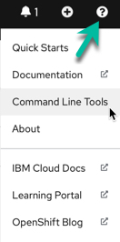

# GitOps

[Gitops](https://www.gitops.tech/)  is a way of implementing Continuous Deployment for cloud native applications.

The core idea of GitOps is having a Git repository that always contains declarative descriptions of the infrastructure currently desired in the production environment and an automated process to make the production environment match the described state in the repository.

## GitOps

Developers and operations want to:

* Audit all changes made to pipelines, infrastructure, and application configuration.
* Roll forward/back to desired state in case of issues.
* Consistently configure all environments.
* Reduce manual effort by automating application and environment setup and remediation.
* Have an easy way to manage application and infrastructure state across clusters/environments

GitOps is a natural evolution of DevOps and Infrastructure-as-Code.

### Core principles

* Git is the source of truth.
* Separate application source code (Java/Go) from deployment manifests i.e the application source code and the GitOps configuration reside in separate git repositories.
* Deployment manifests are standard Kubernetes (k8s) manifests i.e Kubernetes manifests in the GitOps repository can be simply applied with nothing more than a oc apply.
* Kustomize for defining the differences between environments i.e reusable parameters with extra resources described using kustomization.yaml.

### Concepts

* Day 1 Operations are actions that users take to bootstrap a GitOps configuration. See [this note](https://github.com/redhat-developer/kam/tree/master/docs/journey/day1) on how to set up GitOps and Sealed Secret.
* [Day 2 Operations](https://github.com/redhat-developer/kam/tree/master/docs/journey/day2) are actions that users take to change a GitOps system.

### Supporting tools

* [kam CLI from the Red Hat team gitops](https://github.com/redhat-developer/kam)
* [Tekton](#tekton-tutorial) for continuous integration and even deployment
* [ArgoCD](#argocd-tutorial) for continuous deployment

## Playground

### Use IBM open labs

Connect to the IBM [open lab home page]( https://developer.ibm.com/openlabs/openshift), Select `bring your own app` to start a cluster with 2 nodes.

Login to the cloud: `ibmcloud login --sso`

Get access to a temporary access code:

Do not select a region, and do not ipdate the cli. 

Access the Openshift cluster: oc login --server  https://.....

Verify nodes and services

```sh
oc get nodes 
oc get svc,deploy,po --all-namespaces
```

### Openshift try

[Red Hat OpenShift trial](https://www.openshift.com/try). With this environment we cannot create new project, only use two predefined projects.

### Having a schema registry

We can use docker hub, quay.io or define a private registry:

* [ibm cloud container registry](https://cloud.ibm.com/docs/Registry?topic=Registry-getting-started#getting-started)  provides a multi-tenant private image registry that you can use to store and share your container images with users in your IBM Cloud account
* [Amazon Elastic Container Registry (ECR)](https://aws.amazon.com/ecr/) we can share container software privately within your organization or publicly worldwide for anyone to discover and download. geo-replicated for high availability and faster downloads

To move one image from one registry to another use docker tag to change the image name:

```sh
docker tag <source_image>:<tag> <region>.icr.io/<my_namespace>/<new_image_repo>:<new_tag>
```

## OpenShift Pipelines

OpenShift Pipelines is a Continuous Integration / Continuous Delivery (CI/CD) solution based on the open source Tekton project. 
The key objective of Tekton is to enable development teams to quickly create pipelines of activity from simple, repeatable steps.
A unique characteristic of Tekton that differentiates it from previous CI/CD solutions is that Tekton steps execute within
 a container that is specifically created just for that task.

Users can interact with OpenShift Pipelines using the web user interface, command line interface, and via a Visual Studio Code editor plugin. 
The command line access is a mixture of the OpenShift `oc` command line utility 
and the `tkn` command line for specific Tekton commands. 
The `tkn` and `oc` command line utilities can be downloaded from the OpenShift console web user interface. 
To do this, simply press the white circle containing a black question mark near your name on the top right 
corner and then select Command Line Tools:



## Tekton tutorial

This section is a summary based on [OpenShift pipeline tutorial](https://github.com/openshift/pipelines-tutorial), [Red Hat scholar - tekton tutorial](https://redhat-scholars.github.io/tekton-tutorial) and [this blog](https://www.openshift.com/blog/cloud-native-ci-cd-with-openshift-pipelines):

* Tekton is a flexible, Kubernetes-native, open-source CI/CD framework that enables automating deployments across multiple platforms (Kubernetes, serverless, VMs, etc)
* Build images with Kubernetes tools such as S2I, Buildah, Buildpacks, Kaniko,...
* With openshift pipelines operator, CRD, service account and cluster binding are created automatically:

  * install the operator via Operator Hub or using yaml:
  * Service accounts are named `builder` and `pipeline`
* Concepts

    * **Task**: a reusable, loosely coupled number of steps that perform a specific task. Tasks are executed/run by creating TaskRuns. A TaskRun will schedule a Pod. Task definitions are reusable.
    * **Pipeline**: the definition of the pipeline and the Tasks that it should perform
    * **Resources**: build uses resources called [PipelineResource](https://github.com/tektoncd/pipeline/blob/main/docs/resources.md) that helps to configure the git repo url, the final container image name etc

 

The task requires an input resource of type git that defines where the source is located. 
The git source is cloned to a local volume at path `/workspace/source` where `source` comes from the name we gave to the resource

### Administration steps

Tested on RedHat OpenShit Pipelines Operator version 1.2.3  6/10/21

* Install Openshift pipelines operator from the operator hub or using oc cli with an operator subscription like in [EDA lab inventory openshift pipelines](https://github.com/ibm-cloud-architecture/eda-lab-inventory/tree/master/environments/openshift-pipelines)

  ```sh
  oc apply -f https://raw.githubusercontent.com/ibm-cloud-architecture/eda-lab-inventory/master/environments/openshift-pipelines/operator.yaml
  ```

* Define a service account `pipeline` (created automatically by the OpenShift Pipeline Operator  operator)
* Ensure Tekton pipelines is deployed and the API is availabe for use

  ```sh
  kubectl api-resources --api-group='tekton.dev'
  ```

  Results

  ```
  NAME                SHORTNAMES   APIGROUP     NAMESPACED   KIND
  clustertasks                     tekton.dev   false        ClusterTask
  conditions                       tekton.dev   true         Condition
  pipelineresources                tekton.dev   true         PipelineResource
  pipelineruns        pr,prs       tekton.dev   true         PipelineRun
  pipelines                        tekton.dev   true         Pipeline
  runs                             tekton.dev   true         Run
  taskruns            tr,trs       tekton.dev   true         TaskRun
  tasks                            tekton.dev   true         Task
  ```

### Developer's steps:

At the high level the generic steps for a given application look like:

* [Create custom task](#define-tasks) or install existing reusable Tasks
* Create [PipelineResources](#define-resources) to specify the github source repository and the docker image name.
* Create a [Pipeline](#create-pipeline) to define your application's delivery pipeline
* Create a PersistentVolumeClaim to provide the volume/filesystem for the pipeline execution or provide a VolumeClaimTemplate which creates a PersistentVolumeClaim
* Create a PipelineRun to instantiate and invoke the pipeline

#### Define tasks

The fundamental resource of the Tekton process is the <em>task</em>, which contains at least one step to be executed and performs a useful function. 
Tasks execute steps in the order in which they are written, with each step completing before the next step starts. While `Pipelines` execute tasks
 in parallel unless a task is directed to run after the completion of another task. This facilitates parallel execution of build / test / deploy 
 activities and is a useful characteristic that guides the user in the grouping of steps within tasks.

We need to have tasks to build the application executable, to build the docker image, push to the image registry and
potentially deploy to the target runtime project. This last task is in fact done with ArgoCD.

* first task is to clone a repo. In the [Tekton hub](https://hub.tekton.dev/) we can find the yaml for this task. But with the OpenShift pipeline operator, it is part of the clustertask:

  ```sh
  tkn  clustertask describe git-clone
  ```
  So we do not need to redefine this task. If we really need to get the last release of a task we can use a command like:

  ```sh
  oc apply -f https://raw.githubusercontent.com/tektoncd/catalog/main/task/git-clone/0.3/git-clone.yaml
  ```

  Here is an example of using this task in a pipeline

  ```yaml
  tasks:
    - name: fetch-source
      taskRef:
        name: git-clone
        kind: ClusterTask
      workspaces:
      - name: output
        workspace: build-ws
      params:
      - name: url
        value: $(params.repo-url)
      - name: revision
        value: $(params.revision)
  ```

  The **workspace** directory is where your Task/Pipeline sources/build artifacts will be cloned and generated. 
  
  See [next pipeline section](#create-pipeline) to see how to configure this git-clone.

  **Remarks:** when using resource of type git then a clone will be done implicitly.

* Define a Task to build a quarkus app: this is done by using the maven task: `tkn task describe maven` or by using
custom task using the maven docker image. 

  To use the Tekton predefined maven task, use:

  ```sh
  oc  apply -f https://raw.githubusercontent.com/tektoncd/catalog/main/task/maven/0.2/maven.yaml
  ```

  There is an alternative is to define the image to use for a step of the task. [A pipeline with maven image]().

The **source** is a sub-path, under which Tekton cloned the application sources.

* Other task example to apply kubernetes manifests ([apply-manifests](https://raw.githubusercontent.com/openshift/pipelines-tutorial/pipelines-1.4/01_pipeline/01_apply_manifest_task.yaml)) to deploy an image.
or [update-deployment](https://raw.githubusercontent.com/openshift/pipelines-tutorial/pipelines-1.4/01_pipeline/02_update_deployment_task.yaml) task to path the application deployment with a new `image name:tag`.

The tasks are by default tied to namespace. **ClusterTask** makes the task available in all namespaces

* list the tasks defined in current project (Tasks are local to a namespace): 

```sh
tkn task list
``` 

and use next command to list the Operator-installed additional cluster tasks such as buildah

```sh
tkn clustertasks list
``` 

* In [Tekton Hub we may find reusable tasks and pipelines](https://hub.tekton.dev/) like:

  * [git-clone](https://hub.tekton.dev/tekton/task/git-clone) has url as input and a workspace to clone code to.
  * [maven](https://hub.tekton.dev/tekton/task/maven)
  * [buildah](https://hub.tekton.dev/tekton/task/buildah) builds source into a container image and then pushes it to a container registry

  ```sh
  tkn clustertask describe buildah
  ```
#### Define resources

A reference to the resource is declared within the task and then the steps use the resources in commands. 
A resource can be used as an output in a step within the task.

In Tekton, there is no explicit Git pull command. Simply including a Git resource in a task definition will result 
in a Git pull action taking place, before any steps execute, which will pull the content of the Git repository 
to a location of `/workspace/<git-resource-name>`. In the example below the Git repository content is pulled to `/workspace/source`.

```yaml
kind: Task
 resources:
   inputs:
     - name: source
       type: git
   outputs:
     - name: intermediate-image
       type: image
 steps :
   - name: build
```

PipelineResource defines resources to be used as input or output to task and pipeline, they are reusable. 

*It looks it is still in alpha release so may not be kept.*

Example of resource for git repo:

```yaml
apiVersion: tekton.dev/v1alpha1
kind: PipelineResource
metadata:
  name: item-inventory-source
spec:
  type: git
  params:
    - name: url
      value: https://github.com/jbcodeforce/refarch-eda-item-inventory
    - name: revision
      value: master
```

See [other resource definitions](https://github.com/ibm-cloud-architecture/refarch-eda-item-inventory/tree/master/build/resources.yaml) like docker image names.

* get list of resources defined in the project:

 ```sh
 tkn res ls
 ```

#### Create pipeline

A Pipeline is a collection of Tasks that you define and arrange in a specific order of execution as part of your continuous integration flow:


The <em>pipelineRun</em> invokes the pipeline, which contains tasks. Each task consists of a number of steps, each of which can contain elements such as command, script, volumeMounts, workingDir, parameters, resources, workspace, or image. 

Generic pipeline takes the source code of the application from GitHub and then builds jar and docker image and deploys it on OpenShift. The deployment can also being done with ArgoCD.

* `volumeMounts` allow you to add storage to a step. Since each step runs in an isolated container, any data that is created by a step for use by another step must be stored appropriately. 
If the data is accessed by a subsequent step within the same task then it is possible to use the `/workspace` directory to hold any created files and directories. 
A further option for steps within the same task is to use an emptyDir storage mechanism which can be useful for separating out different data content for ease of use. If file stored data is to be accessed by a subsequent step that is in a different task then a Kubernetes persistent volume claim is required to be used. As explained below, this is what we do for the Travelport demo.

> Note that volumes are defined in a section of the task outside the scope of any steps, and then each step that needs the volume will mount it. 

* The `workingDir` element refers to the path within the container that should be the current working directory when the command is executed.
* `parameters`: As with volumeMounts, parameters are defined outside the scope of any step within a task and then they are referenced from within the step. 
Parameters in this case refers to any information in text form required by a step such as a path, a name of an object, a username etc.  
Workspace
* A `workspace` is similar to a volume in that it provides storage that can be shared across multiple tasks. A persistent volume claim 
is required to be created first and then the intent to use the volume is declared within the pipeline and task before mapping the 
workspace into an individual step such that it is mounted. Workspaces and volumes are similar in behavior but are defined in
 slightly different places.

* `Image`: Since each Tekton step runs within its own image, the image must be referenced as shown in the example below:

  ```yaml
  steps :
    - name: build
      command:
        - buildah
        - bud
        - '-t'
        - $(resources.outputs.intermediate-image.url)
      image: registry.redhat.io/rhel8/buildah
  ```

A Pipeline requires PipelineResources to provide inputs and store outputs for the Tasks that comprise it.

* Declare the pipeline in a yaml file like [tutorial build and deploy](https://raw.githubusercontent.com/openshift/pipelines-tutorial/pipelines-1.4/01_pipeline/04_pipeline.yaml) 
or the [item inventory aggregator]()
* In previous section there is an example of git clone task declared in a pipeline. It uses the pipeline parameters to get URL and revision and output to the workspace.

The workspace is declared in the pipeline, and the names must match

  ```yaml
  spec:
  params:
  - name: repo-url
    type: string
    description: The git repository URL to clone from.
  - name: revision
    type: string
    description: The git tag to clone.
  workspaces:
    - name: build-ws
  ```

  This workspace will be specified in the pipelinerun (as well as url and revision):

  ```yaml
  apiVersion: tekton.dev/v1beta1
  kind: PipelineRun
  metadata:
    generateName: build-quarkus-app-result-
  spec:
    pipelineRef:
      name: build-quarkus-app
    workspaces:
    - name: build-ws
      emptyDir: {}
  ```

* Use of Persistent Storage: adding persistent storage for the pipeline to allow us to cache and manage 
state between tasks in the pipeline. For example, for its build, Maven needs all the repositories from the project dependencies. 
Once persisted future builds do not have to download dependent jars. 

Since each step runs in an isolated container any data that is created by a step for use by another step must be stored appropriately. 
If the data is accessed by a subsequent step within the same task then it is possible to use the `/workspace` directory to hold any 
created files and directories. A further option for steps within the same task is to use an emptyDir storage mechanism which can be useful
 for separating different data content for ease of use. If file stored data is to be accessed by a subsequent step that is in a different
task, then a Kubernetes persistent volume claim is required to be used.
The mechanism for adding storage to a step is called a <em>volumeMount</em>, as described further below. 

In our case, a persistent volume claim called <em>pipeline-storage-claim</em> is mounted into the step at a specifc path. 
Other steps within the task and within other tasks of the pipeline can also mount this volume and reuse any data placed there by this step. 
Note that the path used is where the Buildah command expects to find a local image repository. 
As a result any steps that invoke a Buildah command will mount this volume at this location.

`Buildah` is a tool that facilitates building Open Container Initiative (OCI) container images. 
It provides a command line tool that can be used to create a container from scratch or using an image as a starting point.

> You need to use persistence storage when your data must still be available, even if the container, the worker node, or the cluster is removed. 
You should use persistent storage in the following scenarios:

>  * Stateful apps
>  * Core business data
>  * Data that must be available due to legal requirements, such as a defined retention period
>  * Auditing
>  * Data that must be accessed and shared across app instances. For example: 
>
>       - <b>Access across pods</b>: When you use Kubernetes persistent volumes to access your storage, you can determine the number of pods that can mount the volume at the same time. Some storage solutions, such as block storage, can be accessed by one pod at a time only. With other storage solutions, you can share volume across multiple pods.
>       - <b>Access across zones and regions</b>: You might require your data to be accessible across zones or regions. Some storage solutions, such as file and block storage, are data center-specific and cannot be shared across zones in a multizone cluster setup.


* Execute it using a pipeline run

 ```sh
 oc create -f build/pipelinerun.yaml
 ```
* Or using `tkn` pipeline start:

```sh
tkn pipeline start 
```

* List pipeline runs

```sh
tkn pipelinerun list
```

#### Some potential errors

* Build faild to access internal registry with `x509: certificate signed by unknown authority`. 
We may need to do not verify TLS while pushing image to the internal docker registry or use a public registry

#### Triggers


#### Enhancing

We can use nexus to keep maven downloaded jars. 

```sh
oc apply -f https://raw.githubusercontent.com/redhat-scholars/tekton-tutorial/master/install/utils/nexus.yaml
oc expose svc nexus
```

### Other readings

* [Tekton dev documentation](https://tekton.dev/docs/)
* [Deploy a Knative application using Tekton Pipelines](https://developer.ibm.com/tutorials/knative-build-app-development-with-tekton/)
* [IBM Tekton tasks](https://github.com/IBM/ibm-garage-tekton-tasks)

## ArgoCD tutorial

To implement our GitOps workflow, we used Argo CD, the GitOps continuous delivery tool for Kubernetes. 
Argo CD models a collection of applications as a project and uses a Git repository to store the application's desired state (a gitops repo). 
Argo CD compares the actual state of the application in the cluster with the desired state defined in Git and
determines if they are out of sync. When it detects the environment is out of sync, Argo CD can be configured
to either send out a notification to kick off a separate reconciliation process or Argo CD can automatically synchronize the environments to ensure they match.

ArgoCD is deployed with OpenShift GitOps operator. 

If you go to the Developer's Perspective, you can see a topology:


><b>OpenShift GitOps</b> is an OpenShift add-on which provides Argo CD and other tooling to enable teams to implement GitOps workflows for cluster configuration and application delivery. 


Clicking the Argo Server node that contains the URL takes you to the Argo login page.

See [this getting started tutorial](https://argoproj.github.io/argo-cd/getting_started/) and the [core concept](https://argoproj.github.io/argo-cd/core_concepts/)

* Install argocd: this will includes CRD, service account, RBAC policies, config maps, secret and deploy: Redis and argocd server. It makes sense to have
one ArgoCD instance deploy per cluster. It can manage projects and within project, applications.

```sh
oc new-project argocd
oc apply -f https://raw.githubusercontent.com/argoproj/argo-cd/stable/manifests/install.yaml
```

* It can be also installed via the Red Hat OpenShift GitOps operator. After installing the OpenShift GitOps 
operator, an instance of Argo CD is installed in the `openshift-gitops` namespace which has sufficent privileges 
for managing cluster configurations.

* Finally, you can declare the operator yaml and service account and role binding as part of your gitops. See [sample in this folder](https://github.com/ibm-cloud-architecture/eda-lab-inventory/tree/master/environments/openshift-gitops).

Once installed the following pods run:

 ```sh
 argocd-application-controller-0                                   1/1     Running     0          20h
 argocd-dex-server-9dc558f5-4dw4q                                  1/1     Running     2          20h
 argocd-redis-759b6bc7f4-g2jbj                                     1/1     Running     0          20h
 argocd-repo-server-5fbf484547-6x4rj                               1/1     Running     0          20h
 argocd-server-6d4678f7f6-vqs64  
 ```

* Install argocd CLI

On MAC: `brew install argocd`

* Expose the API server: By default, the Argo CD API server is not exposed with an external IP. Update the service to use load balancer: 

```sh
kubectl patch svc argocd-server -n argocd -p '{"spec": {"type": "LoadBalancer"}}'
```

The initial password for the admin account is auto-generated and stored as clear text in the field password in a secret named `argocd-initial-admin-secret` 

```sh
oc get secret argocd-initial-admin-secret -o jsonpath="{.data.password}" | base64 -d && echo ""
```

Get the IP address of the argocd server: `oc get svc` then look at the LoadBalancer service (argocd-server) external-IP.

`argocd login SERVERIP`  then use admin user and password. 
You can also access the ArgoCD UI using the load balancer IP address, admin user and password. 

* Define application: this is the deployable unit, which is map to a k8s deployment that references the image built during the CI pipeline.
The approach is to use one git repository to represent the solution to deploy. Each component, microservice or app is defined in
its own folder and can use Helm or Kustomize to define the deployment, service, configmap... 

You use one application per target environment.

Here is an example of argoCD app:

```yaml
```

On the application tile, we can use the 'SYNC' to deploy the application or use `argocd app get <appname>`.


### Connect pipeline to deployment

Once the manifests for a given app are defined in the gitops repository, we need to have the pipeline being able to update the deployment
descriptor with the image reference and tag defined as part of the build pipeline.

The pipeline needs to have the git credentials to be able to write to the gitops repository. Credentials are saved in a secret and a configmap
define github host, user.

### More reading

* [ArgoCD documentation](https://argo-cd.readthedocs.io/en/stable/)


## Kustomize and gitops

There are at least two repositories: the **application** repository and the **environment configuration** repository.

There are two ways to implement the deployment strategy for GitOps: 

* **Push-based:** use CI/CD tools like jenkins, travis... to define a pipeline, triggered when application code source is updated, to build the container image and deploy the modified yaml files to the environment repo. Changes to the environment configuration repository trigger the deployment pipeline. It has to be used for running an automated provisioning of cloud infrastructure. See also [this tutorial](https://cloud.google.com/kubernetes-engine/docs/tutorials/gitops-cloud-build).
* **Pull-based:** An operator takes over the role of the pipeline by continuously comparing the desired state in the environment repository with the actual state in the deployed infrastructure.

A CICD based on git action will build the image and edit Kustomize patch to bump the expected container tag using the new docker image tag, then commit this changes to the gitops repo.

[Kustomize](https://kustomize.io/) is used to simplify the configuration of application and environment. Kustomize traverses a Kubernetes manifest to add, remove or update configuration options without forking. It is available both as a standalone binary and as a native feature of Kubectl. A [lot of examples here.](https://github.com/kubernetes-sigs/kustomize/tree/master/examples).

The simple way to organize the configuration is to use one `kustomize` folder, then one folder per component, then one overlay folder in which environment folder include `kustomization.yaml` file with patches.

```
└── postgres
    ├── base
    │   ├── configmap.yaml
    │   ├── kustomization.yaml
    │   ├── pvc.yaml
    │   ├── secret.yaml
    │   ├── service-account.yaml
    │   ├── statefulset.yaml
    │   ├── svc-headless.yaml
    │   └── svc.yaml
    ├── kustomization.yaml
    └── overlays
        └── dev
            ├── kustomization.yaml
            └── secret.yaml
```

Here is an example of `kustomization.yaml`:

```
bases:
  - ../../base
patchesStrategicMerge:
  - ./secret.yaml
```

The `patchesStrategicMerge` lists the resource configuration YAML files that you want to merge to the base kustomization. You must also add these files to the same repo as the kustomization file, such as `overlay/dev`. These resource configuration files can contain small changes that are merged to the base configuration files of the same name as a patch.


In GitOps, the pipeline does not finish with something like `oc apply..`. but it’s an external tool (Argo CD or Flux) that detects the drift in the Git repository and will run these commands.

Here is a command to install ArgoCD on k8s, see [details here](https://argoproj.github.io/argo-cd/getting_started/).

```
kubectl apply -n argocd -f https://raw.githubusercontent.com/argoproj/argo-cd/stable/manifests/install.yaml
```

For OpenShift:

* create an `argocd` project
* use operator hub, and install the operator in this project. Nothing to change in the default configuration
* deploy one instance of ArgoCD with the following customization:

```yaml
apiVersion: argoproj.io/v1alpha1
kind: ArgoCD
metadata:
  name: argocd
  namespace: argocd
spec:
  server:
    ingress:
      enabled: true
    route: 
      enabled: true
  dex:
    openShiftOAuth: true
    image: quay.io/ablock/dex
    version: openshift-connector
  rbac:
    policy: |
      g, system:cluster-admins, role:admin
```


An example of gitops with kustomize is in this [vaccine-gitops repo](https://github.com/ibm-cloud-architecture/vaccine-gitops)

### Future readings

* [GitOps - Operations by Pull Request](https://www.weave.works/blog/gitops-operations-by-pull-request)

## Kam

Goal: create a gitops project for an existing application service as day 1 operation and then add more service.

* Use the following kam command:

```sh
kam bootstrap \                
--service-repo-url https://github.com/jbcodeforce/refarch-eda-store-inventory \
--gitops-repo-url  https://github.com/jbcodeforce/refarch-eda-inventory-gitops \
--image-repo image-registry.openshift-image-registry.svc:5000/ibmcase/store-aggregator \
--output refarch-eda-inventory-gitops \
--git-host-access-token <agithubtoken> \
--prefix my-inventory --push-to-git=true
```

**Kam bug:**: the application name is marching the git repo name, and there will be an issue while creating binding with a limit of 
the number of characters. kam boostrap need a --service-name argument.

This will create a gitops project, pushed to github.com as private repo. The repo includes two main folders:

* `environment` includes two environment definitions for dev and stage. 

  ```sh
      environments
    │   ├── my-inventory-dev
    │   │   ├── apps
    │   │   │   └── app-refarch-eda-store-inventory
    │   │   │       ├── base
    │   │   │       │   └── kustomization.yaml
    │   │   │       ├── kustomization.yaml
    │   │   │       ├── overlays
    │   │   │       │   └── kustomization.yaml
    │   │   │       └── services
    │   │   │           └── refarch-eda-store-inventory
    │   │   │               ├── base
    │   │   │               │   ├── config
    │   │   │               │   │   ├── 100-deployment.yaml
    │   │   │               │   │   ├── 200-service.yaml
    │   │   │               │   │   ├── 300-route.yaml
    │   │   │               │   │   └── kustomization.yaml
    │   │   │               │   └── kustomization.yaml
    │   │   │               ├── kustomization.yaml
    │   │   │               └── overlays
    │   │   │                   └── kustomization.yaml
    │   │   └── env
    │   │       ├── base
    │   │       │   ├── argocd-admin.yaml
    │   │       │   ├── kustomization.yaml
    │   │       │   ├── my-inventory-dev-environment.yaml
    │   │       │   └── my-inventory-dev-rolebinding.yaml
    │   │       └── overlays
    │   │           └── kustomization.yaml
    │   └── my-inventory-stage
    │       └── env
    │           ├── base
    │           │   ├── argocd-admin.yaml
    │           │   ├── kustomization.yaml
    │           │   └── my-inventory-stage-environment.yaml
    │           └── overlays
    │               └── kustomization.yaml
  ```

* `config` define argocd and cicd project to support deployment and build pipeline

  ```sh
    ├── config
    │   ├── argocd
    │   │   ├── argo-app.yaml
    │   │   ├── cicd-app.yaml
    │   │   ├── kustomization.yaml
    │   │   ├── my-inventory-dev-app-refarch-eda-store-inventory-app.yaml
    │   │   ├── my-inventory-dev-env-app.yaml
    │   │   └── my-inventory-stage-env-app.yaml
    │   └── my-inventory-cicd
    │       ├── base
    │       │   ├── 01-namespaces
    │       │   │   ├── cicd-environment.yaml
    │       │   │   └── ibmcase-environment.yaml
    │       │   ├── 02-rolebindings
    │       │   │   ├── argocd-admin.yaml
    │       │   │   ├── internal-registry-ibmcase-binding.yaml
    │       │   │   ├── pipeline-service-account.yaml
    │       │   │   ├── pipeline-service-role.yaml
    │       │   │   ├── pipeline-service-rolebinding.yaml
    │       │   │   └── sealed-secrets-aggregate-to-admin.yaml
    │       │   ├── 03-secrets
    │       │   │   ├── docker-config.yaml
    │       │   │   ├── git-host-access-token.yaml
    │       │   │   ├── gitops-webhook-secret.yaml
    │       │   │   └── webhook-secret-my-inventory-dev-refarch-eda-store-inventory.yaml
    │       │   ├── 04-tasks
    │       │   │   ├── deploy-from-source-task.yaml
    │       │   │   └── set-commit-status-task.yaml
    │       │   ├── 05-pipelines
    │       │   │   ├── app-ci-pipeline.yaml
    │       │   │   └── ci-dryrun-from-push-pipeline.yaml
    │       │   ├── 06-bindings
    │       │   │   ├── github-push-binding.yaml
    │       │   │   └── my-inventory-dev-app-refarch-eda-store-inventory-refarch-eda-store-inventory-binding.yaml
    │       │   ├── 07-templates
    │       │   │   ├── app-ci-build-from-push-template.yaml
    │       │   │   └── ci-dryrun-from-push-template.yaml
    │       │   ├── 08-eventlisteners
    │       │   │   └── cicd-event-listener.yaml
    │       │   ├── 09-routes
    │       │   │   └── gitops-webhook-event-listener.yaml
    │       │   └── kustomization.yaml
    │       └── overlays
    │           └── kustomization.yaml
  ```

The `environment` includes folders for each app of the solution.  In an app folder the `services` defines the manifests
to configure the application. When created the image reference `nginx` we need to build the image with a pipeline with [tekton](#tekton_tutorial). 
To bring up the argocd do `oc apply -k config/argocd/` which will create:

* three projects: my-inventory-cicd, my-inventory-dev, my-inventory-stage
* a set of role bindings, secrets...

To access the argocd application use the Grid icon in OpenShift console and admin user. The secret is define in `openshift-gitops` and secret name `argocd-cluster-cluster`. 

```sh
oc get secret argocd-cluster-cluster -n openshift-gitops -ojsonpath='{.data.admin\.password}' | base64 -d
```