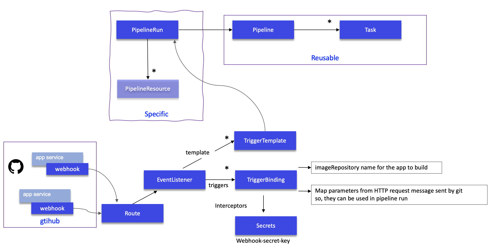

# Tekton tutorial

This article is a summary based on [OpenShift pipeline tutorial](https://github.com/OpenShift/pipelines-tutorial), [Red Hat scholar - tekton tutorial](https://redhat-scholars.github.io/tekton-tutorial) 
and [this blog](https://cloud.redhat.com/blog/cloud-native-ci-cd-with-openshift-pipelines):

* Tekton is a flexible, Kubernetes-native, open-source CI/CD framework that enables automating deployments across multiple platforms (Kubernetes, serverless, VMs, etc)
* Build images with Kubernetes tools such as S2I, Buildah, Buildpacks, Kaniko,...
* With [OpenShift Pipelines](https://docs.openshift.com/container-platform/4.8/cicd/pipelines/creating-applications-with-cicd-pipelines.html) operator, CRD, service account and cluster binding are created automatically.

## Installation

* Install the operator via OpenShift Operator Hub (Search pipeline) or using yaml: 
  
  ```sh
    # under https://github.com/jbcodeforce/eda-gitops-catalog
    oc apply -k openshift-pipelines-operator/overlays/stable
  ```

* Define a service account `pipeline` (created automatically by the OpenShift Pipeline Operator)
* Ensure Tekton pipelines is deployed and the API is available for use

  ```sh
  kubectl api-resources --api-group='tekton.dev'
  ```

  Results

  ```
  NAME                SHORTNAMES   APIGROUP     NAMESPACED   KIND
  clustertasks                     tekton.dev   false        ClusterTask
  conditions                       tekton.dev   true         Condition
  pipelineresources                tekton.dev   true         PipelineResource
  pipelineruns        pr,prs       tekton.dev   true         PipelineRun
  pipelines                        tekton.dev   true         Pipeline
  runs                             tekton.dev   true         Run
  taskruns            tr,trs       tekton.dev   true         TaskRun
  tasks                            tekton.dev   true         Task
  ```

* Install the [tkn CLI](https://docs.openshift.com/container-platform/4.7/cli_reference/tkn_cli/installing-tkn.html)

## Concepts

* **Task**: a reusable, loosely coupled number of steps that perform a specific task. Tasks are executed/run by creating TaskRuns. A TaskRun will schedule a Pod. Task definitions are reusable.
* **Pipeline**: the definition of the pipeline and the Tasks that it should perform
* **Resources**: build uses resources called [PipelineResource](https://github.com/tektoncd/pipeline/blob/main/docs/resources.md) that helps to configure the git repo url, the final container image name etc

 

Task requires an input resource of type git which defines where the source is located. 
The git source is cloned to a local volume at path `/workspace/source` where `source` comes from the name we gave to the resource


## Developer's steps:

To be able to get pipeline executed, we need to deploy OpenShift Pipeline operator. Use
one the catalog repo (eda-gitops-catalog or dba-gitops-catalog)

```sh
oc apply -k openshift-pipelines-operator/overlays/stable 
```

At the high level, the generic steps for a given application are:

* [Create custom task](#define-tasks) or install existing reusable Tasks
* Create [PipelineResources](#define-resources) to specify the github source repository and the docker image name to create.
* Create a [Pipeline](#create-pipeline) to define your application's delivery pipeline
* Create a PersistentVolumeClaim to provide the volume/filesystem for the pipeline execution or provide a VolumeClaimTemplate which creates a PersistentVolumeClaim
* Create a PipelineRun to instantiate and invoke the pipeline
* Add triggers to capture events in the source repository that are propagated by webhook.

### Define tasks

Task contains at least one step to be executed to perform a useful function. Tasks are executed/run by creating TaskRuns, which are containers
running in one pod.
Tasks execute steps in the order in which they are written, with each step completing before the next step starts. While `Pipelines` execute tasks
 in parallel unless a task is directed to run after the completion of another task. This facilitates parallel execution of build / test / deploy 
 activities and is a useful characteristic that guides the user in the grouping of steps within tasks.

We need to have tasks to build the application executable, to build the docker image, push to the image registry and
potentially deploy to the target runtime project. With the adoption of GitOps this last task is in fact done with ArgoCD application.

Tasks are reusable between pipeline.

* A first task is to clone a repo. In the [Tekton hub](https://hub.tekton.dev/) we can find the yaml 
for this task. But with the OpenShift Pipeline operator, it is part of the clustertask:

  ```sh
  # List predefined task at the 'cluster level'
  tkn clustertask list
  # See a particular task like git-clone
  tkn  clustertask describe git-clone
  ```
  
  So we do not need to redefine this task. If we really need to get the last release of a task we can use a command like:

  ```sh
  oc apply -f https://raw.githubusercontent.com/tektoncd/catalog/main/task/git-clone/0.3/git-clone.yaml
  ```

  Here is an example of using this task in a pipeline

  ```yaml
  tasks:
    - name: fetch-source
      taskRef:
        name: git-clone
        kind: ClusterTask
      workspaces:
      - name: output
        workspace: build-ws
      params:
      - name: url
        value: $(params.repo-url)
      - name: revision
        value: $(params.revision)
  ```

  The **workspace** directory is where your Task/Pipeline sources/build artifacts will be cloned and generated. 
  
  See [next pipeline section](#create-pipeline) for how to configure this `git-clone` task.

  **Remarks:** when using resource of type git then a clone will be done implicitly, therefore this task is not needed.

* Define a Task to build a quarkus app: this is done by using the maven task: `tkn task describe maven` or by using
custom task based on the maven docker image. 

  To use the Tekton predefined maven task, do:

  ```sh
  oc  apply -f https://raw.githubusercontent.com/tektoncd/catalog/main/task/maven/0.2/maven.yaml
  ```

  There is an alternative: define the image to use for a step of the task. [A pipeline with maven image]().

The **source** is a sub-path, under which Tekton cloned the application sources.

* Other task example to apply kubernetes manifests ([apply-manifests](https://raw.githubusercontent.com/OpenShift/pipelines-tutorial/pipelines-1.4/01_pipeline/01_apply_manifest_task.yaml)) to deploy an image.
or [update-deployment](https://raw.githubusercontent.com/OpenShift/pipelines-tutorial/pipelines-1.4/01_pipeline/02_update_deployment_task.yaml) task to path the application deployment with a new `image name:tag`.

The tasks are by default tied to namespace. **ClusterTask** makes the task available in all namespaces

* list the tasks defined in current project (Tasks are local to a namespace): 

```sh
tkn task list
``` 

and use next command to list the Operator-installed additional cluster tasks such as `buildah`...

```sh
tkn clustertasks list
``` 

* In [Tekton Hub we may find reusable tasks and pipelines](https://hub.tekton.dev/) like:

  * [git-clone](https://hub.tekton.dev/tekton/task/git-clone) has url as input and a workspace to clone code to.
  * [maven](https://hub.tekton.dev/tekton/task/maven)
  * [buildah](https://hub.tekton.dev/tekton/task/buildah) builds source into a container image and then pushes it to a container registry

  ```sh
  tkn clustertask describe buildah
  ```

### Define resources

A reference to the resource is declared within the task and then the steps use the resources in the commands. 
A resource can be used as an output in a step within the task.

In Tekton, there is no explicit Git pull command. Simply including a Git resource in a task definition will result 
in a Git pull action taking place, before any steps execute, which will pull the content of the Git repository 
to a location of `/workspace/<git-resource-name>`. 
In the example below the Git repository content is pulled to the implicit folder: `/workspace/source`.

```yaml
kind: Task
 resources:
   inputs:
     - name: source
       type: git
   outputs:
     - name: intermediate-image
       type: image
 steps :
   - name: build
```

PipelineResource defines resources to be used as input or output to task and pipeline, they are reusable. 

*It looks it is still in alpha release so may not be kept.*

Example of PipelineResource for git repo:

```yaml
apiVersion: tekton.dev/v1alpha1
kind: PipelineResource
metadata:
  name: item-inventory-source
spec:
  type: git
  params:
    - name: url
      value: https://github.com/jbcodeforce/refarch-eda-item-inventory
    - name: revision
      value: master
```

See [other resource definitions](https://github.com/ibm-cloud-architecture/refarch-eda-item-inventory/tree/master/build/resources.yaml) like docker image names.

* get list of resources defined in the project:

 ```sh
 tkn res ls
 ```

### Create pipeline

A Pipeline is a collection of Tasks that we define and arrange in a specific order of execution as part of our continuous integration flow:


The <em>pipelineRun</em> invokes the pipeline, which contains tasks. Each task consists of a number of steps, each of which can contain elements such as command, script, volumeMounts, workingDir, parameters, resources, workspace, or image. 

Generic pipeline takes the source code of the application from GitHub and then builds jar and docker image and deploys image to OpenShift. 
The deployment part of the pipeline could also being done with ArgoCD application.

* `volumeMounts` allows us to add storage to a step. Since each step runs in an isolated container, any data that is created by a step for use by another step must be stored appropriately. 
If the data is accessed by a subsequent step within the same task then it is possible to use the `/workspace` directory to hold any created files and directories. 
A further option for steps within the same task is to use an emptyDir storage mechanism which can be useful for separating 
out different data content for ease of use. If file stored data is to be accessed by a subsequent step that is in a 
different task then a Kubernetes persistent volume claim is required to be used. 

> Note that volumes are defined in a section of the task outside the scope of any steps, and then each step that needs the volume will mount it. 

* The `workingDir` element refers to the path within the container that should be the current working directory when the command is executed.
* `parameters`: As with volumeMounts, parameters are defined outside the scope of any step within a task and then they are referenced from within the step. 
Parameters, in this case, refer to any information in text form required by a step such as a path, a name of an object, a username etc.  

* A `workspace` is similar to a volume in that it provides storage that can be shared across multiple tasks. A persistent volume claim 
is required to be created first and then the intent to use the volume is declared within the pipeline and task before mapping the 
workspace into an individual step. Workspaces and volumes are similar in behavior but are defined in
 slightly different places.

* `Image`: Since each Tekton step runs within its own image, the image must be referenced as shown in the example below:

  ```yaml
  steps :
    - name: build
      command:
        - buildah
        - bud
        - '-t'
        - $(resources.outputs.intermediate-image.url)
      image: registry.redhat.io/rhel8/buildah
  ```

A Pipeline requires PipelineResources to provide inputs and store outputs for the Tasks that comprise it.

* Declare the pipeline in a yaml file like [tutorial build and deploy](https://raw.githubusercontent.com/OpenShift/pipelines-tutorial/pipelines-1.4/01_pipeline/04_pipeline.yaml) 
or the [item inventory aggregator pipeline in rt-inventory-gitops](https://github.com/jbcodeforce/rt-inventory-gitops/blob/main/config/rt-inventory-cicd/base/04-pipelines/quarkus-pipeline.yaml)
* In previous section there is an example of git clone task declared in a pipeline. It uses the pipeline parameters to get URL and revision and output to the workspace.

The workspace is declared in the pipeline, and the names must match

  ```yaml
  spec:
  params:
  - name: repo-url
    type: string
    description: The git repository URL to clone from.
  - name: revision
    type: string
    description: The git tag to clone.
  workspaces:
    - name: build-ws
  ```

  This workspace will be specified in the pipelinerun (as well as url and revision):

  ```yaml
  apiVersion: tekton.dev/v1beta1
  kind: PipelineRun
  metadata:
    generateName: build-quarkus-app-result-
  spec:
    pipelineRef:
      name: build-quarkus-app
    workspaces:
    - name: build-ws
      emptyDir: {}
  ```

* Use of Persistent Storage: adding persistent storage for the pipeline to allow us to cache and manage 
state between tasks in the pipeline. For example, for its build, Maven needs all the repositories from the 
project dependencies. Once persisted future builds do not have to download dependent jars. 

Since each step runs in an isolated container any data that is created by a step for use by another step must be stored appropriately. 
If the data is accessed by a subsequent step within the same task then it is possible to use the `/workspace` directory to hold any 
created files and directories. A further option for steps within the same task is to use an emptyDir storage mechanism which can be useful
 for separating different data content for ease of use. If file stored data is to be accessed by a subsequent step that is in a different
task, then a Kubernetes persistent volume claim is required to be used.
The mechanism for adding storage to a step is called a <em>volumeMount</em>, as described further below. 

In our case, a persistent volume claim called <em>pipeline-storage-claim</em> is mounted into the step at a specifc path. 
Other steps within the task and within other tasks of the pipeline can also mount this volume and reuse any data placed there by this step. 
Note that the path used is where the Buildah command expects to find a local image repository. 
As a result any steps that invoke a Buildah command will mount this volume at this location.

`Buildah` is a tool that facilitates building Open Container Initiative (OCI) container images. 
It provides a command line tool that can be used to create a container from scratch or using an image as a starting point.

> We need to use persistence storage when our data must still be available, even if the container, the worker node, or the cluster is removed. 
We should use persistent storage in the following scenarios:

>  * Stateful apps
>  * Core business data
>  * Data that must be available due to legal requirements, such as a defined retention period
>  * Auditing
>  * Data that must be accessed and shared across app instances. For example: 
>
>       - <b>Access across pods</b>: When we use Kubernetes persistent volumes to access our storage, we can determine the number of pods that can mount the volume at the same time. Some storage solutions, such as block storage, can be accessed by one pod at a time only. With other storage solutions, we can share volume across multiple pods.
>       - <b>Access across zones and regions</b>: we might require our data to be accessible across zones or regions. Some storage solutions, such as file and block storage, are data center-specific and cannot be shared across zones in a multizone cluster setup.


* Execute it using a pipeline run

 ```sh
 oc create -f build/pipelinerun.yaml
 ```
* Or using `tkn` pipeline start:

```sh
tkn pipeline start 
```

* List pipeline runs

```sh
tkn pipelinerun list
```

### Some potential errors

* Build failed to access internal registry with `x509: certificate signed by unknown authority`. 
We may need to do not verify TLS while pushing image to the internal docker registry or use a public registry

### Triggers

Triggers help to hook our Pipelines to respond to external github events.

A **TriggerTemplate** is a resource which have parameters that can be substituted anywhere 
within the resources of template. It maps to a PipelineRun.

A **TriggerBindings** is a map to enable us to capture fields from an event and store them 
as parameters, and replace them in triggerTemplate whenever an event occurs. Here is an extract of
such trigger binding definition:

```yaml
apiVersion: triggers.tekton.dev/v1alpha1
kind: TriggerBinding
metadata:
  creationTimestamp: null
  name: github-push-binding
  namespace: ads-risk-scoring-cicd
spec:
  params:
  - name: gitrepositoryurl
    value: $(body.repository.clone_url)
  - name: fullname
    value: $(body.repository.full_name)
```

**Trigger** combines TriggerTemplate, TriggerBindings and interceptors. They are used as ref inside the EventListener.

**Event Listener** sets up a Service and listens for events. It connects a TriggerTemplate to a TriggerBinding, into an addressable endpoint.

To use those trigger we need to define a webhook in the source repository, so push events can be sent
to this event listener.

Here is a diagram that represents the relationship between those elements:



* Event Listener is exposed via a route so the Github webhook for the application source repository can send push events to the listener
* The event listener links template and triggers.
* Triggers defines the binding and interceptors that will process the HTTP POST request coming from github. 
* Trigger template defines pipeline run
* PipelineRun reference pipeline definition and optionally resources.

As `PipelineRun` are defined inside the `TriggerTemplate`, they are specifics  to each application to build. 

## Enhancing

We can use nexus to keep the maven downloaded jars. 

```sh
oc apply -f https://raw.githubusercontent.com/redhat-scholars/tekton-tutorial/master/install/utils/nexus.yaml
oc expose svc nexus
```

## Quarkus app - tekton pipeline


## Other readings

* [Tekton dev documentation](https://tekton.dev/docs/)
* [OpenShift Pipelines](https://docs.openshift.com/container-platform/4.8/cicd/pipelines/creating-applications-with-cicd-pipelines.html)
* [OpenShift Pipelines tutorial](https://github.com/openshift/pipelines-tutorial/tree/pipelines-1.5)
* [Deploy a Knative application using Tekton Pipelines](https://developer.ibm.com/tutorials/knative-build-app-development-with-tekton/)
* [IBM Tekton tasks](https://github.com/IBM/ibm-garage-tekton-tasks)
