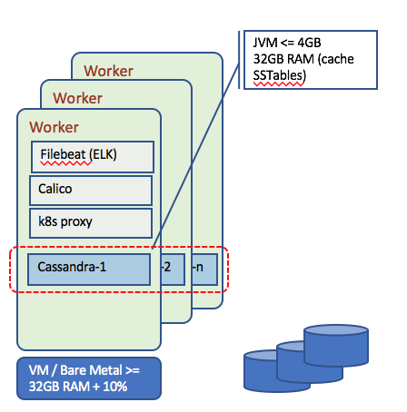

# Cassandra Summary

This article is summary of [Apache Cassandra](http://cassandra.apache.org/) which is a NoSQL, row-oriented, highly scalable and highly available database. It was created by Facebook team and given as an open-source to Apache Foundation.

Cassandra addresses linear scalability and high availability to persist a huge <key,value> data set. It uses replication to multiple nodes, managed in cluster, even deployed cross data centers.

The Apache Cassandra database is the right choice when you need scalability and high availability without compromising performance. Linear scalability and proven fault-tolerance on commodity hardware or cloud infrastructure make it the perfect platform for mission-critical data.

## Key value propositions

* Handle **massive datasets** distributed across multiple nodes, allowing for high read and write performance
* **High availability and fault tolerance** even between data centers. It supports always-on availability with zero downtime. It uses a peer-to-peer architecture and automatic replication to ensure that data is never lost.
* **Distributed and Decentralized Architecture**: Cassandra's decentralized architecture eliminates single points of failure and provides fault tolerance.
* **Linear Scalability**: even as more nodes are added to the cluster
* **Flexible Data Model**: Cassandra's data model is based on a wide column store, which allows for flexible schema design. It supports dynamic column addition and removal, making it suitable for applications with evolving data requirements.
* **Fast writes**: Cassandra is optimized for high-speed writes, making it well-suited for applications that need to capture large volumes of data in real-time, such as IoT, sensor data, and logging
* **Query flexibility**: Cassandra supports a variety of query methods, including lightweight transactions, batches, and secondary indexes, to provide flexible data access.

## Concepts

Cassandra uses a **ring based Distributed Hash Table** servers but without finder or routing tables. Keys are stored in DHT to one server and replicated on the 2 next neighbor servers.  There is one ring per data center.  The coordinator forwards the query to a subset of replicas for a particular key. Every server that could be a coordinator needs to know the 'key to server' assignment.  

Two data placement strategies:

* simple strategy: use two kinds of partitioners:

  * random, which does operation like hashing
  * byte ordered, which assigns range of keys to servers: easier for range queries

* network topology strategy: used for multiple data centers. It supports different configuration, like 2 replicas of each key per data center.

First  replica is placed according to the Partitioner logic: it makes sure to store the other replica to different rack, to avoid a rack failure which may make all key copies not available.  Go around the ring clockwise until encountering a server in a different rack.

*Snitches: is a mechanism to map ip addresses to racks in DC. Cassandra supports such configuration.*

Client sends writes to one coordinator node in Cassandra cluster. Every write operation is first stored in the commit log. It is used for crash recovery. Coordinator may be per key or per client or per query. 

Write operations are always successful, even in case of failure: the coordinator uses the Hinted Handoff mechanism (it assumes ownership of the key until being sure it is supported by the replica), as it writes to other replicas and keeps the write locally until the down replica comes back up. If all the replicas are done, the Coordinator buffers writes for few hours. 

After data is written to the commit log it then is stored in Mem-Table(Memory Table) which remains there till it reaches to the threshold. 

Finally, Sorted-String Table or SSTable is a disk file which stores data from MemTable once it reaches to the threshold. SSTables are stored on disk sequentially and maintained for each database table.

There are three types of read operations: 1/ **Direct-request** where coordinator send read query to one of the replicas and a digest request to other replicas to ensure returned data are up-to-date. 2/ **Digest-request**: returned rows from each replica are compared in memory for consistency 3/ **Read-repair**: in case of data is not consistent across the node, a background read repair request is initiated that makes sure that the most recent data is available across the nodes.

It uses partitioner to send query to all replica nodes responsible for a partition key. The process to write should be fast and not involving lock on resource. It should not involve read and disk seeks.

Here are some key concepts of Cassandra to keep in mind:

* **Cluster**:  the set of nodes potentially deployed across data centers, organized as a 'ring'.
* **Keyspace**: like a schema in SQL DB. It is the higher abstraction object to contain data. The important keyspace attributes are the Replication Factor, the Replica Placement Strategy and the Column Families.
* **Column Family**: they are like tables in Relational Databases. Each Column Family contains a collection of rows which are represented by a Map<RowKey, SortedMap<ColumnKey, ColumnValue>>. The key gives the ability to access related data all together
* **Column** – A column is a data structure which contains a column name, a value and a timestamp. The columns and the number of columns in each row may vary in contrast with a relational database where data are well structured.

## Define Assets Table Structure with CQL

Cassandra Query Language (CQL) is very similar to SQL but suited for the JOINless structure of Cassandra.

Using the csql tool we can create space and table. To use `cqlsh` connect to cassandra container:

```sh
docker exec -ti cassandra_1 cqlsh
# k8s
$ kubectl exec -tin greencompute cassandra_1 cqlsh
```

You are now in cqlsh shell and you can define assets table under keyspace 
`assetmonitoring`:

```
sqlsh>  create keyspace assetmonitoring with replication={'class':'SimpleStrategy', 'replication_factor':1};
sqlsh> use assetmonitoring;
sqlsh:assetmonitoring> create TABLE assets(id text PRIMARY KEY, os text, type text, ipaddress text, version text, antivirus text, current double, rotation int, pressure int, temperature int, latitude double, longitude double);

```

Add an index on the asset operating system field and one on type.

```
CREATE INDEX ON assetmonitoring.assets (os);
CREATE INDEX ON assetmonitoring.assets (type);
```

If you reconnect to the pod using cqlsh you can assess the table using

```
describe tables

describe assets
```

### Some useful CQL commands

```
# See the table schema
cqlsh> describe table assets;

# modify a table structure adding a column
cqlsh> alter table assets add flowRate bigint;

# change column type. example the name column:
cqlsh> alter table assets alter name type text;

# list content of a table  
cqlsh> select id,ipaddress,latitude,longitude from assets;

# delete a table
cqlsh> drop table if exists assets;
```

## Cassandra deployment

Running locally with docker compose on a two nodes topology. [See docker compose file](https://github.com/jbcodeforce/jbcodeforce.github.io/tree/code/studies/cassandra/docker-compose.yaml)

Looking to hosted managed service like [AWS Keyspaces](https://aws.amazon.com/keyspaces/) , [DataStax enterprise](https://www.datastax.com/products/datastax-enterprise)

### Deployment on OpenShift

Cassandra is deployed [via operator](https://github.com/k8ssandra/cass-operator). Through monitoring pod state via Kubernetes callbacks the operator handles day to day operations such as restarting failed processes, scaling clusters up, and deploying configuration changes in a rolling, non-disruptive, fashion.

The operator is designed to be Namespace scoped.

Deploying stateful distributed applications like Cassandra is not easy. You will leverage the kubernetes cluster to support high availability and deploy c7a to the worker nodes.



We also recommend to be familiar with [this kubernetes tutorial on how to deploy Cassandra with Stateful Sets](https://kubernetes.io/docs/tutorials/stateful-application/cassandra/).

#### Performance considerations

The resource requirements for higher performance c7a node are:

* a minimum of 32GB RAM (JVM + Linux memory buffers to cache SSTable) + `memory.available` defined in Kubernetes Eviction policy + Resources needed by k8s components that run on every worker node (e.g. proxy)
* a minimum of 8 processor cores per Cassandra Node with 2 CPUs per core (16 vCPU in a VM)
* 4-8 GB JVM heap, recommend trying to keep heaps limited to 4 GB to minimize garbage collection pauses caused by large heaps.
* Cassandra needs local storage to get best performance. Avoid to use distributed storage, and prefer hostPath or localstorage. With distributed storage like a Glusterfs cluster you may have 9 replicas (3x Cassandra replica factor which is usually 3)

Cassandra nodes tend to be IO bound rather than CPU bound:

* Upper limit of data per node <= 1.5 TB for spinning disk and <= 4 TB for SSD
* Increase the number of nodes to keep the data per node at or below the recommended capacity
* Actual data per node determined by data throughput, for high throughput need to limit the data per node.

The use of Vnodes is generally considered  to be a good practice as they eliminate the need to perform manual token assignment, distribute workload across all nodes in a cluster when nodes are added or removed. It helps rebuilding dead nodes faster.
Vnode reduces the size of SSTables which can improve read performance. Cassandra best practices set the number of tokens per Cassandra node to 256.

Avoid getting multiple node instances on the same physical host, so use `podAntiAffinity` in the StatefulSet spec.

```yaml
spec:
  affinity:
    podAntiAffinity:
      requiredDuringSchedulingIgnoredDuringExecution:
        topologyKey: "kubernetes.io/hostname"
```

#### Using  yaml configurations

You can reuse the yaml config files under `deployment/cassandra` folder to configure a Service to expose Cassandra externally, create static persistence volumes, and use the StatefulSet to deploy Cassandra image.

The steps to deploy to K8S are:

1. Connect to your k8s. You may want to get the admin security token using the Admin console and the script: `scripts/connectToCluster.sh`.  

    *We are using one namespace called 'greencompute'.*

    You can also use our script `deployCassandra.sh` under the `../scripts` folder to automate this deployment.

1. create Cassandra headless service, so application accesses it via KubeDNS. If you do wish to connect an application to cassandra, use the KubeDNS value of `cassandra-svc.greencompute.svc.cluster.local`, or `cassandra-svc` or `cassandra-0`. The alternate solution is to use *Ingress* rule and set a hostname as cassandra.green.case. The `casssandara-ingress.yml` file defines such Ingress.

    ```sh
    $ kubectl apply -f deployment/cassandra/cassandra-service.yaml --namespace greencompute
    $ kubectl get svc cassandra-svc -n greencompute

    NAME        TYPE        CLUSTER-IP   EXTERNAL-IP   PORT(S)    AGE
    cassandra-svc   ClusterIP    None          <none>        9042/TCP   12h
    ```

1. Create Create static persistence volumes to keep data for cassandra: *you need the same number of PV as there are cassandra nodes (here 3 nodes)*

    ```sh
    $ kubectl apply -f deployment/cassandra/cassandra-volumes.yaml

    $ kubectl get pv -n greencompute | grep cassandra
        cassandra-data-1  1Gi  RWO  Recycle   Bound       greencompute/cassandra-data-cassandra-0 12h
        cassandra-data-2  1Gi  RWO  Recycle   Available                                           12h
        cassandra-data-3  1Gi  RWO  Recycle   Available   
    ```

1. Create the StatefulSet, which defines a cassandra ring of 3 nodes. The [cassandra image](https://hub.docker.com/_/cassandra/) used is coming from dockerhub public repository.

    if you are using your own namespace name or you change the service name, modify the service name and namespace used in the yaml :
    
    ```yaml
    env:
        - name: CASSANDRA_SEEDS
        value: cassandra-0.cassandra-svc.greencompute.svc.cluster.local
    ```

    Cassandra seed is used for two purposes:

    * Node discovery: when a new cassandra node is added (which means when deployed on k8s, a new pod instance added by increasing the replica), it needs to find the cluster, so here it is set the svc
    * assist on gossip convergence: by having all of the nodes in the cluster gossip regularly with the same set of seeds. It ensures changes are propagated regularly.

    Here it needs to reference the headless service we defined for Cassandra deployment.

    ```
    $ kubectl apply -f deployment/cassandra/cassandra-statefulset.yaml  -n greencompute
    $ kubectl get statefulset -n greencompute

    NAME                                        DESIRED   CURRENT   AGE
    cassandra                                   1         1         12h
    ```

1. Connect to the pod to assess the configuration is as expected.  

    ```sh
    $ kubectl get pods -o wide -n greencompute
    NAME          READY     STATUS    RESTARTS   AGE       IP              NODE
    cassandra-0   0/1       Running   0          2m        192.168.35.93   169.61.151.164

    $ kubectl exec -tin greencompute cassandra-0 -- nodetool status

    Datacenter: DC1
    ===============
    Status=Up/Down
    |/ State=Normal/Leaving/Joining/Moving
    --  Address          Load       Tokens        Owns (effective)  Host ID                               Rack
    UN  192.168.212.174  257.29 KiB  256          100.0%            ea8acc49-1336-4941-b122-a4ef711ca0e6  Rack1
    ```

The  string UN, is for Up and Normal state.

#### Removing cassandra cluster

We are providing a script for that `./scripts/deleteCassandra.sh` which remove the stateful, the pv, pvc and service

```
grace=$(kubectl get po cassandra-0 -o=jsonpath='{.spec.terminationGracePeriodSeconds}') \
    && kubectl delete statefulset -l app=cassandra -n greencompute \
    && echo "Sleeping $grace" \
    && sleep $grace \
    && kubectl delete pvc,pv,svc -l app=cassandra
```

## High availability

Within a cluster the number of replicas in the statefulset is at least 3 but can be increased to 5 when code maintenance is needed.
The choice for persistence storage is important, and the backup and restore strategy of the storage area network used.

When creating connection to persist data into a keyspace, you specify the persistence strategy and number of replicas at the client code level. Mostly using properties file.

```
p.setProperty(CASSANDRA_STRATEGY, "SimpleStrategy");
p.setProperty(CASSANDRA_REPLICAS, "1");
```

When deploying on Staging or test cluster, ring topology, SimpleStrategy is enough: additional replicas are placed on the next nodes in the ring moving clockwise without considering topology, such as rack or datacenter location.
For HA and production deployment NetworkTopologyStrategy is needed: replicas are placed in the same datacenter but on distinct racks.

For the number of replicas, it is recommended to use 3 per datacenter.

The `spec.env` parameters in the statefulset defines the datacenter name and rack name too.


## Cassandra client API

In the pom.xml we added the following dependencies to get access to the core driver API:

```xml
<dependency>
  <groupId>com.datastax.cassandra</groupId>
  <artifactId>cassandra-driver-core</artifactId>
  <version>3.1.4</version>
</dependency>
```

The DAO code is `CassandraRepo.java` and it basically connects to the Cassandra cluster when the DAO class is created...

```
Builder b = Cluster.builder().addContactPoints(endpoints);
cluster = b.build();
session = cluster.connect();
```

The trick is in the endpoints name. We externalize this setting in a configuration properties and use the cassandra-svc name when deploy in ICP.

It is possible also to create keyspace and tables by API if they do not exist by building CQL query string and use the session.execute(aquery) method. See [this section below](#use-cassandra-java-api-to-create-objects)


## Coding

### Use Cassandra Java API to create objects

* Create keyspace:

 ```Java
 StringBuilder sb =
     new StringBuilder("CREATE KEYSPACE IF NOT EXISTS ")
       .append(keyspaceName).append(" WITH replication = {")
       .append("'class':'").append(replicationStrategy)
       .append("','replication_factor':").append(replicationFactor)
       .append("};");

     String query = sb.toString();
     session.execute(query);
 ```

* Create table

 ```Java
 StringBuilder sb = new StringBuilder("CREATE TABLE IF NOT EXISTS ")
          .append(TABLE_NAME).append("(")
          .append("id uuid PRIMARY KEY, ")
          .append("temperature text,")
          .append("latitude text,")
          .append("longitude text);");

        String query = sb.toString();
        session.execute(query);
 ```

 * insert data: there is no update so if you want a strict insert you need to add "IF NOT EXISTS" condition in the query.

### Issues

1. When having the cassandra replica set to more than two, the cassandra operations are not happenning parallely on both the pods at a time. Some operations are happenning on one node and some others on the other node. Due to this, inconsistent data is retrieved since both the tables doesnot have the same data.

## Future Readings

* [Getting Started documentation](https://cassandra.apache.org/_/quickstart.html)
* [Getting started article on Cassandra and Python](https://towardsdatascience.com/getting-started-with-apache-cassandra-and-python-81e00ccf17c9)
* [10 steps to set up a multi-data center Cassandra cluster on a Kubernetes platform](https://www.ibm.com/developerworks/library/ba-multi-data-center-cassandra-cluster-kubernetes-platform/index.html)
* [IBM Article: Scalable multi-node Cassandra deployment on Kubernetes Cluster](https://github.com/IBM/Scalable-Cassandra-deployment-on-Kubernetes)
* [Running Cassandra on Kubernetes](https://blog.deimos.fr/2018/06/24/running-cassandra-on-kubernetes/)
