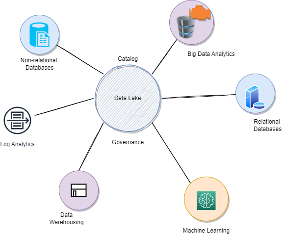

# Data studies

There is perhaps nothing more valuable to an organization than its data. In the age of digital transformation and the empowered customers, organizations must be able to generate real-time insights based on accurate and high-quality data.

## Business cases

* Data as an organizational asset: no more kept in silos or as the property of individual departments
* Data is accessible: access to one who needs it.
* Data is put to work: used in analytics and ML to make better decisions, create efficiencies and drive new innovations.
* A data strategy focused in data lakes addresses scaling the data ingestion, persistence and consumption at the best price-performance ratio, and should address:

    * Non-relational databases
    * Big Data Analytics
    * Relational database
    * Machine learning
    * Data Catalog and Governance
    * Data warehousing
    * Logs analytics

    

* [AWS presentation: Put your data to work with data lake](https://pages.awscloud.com/Put-Your-Data-to-Work-with-the-Best-of-Both-Data-Lakes-and-Purpose-Built-Data-Stores_2021_0925-ABD_OD.html)

## Important concepts

when we talk about **Big Data**, we want to address Data that is stored rapidly from various sources, at massive in size, and is complicated for organizations to secure, analyze, and gain valuable insight from. Big data challenges cannot be solved with traditional database and processing solutions. The big data characteristics: volume, variety, velocity, veracity, and value = **The 5 V**.

The size of data stored by an organization can be from terabytes to petabytes to sometimes even exabytes. Global data creation to grow to 180 zettabytes by 2025.

* Veracity deals with the trustworthiness of the data, and integrity is one of the key factors influencing that trustworthiness. Data integrity is applied in different ways in each phase of the data lifecycle. The data lifecycle includes creation, aggregation, storage, access, sharing, and archiving.

### Data Lake

It is a vehicle for making big data available to AI and analytics. In the 90s, it was implemented using enterprise data warehouses, then mid 2000s Hadoop and ELK stacks was used more as an open data formats and horizontal scaling,
Now in the 2020s  it is supported as cloud based data lake, pay per job, elastic scaling, data in object store, supporting real-time queries.

### Data topology

A *data topology* is an approach for classifying and managing real-world data scenarios. See [separate note](data-topology.md).

### Data gravity

The continual expansion has given rise to the phenomenon known as `data gravity`: the ability of bodies of data to attract applications, services, and other data. **Leverage data where it is**.

#### Requirements and context

* Get data more accessible: data is distributed between apps, data repositories, data centers, in the cloud, at the edges.
* Hybrid cloud deployment introduces complexities, where analytics workload is in dedicated environment instead to close to the data.
* Extensive copying and transfer of data creates the potential challenges for performance, security, governance, quality issues, and operational cost.
* Data lake is a gravity force, it attracts because of the diversity of the data and the size of data set.
* IT spends too much time and effort readying their data for analytics and AI work. Moving massive datasets into analytics clusters is ineffective, expensive, and sometime complex.
* Cloud technology has allowed for massive expansion of data bodies, which has served to increase data gravity rather than diffuses it. New cloud adoption allows scalable processing close to the data.
* Data should be the first job to digital business transformation.
* Product strategies are based on developing new and improved products and services based on data and analytics.
* Organizations have big plans for data, analytics, and AI, and real-time insights: input data is processed within milliseconds so that it is available virtually immediately for use in business and operational processes.
* Preparing data for analytics and AI is challenging:

    * **Latency** (time from which a transaction occurs to the time when the data is available for query) is a major challenge: getting insights where and when they are needed.
    * **Preparation**: Keeping data secure and of high quality: concerns around data transfer and data governance.
    * **Automation**: Still a lot of manual steps when integrating data for analytics and AI: difficulty integrating data from multiple sources is the number one technical challenge.
    * Ethical and regulatory issues keep them from deploying AI models into production.

#### Recommendations

* Analytics and insights are best done where the data lies: Example is to implement real-time analytics in data streams.
* Hybrid cloud initiatives require a data gravity strategy.
* With data gravity strategy, you minimize data movement and remote processing, so reducing the security risk.
* Data gravity has to be taken into account any time the data needs to be migrated.
* Consider data virtualization technology.
* Push AI/ML scoring to the transactional processing platform. Leveraging ML algorithms and models at source systems can help with aggregation, summarization, integration, and transformation for data to support quicker analysis.

Data topology is a good methodology to identify data sources and semantics, consumers and producers of the data. It does not directly enforces Data Gravity.

#### Sources

* [Forester paper on data gravity](https://www.ibm.com/downloads/cas/ZEOENRB1)
* [Talend: Data Gravity: What it Means for Your Data](https://www.talend.com/resources/what-is-data-gravity/)

### Data Mesh

Data mesh is an architecture style based on 4 principles:

* Domain-oriented **decentralization of data ownership** and architecture.
* Domain-oriented **data served as a product**.
* Self-serve data infrastructure as a platform to enable autonomous, domain-oriented data teams.
* Federated governance to enable ecosystems and interoperability.

The implementation of this architecture style is using tools but also demands organizational restructure, by adding a data product role for each domain with the goal to own and share their analytical data as products.

This is a paradigm shift from data lake, data warehouse with BI. The 3nd generation of data platforms is based on the Kappa architecture pattern, using real-time data processing, leveraging cloud based storage like S3 or COS. For enterprise with rich domains, a lot of sources and consumers, centralized data platform leads to adoption and usage failures.

So consider how big is the domain, and how is the growth of data sources within the bounded context. Ingest and store data in one place, inhibit easy addition of new data source.
Big data platform inhibits the test and learn innovation cycle. But siloed domain oriented data is not the solution neither. With the `ingest-process-serve` way of organizing data pipeline some architectures are based on team capacity and skill.

The data team has no business knowledge of the source team and the consumers team. They process feature requests after requests.

Data mesh proposes to address those issues by converging the four principles started in the DDD. 

As of now the closest application of DDD in data platform architecture is for source operational systems to emit their 'business domain events' and for monolithic data platform to ingest them.

In fact we should do better and adopt the following:

* Domains need to host and serve their domain datasets in an easily consumable way. Content and Ownership stays within the domain generating them. This implies that we may duplicate data in different domains as we transform them into a shape that is suitable for that particular domain.
* Shift from ETL push and ingest model to `event streams` of serving and pull model.
* The architecture quantum is the domain and not the pipeline stage.
* The source domain datasets represent the facts and reality of the business: "account Opened", "user click streams" are facts, which are considered as `truths of the business domains`.
* Domain events are stored and served in append logs with time-stamped immutable records.
* Source data domains should also provides business aggregates, easy to consume: "account opened per month" for example is in the account domain.
* New data domains can be created by joining and correlating data from other domains.
* Physical system datasets are different and separated from the domain datasets. Domain datasets are larger in volume, records are timed, and change less frequently than source system.
* Some domains align closely with the consumption. They have different nature than the source ones: they transform the source domain events to aggregate views and structures that fit a particular access model.
* Data pipeline, cleansing, preparing, aggregating and serving data remains needed, but they stay within the domain.
* To address accessibility, usability and harmonization of the distributed dataset, a `product thinking` approach is important, (same approach as API product). The data assets is a product and the data scientists and data engineers are the customers.

* To be discoverable we need a data catalog with metadata such as ownership, source of origin, structure, samples,... so each data product needs to register to the catalog.
* Addressable with a unique address per storage formats.
* Provides a service level objective around data truthfulness. Providing data provenance and data lineage as the metadata associated with each data product helps consumers gain further confidence in the data product.
* Inter-operable: The key for an effective correlation of data across domains is following certain standards and harmonization rules.
* Secure access to datasets is applied at the time of access to each data product
* Common data infrastructure as a self serving platform is needed combined with global governance to ensure interoperability.

#### Sources

 * [How to Move Beyond a Monolithic Data Lake to a Distributed Data Mesh](https://martinfowler.com/articles/data-monolith-to-mesh.html)
 * [The Data Dichotomy: Rethinking the Way We Treat Data and Services](https://www.confluent.io/blog/data-dichotomy-rethinking-the-way-we-treat-data-and-services)