# Scythe Strategy and references

Two possible strategies:

1. **Race to finish** the game as early as possible: between 14 to 17 rounds, so with less coins. Attention it depends of the faction and mech combination.
1. **Stale the game** to accumulate maximum of points: racing player has a point ceiling, so try to get a lot of points before racing player so they cannot catch up. This is high 50 coins. Get lot of coin generation actions, have a lot of territories, get in tier two popularty early. 18 to 22 turns.

## Setup study

- Once players get their faction: assess how to get resources and how to get out of the isolated area quickly. Build mine and use them to connect to or Deploy Mech with riverwalk or other moving capability.
- Assess how to get quick 5 workers then think for 8 workers. Remember that multiple workers in a village gives more workers quicker.
- Assess how to quickly being able to play top and bottom actions in the same turn. Move and Produces are the top two actions at the beginning of the game so try to have the resources to do the bottom action.
- Where is the closed encounter token
- Plan for the stars, and focus on the first 3 for driving the gameplay at the begining:
    - **Worker star** to get resources too. 5 workers is the recommended strategy to avoid cost. But one more turn to get 8 and a star is very good. It also helps to get more territories.
    - **Enlist star** to get revenu from other, specially at 3+ players. Saxony has issue to get enlist. 
    - **Combat star:** can get 2 stars by moving in one turn.
    - **Mech star:** for combat, to expand in other territories
    - **Objective**: some objectives are trap so better to do not focus on it. most of them will come later an can be in a turn with combat
    - **Power star**: good if you have patriot or mechanical boards
    - **Building star**: difficult to setup: need worker in place, resources and build action. Average is two actions per building to get the star.
    - **Upgrade**

## Playing

- Workers with Mech are helpful to protect against attack
- Do not keep resource alone

## Factions

### Albion

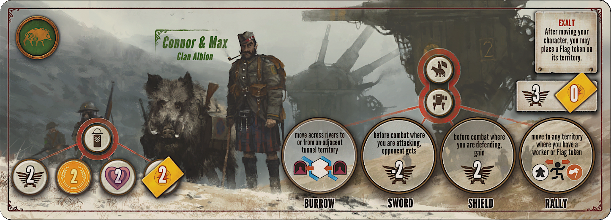

### Crimea 

The Crimea faction has a flexible and aggressive playstyle that revolves around two key faction abilities:

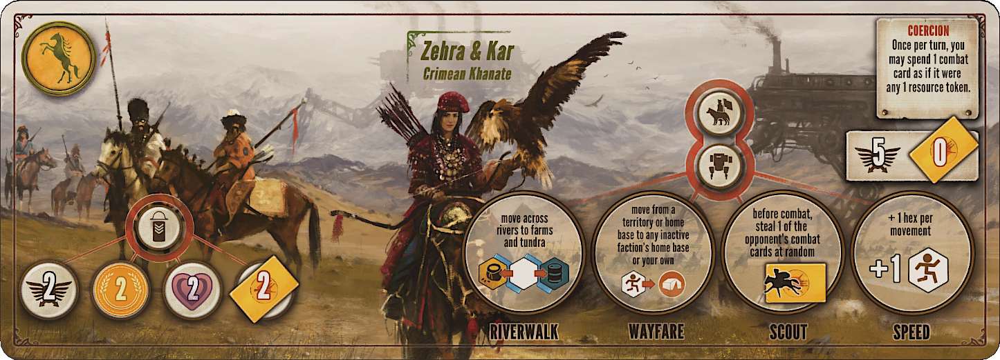

1.  **Coercion**: Once per turn, you can spend a combat card as if it were any single resource. This provides incredible flexibility, allowing you to make up for missing resources and accelerate your actions.
2.  **Wayfare** (Mech Ability): Your character and mechs can move from a territory you control to any inactive faction's home base. This grants exceptional mobility for late-game territory grabs.

**Early Game: Build Your Engine**

Your main goal is to get your combat card engine running.

* **First Enlist:** Your first enlist action should be for the combat card bonus. This gives you an immediate two cards and a steady income of them as opponents take Enlist actions.
* **Workers:** Produce workers early to gather resources for enlists and mechs.
* **First Mech:** Prioritize deploying your first mech, usually with the **Scout** ability (steal a combat card before combat), to establish a strong defense.

**Mid Game: Aggressive Expansion**

With a steady flow of combat cards (which double as resources for you), try to expand.
* **Control Territory:** Use your mechs, enhanced by **Riverwalk** and **Speed** abilities, to claim territory and resources. Don't be afraid to be aggressive.
* **Bottom-Row Actions:** Leverage **Coercion** to afford and complete bottom-row actions like deploying mechs and building structures to earn stars.
* **Combat Readiness:** Maintain a large hand of combat cards. This makes you a fearsome opponent and fuels your economy.

**Late Game: Secure Victory**

Focus on maximizing your score and ending the game on your terms.
* **Stars:** Secure your final stars from objectives, combat, or maxing out power/popularity.
* **Territory Grab:** Use the **Wayfare** mech ability for surprise, last-minute moves to grab valuable territories, including an opponent's empty home base.
* **Popularity:** In the final turns, be mindful of your popularity tier, as it significantly multiplies your score from territories and resources.

### Fenris

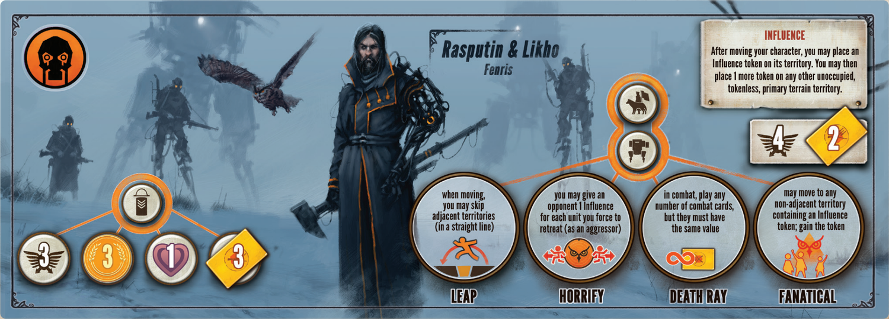

### Nordic

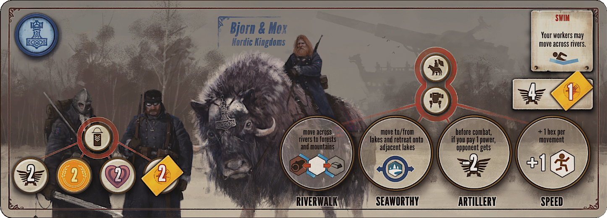

### Polonia

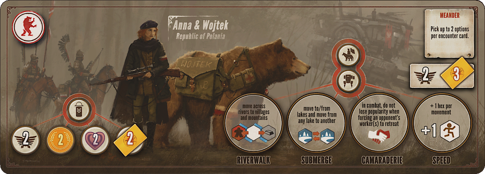   

### Rusviet

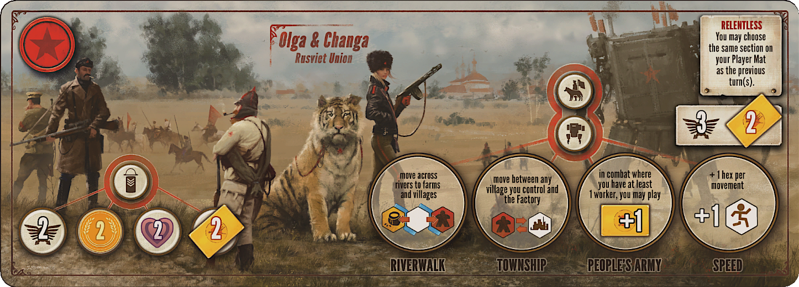

### Saxony

* difficult to get enlist, focus on combat star

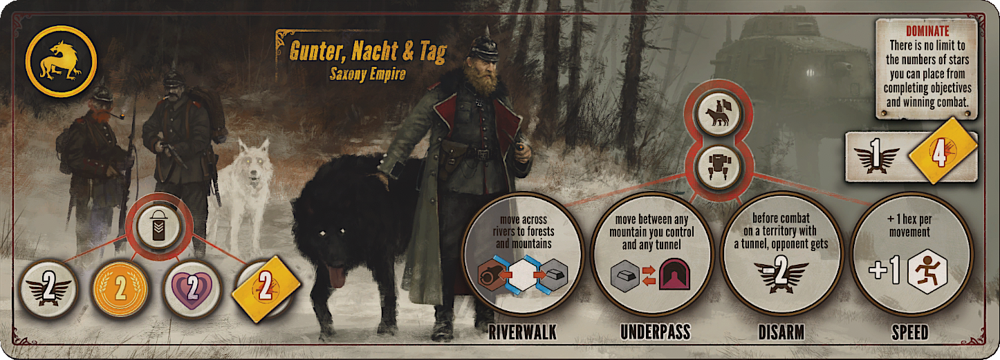

### Togawa

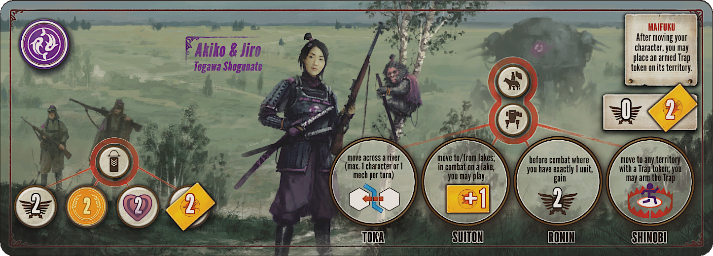

### Vesna

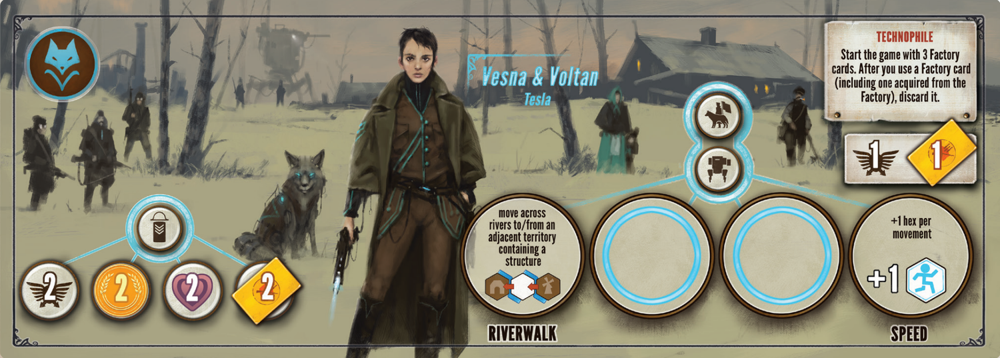

## Player boards / economies 

### Agricultural

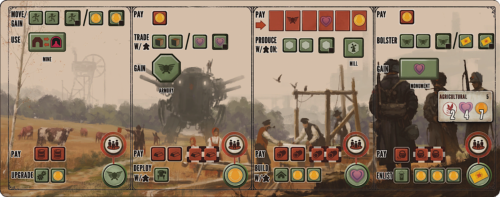

* Bolster + Enlist is very poweful

### Engineering

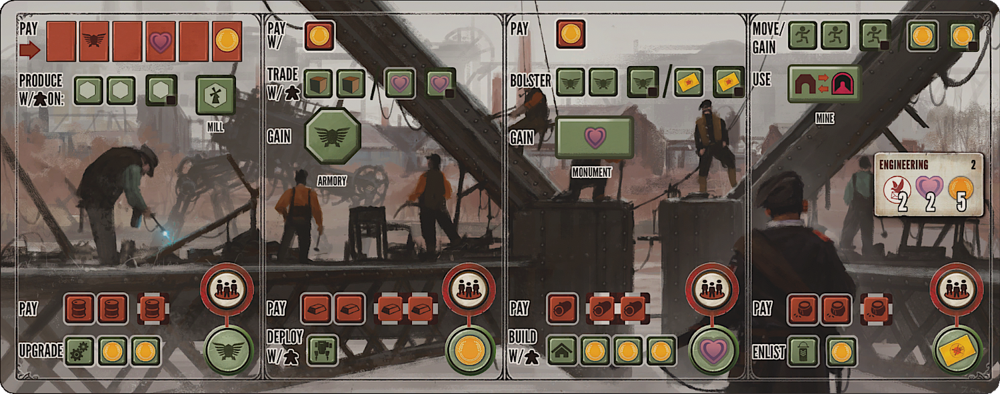

### Industrial

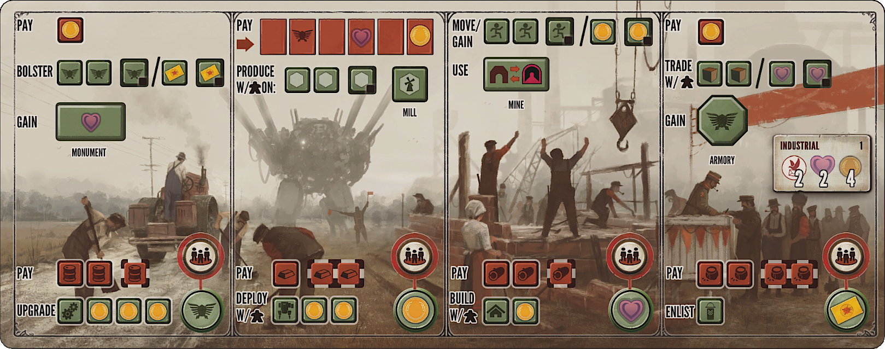

* Good to rush the game

### Innovative

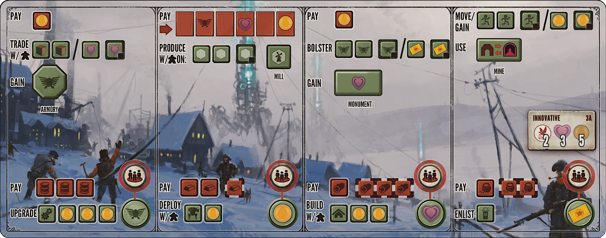

### Mechanical

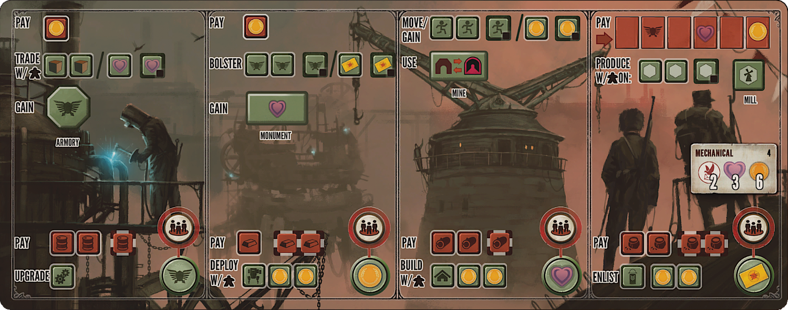

* Bloster and Deploy too.

### Militant

This is a more aggressive playstyle with Mesh, Move and Combat.

* The top-row "Move" action is paired with the bottom-row "Deploy" action is a very strong combination to establish presence on the board.
* Because of Mech early-game production of metal is crucial

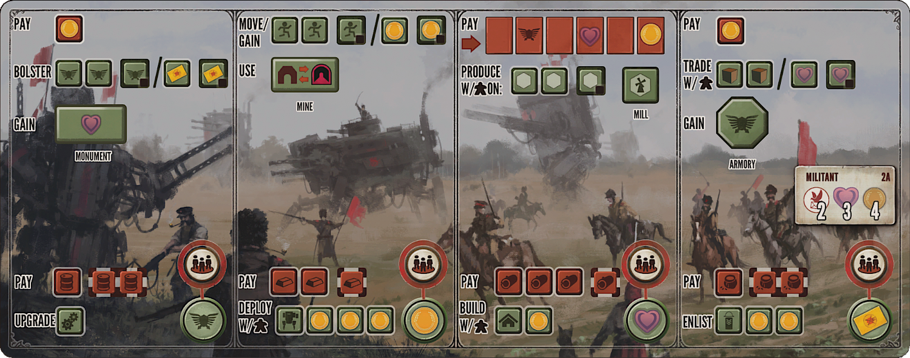

* The "Bolster" action is paired with the "Enlist" action to prepare for combat and get resources from others.

* Stars order may be: Mech, Combat, Workers, Enlist

Combine well with **Saxony** because of the ability to win extra combats.  **Albion's** ability to place flags to control territory works well with the Militant's efficient movement and deployment.  **Togawa's** tunnels allow for stealthy movement, which, when combined with the Militant board, can make them difficult to track as they deploy Mechs and pop up where least expected.

### Patriotic

* Bloster and Deploy lead to consider power, combat and mech stars

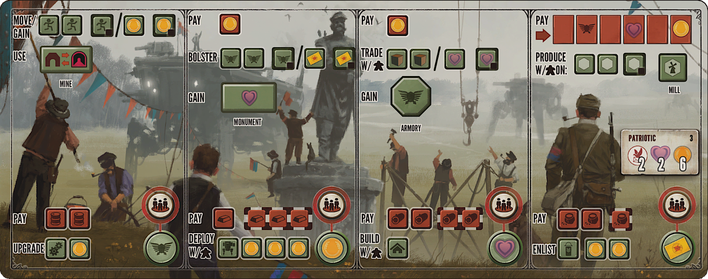

