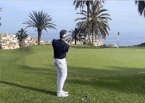
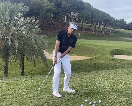
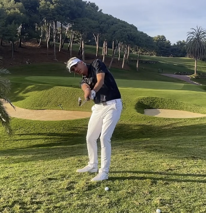

# Renaud Poupard - coursdegolf.net

## "Inertia club" training

The swing mechanics includes 5 dimensions:

1. Dynamic oft of the club
1. Club path
1. Attack angle
1. Contact spot
1. Speed

9 trajectories: start straight, right, left, then ball stays straight, go to the right or left.

There is only one straight fly: a club path at 0 and club face at 90 degres. most of the balls goes on right and left, with different intensity, finishing at 1m of the target to 30 m. So we have only 2 types of trajectory.

The problem is that if we try to search to get the ball straight, which does not realisticly exist, then we will not be able to make it and we will not control the ball fly. We could not play straight ball.

The ball initiates its fly from the club face. Radar technologies demonstrated that the club square to the target did not brings the ball to the target.

The natural trajectory is the one to keep. Make trajectory that comes to the target.

- a slicer makes the ball flies to the right. a slice arriving to the target is a FADE.
- a hooker makes the ball flying to the left. A hook arriving at the target is a DRAW.

Club in the hands can help to make the ball flying where we want. Alignment too. Grip too.  Lie of the club face.

A pro player approximates to the left or right. never straight. Theit path is constant

### Training

* Back to the fundamentals: static with grip, alignment, position, stance, balance
* Dynamic: RRRE: relancher, rotation, Rythm, Equilibre
* Work on feelings, when feeling is good then technics will be, not the opposite: light in hands, no tension, equilibre.
* Avoid to work too much on technics, and no more than working on one technic per training
* Not try to get the best shot each time. Not hit too much on the ball. 70% of power. Try to get it correct. Slower = more centred balls.
* Golf score is about avoiding worse shots, but not best one.
* Get a training plan. Do not work on what was done in pervious shot. Focus on one thing. Plan in advance.

### 1. Learn the swing momentum

* The body weight helps to create momentum. The swing of the club. Set the image to push a child in a swing.
* In this club swing, the hands finish vertical and the club face is vertical.

    { width=500 }

* Clinic to work on momentum: close to the green, do shipping, with just momentum created by body rotation. No tension in arms, hands, feel the "balancier" and **inertia** after the ball stroke.
* With a pitch, work on the counterweight to the club with the body. A party of the body, the left, go to the target, while the club is on the back swing: the body acts as a counterweight. Loose backswing.

    { width=500 }

* Do not accept bad sensation.
* **Shallow swing** exercise: send the club shallow, flat. The left shoulder falls under the shin, the head of club pass under the ball. Imagine to send the ball as a ricochet. 
* Build the snail image (head of the club designing a snail): short low backswing, being confortable, most important is to get the club inertia, extended arms, vertical club at 180 and finish on balance. The term is **under swing**.
* Let the gravity play, on the descent the club fall with gravity, the right shoulder goes down with the club too.

    

* The club is hitting the ball in descent, not the human, the lowest point is in front of sternum. Even when hands are on left leg, the club head will still be at the bottom of the arc. 
* To get longer distance, we need to build a bigger circle: so go farther and lower on backswing, ease the arms, to get them extended at the impact, and be taller.

### Module 1

* intertia / "balancier": counterweight with the body at backswing and then on finish.
* finish in auto-pilot: in balance, club face vertical. shoulder face to target. 
* The swing is with the hips. The rotation of the hips, the shoulders drag the club. Exercise to ship by pulling the club and the ball.
* Look in front to the horizon, to set the body and squeleton in good position at address. Can even do dry swing while looking at the horizon.

#### Shipping

* keep body straight, club crossing the grass.
* use inertia and momentum
* target 3 meters after the green entrance, for the ball to land
* adapt the golf club according to the distance of the roll on the green to the flag.
* Also shipping by looking to the target is a good exercise for sensation and dosage

<iframe width="560" height="315" src="https://www.youtube.com/watch?v=aCicXNhY13U" title="YouTube video player" frameborder="0" allow="accelerometer; autoplay; clipboard-write; encrypted-media; gyroscope; picture-in-picture" allowfullscreen></iframe>

* Balance at the end of the swing, is very important (see the Relachement Rotation Rythm Equilibre principles from Leadbetter) and starts at the address.  
* Grip not in life line, be more in diagonal in the palm of the hand

### Module 2

* Shallow practice for better ball contact
* Open club face, like in bunker, to have higher ball, but same swing and club face vertical when body is facing the target
* In case of socket, may be put the ball 2 cm farther. The club hits closer to the shaft. 
* Use counterweight and 7 second in the finish.

<iframe width="560" height="315" src="https://youtu.be/nSWVi7koMrI?si=YV_az4iupgfai2Nb" title="YouTube video player" frameborder="0" allow="accelerometer; autoplay; clipboard-write; encrypted-media; gyroscope; picture-in-picture" allowfullscreen></iframe>

* Top came because of holding the club at impact, do dry swing to feel the inertia.
* The left arm is straight on back swing but not thighten, no tension, inertie brings the arm straight.  

### Module 3: Long iron and draw

<iframe width="560" height="315" src="https://www.youtube.com/watch?v=HuACA3Gjqrw" title="YouTube video player" frameborder="0" allow="accelerometer; autoplay; clipboard-write; encrypted-media; gyroscope; picture-in-picture" allowfullscreen></iframe>

### Module 4

Create space between club and body on back swing. 

**Topping** the ball is coming from a hand twist at impact or a small body movement upward. 
To avoid top or thin ball, use the under swing image, by dropping the club with gravity, keep the right shoulder low. Gather the ball.

### Module 5: Wood and driver

* Be lightly on the left, left shoulder and right hip pointing higher in the sky.
* Use shallow swing to arrive flat and from bottom to up
* Keep club low when starting backswing
* To find the fluid transition and best inertia, without any pression in the hands: Double finishes swing to feel the inertia of the club: to improve rotation, let the gravity play.
* Start by doing short swing with driver, like it is an approach. To learn to get lower.
* Speed comes from the swing arc.
* Work on finish in pure balance.

## Course management

Do not think the next shot will be your best, so add one or more club as most likley you will be shorter.
Smooth take away is the most important (Leadbetter, Laura Davies,..) thing in the golf swing. Smooth means we start by moving the body, quick it means we move the hands and arms before. Routine to work on the trajectory with 8 iron and higher: one straight, one fade, one draw, one high (move ball forward in stance), one low (ball at the beginning of the stance, keep hands low after impact).
Follow the feet direction for the take away.

## Structural training

### Core principles

* We could not be in confidence on shots we do not master: need to train in all golf shots. When not in confidence we are back to the swing mechanic and not playing golf.
* Improve the swing, increase the good shots. To improve score we need to remove bad shots, which is not just the swing improvement. (1 lost ball = 2 shots, 1 top = 1 shot lost, 3 puts = 1 shot lost)
* Learn how to play with our current swing technic. **Holistic Training**

### The training

The most common training is taking a bucket of 40 balls, hit around 30 with 7 iron, few with driver and then 3 with wedge. So 3 shots on 4 balls. The structural training is focusing on the shot type. Use 36 balls around, 6 balls for 6 exercises, focusing on trajectory. The goal is to work on all part of the game. Privilege the ball contact.

Warm by relaxing the back spine, the back and arms, using breath.

1. 5 - 6 meters from the green. 6 balls for 6 different flight: immediate green entrance, 2 meters, close to the pin (higher flight). x2. Use pitching wedge.

    * short fly - long roll: body weight on left foot. ball more right foot - closed club face. Light arm to get better contact. Interior to exterior club trajectory. Position feet like for a draw.
    * higher fly: open club face, ball in front of sternum, open to the left feet position like for a slice.

1. Divot exercise: Sand wedge - goal is ball contact. no divot, small one, bigger one. 40 meters to the flag.

    * no divot: club hits ball at the lower point of the swing arc: ball in front of sternum, shoulder parallel to the ground
    * small divot - grass only: ball on right of sternum - left shoulder on the left - weight on left. all moderate.
    * bigger divot - with dirt : ball more on right, more weight on left.

1. Short game with iron 7 - on tee. Same trajectory for 6 shots. Not full swing. short stance. Focus on ball impact and relaxation.  goal: is rescue shot the 70+ meter or get out of a under tree... work on the routine with 1 minute per ball, always use a "coup d'essai".
1. Longer than previous ball: play on different factors:  club speed, swing length, club face. Use smaller stance, ball on right foot. Focus on follow through.  
1. Driver contact: one ball with right arm get the feeling. second ball with 2 hands on the same feeling. No focus on distance and trajectory.
1. Putt: distance control: balls arrive at a club distance of the gree border. Focus on dosage.

### Other sources

* [Paul Runyan: the shortest way to lower the score.](https://www.youtube.com/watch?v=dF6yq1cFuzs)
