# Lessons analysis

## Training session plan

* 20 balls wedge warm up - line on the ground - goal is to make contact - 30, 50 and 70 yards. Work way up to full swing.
* 30 balls: mechanicals: back to the feeling with 9 iron.
* 25 balls: Skill work on ball fligh control. Games with a score. 
* 25 balls: Game like strikes: Driver, club, pitch.

Routine: Target -> Two swings -> Feels -> Visualize the shot -> take immediate target -> breeze -> line up -> view target - ball x2 -> swing

* Try to train a lot on: Wedges, Driver, Putter.

### Prepare before a 18 holes cource

* Warm slowly but cover all game plays
* Divide by segments

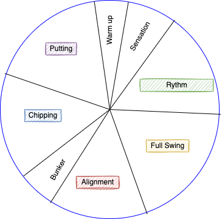

* **Warm-up**: all muscles - stretch - 1 minutes
* **Sensation**: 10 to 15 balls - Half swing - SandWedge or Approach Wedge - Use head weight - feeling.
* **Rythm**: 30 balls max Wedge - full swing with alignment and preparation - view the shot before doing it.
* **Full Sing**: 20 balls - iron 7 or 6 - 2 clubs on the ground for alignment - use the routine.
* **Alignment**: 10 balls - wood and driver - focus on rythm - finish with half swing on wedge.
* **Chipping**: 15 minutes - 10 shots with different clubs: S, P, 8. -> put 9 balls in 3m circle. Think landing zone and adapt with club and swing height.
* **Putting**: 5 minutes - sensation and speed. 

## Full Swing

### 2021 8/11: Full swing analysis

* need to get shoulder tilt at 8% right
* hand too high at the beginning of back swing, hips do not start to turn.
* swing started by hand not hip turn
* Zach has the hand lower.

* He keeps them lower at the end of the back swing and not going that far.

<iframe width="560" height="315" src="https://www.youtube.com/embed/2odG0NPBh_Y" title="YouTube video player" frameborder="0" allow="accelerometer; autoplay; clipboard-write; encrypted-media; gyroscope; picture-in-picture" allowfullscreen></iframe>

<iframe width="884" height="499" src="https://www.youtube.com/embed/2bJMJeH6hN4?t=33" title="SwingVision: Zach Johnson's Round 3 Tee-Shot" frameborder="0" allow="accelerometer; autoplay; clipboard-write; encrypted-media; gyroscope; picture-in-picture" allowfullscreen></iframe>

* I go way too far on back swing

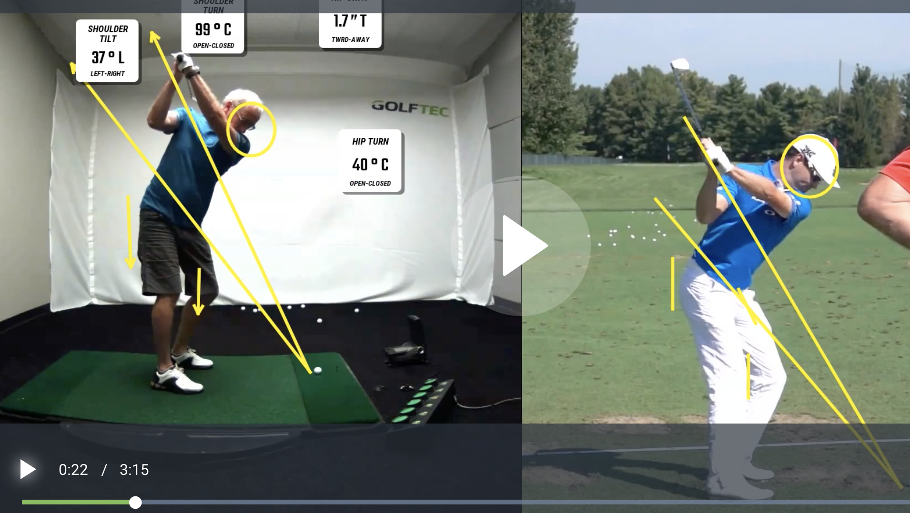

* Shoulders tilt is good, down enought.
* Shoulders turn is over exagerating at 95/99 degrees
* Hip turn should be 44 and not 37 degrees

* Front view, the hands needs to be lightly moved on the left.

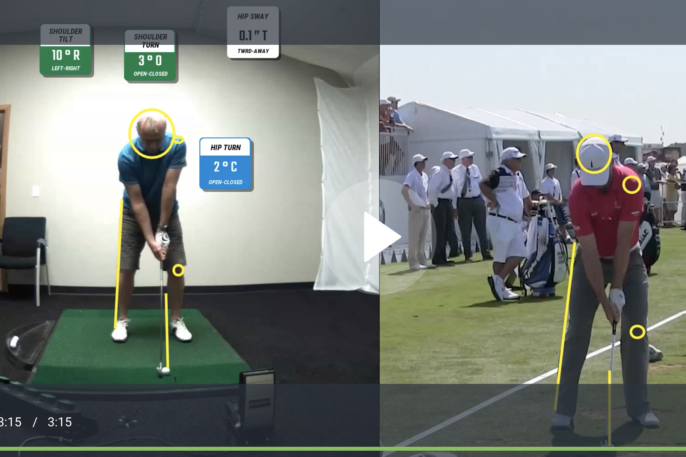

* At position 2, hands by the belt buckle, club horizontal // to the ground

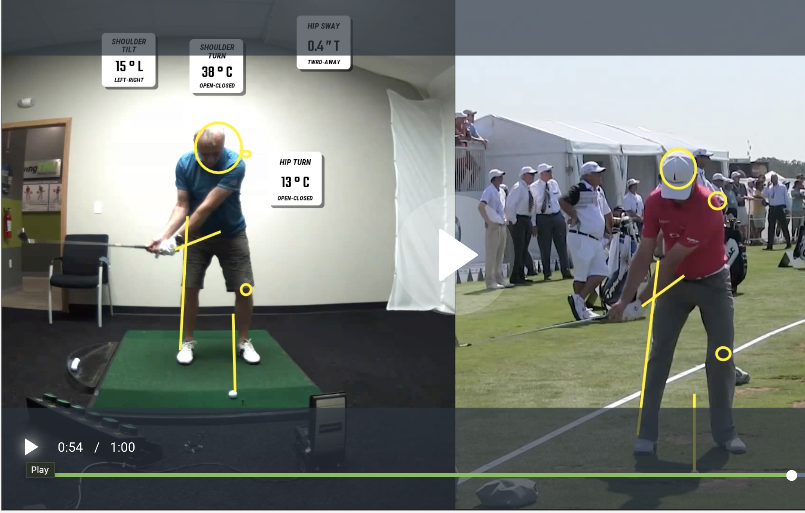

* At position 3: Club should point vertically, arm straight, // to the ground

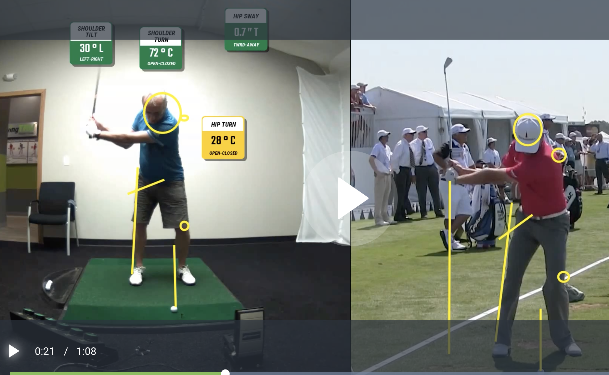

 > we can see also the left part of the body did not move. It has to move forward to help turning the hips  

* Head starts to move out of the position to the right. Avoid head movement.
* Shoulders turn supposed to be at 77, here 72 is good, and tilt should be 35. 30 is still good.

* Position 4: Zach starts hip sway on the left, going to the target. His head does not move at all.
* My arms bend, arms should not be used

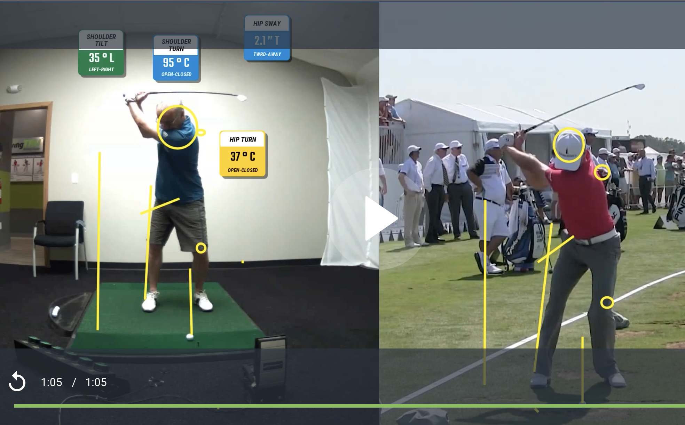

 > arms just hold the club.

* Too much back swing, left knee blocked.

* when going way down, hit sway should be around 3 toward and not 5.1
* Zach has a longer distance hand to belt buckler because he started to move his hips to target before his back swing

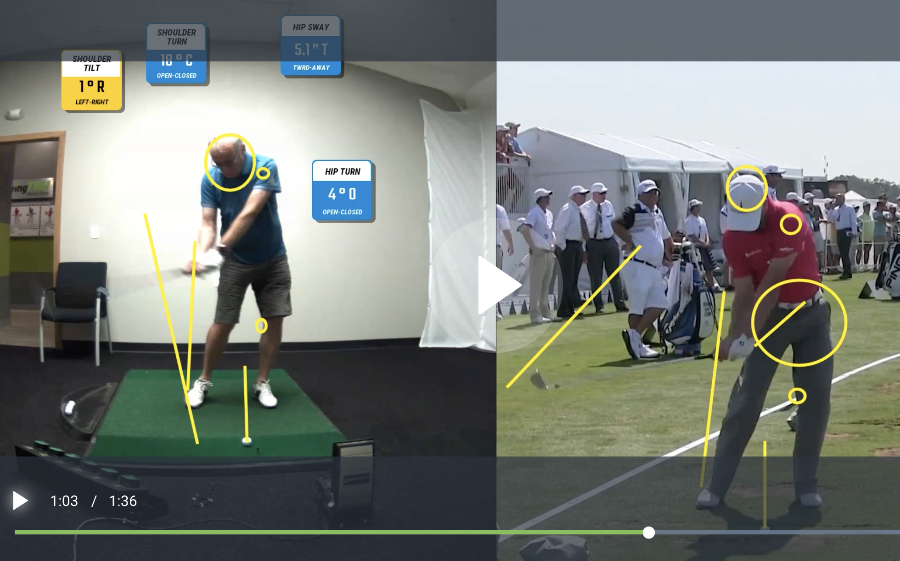

* At impact the golf arms do a triangle with arm extension. my right arm has a light flex

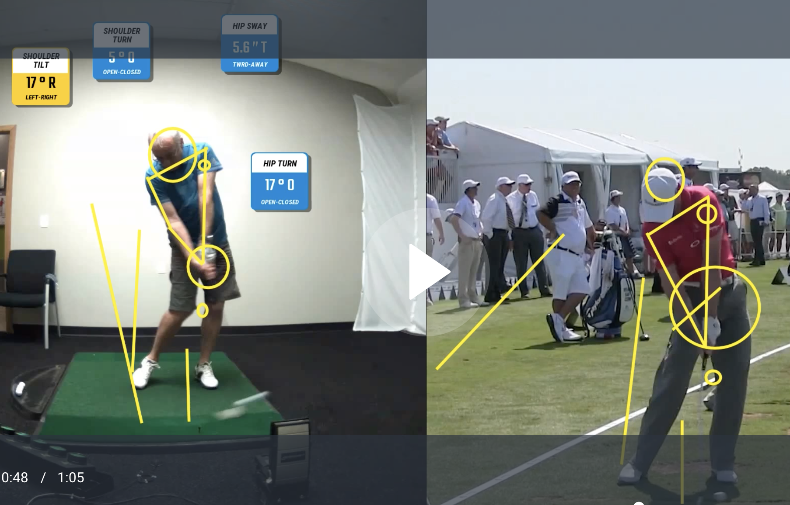

But the hand are wrong as the right hand is going over the left (flipped) to compensate a pulling and turning effect. Right hand plam should be parallel to the club face.

* Finally extension of the arms and lower right shoulder.

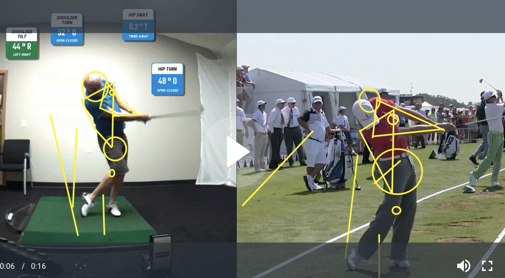

#### Actions to improve

* Fligh pattern observed: push slices.
* Resolution: keep weight on the left side
* Left quad pushes left knee over the left foot, at the same time the left shoulder should go down to the ground as well. Feel the hands go behind you as you take the club back.

#### Drills

* Problem: hit the groud after the ball. This may come from the hip sway on the left,
so us the [KNEE FLEX FOR HIP SWAY EXERCISE](https://clubhouse.golftec.com/weblesson/1027285152): 
flex left knee to the left toes to avoid the hip to move laterally. you will stay
more over the ball.

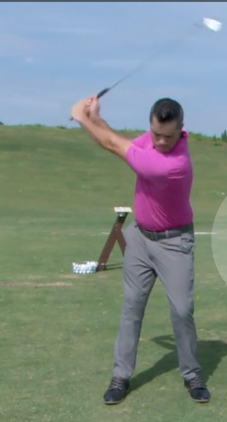

* Problem: swing plane. most golfer are moving the hands high too quickly or too far from the hip as soon as they start doing a backswing and then drag the golf club back
leading to inconsistency. 

Use the [HAND PATH EXERCISE WITH HULA HOOP](https://clubhouse.golftec.com/weblesson/1027285152): hands are tracing the hula loop circle.

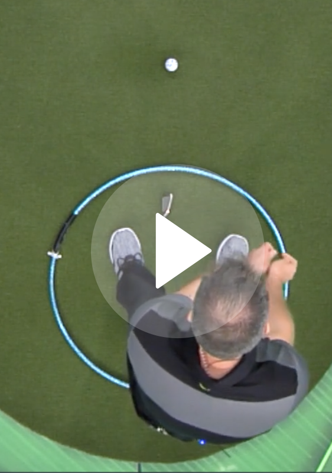

### 2021 8/24

* Back swing going too far. Once shoulder have turned, arms continue.
* Arms are taking over the shoulders
* Hands go too high. 
* Left elbow too far from the rips: train with a towel under the arm to learn to keep
arms compact and not moving hands too high.

* Head moving back to the left, shoulders too flat.

* Fix the elbow, (left photo) closer now to the rips, which improves the shoulder tilt to 33d. Target could be 37d.

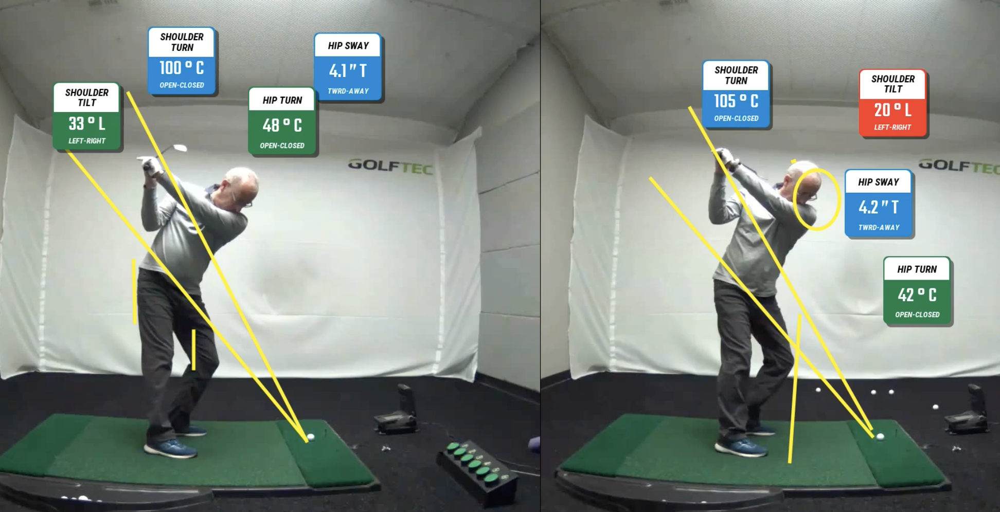

* Shoulder turn is over exagerated (blue)
* Shoulder bend is at 4d 
* Zach is showing a more compact upper body.

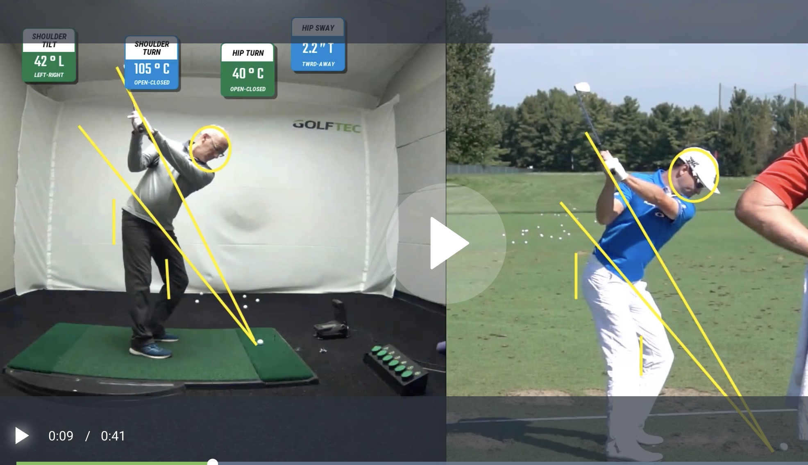

#### Drills: 

To avoid moving the arms too high, place tees or towels under both arm pits and swing
> left knee over left foot. left shoulder goes down to the ground. feel you hands go behind you as you take the club back.

### 2021 12/14

* Back swing is better now:

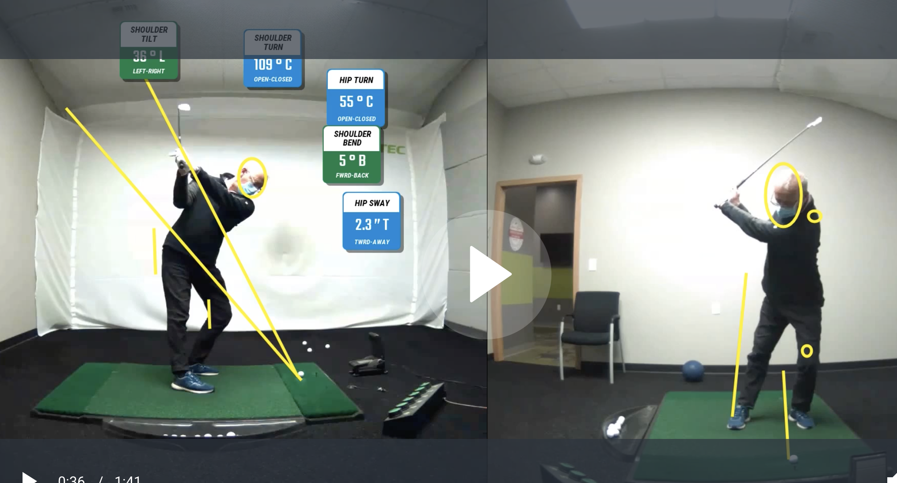

* Down swing, club is coming from outside and hands finish inside

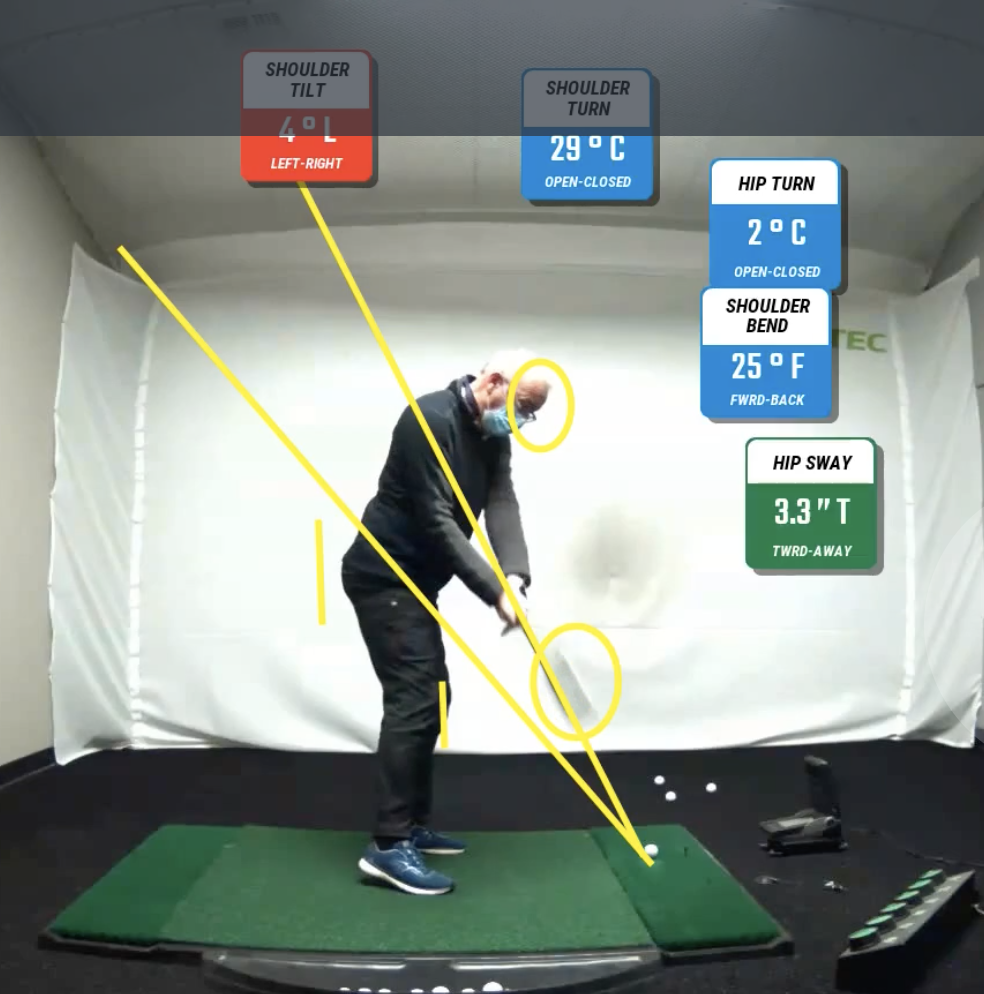

* When hitting the ball hands are inside.

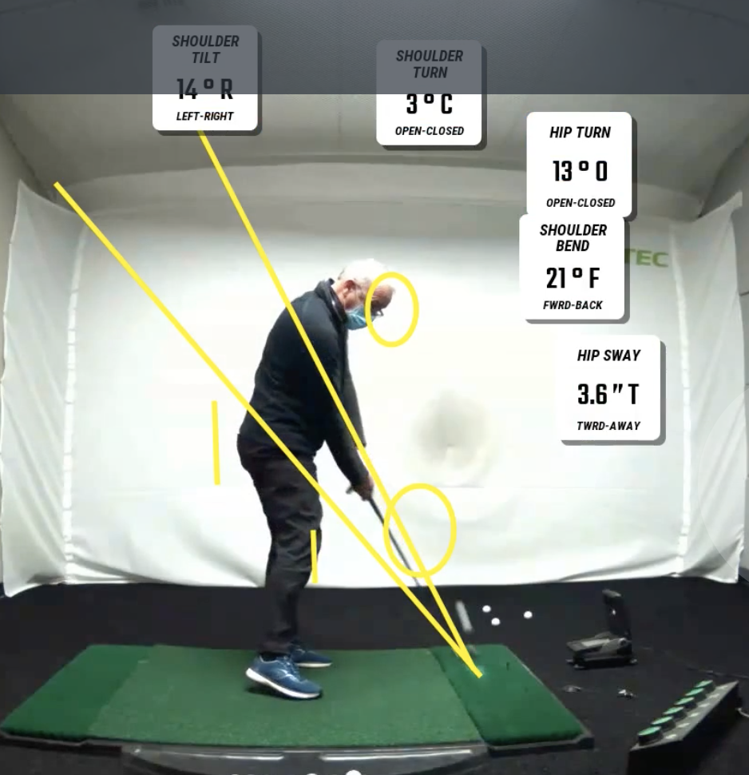

* Improve by getting right should lower (at 30d) and extending arms:

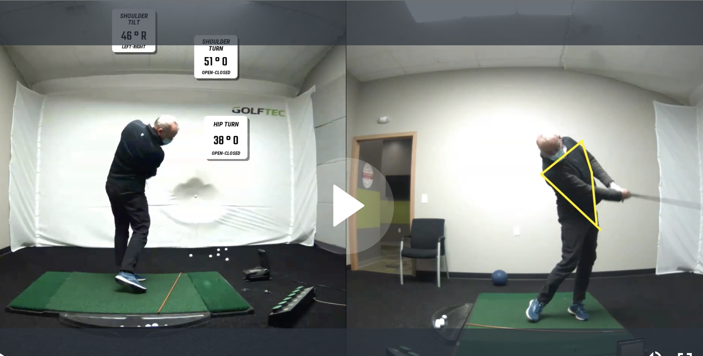

#### Drills: 

* Shoulder tilt exercise: tilt to the right on the followthrough. Pros have their
shoulders tilted on average at 49d. Use the image of water dripping from right ear.

> On followthrough the right shoulder should go down to the ground. Then swing more from the inside and swing out rightward.

### Other full swing videos from practices

* Practice 09/02-2022 - bad swings: after 2 weeks of hitting thin, topping, with bad draws, let tape what's going on...

<iframe width="560" height="315" src="https://www.youtube.com/embed/j5-MuY8aILk" title="YouTube video player" frameborder="0" allow="accelerometer; autoplay; clipboard-write; encrypted-media; gyroscope; picture-in-picture" allowfullscreen></iframe>

* Better swings: still need to work on arms extension at and after impact, be sure to start by the belt buckler.

<iframe width="560" height="315" src="https://www.youtube.com/embed/Gl-CwCUwJus" title="YouTube video player" frameborder="0" allow="accelerometer; autoplay; clipboard-write; encrypted-media; gyroscope; picture-in-picture" allowfullscreen></iframe>

## Pitching

From [Pete Cowen's article](https://golftoday.co.uk/proshop-features-2014-pitching-lesson-html/) core principles:

* Working down, up and around to the finish, the rotation of the left shoulder effectively governs the movement of the arms, hands and clubhead
* The momentum of the pitch is controlled by the turning motion of the upper body
* The continuous turning of the left shoulder makes for a natural release of the left side and enables you to control arms and club

### Drill #1

* Comfortable set-up, the feet fairly close together, left toe turned out slightly, and weight just favouring the left side.
* Take the right hand off the grip and place it on the left shoulder. Get the sensation of left side control. Hold on the grip, while placing the right hand on the left shoulder simply raises the awareness of that area of the upper body.

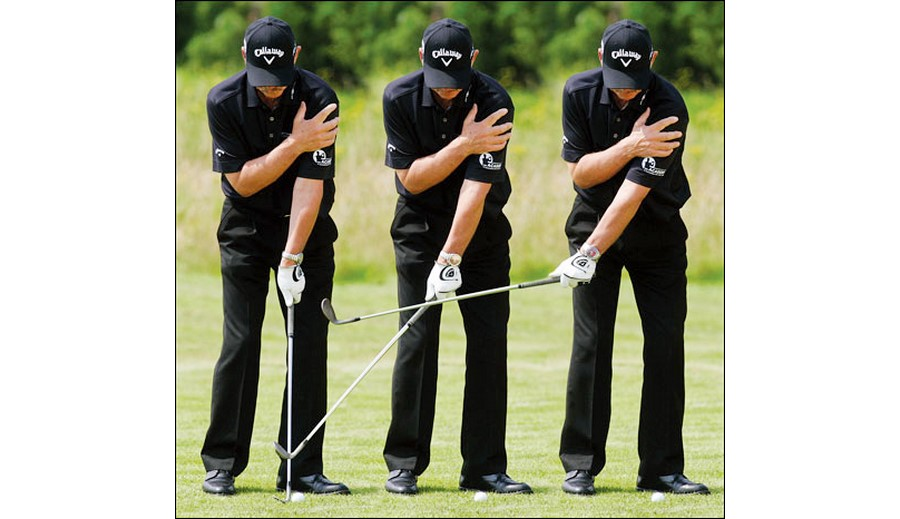

* Make a simple swing, and focus being on controlling the motion with the turning of the left shoulder 
* Feel that the right hand pulls the left shoulder down and around into the backswing, setting off a chain reaction as the arms and hands respond, the left wrist cocking gently in response to the weight of the clubhead.

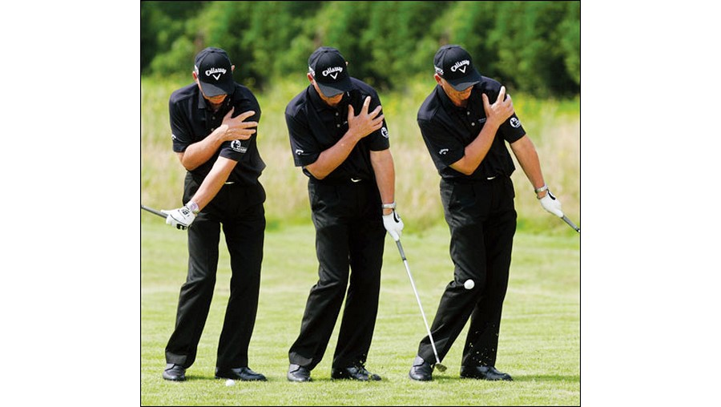

* Feel the upper body paces the return journey, the left arm/hand following this momentum, the left wrist uncocking naturally and the clubhead collecting the ball in the process. There is no manipulation whatsoever in the strike. It is neutral as the left arm and body work in unison. 
* The shaft is seen to be leaning toward the target at impact.

**The key here is that you feel and mobilise the muscles within the left shoulder to control the movement of the arms and, ultimately the club**

### Ball fly

* For a **lower ball**, move the ball back a fraction, lean the clubshaft gently toward the target (delofting the face) and build your stance accordingly. 
* The swing follows pattern above, weight just favouring the left side throughout, and the low shot is always characterised by a fairly low finish.

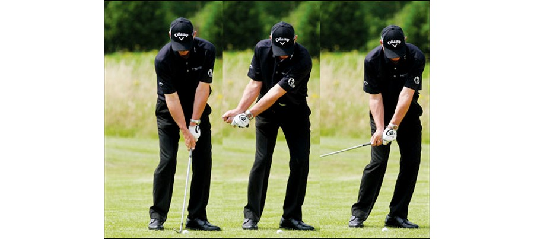

* (L) Hands gently ahead of the ball, leaning the shaft angle toward the target.
* (C) Left shoulder works down, left arm swings across the chest to create controlled backswing, hands relatively passive.
* (R) Weight rotates into the left side as the upper body controls the delivery of the arms and club.

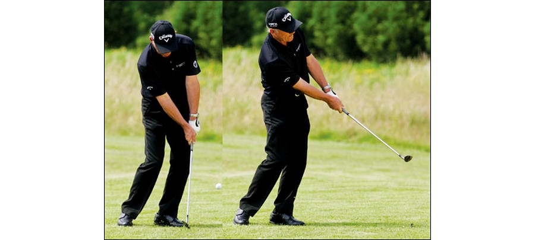

* For **higher ball**, play the ball a little further forward in the stance, lean the shaft away from the target a little

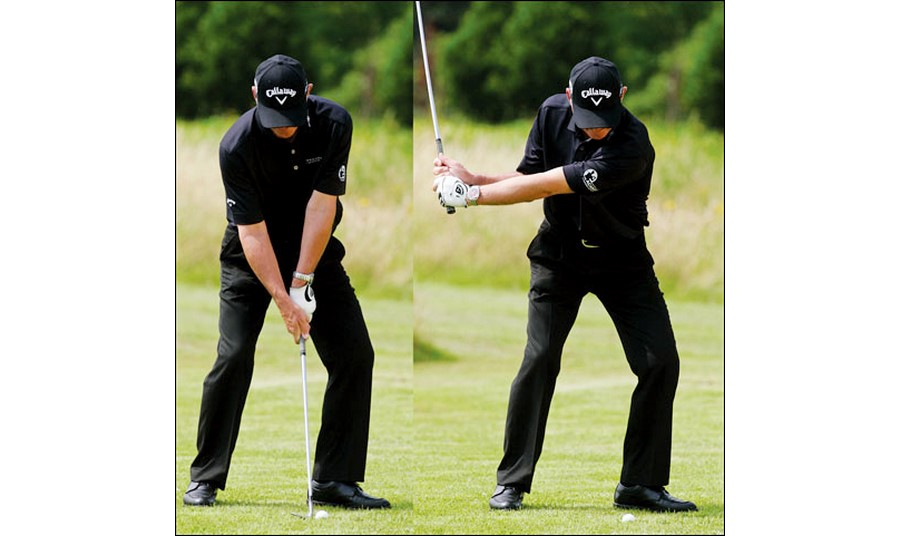

* (L) Hands slightly behind the ball, leaning the shaft gently away from the target 
* (R) Wrists this time encouraged to hinge in order to maximise the loft on the clubface

A higher, floating shot requires more clubhead speed, so extend the length of the swing.

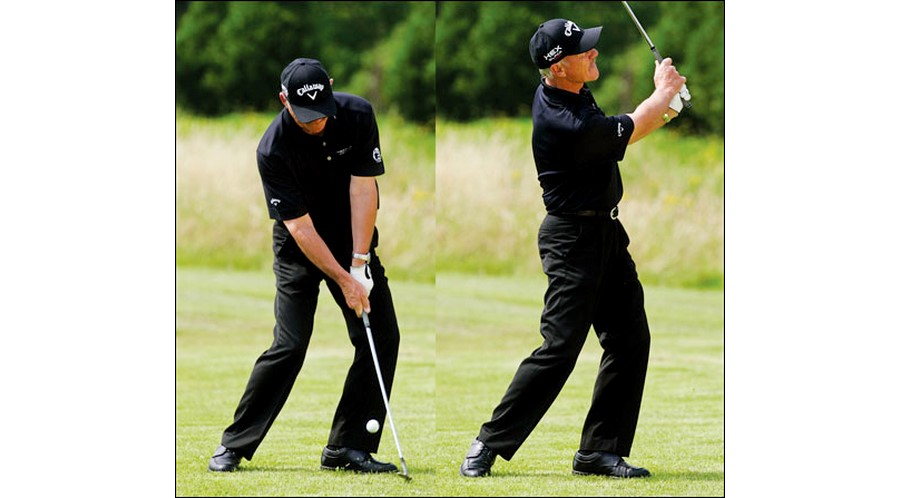

* (L) Right hand releases much earlier in order to slide the open face beneath the ball
* (R) The higher the shot, the fuller the finish – note the way the left shoulder has rotated out of the way to allow the right side to turn through

### Distance control: A factor of swing length & rhythm

To control distance in the pitching arena; a ‘clockface’ principle that involves matching body rotation and length of arm swing on either side of the ball to identify with the ‘best’ (i.e. most consistent) landing distances using the lofted scoring clubs.

### Personal videos

* [Pitch Practice 09/02-2022](https://youtu.be/CzdIs0qaArE)

<iframe width="560" height="315" src="https://www.youtube.com/embed/CzdIs0qaArE" title="YouTube video player" frameborder="0" allow="accelerometer; autoplay; clipboard-write; encrypted-media; gyroscope; picture-in-picture" allowfullscreen></iframe>

## Putter

* Use long putt to putt in a 5 foot square.
* 3 to 5 foot putts exercise with 10 balls
* Alignment exercise with two poles or club on the ground - follow the rails
* Pass the gate with straight line
* Pass the gate with curve.

## Mental Game

### Difficult shots

* Think you are already after a penality or a second bunker shot -> it will increase the chance to get a better shot.

### Recover from bad hole

* Take 10 steps: Let yourself get mad about the shot you’ve just hit for 10 steps. When you take that 11th step, move on. 
* Breathe in for five seconds, hold that breath for five seconds and breathe out for five seconds.
* Yaking things “one shot at a time” 