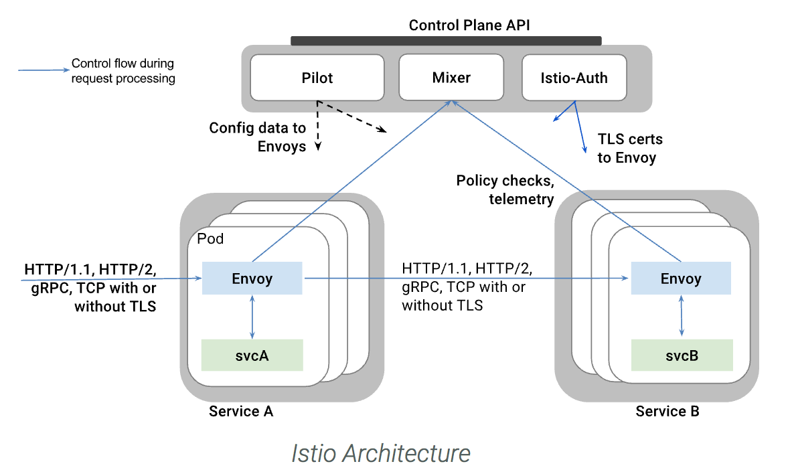

# Use ISTIO for service mesh

## Service Mesh

A **service mesh** is the network of microservices that make up applications in a distributed microservice architecture.

Istio helps operators to connect, secure, control and observe services and microservices. 
It aims to manage service mesh. It is a dedicated infrastructure layer that you can add to your applications. 
It allows you to transparently add capabilities like observability, traffic management, and security, 
without adding them to your own code.

The main concepts are presented in the Istio [main page](https://istio.io/docs/concepts/what-is-istio/).

* Merge several projects into one offering: Istio (v1.6), Kiali (monitoring), Jaeger (distributed tracing).
* Use **istiod** to reduce control panel resource usage, startup time and improves performance (CRD: `ServiceMeshControlPlane`).
* Use Secret Discovery Service to deliver certificates to Envoy: no more k8s secrets, easier to integrate with other certificate providers.
* Jaeger supports ElasticSearch clusters.
* Istio simplifies configuration of service-level properties like circuit breakers, timeouts, and retries,

RedHat offers the [Service mesh](https://docs.openshift.com/container-platform/4.7/service_mesh/v2x/ossm-about.html) as an extension to Istio: 
deployed with operator, 

### Value propositions

* Support the cloud native requirements: service discovery, application load balancing (layer 7), failure recovery, metrics, 
and monitoring, A/B testing, canary releases, rate limiting, access control, and end-to-end authentication
* Automatic load balancing for HTTP, gRPC, WebSocket, and TCP traffic.
* Fine-grained control of traffic behavior with rich routing rules, retries, failovers, and fault injection.
* A pluggable policy layer and configuration API supporting access controls, rate limits and quotas.
* Automatic metrics, logs, and traces for all traffic within a cluster, including cluster ingress and egress.
* Secure service-to-service communication in a cluster

### Recall concepts

* **[Canary release](https://martinfowler.com/bliki/CanaryRelease.html)** is a technique to reduce the risk of introducing
a new software version in production by slowly rolling out the change to a small subset of users before rolling it out to 
the entire infrastructure and making it available to everybody. (Phased rollout)
* **[A/B testing]()** is a way to test a hypothesis using variant implementations. A/B testing is a way to compare two versions
 of a single variable, typically by testing a subject's response to variant A against variant B, and determining which of the
 two variants is more effective

## Architecture

The Istio service mesh is composed of the **data plane** and **control plane**.

The **data plane** groups *Envoy* proxies deployed as sidecar to the microservice, and used to mediate and control communication.

The **control plane** manages and configures Istiod to enforce proxies to route traffic. Istiod provides service discovery, 
configuration and certificate management. It converts high-level routing rules to Envoy configurations and propagates them 
to the sidecars at runtime.



**Kiali** provides visibility into your service mesh by showing you the microservices in your service mesh, 
and how they are connected. a basic Grafana integration is available for advanced queries. 
Distributed tracing is provided by integrating Jaeger into the Kiali console. Tracing follows the path of a request through various microservices that make up an application.

The following is an example of pod assignment within kubernetes. Egress gateway and servicegraph run on a proxy, 
while the other components run in the worker nodes.


*The command used to get this assignment are:*

```sh
kubectl get nodes
kubectl describe node <ipaddress>
```
To get the pods: `kubectl get pods -n istio-system`.

The  component roles were:  

| Component | Role |  
| ---- | ----- |  
|  **Envoy**  | Proxy to mediate  all inbound and outbound traffic for all services in the service mesh. 
It is deployed as a sidecar container inside the same pod as a service. 
It supports load balancing, circuit breakers, health checks, fault injection, metrics...|
| **Istiod** | It provides service discovery, configuration and certificate management. It consists of the following sub-components: |

| **Galley** | Responsible for validating, ingesting, aggregating, transforming and distributing config within Istio. |
| **Pilot** | Supports service discovery, traffic management, resiliency (timeouts, retries, circuit breakers), intelligent routing (A/B testingm canary deployment..). |
| **Citadel** | Used for service-to-service and end-user authentication. Enforce security policy based on service identity. | 


## Installation

With OpenShift service mesh, the installation is via Operators:

* Jaeger
* Kiali
* Service Mesh

Once those operators are installed and running create a control pane, by creating `istio-system` project, 
and then create `ServiceMeshControlPlane` using the mesh operator.

For a more traditional way on Kubernetes, for example, Istio is using custom resources like virtualService and destination rules, we need to apply the CRD templates.

```sh
oc apply -f istio-1.3.3/install/kubernetes/helm/istio/templates/crds.yaml
```

Installing a simple Istio deployment for demonstration purpose use:

```sh
oc apply -f istio-1.0.5/install/kubernetes/istio-demo.yaml
```

On OpenShift we need to define Route to the Istio services:

```
oc expose svc istio-ingressgateway -n istio-system; \
oc expose svc servicegraph -n istio-system; \
oc expose svc grafana -n istio-system; \
oc expose svc prometheus -n istio-system; \
oc expose svc tracing -n istio-system
```

### CLI

```
istioctl version
```
Deploy an app and inject Envoy sidecar into the same pod.

```
oc apply -f <(istioctl kube-inject -f ../../kubernetes/Deployment.yml) -n tutorial
```
### Others

Service Graph displays a high-level overview of how systems are connected, a tool called Weave Scope provides a powerful visualisation and debugging tool for the entire cluster

```
kubectl create -f https://cloud.weave.works/launch/k8s/weavescope.yaml
```

### A/B testing with routing rules

[Route 50% traffic to one image](https://github.com/istio/istio/blob/release-0.1/samples/apps/bookinfo/route-rule-reviews-50-v3.yaml)

[Route based on http header argument](https://github.com/istio/istio/blob/release-0.1/samples/apps/bookinfo/route-rule-reviews-test-v2.yaml)

## Compendium

* [OpenShift Service Msh 2.0](https://docs.openshift.com/container-platform/4.7/service_mesh/v2x/ossm-about.html)
* [Installation on kubernetes](https://istio.io/docs/setup/install/kubernetes)
* [Troubleshooting Istio](https://github.com/istio/istio/wiki/Troubleshooting-Istio)
* [Tutorial on Katacoda](https://www.katacoda.com/courses/istio/deploy-istio-on-kubernetes)
* [Istio on openshift training](https://learn.openshift.com/servicemesh)
* [](https://www.redhat.com/en/events/webinar/kubernetes-istio-kafka-and-camel-glue-your-agencys-cloud-native-strategy)

* [A repo for demo](https://github.com/redhat-developer-demos/istio-tutorial/)