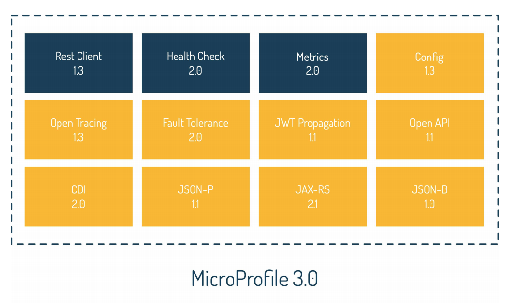

# Microprofile 3.x notes

[microprofile](https://microprofile.io/) is the java framework to develop microservice architecture. MicroProfile APIs establish an optimal foundation for developing microservices-based applications.

This [openliberty website](https://openliberty.io/guides/) includes very good interactive tutorials to learn more on microprofile.

Two way to implement the communication between services:

* **Choreography** defines business workflow as a sequence of domain events and service actions. Each involved service signals a successful or faulty fulfilment of its part of the workflow via a corresponding domain event. Other services may listen to this domain event and start working on their part of the workflow after receiving it.
* **Orchestration**  defines one orchestrating service which sends commands to the different services and receives their responses. This could be done synchronously via RESTful calls or asynchronously with the help of queues or topics.

## Create a microprofile app

This section summarizes some getting started stuff on microprofile.

### With appsody

Create a [open liberty microprofile 3.3](https://github.com/appsody/stacks/tree/master/incubator/java-openliberty) with appsody command: `appsody init java-microprofile`, which downloads the java microprofile code template with "health, liveness and metrics and a hello world API".
`appsody run` or `appsody test` to continuously see the impact from the code updates.

To get the password for the metrics do the following: `docker exec -it my-project-dev  bash -c "grep keystore /opt/ol/wlp/usr/servers/defaultServer/server.env"`

### With maven

Use the [Generate tool at start.microprofile.io](https://start.microprofile.io/).

Run with `mvn liberty:dev` to listen to file changes.

### Run with docker

Once the application is created and built, we can also define a docker file and run it. From [this openliberty guides](https://openliberty.io/guides/docker.html) here is a quick summary:

* The open liberty maven plugin add an execution to create the server, install features, and deploy the app as part of the `mvn package` command.
* docker build and then docker run it by mounting the war file:

```shell
docker run -ti --network kafkanet -p 9081:9081 -v $(pwd)/target/PerfConsumerApp.war:/config/dropins/PerfConsumerApp.war ibmcase/perfconsumerapp 
```

## Cross cutting concerns

Cross-cutting concerns are common to all microservice and include logging, monitoring of service health and metrics, fault tolerance, configuration, and security.

* Support distributed logging and tracing cross microservices, that can be merged and analyzed as a whole.
* Without a single point of control, each microservice needs to know if it is healthy and perform as expected.
* Microservices architecture needs to be resilient and fault tolerant by design. This means we must not only be able to detect but also to handle any issue automatically.
* Microservice accesses configurations from multiple sources in a homogeneous and transparent way
* Support a mechanism to handle distributed authentication and authorization
* Offer security context propagation
* Make sure that the original service call is not forged in the authentication process.

## Programming model

MicroProfile utilizes a very small subset of Java EE APIs to define its core programming model:

* CDI 2.0 for Dependency Injection
* JAX-RS 2.1 for REST APIs
* JSON P 1.1 for JSON Parsing
* JSON-B 1.0 for JSON Binding


As illustrated in the figure above Microprofile 3.0 bundles a set of features:

### Config

**Config**: externalizes configuration and obtains config via injection from config files, environment variables, system properties, or custom resource. Those configurations are static, they cannot be modified while the server is running.
MicroProfile Config uses Contexts and Dependency Injection (CDI) to inject configuration property values directly into an application without requiring user code to retrieve them.

    ```java
    // inject property with default value
    @Inject @ConfigProperty(name = "topicName")
    String topicName;
    ```

MicroProfile Config combines configuration properties from multiple sources, each known as a ConfigSource. The config file is named `META-INF/microprofile-config.properties`

The `@Inject` annotation injects the topic name directly, the injection value is static and fixed on application starting.

It is possible to have dynamic configuration by implementing the `org.eclipse.microprofile.config.spi.ConfigSource` interface and using the java.util.ServiceLoader mechanism with configuration file in `META-INF/services/org.eclipse.microprofile.config.spi.ConfigSource` to specifies the class name to use for loading configuration. The property to load dynamically has a Provider type:

```java
  @Inject
  @ConfigProperty(name = "io_openliberty_guides_inventory_inMaintenance")
  private Provider<Boolean> inMaintenance;
```

It forces the service to retrieve the inMaintenance value just in time. This retrieval of the value just in time makes the config injection dynamic and able to change without having to restart the application.

To enable this capability, we need `mpConfig-1.3` or `microprofile-3.0` feature.

See [configuration for microprofile git repo](https://github.com/eclipse/microprofile-config). And [this tutorial](https://openliberty.io/guides/microprofile-config-intro.html#example-devops-pipeline).

### CDI

[CDI](#CDI) Contexts and Dependency Injection (CDI) to manage scopes and inject dependencies

## Fault tolerance

[Fault Tolerance](https://microprofile.io/project/eclipse/microprofile-fault-tolerance) enables us to build resilient microservices by separating the execution logic from business logic. Key aspects of the Fault Tolerance API includes well known resilience patterns like TimeOut, RetryPolicy, Fallback, Bulkhead (isolate failure), and Circuit Breaker (fail fast) processing.

    ```java
    @GET
    @Timeout(500)
    @Retry(delay = 200, maxRetries = 2, jitter = 100, retryOn = IOException.class)
    @Fallback(fallbackMethod = “getBestsellersFallback”)
    public Response getPersonalRecommendations() throws InterruptedException {
        // retrieve personal recommendations by delegating the call to
        // Personal Recommendations Microservice
    }
    public Response getBestsellersFallback() {
        // retrieve bestsellers instead of personal recommendations as fallback
        // by delegating the call to Bestsellers Service
    }
    ```

    The `@Timeout` annotation specifies the time in milliseconds allowed for the request to finish. This is to avoid the user interface to wait forever.
    The `@Retry` helps to recover from network or remote microservice transient failures. The retryOn specifies the exception to trigger the retry. `delay` specifies the amount of time to wait before retrying a request. `jitter` specifies a variation to apply to the delay interval between retries.

## Health Check

* **Health Check** lets developers define and expose a domain-specific microservices health status (“UP” or “DOWN”) so unhealthy services can be restarted by the underlying environment. Health checks are used to determine
both the liveness and readiness of a service. Determining the state of a service can be composed by a set
of verification procedures. Multiple domain-specific health checks can easily be added to a microservice by implementing the corresponding HealthCheck interface.

    ```java
    @Readiness
    @ApplicationScoped
    public class ConnectionPoolCheck implements HealthCheck {
        @Override
        public HealthCheckResponse call() {
            if (isConnectionPoolHealthy()) {
            return HealthCheckResponse(“customer-cp”)
            .up()
            .build();
            } else {
            return HealthCheckResponse(“customer-cp”)
            .down()
            .build();
            }
        }
    ```

The `@Liveness` annotation is used to assess if the microservice is running.

The `@Readiness` annotation indicates that this particular bean is a readiness health check procedure. By pairing this annotation with the ApplicationScoped context from the Contexts and Dependency Injections API, the bean is discovered automatically when the `http://<>/health` endpoint receives a request

* **Metrics** delivers details about the microservices runtime behavior by providing a unified way for MicroProfile servers to export monitoring data to management agents. Metrics also provides a common Java API for exposing their telemetry data. Metrics serves to pinpoint issues, providing long-term trend data for capacity planning, and pro-active discovery of issues (e.g. disk usage growing without bounds) via a simple to use RESTful API. Metrics can also help scheduling-systems decide when to scale the application to run on more or fewer machines.

    ```java
    @POST
    @Produces(MediaType.APPLICATION _ JSON)
    @Timed(absolute = true,
        name = "microprofile.ecommerce.checkout",
        displayName = "check-out time",
        description = "time of check-out process in ns",
        unit = MetricUnits.NANOSECONDS)
    public Response checkOut(...) {
        // do some check-out specific business logic
        return Response.ok()… build();
    }
    ```

The `@Timed` annotation tracks how frequently the method is invoked and how long it takes for each invocation of the method to complete. The `@Counted` annotation to a method to count how many times the matching URL is accessed monotonically, which is counting up sequentially.
The `@Gauge` annotation to a method helps to track the number of items that are in the returned collection.

In OpenLiberty the quickStartSecurity and keyStore configuration elements provide basic security to secure the server. When you visit the /metrics endpoint, use the credentials defined in the server configuration to log in and view the data.

* **Open API** specification provides a set of Java interfaces and programming models that allow developers to natively produce OpenAPI v3 documents. Use JAX-RS anotations with OpenAPI annotations or start from a yml file.

* **Rest Client** simplifies building REST Clients by providing a type-safe approach for invoking RESTful services over HTTP. It uses JXRS 2.1.

* **JWT Authentication** defines a format of JSON Web Token (JWT) used as the basis for interoperable authentication and authorization by providing role-based access control (RBAC) microservice endpoints using OpenID Connect. One of the main strategies to propagate the security state from clients to services, or even from services to services, involves the use of security tokens.

* **OpenTracing** enables services to easily participate in a distributed tracing environment by defining an API. To accomplish distributed tracing, each service must be instrumented to log messages with a correlation id that may have been propagated from an upstream service.

### Sandbox projects

* The proposal for **Long Running Actions** introduces APIs for services to coordinate activities. The main thrust of the proposal introduces an API for loosely coupled services to coordinate long running activities in such a way as to guarantee a globally consistent outcome without the need to take locks on data.
* The **Reactive Streams Operators** specification propose a set of operators for Reactive Streams. By mapping Java Streams API but for Reactive Streams, it provide a natural API to deal with stream of data, enforcing error
propagation, completion signals, and back-pressure.
* The [Reactive Messaging](https://microprofile.io/project/eclipse/microprofile-reactive-messaging) proposal explores the question „what if Java offered a new API for handling streams of messages - either point to point or from a message broker - based on the JDK 9 Flow API or alternatively on the
JDK8 compatible Reactive Streams API - that was lighter weight and easier to use than JMS/MDBs“

## Getting started

[MicroProfile Starter](https://start.microprofile.io/) helps to generate microprofile maven project with sample code.
The folders microprofile30/service-a and service-b have the generated code. From this code the app under JEEPlay jbcodeforce.microprofile.app defines a basic template for a REST based microservice. What need to be done is:

* JAX-RS has two key concepts for creating REST APIs. The resource itself, which is modelled as a class, and a JAX-RS application, which groups all exposed resources under a common path. See the class [BasicRestApp](https://github.com/jbcodeforce/java-studies/blob/master/JEEPlay/src/main/java/jbcodeforce/microprofile/app/BasicRestApp.java).
* The @ApplicationPath annotation has a value that indicates the path within the WAR that the JAX-RS application accepts requests from.
* Clear have one Resource class for the same resource type. The @Path annotation on the class indicates that this resource responds to specified path of the JAX-rS application. JAX-RS maps the HTTP methods on the URL to the methods on the class. [SystemPropertiesResource](https://github.com/jbcodeforce/java-studies/blob/master/JEEPlay/src/main/java/jbcodeforce/microprofile/app/SystemPropertiesResource.java)
* The JAX-RS 2.1 specification mandates JSON-Binding (JSON-B) and JAX-B.
* Example of results : [http://localhost:9080/JEEPlay/System/properties](http://localhost:9080/JEEPlay/System/properties)

## Concepts

### CDI

Use Contexts and Dependency Injection (CDI) to manage scopes and inject dependencies into microservices.
The most fundamental services that are provided by CDI are contexts that bind the lifecycle of stateful components to well-defined contexts, and dependency injection that is the ability to inject components into an application in a typesafe way. With CDI, the container does all the daunting work of instantiating dependencies, and controlling exactly when and how these components are instantiated and destroyed.

Scopes are defined by using CDI annotations.

When a bean needs to be persistent between all of the clients (singleton), use the `@ApplicationScoped` annotation. This annotation indicates that this particular bean is to be initialized once per application. By making it application-scoped, the container ensures that the same instance of the bean is used whenever it is injected into the application.

Add the `@RequestScoped` annotation on the class to indicate that this bean is to be initialized once for every request. Request scope is short-lived and is therefore ideal for HTTP requests.

The `@Inject` annotation indicates a dependency injection for application concept beans.

Important to note that access to the injected bean could not be done in the contructor of the class using this injected bean. There is a problem of life cycle and so the host bean needs to be constructed before getting the injection.

### SSL client connection

When an application deployed in your app server, like Open Liberty, needs to access to a server end point over TLS (SSL), we need to make the server public certificate available to the Java client JVM. The certificate is persisted in a Truststore.

In open liberty the server.xml define where to find the truststore:

```

```

## Reactive messaging operator

The implementation specification is based on [SmallRye](https://smallrye.io/smallrye-reactive-messaging/)
