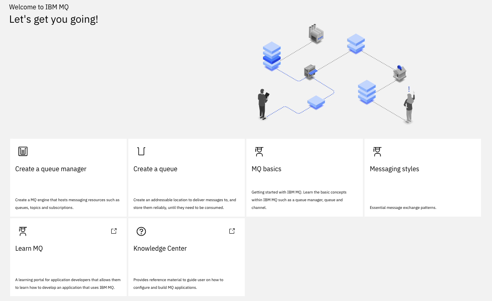

# MQ Studies

## References for reading

Here are a set of articles you may need to read to get ready on MQ:

* [Learning MQ](http://ibm.biz/learn-mq) 
* [MQ Essentials- Getting started with IBM MQ](
https://developer.ibm.com/messaging/learn-mq/mq-tutorials/getting-started-mq/)
* [First demo on docker](https://developer.ibm.com/messaging/learn-mq/mq-tutorials/mq-connect-to-queue-manager/#docker)
* [MQ Cheat sheet](https://developer.ibm.com/messaging/learn-mq/mq-tutorials/dev-cheat-sheet/)
* [Develop a JMS point to point application](https://developer.ibm.com/messaging/learn-mq/mq-tutorials/develop-mq-jms/) The code of this IBM tutorial is also in this repository under the `democlient/MQJMSClient` folder so we can test the configuration.
* [IBM MQ v9.0+ product documentation](https://www.ibm.com/support/knowledgecenter/en/SSFKSJ_9.0.0/com.ibm.mq.helphome.v90.doc/WelcomePagev9r0.html)


* [Docker image for MQ community]()
* [Comparing Messaging Pub/Sub and Event Streams](https://community.ibm.com/community/user/imwuc/viewdocument/comparing-messaging-pubsub-and-eve?CommunityKey=b382f2ab-42f1-4932-aa8b-8786ca722d55)

## Key Concepts

* **Messages**: packages of data produced and consumed by applications.
* **Queues**: addressable locations to deliver messages to and store them reliably until they need to be consumed.
* **Queue managers**: actual MQ engines, the servers that host the queues
* **Channels**: the way queue managers communicate with each other and with the applications.
* **MQ networks**: loose collections of interconnected queue managers, all working together to deliver messages between applications and locations
* **MQ clusters**: tight couplings of queue managers, enabling higher levels of scaling and availability.
* **Point to point** for a single consumer. Senders produce messages to a queue, and receivers asynchronously consume messages from that queue. With multiple receivers, each message is only consumed by one receiver, distributing the workload across them all.
* **Publish/subscribe** copies of messages will be delivered to all interested consuming applications. Subscribers create a subscription to topic when they want to receive messages.

## MQ value proposition

* No data loss, no duplicate
* Integrate with transaction
* Scale horizontally: add more queue managers to share tasks and distribute the messages across them. MQ Clusters will even intelligently route messages to where they’re needed. The world is full of horizontally scaled MQ systems that handle billions of messages a day.
* High availability

## Getting started with MQ docker image

See the docker compose file in the mqChallenge folder. Once the mqserver is running, open a bash:  `docker exec -ti mqserver bash`

* Display the MQ server information

```shell
bash-4.4$ dspmqver
Name:        IBM MQ
Version:     9.1.5.0
Level:       p915-ifix-L200325.DE
BuildType:   IKAP - (Production)
Platform:    IBM MQ for Linux (x86-64 platform)
Mode:        64-bit
O/S:         Linux 4.19.76-linuxkit
O/S Details: Red Hat Enterprise Linux 8.1 (Ootpa)
InstName:    Installation1
InstDesc:    IBM MQ V9.1.5.0 (Unzipped)
Primary:     N/A
InstPath:    /opt/mqm
DataPath:    /mnt/mqm/data
MaxCmdLevel: 915
LicenseType: Developer
```

* Display your running queue managers: `dspmq`

```shell
QMNAME(QM1)                                               STATUS(Running)
```

The default configuration is:

```properties
Queue manager QM1
Queue DEV.QUEUE.1
Channel DEV.APP.SVRCONN
Listener DEV.LISTENER.TCP on port 1414
```

## Demo app

Client applications connect to the queue manager and can open, put, and get messages, and close the queue.
Applications use an MQ channel to connect to the queue manager. The following demo 
opens a queue, puts messages to it and then gets messages from the same queue. The app demonstrates point-to-point style of messaging.

```shell
curl https://raw.githubusercontent.com/ibm-messaging/mq-dev-samples/master/gettingStarted/mq-demo-client-application/Dockerfile
# Build
docker build -t mq-demo .
# Run
docker run --network labnet -ti mq-demo
```

Then answer the questions, using the name of `mqserver` for the hostname, as it is the name defined in the docker compose, and the password is the one defined in `MQ_APP_PASSWORD`.

```
|  \/  |/ _ \  |   \ ___ _ __  ___
| |\/| | (_) | | |) / -_) '  \/ _ \
|_|  |_|\__\_\ |___/\___|_|_|_\___/

Welcome to this demo application for IBM MQ!
The app will allow you to connect to a queue manager and start sending and receiving messages.

Type the name of your queue manager (leave blank for 'QM1'):
Type the host name or IP address for your queue manager:
mqserver
Type the listener port of your queue manager (leave blank for '1414'):
Type the name of the client connection channel (leave blank for 'DEV.APP.SVRCONN'):
Type the name of the queue (leave blank for 'DEV.QUEUE.1'):
Type the application user name (leave blank for 'app'):

Connecting to queue manager 'QM1'
at address 'mqserver(1414)'
through channel 'DEV.APP.SVRCONN'
...
Connected!

*** YOU ARE NOW CONNECTED TO THE QUEUE MANAGER! ***

Type PUT [number] to put a given number of messages to the queue
Type GET [number] to get a given number of messages from the queue
Type AUTO [seconds] to put and get messages automatically for a given number of seconds
Type EXIT to quit
Type HELP to display this message
```

Play with PUT and GET.

## Access to MQ Console

`https://localhost:9443/ibmmq/console`  admin / passw0rd



### Administre Queue


## Basic JMS 2.0 client

The code under JMSMQclient is an adaption of [the develop MQ client tutorial](https://developer.ibm.com/messaging/learn-mq/mq-tutorials/develop-mq-jms/). The differences are:

* use quarkus to package as webapp.
* Offer API to start the sending of n messages.
* Offer API to get the consumed message.
* Inject configuration from properties file.
* Expose API via swagger.

## Publisher / Subscribe on MQ

This is the implementation of [the MQ developer tutorial](https://developer.ibm.com/messaging/learn-mq/mq-tutorials/mq-dev-challenge/) and supports the implementation of the following solution:


The conference event system and reseller applications are loosely coupled. Asynchronous messaging allows us to integrate these components and build in a buffer, or shock absorber. Should either component lose connectivity, fail or experience fluctuations in throughput, the messaging layer will deal with any instability.

## The Event Booking

The event booking system runs in a container and holds an event publisher, MQ server hosting newTickets topic and purchase and confirmation queues. The code is in `EventBookingServer` folder.

To build the image

```shell
mvn package
docker build -t jbcodeforce/mqbooking .
```

And run it with the script `runBookingContainer.sh`

## The reseller app

The Reseller application provides the prompt to ask the user how many of the available tickets they want to purchase.
The conference event booking system will process the request message and provide a response. 
The Reseller application will print the outcome to stdout.

Build with the shell `TicketSeller/build.sh`and run it. 