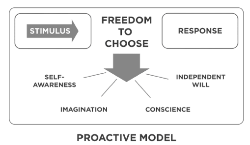
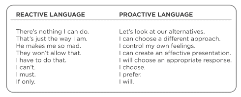
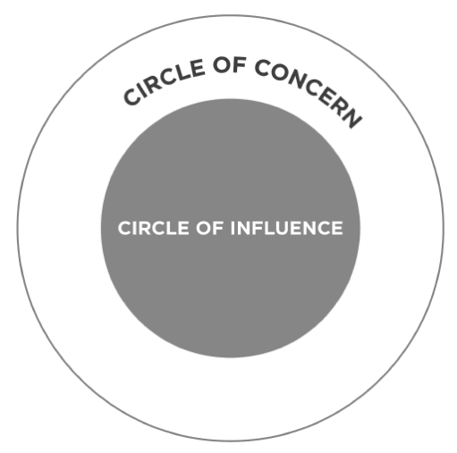
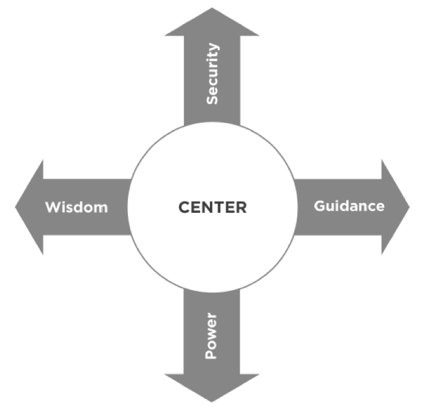
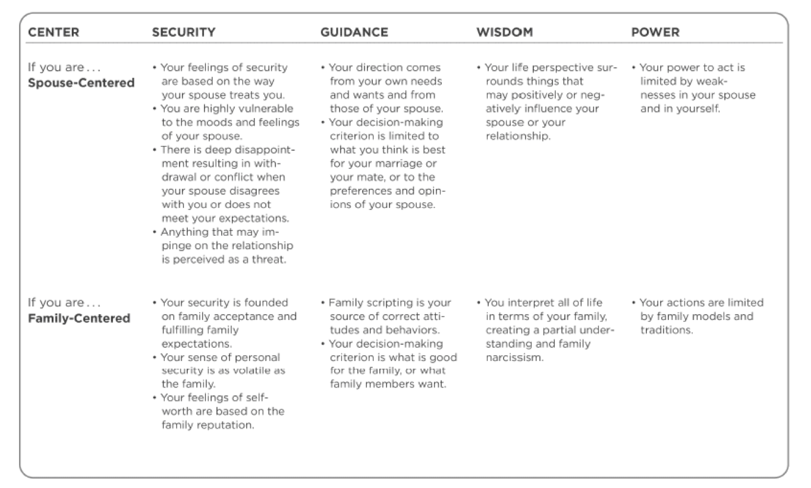
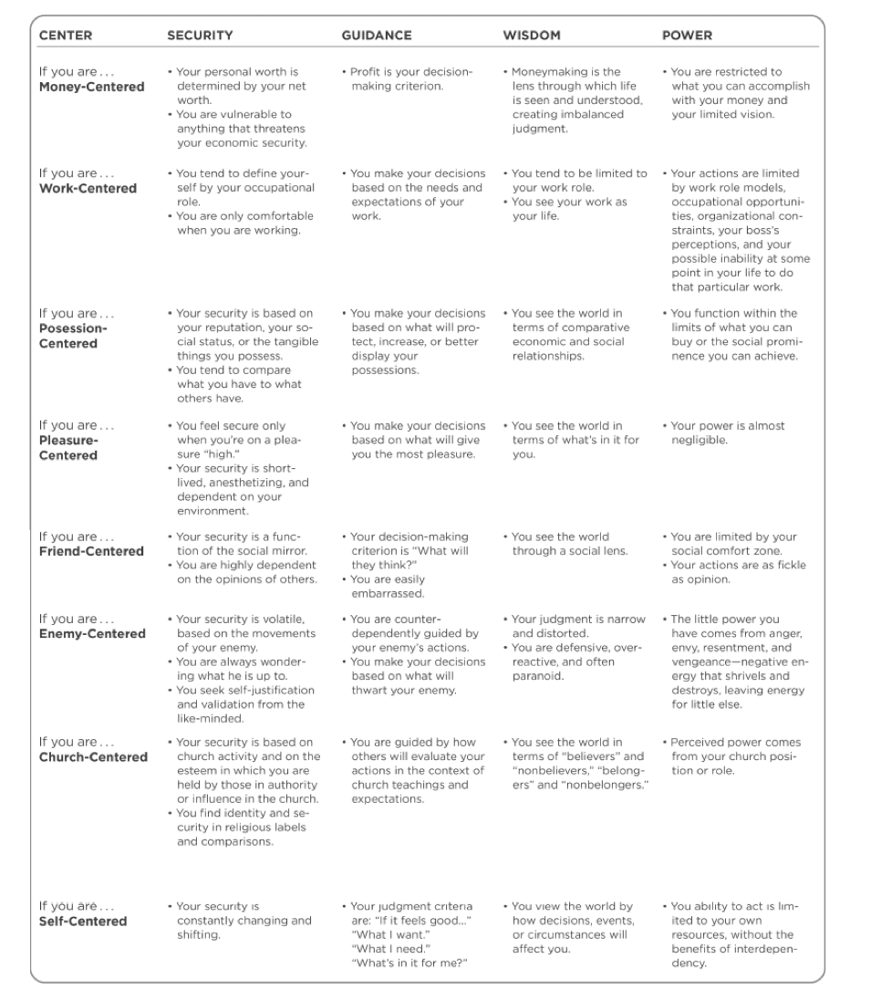
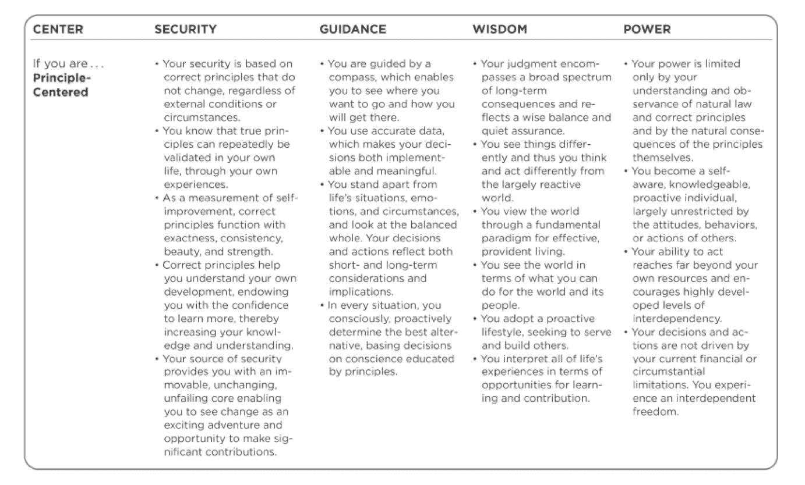
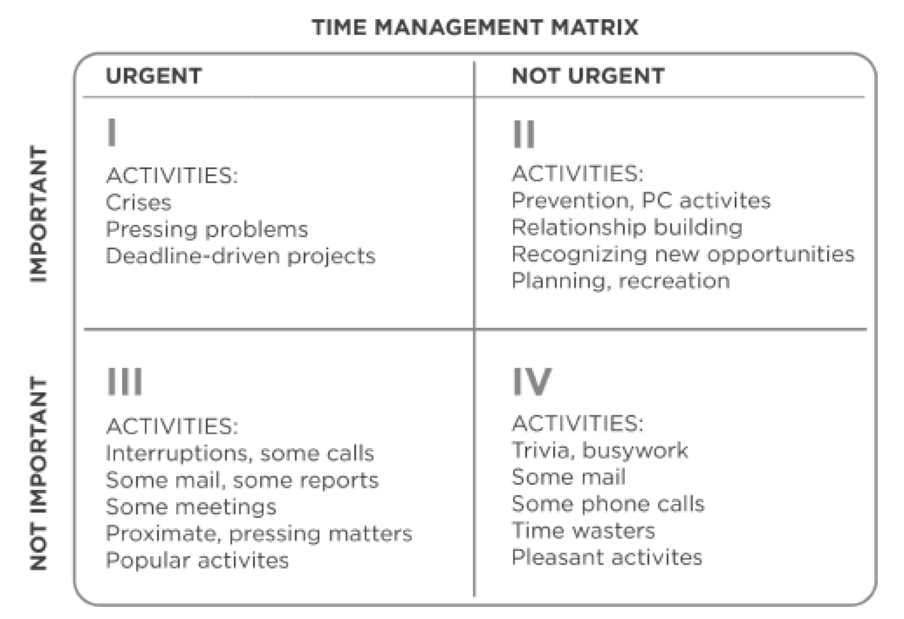
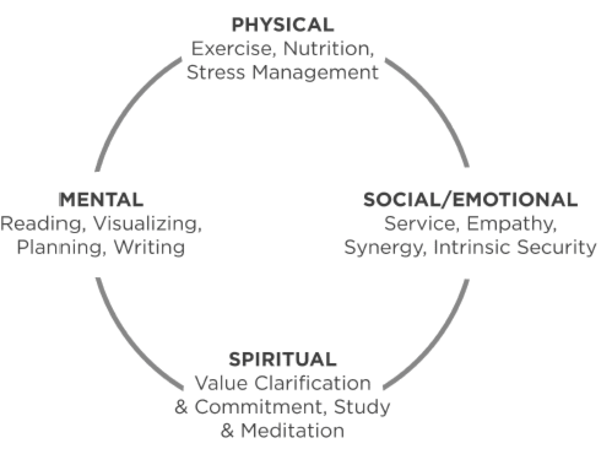

# The 7 Habits of Highly Effective People - Steven Covey

*If you want to achieve your highest aspirations and overcome your greatest challenges, identify and apply the principles or natural laws that govern the results you seek.*

## Introduction

### Most common human challenges

**Fear and insecurity:** people today are gripped with a sense of fear. They fear for the future. They feel vulnerable in the workplace. They are afraid of losing their jobs and their ability to provide for their families. This vulnerability often fosters a resignation to riskless living and to co-dependency with others at work and at home. Our culture’s common response to this problem is to become more and more independent. “I’m going to focus on ‘me and mine.’ I’ll do my job, do it well, and get on to my real joys off the job.” Independence is an important, even vital, value and achievement but the problem is, we live in an interdependent reality, and our most important accomplishments require interdependency skills well beyond our present abilities.

**Want it now:** credit card mindset. get results immediately. Focus on short term.

*In fact we must constantly re-educate and reinvent ourselves. The real mantra of success is sustainability and growth. So we continuously need to invest in reinventing ourselves in work, family, health, relationship and community.*

**Blame and victimize.** Wherever you find a problem, you will usually find the finger-pointing of blame. Society is addicted to playing the victim. Blaming everyone and everything else for our problems and challenges may provide temporary relief from the pain, but it also chains us to these very problems.

*Be humble enough to accept and take responsibility for your  and courageous enough to take whatever initiative is necessary to creatively work your way through or around the challenges.*

**Hopelessness.** When we succumb to believing that we are victims of our circumstances, we lose hope, we lose drive, and we settle into resignation and stagnation. The survival response is cynicism—“just lower your expectations of life to the point that you aren’t disappointed by anyone or anything.” 

*The contrasting principle of growth and hope throughout history is the discovery that “I am the creative force of my life.”*

**Lack of life balance:** 

We are subordinating health, family, integrity, and many of the things that matter most to our work.
The problem is that our modern culture says, “go in earlier, stay later, be more efficient, live with the sacrifice for now”

*but the truth is that balance and peace of mind follow the person who develops a clear sense of his or her highest priorities and who lives with focus and integrity toward them.*

**“What’s in it for me?** Our culture teaches us that if we want something in life, we have to “look out for number one.”
The greatest opportunities and boundless accomplishments of the Knowledge Worker Age are reserved for those who master the art of “we.”
True greatness will be achieved through the abundant mind that works selflessly—with mutual respect, for mutual benefit.

**Being understood and influencer**

The greatest human  need is to be understood—to have a voice that is heard, respected, and valued—to have influence.

*The real beginning of influence comes as others sense you are being influenced by them—when they feel understood by you.*

The principle of influence is governed by mutual understanding born of the commitment of at least one person to deep listening first.

**Conflict and differences:** unleash the principle of creative cooperation in developing solutions to problems that are better than either party’s original notion!

## Inside out

To change ourselves effectively, we first had to **change our perceptions**. All the first  literature on how to be successful and happy within the last 200 years, focused on what could be called the **Character Ethic** as the foundation of success: things like integrity, humility, fidelity, temperance, courage, justice, patience, simplicity, modesty. The Character Ethic taught that there are basic principles of effective living, and that people can only experience true success and enduring happiness as they learn and integrate these principles into their basic character.

For **Personality Ethic** success became more a function of personality, of public image, of attitudes and behaviors, skills and techniques, that lubricate the processes of human interaction. The basic thrust was quick-fix influence techniques, power strategies, communication skills, and positive attitudes. Those skills are important but secondary.

For interpersonal relationships Personality ethic is short term driven. You make illusion but are not credible in long run.
**"You always reap what you sow"**. This principle is also true, ultimately, in human behavior, in human relationships.
Character Ethic has social recognition for their talents, they built trust and are eloquent in long term relationship.

### The power of paradigm.

Paradigm today means a model, theory, perception, assumption, or frame of reference. It could be pictured as a map. We have multiple maps in our mind. They can be divided into two main categories

- maps of the way things are, or realities,
- maps of the way things should be, or values.

We interpret everything we experience through these mental maps. We seldom question their accuracy; we’re usually even unaware that we have them. We simply assume that the way we see things is the way they really are or the way they should be. And our attitudes and behaviors grow out of those assumptions. **The way we see things is the source of the way we think and the way we act.**

This brings into focus one of the basic flaws of the Personality Ethic. To try to change outward attitudes and behaviors does very little good in the long run if we fail **to examine the basic paradigms from which those attitudes and behaviors flow.**

Each of us tends to think we see things as they are, that we are objective. But this is not the case. We see the world, not as it is, but as we are conditioned to see it.

The more aware we are of our basic paradigms, maps, or assumptions, and the extent to which we have been influenced by our experience, the more we can take responsibility for those paradigms, examine them, test them against reality, listen to others and be open to their perceptions, thereby getting a larger picture and a far more objective view.

**The power of paradigm shift:** We can only achieve quantum improvements in our lives as we quit hacking at the leaves of attitude and behavior and get to work on the root, the paradigms from which our attitudes and behaviors flow.

**Seeing and being:** Paradigms are inseparable from character. Being is seeing in the human dimension. And what we see is highly interrelated to what we are. We can’t go very far to change our seeing without simultaneously changing our being, and vice versa.

### The principles centered paradigm:

The Character Ethic is based on the fundamental idea that there are principles that govern human effectiveness. Those principles govern human growth and happiness. They are natural laws that are woven into the fabric of every civilized society throughout history and comprise the roots of every family and institution that has endured and prospered. Some of those principles are:

- **Fairness**, out of which our whole concept of equity and justice is developed.
- **Trust**: belief that someone or something is reliable, good, honest, effective
- **Integrity, consistency and honesty**. They create the foundation of trust which is essential to cooperation and long-term personal and interpersonal growth. [What is integrity](https://www.thebalance.com/what-is-integrity-really-1917676): a person with integrity demonstrates sound moral and ethical principles and does the right thing, no matter who's watching.
- **Human dignity**: the state or quality of being worthy of honor or respect
- **Service**, or the idea of making a contribution.
- **Excellence:** the quality to be extremely good
- **potential**, the idea that we are embryonic and can grow and develop and release more and more potential, develop more and more talents.
- **Growth**
- **Patience**: the capacity to accept or tolerate delay, trouble, or suffering without getting angry or upset.
- **Nurturing**: the ability to provide emotional and physical care or love
- **Encouragement**.

Principles are not practices. A practice is a specific activity or action. A practice that works in one circumstance will not necessarily work in another.

Principles are guidelines for human conduct that are proven to have enduring, permanent value. They’re fundamental. It is important to understand the difference between principles and values. Principles are natural laws that are external to us and that ultimately control the consequences of our actions. Values are internal and subjective and represent what we feel strongest about in guiding our behavior. 

Humility is the mother of all virtues. Humility says we are not in control, principles are in control, therefore we submit ourselves to principles. Pride says that we are in control, and since our values govern our behavior, we can simply do life our way. We may do so but the consequences of our behavior flow from principles not our values. In fact we should value Principles. 

When relationships are strained and the air charged with emotion, an attempt to teach is often perceived as a form of judgment and rejection.

**The way we see the problem is the problem**

Could there be something —some paradigm within myself that affects the way I see my time, my life, and my own nature?

Can you see how fundamentally the paradigms of the Personality Ethic affect the very way we see our problems as well as the way we attempt to solve them?

### A New level of thinking

These are deep, fundamental problems that cannot be solved on the superficial level on which they were created. This new level of thinking is a principle-centered, character-based, “inside-out” approach to personal and interpersonal effectiveness.

The inside-out approach says that private victories precede public victories, that making and keeping promises to ourselves precedes making and keeping promises to others.

- if you want to have a happy marriage, be the kind of person who generates positive energy and sidesteps negative energy rather than empowering it.
- If you want to have a more pleasant, cooperative teenager, be a more understanding, empathic, consistent, loving parent.
- If you want to have more freedom, more latitude in your job, be a more responsible, a more helpful, a more contributing employee.
- If you want to be trusted, be trustworthy

Inside-out is a process—a continuing process of renewal based on the natural laws that govern human growth and progress. It’s an upward spiral of growth that leads to progressively higher forms of responsible independence and effective interdependence.

### Questions

Try to be able to those questions:

???+ question "What is the difference between the Personality and Character ethics?"
    Character ethic learns and integrates basic universal human principles into their basic character to live effective life and be happy.
    Personality ethic builds success as a function of personality, of public image, of attitudes and behaviors, skills and techniques, that lubricate the processes of human interaction. It took two paths: one was human and public relations techniques, and the other was positive mental attitude (PMA).

???+ question "what is the disadvantage of relying solely on the Personality ethic?"
    Superficial, manipulative, focusing on techniques, not on personal values, it misses the connection with the deepest why, the values transferred generations after the other.

???+ question "Was there a time in your life when you've felt this way--and it might be right now?"
    What was (is) your mindset to cause those feelings, and how does this affect your behavior? 
    What price are you paying because of these limitations? 

???+ question "What might be the payoff if you could change your thinking and your behavior? "

???+ question "How difficult is it to achieve objectivity--in life generally and in your own life?"

???+ question "How are you able to do this? How can we become more aware of our lenses (paradigms)? "
    What is a paradigm regarding your work that sometimes hurts your efforts and your results?
    What are the consequences of paradigms that aren’t aligned with correct principles?

???+ question "What is a positive paradigm you have toward working with your colleagues?"
    how does this paradigm affect your behavior and your relationships with clients?

* What can you do to change this? 
* Regarding the personality and character ethic—does this mean it is bad to have a personality? 
* What is an example of how your organization operates with clients that demonstrates high character on the part of your organization? 
* What was a time when you demonstrated poor character, as an adult or as a child, i.e. violated a confidence, demonstrated poor discipline, etc.? 
* What was the outcome, short term and long term? Were you able to make up for this lapse? How? 
* It is important to stay focused on strengths, which everyone has, and on how we can focus or apply these strengths. What is one of your strongest character attributes, and what is an example of how you demonstrated this with friends or family? 
* What about with colleagues or clients? Why is it more important to work on your paradigms than on your behaviors? 

## The 7 habits overview

Our character, basically, is a composite of our habits. “Sow a thought, reap an action; sow an action, reap a habit; sow a habit, reap a character; sow a character, reap a destiny,”
Habit is at the intersection of knowledge, skill, and desire.

- Knowledge: what to do and why
- Skill: how to do
- Desire: want to do

{ width=400 }

Creating a habit requires work in all three dimensions. 

The 7 habits are in harmony with the natural laws of growth, they provide an incremental, sequential, highly integrated approach to the development of personal and interpersonal effectiveness. They move us progressively on a **Maturity Continuum** from dependence to independence to interdependence.

- On the maturity continuum **dependence** is the paradigm of **you**. "You take care of me; you come through for me; you didn’t come through; I blame you for the results."
- **Independence** is the paradigm of I: "I can do it; I am responsible; I am self-reliant; I can choose."
- **Interdependence** is the paradigm of we: "we can do it; we can cooperate; we can combine our talents and abilities and create something greater together."

**True independence of character empowers us to act rather than be acted upon.** It frees us from our dependence on circumstances and other people and is a worthy, liberating goal. But it is not the ultimate goal in effective living.
Interdependence is a far more mature, more advanced concept. If I am physically interdependent, I am self-reliant and capable, but I also realize that you and I working together can accomplish far more than, even at my best, I could accomplish alone. If I am emotionally interdependent, I derive a great sense of worth within myself, but I also recognize the need for love, for giving, and for receiving love from others. If I am intellectually interdependent, I realize that I need the best thinking of other people to join with my own.

Effectiveness lies in the balance—what is called the **P/PC Balance**. P stands for production of desired results, the golden eggs. PC stands for **production capability**, the ability or asset that produces the golden eggs.

When people fail to respect the P/PC Balance in their use of physical assets (machines) in organizations, they decrease organizational effectiveness.
The PC principle is to always treat your employees exactly as you want them to treat your best customers.
PC work is treating employees as volunteers just as you treat customers as volunteers, because that’s what they are. They volunteer the best part—their hearts and minds.

## Habit 1: Being proactive

We need to constantly be aware of ourselves and our world, our paradigms to determine whether they are reality- or principle-based or if they are a function of conditioning and conditions. Develop self-awareness: 

- Can you look at yourself almost as though you were someone else?
- Think about the mood you are now in. Can you identify it? What are you feeling?
- How your mind is working. Is it quick and alert?

*Awareness is a core emotional intelligence characteristic.*

**“self-awareness” or the ability to think about your very thought process.** When we are not able to see others and their world, we will project our intentions on their behavior and call ourselves objective.

We are not our feelings. We are not our moods. We are not even our thoughts. (See also th "untethered soul" book) 
There are three theories of determinism to explain the nature of a man:

- **genetic determinism:** what grand parents did to you via DNA
- **psychic determinism:** what your parents did to you via education
- **environmental determinism:** your boss, your spouse, your economic environment are doing to you

All are based on the stimulus-response theory.
Between stimulus and response, man has the freedom to choose the response. 
Liberty represents more options to choose from in the current environment / context, while freedom is more internal power to choose the response

- We have imagination— the ability to create in our minds beyond our present reality.
- We have conscience— a deep inner awareness of right and wrong, of the principles that govern our behavior, and a sense of the degree to which our thoughts and actions are in harmony with them.
- We have independent will— the ability to act based on our self-awareness, free of all other influences.

???+ info "Proactivity"
    Proactivity means that as human beings, we are responsible for our own lives. Our behavior is a function of our decisions, not our conditions. We can subordinate feelings to values. We have the initiative and the responsibility to make things happen. 

Highly proactive people recognize that responsibility (ability to choose their response). They do not blame circumstances, conditions, or conditioning for their behavior. Their behavior is a product of their own conscious choice, based on principles (fairness, integrity, honesty, dignity, accountability, quality, excellence, growth, patience, nurturing, and encouragement), rather than a product of their conditions, based on feelings. **They are value driven.**

Reactive people build their emotional lives around the behavior of others, empowering the weaknesses of other people to control them. They are also affected by the physical environment, like the weather.

**The ability to subordinate an impulse to a value is the essence of the proactive person.** Reactive people are driven by feelings, by circumstances, by conditions, by their environment. Proactive people are driven by values carefully thought about, selected and internalized values.

Taking initiative does not mean being pushy, obnoxious, or aggressive. It does mean recognizing our responsibility to make things happen. 

Listening to our language to assess where we stand:

{ width=600 }

In the great literature of all progressive societies, love is a verb.  So love her. Serve her. Sacrifice. Listen to her. Empathize. Appreciate. Affirm her. Reactive people make it a feeling. They’re driven by feelings. 
*Love is a value that is actualized through loving actions.*

Proactive people make love a verb. Love is something you do: the sacrifices you make, the giving of self. 

### Circle of Concern / Circle of Influence

Another excellent way to become more self-aware regarding our own degree of proactivity is to look at where we focus our time and energy. 

{ width=400 }

Proactive people focus their efforts in the Circle of Influence. They work on the things they can do something about. The nature of their energy is positive, enlarging and magnifying, causing their **Circle of Influence** to increase.

Reactive people, on the other hand, focus their efforts in the **Circle of Concern**. They focus on the weakness of other people, the problems in the environment, and circumstances over which they have no control. The negative energy generated by that focus, combined with neglect in areas they could do something about, causes their Circle of Influence to shrink.

By determining which of these two circles is the focus of most of our time and energy, we can discover much about the degree of our proactivity.

The problems we face fall in one of three areas:

- **Direct control** (problems involving our own behavior). They are solved by working on our habits.
- **Indirect control** (problems involving other people’s behavior). They are solved by changing our methods of influence.
- **No control** (problems we can do nothing about, such as our past or situational realities). Just smile and learn to live with them, even though we don’t like them. In this way, we do not empower these problems to control us. 

Whether a problem is direct, indirect, or no control, we have in our hands the first step to the solution. Changing our habits, changing our methods of influence and changing the way we see our no control problems are all within our Circle of Influence.
 
One way to determine which circle our concern is in is to distinguish between the have’s and the be’s. The Circle of Concern is filled with the have’s: “I’ll be happy when I have my house paid off.”

If I really want to improve my marriage situation, I can work on the one thing over which I have control—myself. 

There are so many ways to work in the Circle of Influence—to be a better listener, to be a more loving marriage partner, to be a better student, to be a more cooperative and dedicated employee. Sometimes the most proactive thing we can do is to be happy, just to genuinely smile. Happiness, like unhappiness, is a proactive choice.

While we are free to choose our actions, we are not free to choose the consequences of those actions. Consequences are governed by natural law.

The proactive approach to a mistake is to acknowledge it instantly, correct and learn from it.
It is not what others do or even our own mistakes that hurt us the most; it is our response to those things. (think to [the snake bite]())

Making and keeping commitments
At the very heart of our Circle of Influence is our ability to make and keep commitments and promises. The commitments we make to ourselves and to others, and our integrity to those commitments, is the essence and clearest manifestation of our proactivity.

### 30 days exercise: proactive application

1.  For a full day, listen to your language and to the language of the people around you. How often do you use and hear reactive phrases such as “If only,” “I can’t,” or “I have to”?
2. Identify an experience you might encounter in the near future where, based on past experience, you would probably behave reactively. Review the situation in the context of your Circle of Influence. How could you respond proactively? Take several moments and create the experience vividly in your mind, picturing yourself responding in a proactive manner. Remind yourself of the gap between stimulus and response. Make a commitment to yourself to exercise your freedom to choose.
3. Select a problem from your work or personal life that is frustrating to you. Determine whether it is a direct, indirect, or no control problem. Identify the first step you can take in your Circle of Influence to solve it and then take that step.
4. Try the thirty-day test of proactivity. Be aware of the change in your Circle of Influence.

### Summary:

* Proactive people focus their efforts in the Circle of Influence. They work on the things they can do something about.
* Ask what is  the situation of the problem at hand. What is happening here… search of the stimulus.
* Their behavior is a product of their own conscious choice, based on values, rather than a product of their conditions, based on feeling.
* Catch your emotional response before it leads to obsessive thinking

## Habit 2: Begin with the End in Mind

Assessing the following questions help to touch deep, inner fundamental values:

- What would you like your wife says about you once you died? mother, child
- What kind of friend?
- What kind of working associate?
- What character would you like them to have seen in you?
- What contributions, what achievements would you want them to remember?
- Look carefully at the people around you. What difference would you like to have made in their lives?

Looking with the end in mind helps to frame the reference or the criterion by which everything else is examined. Examined in the context of the whole, of what really matter most to you.

If you want to raise responsible, self-disciplined children, you have to keep that end clearly in mind as you interact with your children on a daily basis. You can’t behave toward them in ways that undermine their self-discipline or self-esteem.

People found they have achieve victories that are empty successes.

How different our lives are when we really know what is deeply important to us, we manage ourselves each day to be and to do what really matters most. 
 
**All things are created twice:** There’s a mental or first creation, and a physical or second creation, to all things.

In our personal lives, if we do not develop our own self-awareness and do not become responsible for first creations, we empower other people and circumstances outside our `Circle of Influence` to shape much of our lives by default.

We reactively live the scripts handed to us by family, associates, other people’s agendas, those scripts come from people not principles. 

Begin with the end in mind is based on the principles of personal leadership which is the first creation. While management (address how to best accomplish things) is the second creation. 

*"Management is doing things right; leadership is doing the right things."*

We are more in need of a vision or destination and a compass (a set of principles or directions) and less in need of a road map. A lot of businesses are caught into management. Even too often parents are also trapped in the management paradigm, thinking of control, efficiency, and rules instead of direction, purpose, and family feeling.

In developing our own self-awareness many of us discover ineffective scripts, deeply embedded habits that are totally unworthy of us, totally incongruent with the things we really value in life. We are response-able to use our imagination and creativity to write new ones that are more effective.

It also means to begin each day with those values firmly in mind. Then as the vicissitudes, as the challenges come, I can make my decisions based on those values. I can act with integrity. I don’t have to react to the emotion, the circumstance. I can be truly proactive, value driven, because my values are clear.

### Personal mission statement:

Develop a personal mission statement or philosophy that focuses on what you want to be (character) and to do (contributions and achievements) and on the values or principles upon which being and doing are based.

In order to write a personal mission statement, we must begin at the very center of our Circle of Influence:

{ width=400 }

Whatever is at the center of our life will be the source of our security, guidance, wisdom, and power.

- **Security** represents your sense of worth, your identity, your emotional anchorage, your self-esteem, your basic personal strength or lack of it.
- **Guidance** means your source of direction in life. Encompassed by your map. It defines standards or principles or implicit criteria that govern moment by moment decision making and doing.
- **Wisdom** is **your perspective on life**, your sense of balance, your understanding of how the various parts and principles apply and relate to each other. It embraces judgment, discernment, comprehension.
- **Power** is the **faculty to act**, the strength and potency to accomplish something. It is the vital energy to make choices and decisions. It also includes the capacity to overcome deeply embedded habits and to cultivate higher, more effective ones.

When these four factors are present together, harmonized and enlivened by each other, they create a great force.

### Examples of alternative centers

- ^^Spouse centered^^ : as it is a major part of our life, it may make sense, but there is a high thread of strong emotional dependence. We become vulnerable to the moods and feelings, the behavior and treatment of our spouse. When we are dependent on the person with whom we are in conflict, both needs and conflicts are compounded. Love-hate over-reactions, fight-for-flight tendencies, withdrawal, aggressiveness, bitterness, resentment, and cold competition are some of the usual results. When these occur, we tend to fall even further back on background tendencies and habits in an effort to justify and defend our own behavior and we attack our spouse’s. Each partner tends to wait on the initiative of the other for love, only to be disappointed but also confirmed as to the rightness of the accusations made. There is only phantom security in such a relationship when all appears to be going well. Guidance is based on the emotion of the moment. Wisdom and power are lost in the counter dependent negative interactions.
- ^^Family centered:^^ People who are family-centered get their sense of security or personal worth from the family tradition and culture. Family-centered parents do not have the emotional freedom, the power, to raise their children with their ultimate welfare truly in mind. Any behavior that they consider improper threatens their security. They become upset, guided by the emotions of the moment, spontaneously reacting to the immediate concern rather than the long-term growth and development of the child.
- ^^Money centered:^^ Economic security is basic to one’s opportunity to do much in any other dimension. In a hierarchy or continuum of needs, survival and financial security comes first.
- ^^Work centered:^^ Work-centered people may become “workaholics,” driving themselves to produce at the sacrifice of health, relationships, and other important areas of their lives. Their fundamental identity comes from their work. Their guidance is a function of the demands of the work. Their wisdom and power come in the limited areas of their work, rendering them ineffective in other areas of life.
- ^^Possession centered:^^ A driving force of many people is possessions— not only tangible, material possessions such as fashionable clothes, homes, cars, boats, and jewelry, but also the intangible possessions of fame, glory, or social prominence. My sense of self-worth constantly fluctuates linked to the value of my possession.
- ^^Pleasure centered:^^  The pleasure-centered person, too soon bored with each succeeding level of “fun,” constantly cries for more and more. security, the guidance, the wisdom, and the power are at the low end of the continuum,
- ^^Friend or enemy centered:^^ Acceptance and belonging to a peer group can become almost supremely important. The distorted and ever-changing social mirror becomes the source for the four life-support factors, creating a high degree of dependence on the fluctuating moods, feelings, attitudes, and behavior of others.
- ^^Religion centered:^^ image or appearance can become a person’s dominant consideration, leading to hypocrisy that undermines personal security and intrinsic worth. Guidance comes from a social conscience. Seeing the church as an end rather than as a mean to an end undermines a person’s wisdom and sense of balance.
- ^^SELF-CENTEREDNESS:^^ Perhaps the most common center today is the self. The most obvious form is selfishness, which violates the values of most people.

By centering our lives on correct principles, we create a solid foundation for development of the four life-support factors. The wisdom and guidance that accompany principle-centered living come from correct maps, from the way things really are, have been, and will be. Correct maps enable us to clearly see where we want to go and how to get there.

The personal power that comes from principle-centered living is the power of a self-aware, knowledgeable, proactive individual, unrestricted by the attitudes, behaviors, and actions of others or by many of the circumstances and environmental influences that limit other people. The only real limitation of power is the natural consequences of the principles themselves.

 
A mission statement is not something you write overnight. It takes deep introspection, careful analysis, thoughtful expression, and often many rewrites to produce it in final form. The process is as important as the product.

A good affirmation has five basic ingredients: it’s personal, it’s positive, it’s present tense, it’s visual, and it’s emotional. So I might write something like this: “It is deeply satisfying (emotional) that I (personal) respond (present tense) with wisdom, love, firmness, and self-control (positive) when my children misbehave.”
Write it and visualize it. Spend a few minutes each day and totally relax my mind and body to visualize affirmation. Visualize helps me to become more congruent with my deeper values in my daily life. 

Almost all of the world-class athletes and other peak performers are visualizers. They see it; they feel it; they experience it before they actually do it. They begin with the end in mind.

You may find that your mission statement will be much more balanced, much easier to work with, if you break it down into the specific role areas of your life and the goals you want to accomplish in each area.

## Habit 3: Putting first thing first

**What one thing could you do (something you aren’t doing now) that, if you did it on a regular basis, would make a tremendous positive difference in your personal life?**

What one thing in your business or professional life would bring similar results?

You can become principle-centered, day-in and day-out, by practicing effective self-management. Habit 3 is about putting relationship in priority over schedule. Focus on effectiveness, the first things in our lives are always relationships. The essence of effectiveness deals with people and relationships which are governed by a moral sense of principles of what is right and what is wrong and integrity around those. 

The new paradigm is to place priority on relationship over schedule, principles over values, leadership first then management, compass then clock.

Empowerment comes from learning how to use 'independent will' (keep the promises we made to ourselves and others) endowment in the decisions we make every day. The degree to which we have developed our independent will in our everyday lives is measured by our personal integrity. Integrity is, fundamentally, the value we place on ourselves.

**Effective management is putting first things first.** While leadership decides what “first things” are. “time management” includes todo list (1st generation); schedules and planners (2nd), a prioritization according to values (3rd). The challenge is not to manage time, but to manage ourselves. Satisfaction is a function of expectation as well as realization. And expectation (and satisfaction) lies in our Circle of Influence.

### 4nd Generation of Time management

Rather than focusing on things and time, the fourth generation of time management expectations focus on preserving and enhancing relationships and on accomplishing results. It can be presented in a four quadrant matrix. 

* Urgent means it requires immediate attention.
* Importance, on the other hand, has to do with results. If something is important, it contributes to your mission, your values, your high priority goals.

We react to urgent matters. Important matters that are not urgent require more initiative, more proactivity. We must act to seize opportunity, to make things happen.

People who manage their lives by crisis live spend 90% in quadrant I and 10% in IV.

In quadrant III and IV lead to irresponsible life, easy target for firing, dependent on others for basics. III is short term focus, crisis management, reputation - chameleon character, see goals and plans as worthless, feel victimized and out of control, shallow or broken relationship. They spend most of their time reacting to things that are urgent, assuming they are also important.
 
**Quadrant II is the heart of effective personal management**. It deals with things that are not urgent, but are important. It deals with things like building relationships, writing a personal mission statement, long-range planning, exercising, preventive maintenance, preparation—all those things we know we need to do, but somehow seldom get around to doing. The results: vision, perspective, balance, discipline, control, few crises. 

### Better planning: 

- Initial time for Quadrant II has to come out of III and IV.
- Quadrant II organizer will need to meet six important criteria. 

	- **COHERENCE**. there is harmony, unity, and integrity between your vision and mission, your roles and goals, your priorities and plans, and your desires and discipline.
	- **BALANCE:** keep balance in your life, to identify your various roles and keep them right in front of you, so that you don’t neglect important areas such as your health, your family, professional preparation, or personal development.
	- **Organize** based on 7 days week to keep balance and context.
	- The key is not to prioritize what’s on your schedule, but to schedule your priorities.
	- **PEOPLE DIMENSION:** a principle-centered person thinks in terms of effectiveness in dealing with people. It requires subordination of schedules to people.
	- **FLEXIBILITY.** Your planning tool should be your servant, tailored to your style and needs. 

- Think of one or two important results you feel you should accomplish in each of your role during the next seven days. These would be recorded as goals. 
- Now you can look at the week ahead with your goals in mind and schedule time to achieve them. 
- Having identified roles and set goals, you can translate each goal to a specific day of the week, either as a priority item or, even better, as a specific appointment. 
- Taking a few minutes each morning to review your schedule can put you in touch with the **value-based decisions** you made as you organized the week as well as unanticipated factors that may have come up.
 
**Live it!**: as it is primarily a function of our independent will, our self-discipline, our integrity, and commitment

The values of this time management habit:

- it’s principle-centered. It empowers you to see your time in the context of what is really important and effective.
- it’s conscience-directed. It gives you the opportunity to organize your life to the best of your ability in harmony with your deepest values. But it also gives you the freedom to peacefully subordinate your schedule to higher values. 
- it defines your unique mission, including values and long-term goals. it gives direction and purpose to the way you spend each day. 
- It helps you balance your life by identifying roles, and by setting goals and scheduling activities in each key role every week.
- it gives greater context through weekly organizing (with daily adaptation as needed), rising above the limiting perspective of a single day and putting you in touch with your deepest values through review of your key roles.

### Delegation increase P and PC

If we delegate to time, we think **efficiency**. If we delegate to other people, we think **effectiveness**.
There are basically two kinds of delegation: “gofer delegation” and “stewardship delegation.”

### Stewardship delegation

Transferring responsibility to other skilled and trained people enables you to give your energies to other high-leverage activities. Delegation means growth, both for individuals and for organizations. 

Stewardship delegation is focused on results instead of methods. It gives people a choice of method and makes them responsible for results.
Point out the potential failure paths, what not to do, but don’t tell them what to do. Keep the responsibility for results with them.
Involve clear, up-front mutual understanding and commitment regarding expectations in five areas:

1. Desired results
1. GUIDELINES. Identify the parameters within which the individual should operate. Tells what not to do.
1. RESOURCES. Identify the human, financial, technical, or organizational resources the person can draw on to accomplish the desired results.
1. ACCOUNTABILITY. Set up the standards of performance that will be used in evaluating the results and the specific times when reporting and evaluation will take place.
1.CONSEQUENCES. Specify what will happen, both good and bad, as a result of the evaluation. 

**Trust** is the highest form of human motivation. It brings out the very best in people. But it takes time and patience, and it doesn’t preclude the necessity to train and develop people so that their competency can rise to the level of that trust.

### Paradigm of interdependence

You can’t be successful with other people if you haven’t paid the price of success with yourself.
Self-mastery and self-discipline are the foundation of good relationships with others. Independence is an achievement. Interdependence is a choice only independent people can make. Unless we are willing to achieve real independence, it’s foolish to try to develop human relationship skills. When the difficult times come—and they will—we won’t have the foundation to keep things together.

So the place to begin building any relationship is inside ourselves, inside our Circle of Influence, our own character. As we become independent—proactive, centered in correct principles, value driven and able to organize and execute around the priorities in our life with integrity, We then can choose to become interdependent, capable of building rich, enduring, highly productive relationships with other people.

An **Emotional Bank Account** is a metaphor that describes the amount of trust that’s been built up in a relationship. It’s the feeling of safeness you have with another human being. 
If I make deposits into an Emotional Bank Account with you through courtesy, kindness, honesty, and keeping my commitments to you, I build up a reserve. 

If a large reserve of trust is not sustained by continuing deposits, a marriage will deteriorate. Instead of rich, spontaneous understanding and communication, the situation becomes one of accommodation, where two people simply attempt to live independent life-styles in a fairly respectful and tolerant way. The relationship may further deteriorate to one of hostility and defensiveness. The “fight or flight” response creates verbal battles, slammed doors, refusal to talk, emotional withdrawal and self-pity. It may end up in a cold war at home, sustained only by children, sex, social pressure, or image protection.

Our most constant relationships, like marriage, require our most constant deposits. With continuing expectations, old deposits evaporate.
Building and repairing relationships takes time. If you become impatient with his apparent lack of response or his seeming ingratitude, you may make huge withdrawals and undo all the good you’ve done.

### 6 major deposits

1. **Understanding the Individuals:** Really seeking to understand another person is probably one of the most important deposits you can make, and it is the key to every other deposit. To make a deposit, what is important to another person must be as important to you as the other person is to you. 
Understand them deeply as individuals, the way you would want to be understood, and then to treat them in terms of that understanding.
- **Attending to the Little Things**: The little kindnesses and courtesies are so important. Small discourtesies, little un-kindnesses, little forms of disrespect make large withdrawals. In relationships, the little things are the big things.
1. **Keeping Commitments:** Keeping a commitment or a promise is a major deposit; breaking one is a major withdrawal.
1. **Clarifying expectations:** Unclear expectations in the area of goals also undermine communication and trust. it’s so important whenever you come into a new situation to get all the expectations out on the table. People will begin to judge each other through those expectations. And if they feel like their basic expectations have been violated, the reserve of trust is diminished. 
1. **Showing Personal Integrity:** Personal Integrity generates trust. Integrity includes but goes beyond honesty. Honesty is telling the truth— conforming our words to reality. **Integrity is conforming reality to our words** — keeping promises and fulfilling expectations.

One of the most important ways to manifest integrity is to be loyal to those who are not present. In doing so, we build the trust of those who are present. When you defend those who are absent, you retain the trust of those present. 
Integrity in an interdependent reality is simply this: you treat everyone by the same set of principles. Integrity also means avoiding any communication that is deceptive, full of guile, or beneath the dignity of people.

- Apologizing Sincerely When You Make a Withdrawal: It is one thing to make a mistake, and quite another thing not to admit it.
- Laws of love and laws of life: when we truly love others without condition, without strings, we help them feel secure and safe and validated and affirmed in their essential worth, identity, and integrity. We make it easier for them to live the laws of life—cooperation, contribution, self-discipline, integrity—and to discover and live true to the highest and best within them.

In an interdependent situation, every P problem is a PC opportunity—a chance to build the Emotional Bank Accounts that significantly affect interdependent production.
When parents see their children’s problems as opportunities to build the relationship instead of as negative, burdensome irritations, it totally changes the nature of parent-child interaction.

## Habit 4: Think Win Win

As with many, many problems between people in business, family, and other relationships, the problem is the result of a flawed paradigm: people are trying to get the fruits of cooperation from a paradigm of competition.

### Principles of interpersonal leadership

There are six paradigms of human interaction:

* Win/Win is not a technique; it’s a total philosophy of human interaction. **The goal is to constantly seeks mutual benefit in all human interactions**. One person’s success is not achieved at the expense or exclusion of the success of others.

In leadership style, Win/ Lose is the authoritarian approach: “I get my way; you don’t get yours.”

Most people have been deeply scripted in the Win/ Lose mentality since birth. When one child is compared with another, when patience, understanding or love is given or withdrawn on the basis of such comparisons— people are into Win/ Lose thinking.

But people are not graded against their potential or against the full use of their present capacity. They are graded in relation to other people.
People who think Lose/ Win are usually quick to please or appease. They seek strength from popularity or acceptance. They have little courage to express their own feelings and convictions and are easily intimidated. They bury a lot of feelings. buried alive and come forth later in uglier ways. Disproportionate rage or anger, overreaction to minor provocation, and cynicism are other embodiments of suppressed emotion.

When two Win/ Lose people get together— that is, when two determined, stubborn, ego-invested individuals interact— the result will be Lose/ Lose. Some people become so centered on an enemy, so totally obsessed with the behavior of another person that they become blind to everything except their desire for that person to lose, even if it means losing themselves.

Another common alternative is simply to think Win. What matters is that they get what they want. A person with the Win mentality thinks in terms of securing his own ends— and leaving it to others to secure theirs.

If you value a relationship and the issue isn’t really that important, you may want to go for Lose/ Win in some circumstances to genuinely affirm the other person. “What I want isn’t as important to me as my relationship with you. Let’s do it your way this time.”

The best choice, then, depends on reality. The challenge is to read that reality accurately and not to translate Win/ Lose or other scripting into every situation.

if I focus on my own Win and don’t even consider your point of view, there’s no basis for any kind of productive relationship. In the long run, if it isn’t a win for both of us, we both lose. That’s why Win/Win is the only real alternative in interdependent realities.
There is an even higher expression of Win/Win—Win/Win or No Deal.
No Deal basically means that if we can’t find a solution that would benefit us both, we agree to disagree. When you have No Deal as an option in your mind, you feel liberated because you have no need to manipulate people, to push your own agenda, to drive for what you want. You can be open. You can really try to understand the deeper issues underlying the positions. 

FIVE DIMENSIONS OF WIN/WIN
 Think Win/Win is the habit of interpersonal leadership. It involves mutual learning, mutual influence, & mutual benefits. Effective interpersonal leadership requires the vision, the proactive initiative and the security, guidance, wisdom, and power that come from principle-centered personal leadership.

Win/Win puts the responsibility on the individual for accomplishing specified results within clear guidelines and available resources. It makes a person accountable to perform and evaluate the results and provides consequences as a natural result of performance.

The principle of win/win embraces five interdependent dimensions of life:

Character is the foundation of Win/ Win, and everything else builds on that foundation.

1-Character: There are three character traits essential to the Win/Win paradigm:
- Integrity: if we can’t make and keep commitments to ourselves as well as to others, our commitments become meaningless. We know it; others know it. They sense duplicity and become guarded.
- Maturity: is the balance between courage and consideration. Courage focuses on golden eggs, the P, consideration deals with the long-term welfare of the other stakeholders, PC. To go for Win/ Win, you not only have to be nice, you have to be courageous. You not only have to be empathic, you have to be confident. You not only have to be considerate and sensitive, you have to be brave.
- Abundance Mentality, is the paradigm that there is plenty out there and enough to spare for everybody. It flows  out of a deep inner sense of personal worth and security.

Public Victory does not mean victory over other people. It means success in effective interaction that brings mutually beneficial results to everyone involved. Public Victory means working together, communicating together, making things happen together that even the same people couldn’t make happen by working independently

2- Relationships: From the foundation of character, we build and maintain Win/Win relationships. The trust, the Emotional Bank Account, is the essence of Win/Win. Without trust, the best we can do is compromise; without trust, we lack the credibility for open, mutual learning and communication and real creativity.
 Dealing with Win/Lose is the real test of Win/Win. The place to focus is on your Circle of Influence: You make deposits into the Emotional Bank Account through genuine courtesy, respect, and appreciation for that person and for the other point of view. You stay longer in the communication process. You listen more, you listen in greater depth. You express yourself with greater courage. You aren’t reactive. Until the other person begins to realize that you genuinely want the resolution to be a real win for both of you. That very process is a tremendous deposit in the Emotional Bank Account. 
Traditional authoritarian supervision is a Win/Lose paradigm. It’s also the result of an overdrawn Emotional Bank Account.
It is much more ennobling to the human spirit to let people judge themselves than to judge them.

3-Agreements: From relationships flow the agreements give definition and direction to Win/Win. They are sometimes called performance agreements or partnership agreements.
In the Win/Win agreement, the following five elements are made very explicit:
-  Desired results (not methods) identify what is to be done and when. 
- Guidelines specify the parameters (principles, policies, etc.) within which results are to be accomplished. 
- Resources identify the human, financial, technical, or organizational support available to help accomplish the results.
-  Accountability sets up the standards of performance and the time of evaluation. 
- Consequences specify—good and bad, natural and logical—what does and will happen as a result
In performance agreements the following consequences may be stated upfront:
- Financial
- Psychics like recognition, respect, credibility
- 
- Opportunity includes training, development, perks, and other benefits. 
- Responsibility has to do with scope and authority,

To maintain win/win agreements you need personal integrity and a relationship of trust.

4-system  you need to align the reward system with the goals and values set in mission and agreements. A system that supports growing the P and PC. If you put good people in bad systems, you get bad results. You have to water the flowers you want to grow

It begins with character and moves toward relationships, out of which flow agreements. It is nurtured in an environment where structure and systems are based on Win/Win. And it involves process.

Win/Win puts the responsibility on the individual for accomplishing specified results within clear guidelines and available resources. It makes a person accountable to perform and evaluate the results and provides consequences as a natural result of performance.

5-Process
The essence of principled negotiation is to separate the person from the problem, to focus on interests and not on positions, to invent options for mutual gain, and to insist on objective criteria—some external standard or principle that both parties can buy into.
Searching for a win-win solution involves performing a Four-step process: 
- First, see the problem from the other point of view. Really seek to understand and to give expression to the needs and concerns of the other party as well as or better than they can themselves. write down explicitly how you think that person sees the solution.
-  Second, identify the key issues and concerns (not positions) involved.
-  Third, determine what results would constitute a fully acceptable solution. start by listing, from your own perspective, what results would constitute a Win for you.
- Fourth, identify possible new options to achieve those results.

APPLICATION SUGGESTIONS: 
1. Think  about an upcoming interaction wherein you will be attempting to reach an agreement or negotiate a solution. Commit to maintain a balance between courage and consideration. 
2. Make a list of obstacles that keep you from applying the Win/Win paradigm more frequently. Determine what could be done within your Circle of Influence to eliminate some of those obstacles.
3.  Select a specific relationship where you would like to develop a Win/Win agreement. Try to put yourself in the other person’s place, and write down explicitly how you think that person sees the solution. Then list, from your own perspective, what results would constitute a Win for you. Approach the other person and ask if he or she would be willing to communicate until you reach a point of agreement and mutually beneficial solution.
4.  Identify three key relationships in your life. Give some indication of what you feel the balance is in each of the Emotional Bank Accounts. Write down some specific ways you could make deposits in each account. 
5. Deeply consider your own scripting. Is it Win/Lose? How does that scripting affect your interactions with other people? Can you identify the main source of that script? Determine whether or not those scripts serve well in your current reality. 
6. Try to identify a model of Win/Win thinking who, even in hard situations, really seeks mutual benefit. Determine now to more closely watch and learn from this person’s example.

## Habit 5: SEEK FIRST TO UNDERSTAND, THEN TO BE UNDERSTOOD

how often do we diagnose before we prescribe in communication?

 If you want to be really effective in the habit of interpersonal communication, you cannot do it with technique alone. You have to build the skills of empathic listening on a base of character that inspires openness and trust.
“Seek first to understand” involves a very deep shift in paradigm. Most people do not listen with the intent to understand; they listen with the intent to reply. They’re either speaking or preparing to speak. They’re filtering everything through their own paradigms, reading their autobiography into other people’s lives.
Our conversations become collective monologues, and we never really understand what’s going on inside another human being.

“Regret is the birth place for empathy” Renee Brown http://brenebrown.com/

empathic listening  means listening with intent to understand. seeking first to understand, to really understand. It gets inside another person’s frame of reference. You look out through it, you see the world the way they see the world, you understand their paradigm, you understand how they feel. 
Empathic listening involves much more than registering, reflecting, or even understanding the words that are said. You listen with your eyes and with your heart. You listen for feeling, for meaning. You listen for behavior.
Empathic listening is so powerful because it gives you accurate data to work with.

One of the greatest insights in the field of human motivation: Satisfied needs do not motivate. It’s only the unsatisfied need that motivates.
Next to physical survival, the greatest need of a human being is psychological survival—to be understood, to be affirmed, to be validated, to be appreciated. When you listen with empathy to another person, you give that person psychological air.
You can’t achieve maximum interdependent production from an inaccurate understanding of where other people are coming from. And you can’t have interpersonal PC—high Emotional Bank Accounts—if the people you relate with don’t really feel understood.

Seek first to understand, or diagnose before you prescribe, is a correct principle manifest in many areas of life. If you don’t have confidence in the diagnosis, you won’t have confidence in the prescription.

FOUR AUTOBIOGRAPHICAL RESPONSES 
Because we listen autobiographically, we tend to respond in one of four ways. 
- We evaluate—we either agree or disagree; 
- we probe—we ask questions from our own frame of reference; 
- we advise—we give counsel based on our own experience; 
- we interpret—we try to figure people out, to explain their motives, their behavior, based on our own motives and behavior.

Constant probing is one of the main reasons parents do not get close to their children. Using empathy listening,  now father and son are on the same side of the table looking at the problem, instead of on opposite sides looking across at each other. Children will open up if they feel their parents will love them unconditionally and will be faithful to them afterwards and not judge or ridicule them.
Empathic listening takes time, but it doesn’t take anywhere near as much time as it takes to back up and correct misunderstandings when you’re already miles down the road, to redo, to live with unexpressed and unsolved problems, to deal with the results of not giving people psychological air.

Perception
As you learn to listen deeply to other people, you will discover tremendous differences in perception. You will also begin to appreciate the impact that these differences can have as people try to work together in interdependent situations, like working on a problem or on a win/win agreement.

Seek to be understood.
From the Greek philosophy ethos, pathos, and logos:
- Ethos is your personal credibility, the faith people have in your integrity and competency. It’s the trust that you inspire, your Emotional Bank Account. 
- Pathos is the empathic side—it’s the feeling. It means that you are in alignment with the emotional thrust of another person’s communication.
- Logos is the logic, the reasoning part of the presentation.

When you can present your own ideas clearly, specifically, visually, and most important, contextually—in the context of a deep understanding of other people’s paradigms and concerns—you significantly increase the credibility of your ideas.

One on one.
You can always seek first to understand, this is in your circle of influence, you have accurate information to work with, you get to the heart of matters quickly, you build Emotional Bank Accounts, and you give people the psychological air they need so you can work together effectively. 
Because you really listen, you become influenceable. And being influenceable is the key to influencing others. Your circle begins to expand. You increase your ability to influence many of the things in your Circle of Concern.
Even when people don’t want to open up about their problems, you can be empathic. You can sense their hearts, you can sense the hurt, and you can respond, “You seem down today.” They may say nothing. That’s all right. You’ve shown understanding and respect. 
Don’t push; be patient; be respectful. People don’t have to open up verbally before you can empathize. You can empathize all the time with their behavior. You can be discerning, sensitive, and aware and you can live outside your autobiography when that is needed. And if you’re highly proactive, you can create opportunities to do preventive work, Spend time with your children now, one on one. Listen to them; understand them. Look at your home, at school life, at the challenges and the problems they’re facing, through their eyes. Build the Emotional Bank Account. Give them air. Go out with your spouse on a regular basis. Have dinner or do something together you both enjoy. Listen to each other; seek to understand. See life through each other’s eyes.

Exercises
1. Select a relationship in which you sense the Emotional Bank Account is in the red. Try to understand and write down the situation from the other person’s point of view. In your next interaction, listen for understanding, comparing what you are hearing with what you wrote down. How valid were your assumptions? Did you really understand that individual’s perspective?

## Habit 6: Synergize
What is synergy? Simply defined, it means that the whole is greater than the sum of its parts.

The essence of synergy is to value differences—to respect them, to build on strengths, to compensate for weaknesses.
In marriage could the physical, social, mental, and emotional differences be sources of creating new, exciting forms of life—creating an environment that is truly fulfilling for each person, that nurtures the self-esteem and self-worth of each, that creates opportunities for each to mature into independence and then gradually into interdependence.

Synergy and communication

Lilienthal took several weeks to create a high Emotional Bank Account. He had these people get to know each other—their interests, their hopes, their goals, their concerns, their backgrounds, their frames of reference, their paradigms. He facilitated the kind of human interaction that creates a great bonding between people

The attitude was “If a person of your intelligence and competence and commitment disagrees with me, then there must be something to your disagreement that I don’t understand, and I need to understand it. You have a perspective, a frame of reference I need to look at.”
The following diagram illustrates how closely trust is related to different levels of communication.

Fishing the third alternative
Because a couple have a high Emotional Bank Account, they have trust and open communication in their marriage. Because they think Win/Win, they believe in a third alternative, a solution that is mutually beneficial and is better than what either of them originally proposed. Because they listen empathically and seek first to understand, they create within themselves and between them a comprehensive picture of the values and the concerns that need to be taken into account in making a decision. And the combination of those ingredients—the high Emotional Bank Account, thinking Win/Win, and seeking first to understand—creates the ideal environment for synergy.

Valuing the differences
Valuing the differences is the essence of synergy—the mental, the emotional, the psychological differences between people. And the key to valuing those differences is to realize that all people see the world, not as it is, but as they are. 
The person who is truly effective has the humility and reverence to recognize his own perceptual limitations and to appreciate the rich resources available through interaction with the hearts and minds of other human beings. That person values the differences because those differences add to his knowledge, to his understanding of reality. When we’re left to our own experiences, we constantly suffer from a shortage of data.
Is it logical that two people can disagree and that both can be right? It’s not logical: it’s psychological. And it’s very real. You see the young lady; I see the old woman. “Good! You see it differently! Help me see what you see.”
I take my foot off the brake and release the negative energy you may have invested in defending a particular position. I create an environment for synergy.

Your own internal synergy is completely within your circle of influence. You can respect both sides of your own nature—the analytical side and the creative side.
You can be synergistic within yourself even in the midst of a very adversarial environment. You don’t have to take insults personally. You can sidestep negative energy; you can look for the good in others and utilize that good, as different as it may be, to improve your point of view and to enlarge your perspective. You can exercise the courage in interdependent situations to be open, to express your ideas, your feelings, and your experiences in a way that will encourage other people to be open also. You can value the difference in other people. When someone disagrees with you, you can say, “Good! You see it differently.” You don’t have to agree with them; you can simply affirm them. And you can seek to understand.
There’s almost always a third alternative, and if you work with a Win/Win philosophy and really seek to understand, you usually can find a solution that will be better for everyone concerned.

## Habit 7: Sharpen the saw

### FOUR DIMENSIONS OF RENEWAL:

Habit 7 is personal PC. It’s preserving and enhancing the greatest asset you have: you. It’s renewing the four dimensions of your nature—physical, spiritual, mental, and social/emotional.

“Sharpen the saw” basically means expressing all four motivations. It means exercising all four dimensions of our nature, regularly and consistently in wise and balanced ways:

- **Physical:** build your body in three areas:

    - **Endurance**: 30 minutes at least ( 220 - age)*.6 but training is between .72 to .87. 
    - **Flexibility:** stretching
    - **Strength:** it comes from muscle resistance exercises—like simple calisthenics, push-ups, pull-ups, and sit-ups, and from working with weights. When there is pain there is gain, but most importantly work from your self awareness, be proactive. Do it anyway. Even if it’s raining on the morning you’ve scheduled to jog, do it anyway. “Oh good! It’s raining! I get to develop my willpower as well as my body!”

- The **spiritual** dimension is your core, your center, your commitment to your value system. It’s a very private area of life and a supremely important one. As I read and meditate, I feel renewed, strengthened, centered and recommitted to serve. The  nature experiences: listen for a long period of time, reach back to your past, happy moments, examine your motives, and finally write your worries. Zen master meditated early in the morning and for the rest of the day, he carried the peace of those moments with him in his mind and heart. 
- The **mental**: —continuing education, continually honing and expanding the mind—is vital mental renewal. Proactive people can figure out many, many ways to educate themselves: classroom, systematized study programs. Most important is to spend time to understand what the teacher, writer is trying to say.
- The **social and the emotional** dimensions of our lives are tied together because our emotional life is primarily, but not exclusively, developed out of and manifested in our relationships with others. We can renew our social and emotional in our normal everyday interactions with other people. But it definitely requires exercise.

If our personal security comes from sources within ourselves, then we have the strength to practice the habits of Public Victory. If we are emotionally insecure, even though we may be intellectually very advanced, practicing Habits 4, 5, and 6 with people who think differently on jugular issues of life can be terribly threatening. **our intrinsic security comes from living a life of integrity in which our daily habits reflect our deepest values**.

There is security in knowing that Win/Win solutions do exist, that life is not always “either/or,” that there are almost always mutually beneficial, **Third Alternatives**. There is security in knowing that you can step out of your own frame of reference without giving it up, that you can really, deeply understand another human being. There is security that comes when you authentically, creatively and cooperatively interact with other people and really experience these interdependent habits. There is intrinsic security that comes from service, from helping other people in a meaningful way. One important source is your work, when you see yourself in a contributive and creative mode, really making a difference. 

Renewal in each dimension is important, it only becomes optimally effective as we deal with all four dimensions in a wise and balanced way. To neglect any one area negatively impacts the rest.

Same applies to organizations: the physical dimension is expressed in economic terms. The mental or psychological dimension deals with the recognition, development, and use of talent. The social/emotional dimension has to do with human relations, with how people are treated. And the spiritual dimension deals with finding meaning through purpose or contribution and through organizational integrity.

### Becoming a transition person

Giving “wings” to our children and to others means empowering them with the freedom to rise above negative scripting that had been passed down to us, and better to change them. We are transition.

### To do

Make a list of activities that would help you keep in good physical shape, that would fit your life-style and that you could enjoy over time

- Running 2 to 3 Times a week. Walk 8k steps every days
- Yoga 3 times 1h a week, 20 MN morning otherwise.
- Take care of eating vegetables and fruits
- Drink 2.5 liter a day
- Meditation 20 MN morning and evening