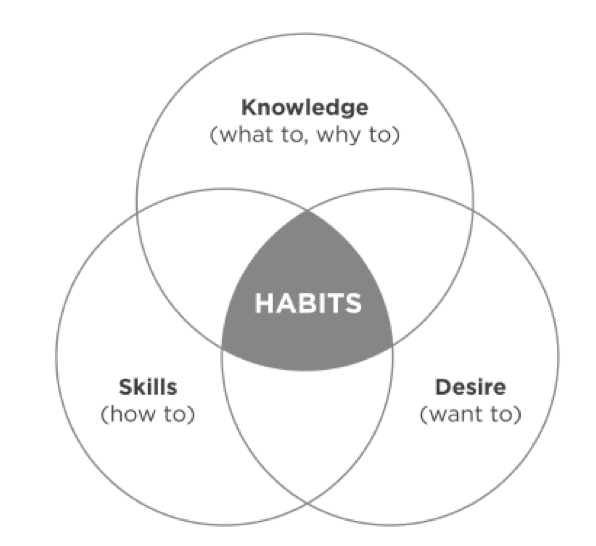

# The 7 Habits of Highly Effective People

*If you want to achieve your highest aspirations and overcome your greatest challenges, identify and apply the principles or natural laws that govern the results you seek.*

## Introduction

### Most common human challenges

**Fear and insecurity:** people today are gripped with a sense of fear. They fear for the future. They feel vulnerable in the workplace. They are afraid of losing their jobs and their ability to provide for their families. This vulnerability often fosters a resignation to riskless living and to co-dependency with others at work and at home. Our culture’s common response to this problem is to become more and more independent. “I’m going to focus on ‘me and mine.’ I’ll do my job, do it well, and get on to my real joys off the job.” Independence is an important, even vital, value and achievement but the problem is, we live in an interdependent reality, and our most important accomplishments require interdependency skills well beyond our present abilities.

**Want it now:** credit card mindset. get results immediately. Focus on short term.

*In fact we must constantly re-educate and reinvent ourselves. The real mantra of success is sustainability and growth. So we continuously need to invest in reinventing ourselves in work, family, health, relationship and community.*

**Blame and victimize.** Wherever you find a problem, you will usually find the finger-pointing of blame. Society is addicted to playing the victim. Blaming everyone and everything else for our problems and challenges may provide temporary relief from the pain, but it also chains us to these very problems.

*Be humble enough to accept and take responsibility for your  and courageous enough to take whatever initiative is necessary to creatively work your way through or around the challenges.*

**Hopelessness.** When we succumb to believing that we are victims of our circumstances, we lose hope, we lose drive, and we settle into resignation and stagnation. The survival response is cynicism—“just lower your expectations of life to the point that you aren’t disappointed by anyone or anything.” 

*The contrasting principle of growth and hope throughout history is the discovery that “I am the creative force of my life.”*

**Lack of life balance:** 

We are subordinating health, family, integrity, and many of the things that matter most to our work.
The problem is that our modern culture says, “go in earlier, stay later, be more efficient, live with the sacrifice for now”

*but the truth is that balance and peace of mind follow the person who develops a clear sense of his or her highest priorities and who lives with focus and integrity toward them.*

**“What’s in it for me?** Our culture teaches us that if we want something in life, we have to “look out for number one.”
The greatest opportunities and boundless accomplishments of the Knowledge Worker Age are reserved for those who master the art of “we.”
True greatness will be achieved through the abundant mind that works selflessly—with mutual respect, for mutual benefit.

**Being understood and influencer**

The greatest human  need is to be understood—to have a voice that is heard, respected, and valued—to have influence.

*The real beginning of influence comes as others sense you are being influenced by them—when they feel understood by you.*

The principle of influence is governed by mutual understanding born of the commitment of at least one person to deep listening first.

**Conflict and differences:** unleash the principle of creative cooperation in developing solutions to problems that are better than either party’s original notion!

## Inside out

To change ourselves effectively, we first had to **change our perceptions**. All the first  literature on how to be successful and happy within the last 200 years, focused on what could be called the **Character Ethic** as the foundation of success: things like integrity, humility, fidelity, temperance, courage, justice, patience, simplicity, modesty. The Character Ethic taught that there are basic principles of effective living, and that people can only experience true success and enduring happiness as they learn and integrate these principles into their basic character.

For **Personality Ethic** success became more a function of personality, of public image, of attitudes and behaviors, skills and techniques, that lubricate the processes of human interaction. The basic thrust was quick-fix influence techniques, power strategies, communication skills, and positive attitudes. Those skills are important but secondary.

For interpersonal relationships Personality ethic is short term driven. You make illusion but are not credible in long run.
**"You always reap what you sow"**. This principle is also true, ultimately, in human behavior, in human relationships.
Character Ethic has social recognition for their talents, they built trust and are eloquent in long term relationship.

### The power of paradigm.

Paradigm today means a model, theory, perception, assumption, or frame of reference. It could be pictured as a map. We have multiple maps in our mind. They can be divided into two main categories

- maps of the way things are, or realities,
- maps of the way things should be, or values.

We interpret everything we experience through these mental maps. We seldom question their accuracy; we’re usually even unaware that we have them. We simply assume that the way we see things is the way they really are or the way they should be. And our attitudes and behaviors grow out of those assumptions. **The way we see things is the source of the way we think and the way we act.**

This brings into focus one of the basic flaws of the Personality Ethic. To try to change outward attitudes and behaviors does very little good in the long run if we fail **to examine the basic paradigms from which those attitudes and behaviors flow.**

Each of us tends to think we see things as they are, that we are objective. But this is not the case. We see the world, not as it is, but as we are conditioned to see it.

The more aware we are of our basic paradigms, maps, or assumptions, and the extent to which we have been influenced by our experience, the more we can take responsibility for those paradigms, examine them, test them against reality, listen to others and be open to their perceptions, thereby getting a larger picture and a far more objective view.

**The power of paradigm shift:** We can only achieve quantum improvements in our lives as we quit hacking at the leaves of attitude and behavior and get to work on the root, the paradigms from which our attitudes and behaviors flow.

**Seeing and being:** Paradigms are inseparable from character. Being is seeing in the human dimension. And what we see is highly interrelated to what we are. We can’t go very far to change our seeing without simultaneously changing our being, and vice versa.

### The principles centered paradigm:

The Character Ethic is based on the fundamental idea that there are principles that govern human effectiveness. Those principles govern human growth and happiness. They are natural laws that are woven into the fabric of every civilized society throughout history and comprise the roots of every family and institution that has endured and prospered. Some of those principles are:

- **Fairness**, out of which our whole concept of equity and justice is developed.
- **Trust**: belief that someone or something is reliable, good, honest, effective
- **Integrity, consistency and honesty**. They create the foundation of trust which is essential to cooperation and long-term personal and interpersonal growth. [What is integrity](https://www.thebalance.com/what-is-integrity-really-1917676): a person with integrity demonstrates sound moral and ethical principles and does the right thing, no matter who's watching.
- **Human dignity**: the state or quality of being worthy of honor or respect
- **Service**, or the idea of making a contribution.
- **Excellence:** the quality to be extremely good
- **potential**, the idea that we are embryonic and can grow and develop and release more and more potential, develop more and more talents.
- **Growth**
- **Patience**: the capacity to accept or tolerate delay, trouble, or suffering without getting angry or upset.
- **Nurturing**: the ability to provide emotional and physical care or love
- **Encouragement**.

Principles are not practices. A practice is a specific activity or action. A practice that works in one circumstance will not necessarily work in another.

Principles are guidelines for human conduct that are proven to have enduring, permanent value. They’re fundamental. It is important to understand the difference between principles and values. Principles are natural laws that are external to us and that ultimately control the consequences of our actions. Values are internal and subjective and represent what we feel strongest about in guiding our behavior. 

Humility is the mother of all virtues. Humility says we are not in control, principles are in control, therefore we submit ourselves to principles. Pride says that we are in control, and since our values govern our behavior, we can simply do life our way. We may do so but the consequences of our behavior flow from principles not our values. In fact we should value Principles. 

When relationships are strained and the air charged with emotion, an attempt to teach is often perceived as a form of judgment and rejection.

THE WAY WE SEE THE PROBLEM IS THE PROBLEM

Could there be something —some paradigm within myself that affects the way I see my time, my life, and my own nature?

Do I have some basic paradigm about my spouse, about marriage, about what love really is, that is feeding the problem?
Can you see how fundamentally the paradigms of the Personality Ethic affect the very way we see our problems as well as the way we attempt to solve them?

### A New level of thinking

These are deep, fundamental problems that cannot be solved on the superficial level on which they were created. This new level of thinking is a principle-centered, character-based, “inside-out” approach to personal and interpersonal effectiveness.

The inside-out approach says that private victories precede public victories, that making and keeping promises to ourselves precedes making and keeping promises to others.

- if you want to have a happy marriage, be the kind of person who generates positive energy and sidesteps negative energy rather than empowering it.
- If you want to have a more pleasant, cooperative teenager, be a more understanding, empathic, consistent, loving parent.
- If you want to have more freedom, more latitude in your job, be a more responsible, a more helpful, a more contributing employee.
- If you want to be trusted, be trustworthy

Inside-out is a process—a continuing process of renewal based on the natural laws that govern human growth and progress. It’s an upward spiral of growth that leads to progressively higher forms of responsible independence and effective interdependence.

### Questions

???+ question "What is the difference between the Personality and Character ethics?"
    Character ethic learns and integrates basic universal human principles into their basic character to live effective life and be happy.
    Personality ethic builds success as a function of personality, of public image, of attitudes and behaviors, skills and techniques, that lubricate the processes of human interaction. It took two paths: one was human and public relations techniques, and the other was positive mental attitude (PMA).

* what is the disadvantage of relying solely on the Personality ethic?

Superficial, manipulative, focusing on techniques, not on personal values, it misses the connection with the deepest  why, the values transferred generations after the other.

Was there a time in your life when you've felt this way--and it might be right now? 

What was (is) your mindset to cause those feelings, and how does this affect your behavior? 
What price are you paying because of these limitations? Mm

What might be the payoff if you could change your thinking and your behavior? 

Talk about how personal conditioning colors perspective in your own experiences. How difficult is it to achieve objectivity--in life generally and in your own life? 

Stephen says that to change “we must look at the lens through which we see the world.” How are you able to do this? How can we become more aware of our lenses (paradigms)? 

What is a positive paradigm you have toward working with your colleagues, and how does this paradigm affect your behavior and your relationships with clients?

 What is a paradigm regarding your work that sometimes hurts your efforts and your results? 
What can you do to change this? 
Regarding the personality and character ethic—does this mean it is bad to have a personality? 
What is an example of how your organization operates with clients that demonstrates high character on the part of your organization? 
What was a time when you demonstrated poor character, as an adult or as a child, i.e. violated a confidence, demonstrated poor discipline, etc.? 
What was the outcome, short term and long term? Were you able to make up for this lapse? How? 
It is important to stay focused on strengths, which everyone has, and on how we can focus or apply these strengths. What is one of your strongest character attributes, and what is an example of how you demonstrated this with friends or family? 
What about with colleagues or clients? Why is it more important to work on your paradigms than on your behaviors? 
What are the consequences of paradigms that aren’t aligned with correct principles?

## C2: 7 habits overview

Our character, basically, is a composite of our habits. “Sow a thought, reap an action; sow an action, reap a habit; sow a habit, reap a character; sow a character, reap a destiny,”
Habit is at the intersection of knowledge, skill, and desire.

- Knowledge: what to do and why
- Skill: how to do
- Desire: want to do

Creating a habit requires work in all three dimensions. 

The 7 habits are In harmony with the natural laws of growth, they provide an incremental, sequential, highly integrated approach to the development of personal and interpersonal effectiveness. They move us progressively on a Maturity Continuum from dependence to independence to interdependence.

- On the maturity continuum dependence is the paradigm of you—you take care of me; you come through for me; you didn’t come through; I blame you for the results
- Independence is the paradigm of I—I can do it; I am responsible; I am self-reliant; I can choose.
- Interdependence is the paradigm of we—we can do it; we can cooperate; we can combine our talents and abilities and create something greater together.

True independence of character empowers us to act rather than be acted upon. It frees us from our dependence on circumstances and other people and is a worthy, liberating goal. But it is not the ultimate goal in effective living.
Interdependence is a far more mature, more advanced concept. If I am physically interdependent, I am self-reliant and capable, but I also realize that you and I working together can accomplish far more than, even at my best, I could accomplish alone. If I am emotionally interdependent, I derive a great sense of worth within myself, but I also recognize the need for love, for giving, and for receiving love from others. If I am intellectually interdependent, I realize that I need the best thinking of other people to join with my own.

Effectiveness lies in the balance—what is called the P/PC Balance. P stands for production of desired results, the golden eggs. PC stands for production capability, the ability or asset that produces the golden eggs.

When people fail to respect the P/PC Balance in their use of physical assets (machines) in organizations, they decrease organizational effectiveness.
The PC principle is to always treat your employees exactly as you want them to treat your best customers.
PC work is treating employees as volunteers just as you treat customers as volunteers, because that’s what they are. They volunteer the best part—their hearts and minds.

## Habit 1: Being proactive

we need to constantly be aware of ourselves and our world, our paradigms to determine whether they are reality- or principle-based or if they are a function of conditioning and conditions. Develop self-awareness: 

- Can you look at yourself almost as though you were someone else?
- Think about the mood you are now in. Can you identify it? What are you feeling?
- How your mind is working. Is it quick and alert?

Awareness is a core emotional intelligence characteristic.

“self-awareness” or the ability to think about your very thought process. When we are not able to see others and their world, we will project our intentions on their behavior and call ourselves objective.

We are not our feelings. We are not our moods. We are not even our thoughts. (See also untethered soul book) 
There are three theories of determinism to explain the nature of a man:

- genetic determinism: what grand parents did to you via DNA
- psychic determinism: what your parents did to you via education
- environmental determinism: your boss, your spouse, your economic environment are doing to you

All are based on the stimulus-response theory.
Between stimulus and response, man has the freedom to choose the response. 
Liberty represents more options to choose from in the current environment / context, while freedom is more internal power to choose the response

- we have imagination— the ability to create in our minds beyond our present reality.
- we have conscience— a deep inner awareness of right and wrong, of the principles that govern our behavior, and a sense of the degree to which our thoughts and actions are in harmony with them.
- we have independent will— the ability to act based on our self-awareness, free of all other influences.

Proactivity means that as human beings, we are responsible for our own lives. Our behavior is a function of our decisions, not our conditions. We can subordinate feelings to values. We have the initiative and the responsibility to make things happen. 

Highly proactive people recognize that responsibility (ability to choose their response). They do not blame circumstances, conditions, or conditioning for their behavior. Their behavior is a product of their own conscious choice, based on principles (fairness, integrity, honesty, dignity, accountability, quality, excellence, growth, patience, nurturing, and encouragement), rather than a product of their conditions, based on feelings.
They are value driven.
Reactive people build their emotional lives around the behavior of others, empowering the weaknesses of other people to control them. They are also affected by the physical environment, like the weather.

The ability to subordinate an impulse to a value is the essence of the proactive person. Reactive people are driven by feelings, by circumstances, by conditions, by their environment. Proactive people are driven by values carefully thought about, selected and internalized values.

Taking initiative does not mean being pushy, obnoxious, or aggressive. It does mean recognizing our responsibility to make things happen. 

Listening to our language to assess where we stand:

In the great literature of all progressive societies, love is a verb.  So love her. Serve her. Sacrifice. Listen to her. Empathize. Appreciate. Affirm her. Reactive people make it a feeling. They’re driven by feelings. 
Love is a value that is actualized through loving actions.
Proactive people make love a verb. Love is something you do: the sacrifices you make, the giving of self. 

CIRCLE OF CONCERN/CIRCLE OF INFLUENCE

Another excellent way to become more self-aware regarding our own degree of proactivity is to look at where we focus our time and energy. 

Proactive people focus their efforts in the Circle of Influence. They work on the things they can do something about. The nature of their energy is positive, enlarging and magnifying, causing their Circle of Influence to increase.

Reactive people, on the other hand, focus their efforts in the Circle of Concern. They focus on the weakness of other people, the problems in the environment, and circumstances over which they have no control. The negative energy generated by that focus, combined with neglect in areas they could do something about, causes their Circle of Influence to shrink.

By determining which of these two circles is the focus of most of our time and energy, we can discover much about the degree of our proactivity.

The problems we face fall in one of three areas:
- direct control (problems involving our own behavior). They are solved by working on our habits.
- indirect control (problems involving other people’s behavior). They are solved by changing our methods of influence.
- no control (problems we can do nothing about, such as our past or situational realities). Just smile and learn to live with them, even though we don’t like them. In this way, we do not empower these problems to control us. 
Whether a problem is direct, indirect, or no control, we have in our hands the first step to the solution. Changing our habits, changing our methods of influence and changing the way we see our no control problems are all within our Circle of Influence.
 
One way to determine which circle our concern is in is to distinguish between the have’s and the be’s. The Circle of Concern is filled with the have’s: “I’ll be happy when I have my house paid off.”

If I really want to improve my marriage situation, I can work on the one thing over which I have control—myself. I can stop trying to shape up my wife and work on my own weaknesses. I can focus on being a great marriage partner, a source of unconditional love and support.
There are so many ways to work in the Circle of Influence—to be a better listener, to be a more loving marriage partner, to be a better student, to be a more cooperative and dedicated employee. Sometimes the most proactive thing we can do is to be happy, just to genuinely smile. Happiness, like unhappiness, is a proactive choice.

While we are free to choose our actions, we are not free to choose the consequences of those actions. Consequences are governed by natural law.

The proactive approach to a mistake is to acknowledge it instantly, correct and learn from it.
It is not what others do or even our own mistakes that hurt us the most; it is our response to those things. (think to the snake bite)

Making and keeping commitments
At the very heart of our Circle of Influence is our ability to make and keep commitments and promises. The commitments we make to ourselves and to others, and our integrity to those commitments, is the essence and clearest manifestation of our proactivity.

30 days exercise: proactive application
1.  For a full day, listen to your language and to the language of the people around you. How often do you use and hear reactive phrases such as “If only,” “I can’t,” or “I have to”?
2. Identify an experience you might encounter in the near future where, based on past experience, you would probably behave reactively. Review the situation in the context of your Circle of Influence. How could you respond proactively? Take several moments and create the experience vividly in your mind, picturing yourself responding in a proactive manner. Remind yourself of the gap between stimulus and response. Make a commitment to yourself to exercise your freedom to choose.
3. Select a problem from your work or personal life that is frustrating to you. Determine whether it is a direct, indirect, or no control problem. Identify the first step you can take in your Circle of Influence to solve it and then take that step.
4. Try the thirty-day test of proactivity. Be aware of the change in your Circle of Influence.

Summary:
Proactive people focus their efforts in the Circle of Influence. They work on the things they can do something about.
Ask what is  the situation of the problem at hand. What is happening here… search of the stimulus.
Their behavior is a product of their own conscious choice, based on values, rather than a product of their conditions, based on feeling.
catch your emotional response before it leads to obsessive thinking
