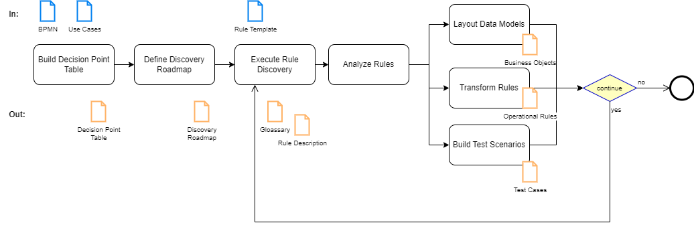
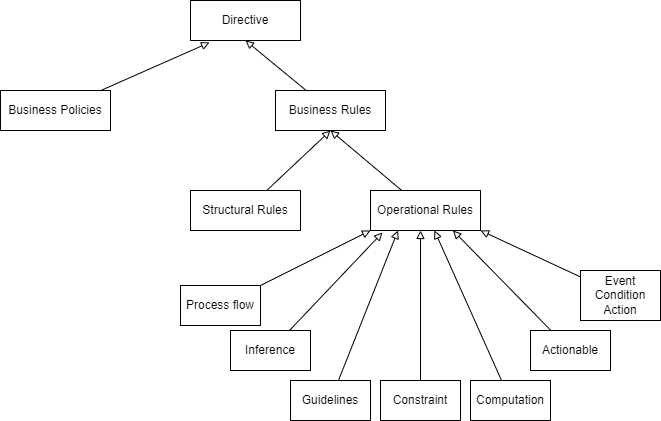

# Rule Harvesting

!!!- info "Update"
    This chapter is extracted from the Agile Business Rule Development Book with integration in a 2024 context.

Rule harvesting includes the two main activities of rule discovery and analysis, with the goal to understand the business entities (conceptual data model) within the scope of the application and to identify and extract the rules. A key activity in the rule harvesting phase is to formalize the decisions made during the execution of the business process by defining the different decision point candidate for business rule implementation. 

Agile Business Rule Development puts the emphasis on developing the system through short iterations. Each iteration produces a working set of rules. Feedback from the harvesting and prototyping phases force the subject matter experts to better understand their own business processes, and help them to adapt those processes for more efficiency. Rule harvesting is a short project activity executed for each decision point in scope for implementation.

The process flow may look like in the following Figure:

The purposes of Rule Discovery and Analysis activities are: 

* To define the rule classification from the business process 
* To attach decision point to business process activities and / or use case steps 
* To define the rule sources for the discovery and the type of roadmap to support the knowledge acquisition. 
* To formalize the rules using templates and business term and language understood by the business user 
* To prepare the test data  for the rules 
* To define the object model for the rules

## Rule Discovery

Rule discovery, also called Business Rules Modeling in the industry, aims to develop simple modeling artifacts like rule descriptions, business entity diagrams, and business process maps.

Rule discovery involves an iterative process wherein a subset of rules is identified and documented, rather than investing months in comprehending all the rules initially and generating an extensive document.

Business rule discovery techniques share similarities with traditional requirements elicitation methods, but with one key distinction: they prioritize identifying specific needs that directly impact decision-making within the company. 

The sources for starting a rule discovery activity is a business process description, or use case description. From the business process description in BPMN map study the task or activity description and search for verb which involves mental processing or thinking. Work with the Subject Matter Expert or with the business analyst responsible to document the Business Process on how the decision on those activities are done. For any decision log them in a table with the task reference, the intent and enforcement description.

| Decision Point  Name | Description | Source for Rule Discovery | Current State of Automation | Enforcement | Ownership | 
| --- | --- | --- | --- | --- | --- |
| Data validation | Validate the information entered around the borrower, the amount requested, the property | 1003 forms & legal document per state and federal | Some rules are implemented in the current GUI used to enter the data in the system | Data entry in system | John |
| Calculate Risk grade and credit score | Calculate the value of different parameters such as the credit score and the risk grade | Score cards, Excel files | None | Once loan and property data validated | Jack |

**Example of Decision Point Table**

The decision points table (DPT), helps at defining where to find the rules (rule sources), and which method to use for the rule harvesting. The rule discovery process changes according to the sources used. For example, working from a legal document implies a different discovery process than the discovery based on interviewing a subject matter expert, or extracting rule from executable software code.

???- guideline "Decision point table"
    There are different ways to extract the decision points table. For user stories approach, search for verb which involves mental processing or thinking: `check, qualify, compute, calculate, estimate, evaluate, determine, assess, compare, verify, validate, confirm, decide, diagnose, and process`. Behinds those verbs the team extracts a lot of business knowledge and how the business decisions are made in each activity. When using process modeling approach, identify the branch points in the process. The decisions to route to one of the sub branches can be considered as business rules, but the most important focus should be on the activities before the diamond: is there any mental thinking verbs in the description of this task?Assess how decisions are made within those tasks.

### Classification of business rules

Before deciding how to write rules and where to implement them, you first need to understand which types of rules your team will be harvesting. In early 2008, the Object Management Group (OMG) finalized a specification for documenting the semantics of business vocabularies and business rules, entitled called Semantics of Business Vocabulary and Business Rules (SBVR)

SBVR is part of the OMG’s Model Driven Architecture (MDA) with the goal to capture specifications in natural language and to represent them in formal logic so they can be automated. SBVR includes two specialized vocabularies: 

* Vocabulary for describing Business Vocabularies, which deals with all kinds of terms and meanings
* Vocabulary for describing Business Rules, which deals with the specification of the meaning of business rules, and builds on the business vocabulary.

The meaning is what someone understands or intends to express. The meanings are derived into concepts, questions and propositions. A phrase such as "We deny the invoice if the medical treatment was done after one year of the accident" has a clear meaning for a claim processor within a car insurance company. Analysts need to logically transform this meaning into concepts that have a unique interpretation so that we can represent the business knowledge within a comprehensive vocabulary. Concepts include a unique combination of characteristics or properties. 

Within the Business Motivation Model, the OMG has also defined the relation between business policies, directives, business processes, and business rules. This work is very important to clearly classify each of those concepts. 

The OMG definition of **business policy** is: “A non-actionable directive whose purpose is to govern or guide the enterprise. Business policies govern business processes”. A **Business rule** is “– A directive, intended to govern, guide, or influence business behavior, in support of business policy that has been formulated in response to an opportunity, threat, strength, or weakness. It is a single directive that does not require additional interpretation to undertake strategies or tactics. Often, a business rule is derived from business policy. Business rules guide a business process”. 

For the purpose of rule harvesting, keep in mind that business rules are actionable, unambiguous, and derived from the business policy. Considering rules as semantically meaningful, rather than business policies, is key to making them executable.

The OMG BMM reuses some classifications from the SBVR:  business rules are separated into two possible classes: 

* Structural (definitional) business rules which are about how the business organizes the things it deals with, they are considered as necessity. In this context the statements describing the rule can describe the necessity, the impossibility or the restricted possibility. 
* Operational (behavioral) business rules govern the business conduct. They are considered as an obligation and are directly enforceable. When considering operational business rules it is important to look at the level of **enforcement** and where the rule enforcement occurs. Statements to describe the rules include obligation, prohibition, and restricted permission. The action part of the rule is as important as the condition. The action drives where the enforcement may happen. 

In SBVR, rules are always constructed by applying necessity or obligation to fact types. A fact type is an association between two or more concepts. 
Another approach to define facts is to use the Ontology Web Language (OWL) and Resource Description Framework (RDF). Developed to specify semantic web3, OWL and RDF can be used to model the enterprise ontology. The ontology is the source for data models used by the rules as an alternate to traditional OOA and SBVR. OWL and RDF implement an object-relational model allowing creation of a directed graph, a network of objects and relationships describing data. 

Using a mix of the SBVR classification for business rules, OWL – RDF to describe the domain and an older rule classification model which we have used for years in consulting engagements, the different types of business rules can be presented as follows:
 

**Figure 2: Business Rule Schema**

 This schema represents a conceptual breakdown of the different types of rules that are relevant to the business, including structural and operational rules. 

Structural rules define the terms used by the business in expressing their business rules and the relationships (facts) among those terms. These comprise the vocabulary used in rule authoring. As an example a statement like: An Insurance Policy includes a set of coverage. The policy is effective at a given date and needs to be renewed every six months. Transforming this statement implies defining a structure in the insurance domain, where an insurance policy entity has an effective date, expiration date and a list of coverage.

Operational rules are the rules that implement business decision logic. When a business decision is made (e.g. whether to sell a given insurance policy, whether to accept or reject a claim), the business rules are the individual statements of business logic that are evaluated by the rule engine to determine the decision result. 

The following table is adapted from the work by Barbara Von Halle, and is a simplified view of the business rules group classification. It details those categories:

| Rule Classification | Explanation | Expression |
| --- | --- | --- |
| **Mandatory constraints** | Rules that reject the attempted business transaction. | Grammar to use during rule documentation: **{term} MUST HAVE {at least, at most, exactly n of} {term}; {term} MUST BE IN LIST [a,b,c]**. For the SBVR expression: **it is [not] necessary that {fact}**|
| **Guidelines** | Rules that does not reject the transaction; they merely warn about an undesirable circumstance. Usually translates to warning messages. | {term} SHOULD HAVE {at least, at most, exactly n of} {term}; {term} SHOULD BE IN LIST [a,b,c]**. For the SBVR expression: **it is [not] possible that {fact}**|
| **Action-enablers** | Rules that tests conditions and upon finding them true, initiate another business event, message, business process or other activity | **IF {condition} THEN {action}** | 
| Computations | Rules that create new information from existing information based on mathematical computation. | **{term} IS COMPUTED AS {formula}** |
| **Inferences** | Rules that create new information from existing information. The result is a piece of knowledge used as a new fact for the rule engine to consider. | **IF {term} {operator} {term} THEN {term} {operator} {term}** |
| **Event Condition Action** (ECA) | Rules where the condition is evaluated once the occurrence of an event is found. Most ECA rules use temporal operators to search events related to their timestamp of creation or occurrence. | **On {event} when {condition} then {action}** |

To implement guidelines and constraints, you need to consider what happens when they are violated. Most of the time, the action raises an exception or a high priority issue to be managed later in the business process, which may reject the business event. The rule needs to report clearly on the selected decision so that a human can understand and act on the business transaction. 

A **guideline** written as: "The date of loss should be before the expiration date of the policy" may translate to the following rule: if the date of loss is after the expiration date of the policy, then create a warning ticket for the claim processor to handle. This implementation allows the insurer to make allowances for an insured person who has a history of regularly renewing the policy but for some reason forgot to renew on time.

A **constraint** written as: "The borrower must put a minimum cash down of 5%", translates to this rule: if the minimum cash is below 5% then reject the loan application with the reason ‘The borrower must put minimum cash down of 5%’. 

**Action enabler** rules modify, create or delete terms or association between terms, or execute methods which can be web service. For example, a rule like: "if a driver has made one or more at-fault claims in the current year, decrease the discount rate by 3%", updates an attribute (“discount rate”) of an object.

**Computation** rules implement mathematical equations and assign values to variables according to a set of given criteria. For example, a risk factor variable can be computed according to the age of the driver. It is important to note that management of computation rules may require managing the entire ruleset together, if there are rules that are required to be managed prior to those calculations and at the terms of the calculation. 

**Process flow** routing rules direct the movement through a process flow or workflow. Process flow rules are distinct from business logic rules. It may be helpful to distinguish process flow rules from the business logic rules that determine the values of the parameters on which the process flow is directed as such rules are more often complex and numerous than routing rules. Routing rules may be written as: "if there is at least one exception in previous activity of the process goes to this task if not continue on the main path". The business logic to define if there is an exception is made within a rule engine with a lot of rules to evaluate and execute. 

**Inference rules** use syntax similar to action enabler rules, but they create new objects or facts which may bring the rule engine to re-evaluate some other rule’s eligibility. 

During discovery, it is important to understand the execution context as seen by the business user, and be able to answer questions like: “If executing this rule modifies the state of the claim, will the eligibility rules that have already executed need to be reevaluated?”  For example, an insurance policy underwriting rule that says if the age of the driving license is below 3, add a risk factor of 50 and reevaluate the total risk score, modifies the risk scoring variables, which requires that other rules be reevaluated.

It is possible to continue the decomposition of those rules. For example transformation rules in ETL (Extract Transform Load) are often considered separate from other business rules; although in pattern they are essentially inference rules and computation rules. Data transformation rules, while important to the business, are a side effect of system implementation rather than a reflection of core business logic. For implementation, the decision to use a rule engine for data transformation rules depends on whether the rules are static, dynamic, or business driven. Some implementations use a rule engine to easily implement transformation rules between two data models instead of using a complex scripting language when the transformations have to be maintained by business users.

Complex Event Processing (CEP) statements (or rules) support a category of business rules related to real-time event filtering, event aggregation and correlation, and applying pattern matching conditions on attributes of events. CEP applies business rules to a stream of data. A business rule to detect fraud on banking cards may be written as: "Raise a warning alarm if more than one transaction for an amount over $100 is received from the same merchant on the same card number within the last 15-minutes".

According to the preceding rule classifications, this rule would be considered a mix of ECA and inference rules. However, one important dimension of this type of rule is the time window constraint on which the rules apply and the type of language used to write the rule. Today most of those languages are based on SQL and includes operators to look at time window. The action part of the rule creates new events (called the complex events) which are managed by a downstream application. 

In addition to industry standards, as described above, the following table include commonly used rules:

| Rule Classification | Type of application | Example
| --- | --- | --- |
| **Compliance Rules** | Rules that reject the attempted business transaction. Yes/no result but completed with reason code and explanation. Found in Underwriting, Fraud detection, Data and form validation. | Example: Whoever receives a commission paid by an insurance company for the sale of an insurance policy needs an insurance license. |
| **Rating** | Strongly interrelated rules that compute metrics for a complex object model. Scoring and rating, Contracts and allocation, Pure calculations on an object providing a final value (or rating). | Example: if the driver is between 16 and 22 years old the risk is set to 400. If the driver is between 23 and 27 the risk is set to 300 |
| **Correlation** | Strongly interrelated rules that correlate information from a set of objects to Compute some complex metrics. Billing and cost estimation. Complement by inserting information. | Example: if the medical bill references a patient, and the patient is not declared in the related claim then there is an issue on the claim description or the invoice is not related to a patient covered | 
| **Stateful** | Strongly interrelated rules that correlate events in a stateful way. Stateful in this context means the internal states of the engine are maintained between rule execution invocations. Alarm filtering and correlation, Web page navigation, GUI customization | Example: if there is an alarm L1 on network element A and an alarm L2 on network element B and a direct link exists between A and B then the alarm L1 is linked to L2, remove alarm L2. |

Rule classification plays a crucial role in streamlining the decision service design, as it allows for an optimal implementation of each rule. Inference and action enabler rules are particularly well-suited for utilization within a rule engine. On the other hand, purely computational rules are typically implemented through code, unless they are subject to frequent changes in applicability criteria or have strong interdependencies with other business rules. Furthermore, rule classification aids in assessing the complexity of rules and estimating the associated implementation workload.

### Discovery activities

The discovery activities are conducted during the elaboration phase of the project, but the same process is conducted even after the system has gone into production when there is a new business event, or when there is a need to modify some decision or some business policy. 

Companies have been operating with business rules for many years, but the form of these rules is not externalized and managed as standalone artefact. Capturing business rules relies on a combination of eliciting business requirements, reverse engineering existing application code and formalizing expert’s knowledge. Business rules are not just requirements: they specify how a business process is executed, how decisions are made, and how domain knowledge is structured. When using a business rule approach, we are working at the business process and policies level to understand the constraints and the behaviors of the process. 

 The most unique aspect of the rules discovery phase is the perception of a business event as a set of decision-rich activities. We unfold the processing of a business event as a set of decisions and policies. We then dissect the decisions and policies into executable and precise business rules that guide the business event in a predictable and desirable manner. 

There are two dimensions to consider when preparing the rule discovery activities or roadmap:

1. The source of rule, which can be:

    * the documentation which includes all sorts of documents (business plans, deliverables of earlier projects, legislation, regulations, standards, business requirements for the current project), 
    * the tacit know-how: the unwritten "way we do things", embodied as a collective way of doing things (organizational intelligence), or as individuals' expertise, 
    * the legacy system which includes an operational system that implements some of the business logic (code mining)
    * the bBusiness records as the way particular customer requirements have been satisfied, pricing formulas used in previous contracts

1. The type of analysis techniques used by the project team: 

    * Business event analysis performed during event storming workshop
    * Use case and user story elaboration, 
    * Business process modeling using BPMN or event storming 
    * Business mission and strategy analysis, using design thinking practices
    * Data analysis: it is true that doing Machine Learning with decision tree construction may be implemented using operational rules.

Obviously the know-how discovery is the most difficult elicitation task to execute, and the one that usually takes the longest time. We will provide details later in this section on how to conduct such an elicitation workshop. 

The following table is giving the different possible starting points for the discovery activities based on the analysis method used:

| Starting Point | Analysis Description |
| --- | --- |
| **Business Events** | Start with the business events and review how it is processed, and enforced policies |
| **Use case** | Analyze use case description to find decision points and then rules. This is the preferred approach, for teams familiar with use cases, or user stories. |
| **Business Process - Workflow** | Evaluate individual process steps and tasks to define the decision behind activity and then the rules. Used when the organization uses process decomposition for the requirements gathering and analysis phase. |
| **Data analysis** | "Take into account the life cycle of key business objects and extract the underlying processes and decisions involved in altering the data's state. This analysis can commence with the examination of the logical data model and the methods by which business entities are created, updated, and deleted, along with their respective states. One example of such an approach is to look at the States of an Insurance Policy, and how, who, when changes are made. |

It is important to set the expectation among the stakeholders that not all the rules will be discovered during this phase. The goal is to complete the rule discovery up to 40-60% so we can have some tangible decisions on standard business events to process. The rule developers  will increase the amount of rules in scope during future project iterations. 

### Discovery roadmap

The selection of the type of roadmap is linked to the rule source. 

* **Static analysis** process uses reading and highlighting the rules within documentation which can be legal, internal policies, procedure. The team has to gather all the related documents with the reference on version, date of creation and validity... The elicitation is based on reading sessions completed with Question / Answer workshop sessions.
* **Interactive** involves working sessions with subject matter experts who have the knowledge of the business process and the decisions within a process task. Also a person doing the day to day activity is a very good source to understand how decisions are made and how exceptions to the main business process are handled. The process to elicit rules from people will be accomplished by using elicitation workshop.
* **Automated** involve using a computer and special applications to search for rule statement within procedure code, SQL procedures, code listing… When using rule mining technology we have to be careful to not lose the context of execution in which the if-then-else statement was implemented. Therefore code review should always be complemented by workshop sessions with Q&A.

???- guideline "Code mining"
    Code mining may be interesting, but developers need to be able to assess:

    * Who has the knowledge of the current code? Is this person still in the company?
    * Should the current business context use the same business rules as 15 or 20 years ago?
    * Not all ‘If-then-else statement’ in legacy code represents business rules, sometimes procedures, functions and algorithms may be an implementation of business rules. The context of execution is a very important dimension to understand before reusing a coded business rule as-is.
    * Variable names were often limited to 8 characters in a flat data model. There is no need to keep it that way. You may want to think about designing an efficient object oriented model.
    * Most of the time, automatic translation of badly coded business rules will generate bad business rules in the new environment.
    * Business rules implemented for a business rule engine have a different structure than procedural code. They should be more atomic and isolated, and the rule writer may leverage the inference capacity of the engine. Therefore the automatic translation will produce poor results.

The following table summarizes the different techniques classified per type of source:

| Source | Static analysis | Interactive | Automated |
| **Documentation** | Very good fit | As a complement of static analysis | Potential with Generative AI |
| **Know-how** | Not applicable | Unique solution | AI Agent may help defining discovery question to SMEs |
| **Code** | Efficient | As a complement of the other processes | Good result, improved with Gen AI |

When the source of the business rules is people, individual interviews are required to get the core of the knowledge and then followed up with workshops to resolve outstanding issues and process exception paths with the team.

Rule elicitation is an ongoing activity you perform throughout the project. Collaboration with your stakeholders is critical. They will change their minds as the project proceeds and that’s perfectly fine. Remember that there are different types of languages for expressing business rules. 

* Natural language
* Restricted Language
* Formal expression using a specific grammar
The natural language is initially used during business conversations to describe the rules, informally, without trying to impose any structure, for example with people sitting around a table. At this stage, we don't have any templates or guidelines for structure that we need to abide to. Using this language we may have redundancy and inconstancy in the rule expressions and in the business terms used. 

A second evolution is using a restricted language, still consumable by both analysts and developers, but where we have imposed some structure and grammar to the language so we can express rule statements with proper form. SBVR is proposing the restricted English to support this. The statement may not be correct semantically (redundancy, consistency, etc.) but we can formalize the business term and glossary of terms.

The third type of language is precise and there are no ambiguities: the rule refers exactly to information system objects. This language is parse-able and non-ambiguous, and can be executed by a computer.

An example of rule template:

| Business Activity: | | |
| --- | --- | --- |
| **Decision Name:** | | | 
| **Policies reference:** | | |
| **Ownership:** | | |
| **Rule Name** | **Rule Statement**  | **Notes** |
| Accident Prone Customer | Use the raw natural language of the business conversation. Later we may need to use a more strict language like the restricted English of SBVR.  A customer who had an accident report in the past is marked as accident prone | Use comment for example to describe the type of rule, inference | 
| | |

???- info "Rule Language"
    A formal language features sentences which have a clear and unambiguous interpretation. There are different kinds of formal languages:

    * Predicate logic using syntax like: (" X,Y) [Claim(X) L MedicalInvoice(Y) L Relation(X,Y) => (claimRefNumber(Y) = claimNumber(X))]
    * Object Constraint Language (OCL) : is an addition to UML to express constraints between objects that must be satisfied
    * Truth tables or decision table which present rule as row and columns representing conditions and actions
    * Semantics of Business Vocabulary and Business Rules or SBVR which defines structural and operational rules as well a vocabulary to define business concepts.
    * JRules Technical Rule Language executable by a rule engine
    * JRules Business Action Language, high level language close to English which is formal as it is using a unique interpretation and unique translation. Rule writers pick among a set of predefined sentences

### Discovering rules from SMEs

Interviews and analysis workshops are the two types of interaction used with subject matter expert. For interviews, the typical number of people in the same room is around two or three and for workshops six to ten people are involved. Workshops can last several days. Interviews are used at the beginning of the discovery phase and will most likely address one area of the business process. The analysis workshop is perhaps the most powerful technique for eliciting a lot of requirements. It gathers all key stakeholders together for a short but intensely focused period. The use of a facilitator experienced in requirements management can ensure the success of the workshop. Brainstorming is the most efficient technique used during the sessions. 
 Brainstorming involves both idea generation and idea reduction. The most creative, innovative ideas often result from combining, seemingly unrelated ideas. Various voting techniques may be used to prioritize the ideas created. Allow for human behavior but control the following points:

* Do not “attack” other members
* Do not come back late from a break, even if Key shareholders may be late returning because they have other things to do. The sessions are short so they should be able to do other activities during the day.
* Avoid domineering position

Some suggestions to improve the process:

* Facilitator keeps a timer for all breaks and fines anyone that is late, everyone gets one free pass
* Facilitator encourages everyone to use 5-minute position statement
* In case of long discussion without reaching firm conclusion or agreement it is good to use the business concerns to drive the elicitation
* If the rule is not clear this is good practice to prototype it.
* Use concrete scenarios to illustrate some rules. These scenarios can later be leveraged for tests.

The following table lists the standard questions the analyst team may ask during the workshop depending of the source: 

| Type of input document | Questions | Type of artifacts impacted |
| --- | --- | --- |
|Use case or Business Process map | In this activity, what kind of control  the worker responsible to perform the task ? What kind of decisions? On this use case step, the person assess the application, what kind of assessment is he doing? Is there a standard check list? | Use case or BPM, Rule description document |
| Rule description, Conceptual  data model | What do you mean by …. (a business term to clearly define).  How does it relate to …. (other business term) | Conceptual  data model |
| Rule statement | What about the other ranges of possible values for this condition? How often does this condition change? Do you have some other cases? | Business Entities Diagram, Rule description document |

Between sessions, verify that business terms are well defined and the rules make sense and do not have logical conflicts. Log all the questions related to this analysis in an issue tracking document (Open Points).

### Discovering rules from documents

This approach is used when Governmental Administration or policy group issues legal documents. We did observe this work requires courage and rigor. When using electronic documents, we used the following practices:

    * Annotate the document on anything that needs some future discussion
    * Copy and paste the business policy declared in the document to the rule template to clearly isolate it for future analysis. 
    * Work in a consistent/systematic way to ensure a good coverage. 
    * Check for agreement with the current business model as you go along. 
    * Investigate discrepancies and log them. 
    * Focus on stakeholder understanding (communication is key), and insist to clarify how a legal rule is interpreted by the line of business.

One risk with this approach is that the reader is making his own interpretation of the context, and the document may not include all the cases and criteria leading to interpretations. It is sometimes difficult to get the business motivation behind a written policy. We recommend applying a rigorous method to be able to achieve the following goals: 

    * Get an exhaustive list of the business events under scope: log them in a table 
    * Get the activities, tasks, processes that support the processing of those business events 
    * Identify where the business rules could be enforced in the process
    * Get the business motivation behind the rules 
    * Get explanation on rules if they are unclear, ambiguous. 
    * Try to extract the object model under scope, domain values by looking at the terms used by the rules…. 

We should still apply agile modeling by involving the SMEs to get feedbacks on the findings, assumptions and issues. Use simple diagrams to communicate with the project stakeholders.

### Discovering rules from code

Discovering rules from application code is time consuming and does not lead to great results. The analyst needs to study a lot of lines of code, and procedures to find the conditional operators which are linked to business decisions. Depending on the design and code structure of the application this work can be very time consuming. It is important to remember the context of execution when the “if statement” is executed, some variables may change the context of this “business rules”. With some languages using limited length to define variable names it is more difficult to relate such variables to business entities. A variable in one procedure can have a different name but the same meaning. Code mining tools exist on the market and help to extract business rules and the variables meanings. It is important to keep in mind that rules written in the past may not be relevant any more. Lastly, as stated previously, most of the rules implemented as procedural function, need a deep refactoring before deployment to a rule engine. 

Code mining is commonly requested by people as it reassures the business team that the rule harvesting starts by the existing behavior of the legacy code. Code mining is usually better used to confirm behavior of some litigious points identified from using other techniques than to try to extract all of the rules as a whole. Rule discovery with SME, using workshop sessions, may conduct to ambiguities or misconceptions. Trying to understand how the rules are implemented in the current system helps to resolve such situations.  

### Documenting the business rules

To document the rule, try to use the language of the business ("problem domain") rather than the language of the technology ("solution domain"). The following rule is as stated by a business user in a car rental industry:
`A driver authorized to drive a car of group K must be over 29`

A rule developer may think to document the rule as:

`If the age of the driver is less than 29 and the requested group of the reservation is K, modify the authorized attribute of the driver accordingly.`

As stated above it is important to identify the different languages used to document the rule. The rule statements may evolve with time. We use different templates for documenting rules, depending of the type of discovery roadmap. 