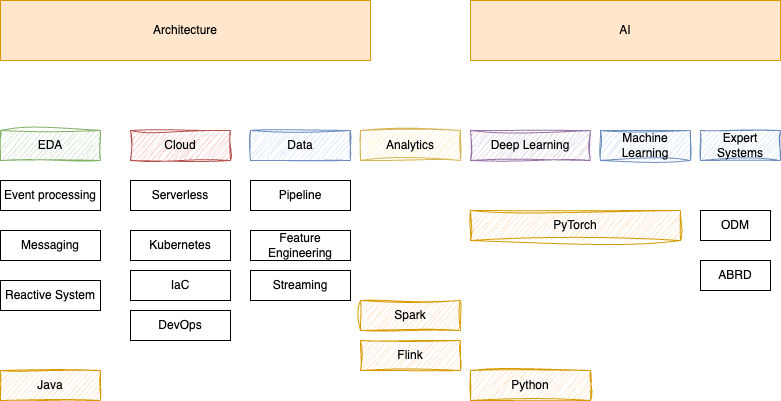

# Skills

This section presents my working content for skill set, certification...

1/2024 Skill Map

## Architecture

### EDA

* [My book on Event Driven Architecture](https://jbcodeforce.github.io/eda-studies/)
* **Event processing**: [Kafka Stream](), [Flink study](https://jbcodeforce.github.io/flink-studies/), [AWS Managed Service for Flink](https://jbcodeforce.github.io/yarfba/kinesis/#managed-service-for-apache-flink)

* **Messaging**: [ActiveMQ open source](https://jbcodeforce.github.io/aws-messaging-study/activemq/), [Amazon MQ](https://jbcodeforce.github.io/aws-messaging-study/amazonmq/), [IBM MQ](https://jbcodeforce.github.io/eda-studies/techno/ibm-mq/), [Kafka](https://jbcodeforce.github.io/kafka-studies/), [Amazon SQS](https://jbcodeforce.github.io/aws-messaging-study/sqs/)
* Distributed systems, Reactive Systems
* [Vaccine delivery solution](https://github.com/jbcodeforce/vaccine-solution-main)
* [Real time inventory solution](https://github.com/jbcodeforce/refarch-eda-item-inventory)

### Cloud

* Cloud architecture: [AWS](https://jbcodeforce.github.io/yarfba/) Certified AWS SA Associate (May 23), and [AWS SA Professional (Dec 23)](https://www.credly.com/earner/earned/share/23fc1d81-d8be-43d3-9be4-b528c132f377)
* [Serverless](https://jbcodeforce.github.io/yarfba/serverless/): [AWS Lambda](https://jbcodeforce.github.io/yarfba/serverless/lambda/), [Step function](https://jbcodeforce.github.io/yarfba/serverless/stepfct/), [API Gateway](https://jbcodeforce.github.io/yarfba/serverless/apigtw/).  Joined AWS Serverless technical competency group in September 2023.
* Container (docker) and Kubernetes / [OpenShift](https://jbcodeforce.github.io/openshift-studies/)
* Infrastructure as code: [CDK](https://jbcodeforce.github.io/yarfba/coding/cdk/), [SAM](https://jbcodeforce.github.io/yarfba/coding/sam/)
* [DevOps](https://jbcodeforce.github.io/coding/agile/) - [GitOps](https://jbcodeforce.github.io/coding/gitops) - [ArgoCD](https://jbcodeforce.github.io/coding/argocd)
* Java, JEE, Java Microprofile, Quarkus, Spring boot

### Data

* [Main content in this repository.](./data/index.md)

### Analytics

* [Spark study](https://jbcodeforce.github.io/spark-studies/), [Amazon EMR](https://jbcodeforce.github.io/yarfba/analytics/#elastic-mapreduce-emr)
* [Flink study](https://jbcodeforce.github.io/flink-studies/), [AWS Managed Service for Flink](https://jbcodeforce.github.io/yarfba/kinesis/#managed-service-for-apache-flink)

## AI

### [Machine Learning](https://jbcodeforce.github.io/ML-studies/#machine-learning)
### [Deep Learning](https://jbcodeforce.github.io/ML-studies/ml/deep-learning/)

* [Amazon SageMaker](https://jbcodeforce.github.io/yarfba/ai-ml/sagemaker/)
* [PyTorch](https://jbcodeforce.github.io/ML-studies/coding/pytorch/)
* [Generative AI](https://jbcodeforce.github.io/ML-studies/ml/generative-ai/), [Langchain](https://jbcodeforce.github.io/ML-studies/coding/langchain/)
* [Amazon Bedrock](https://jbcodeforce.github.io/yarfba/ai-ml/bedrock/)

## Development

* [Java](https://jbcodeforce.github.io/java), [Python](https://jbcodeforce.github.io/python-code), nodejs, bash
* [Quarkus](https://jbcodeforce.github.io/java/quarkus/)
* Web Development Vuejs, Angular
* Business rules based system
* SQL Database with JPA and JTA: Postgresql, DB2
* Document oriented DB: DynamoDB, Mongodb, Cassandra
* Kafka Streams API, Kafka API, reactive messaging

## Methodology

* Agile development, Lean Startup, Design Thinking, Event Storming and Domain Driven Design
* Agile business rules development (Creator)
* DevOps, [Gitops](https://jbcodeforce.github.io/coding/gitops)

## Solution selling

Studied:

* Solution selling
* Customer success
* Product life cycle