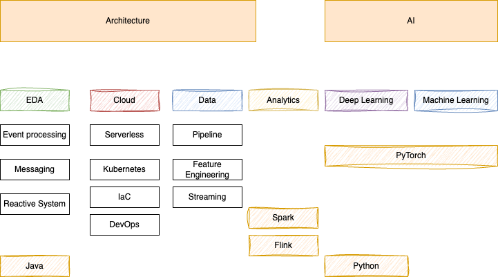

# Skills

As a seasoned senior consultant, I have had the privilege of immersing myself in a wide range of technologies throughout my career. My insatiable passion for learning continually drives me to explore new concepts and expand my knowledge base. In this section, I would like to provide you with a high-level overview of the breadth and depth of my expertise in certain subjects.

My Git repositories showcase my commitment to delving deeper into specific solutions, as I consistently develop and refine assets that contribute to these areas.

* **3/2024 Skill Map**

The following figure illustrates the two main pillars for my knowledge base: software architecture and AI, with sub-pillars, I am continuously working on over time:

I will try to assess the skill level using the following definitions:

| Level | Description |
| --- | --- |
| **100	Foundational** |	I can present the feature overview, address value proposition, pro-cons, fit for purpose |
| **200	Intermediate** |	Being able to articulate best practices, demonstrate the product feature, code using the product |
| **300	Advanced**	| Bbe able to deep dive into a topic, a feature, an integration, and support deeper architecture discussions |
| **400	Expert** |  Product dev experience. Good knowledge on how a product works. Understand parameters. Code around the product deployment. Support long term consulting engagement. |

## Architecture

### EDA

* [My book on Event Driven Architecture and solutions.](https://jbcodeforce.github.io/eda-studies/)
* **Event processing**: [Kafka Stream](https://jbcodeforce.github.io/eda-studies/techno/kstreams/), [Flink study](https://jbcodeforce.github.io/flink-studies/), [AWS Managed Service for Flink](https://jbcodeforce.github.io/yarfba/kinesis/#managed-service-for-apache-flink); [Spark Streaming](https://jbcodeforce.github.io//spark-studies/dev/streaming/).

* **Messaging studies**: [ActiveMQ open source](https://jbcodeforce.github.io/aws-messaging-study/activemq/), [Amazon MQ](https://jbcodeforce.github.io/aws-messaging-study/amazonmq/), [IBM MQ](https://jbcodeforce.github.io/eda-studies/techno/ibm-mq/), [Kafka](https://jbcodeforce.github.io/kafka-studies/), [Amazon SQS](https://jbcodeforce.github.io/aws-messaging-study/sqs/)
* Distributed systems, Reactive Systems
* [Vaccine delivery solution](https://github.com/jbcodeforce/vaccine-solution-main)
* [Real time inventory solution](https://github.com/jbcodeforce/refarch-eda-item-inventory)
* [A demonstration for an event-driven solution of autonomous car rides.](https://jbcodeforce.github.io/autonomous-car-iac/)

### Cloud

* Cloud architecture: [AWS body of knowledge (useful to keep level 100 to 200 knowledge on AWS service)](https://jbcodeforce.github.io/yarfba/) Certified AWS SA Associate (May 23), and [AWS SA Professional (Dec 23)](https://www.credly.com/earner/earned/share/23fc1d81-d8be-43d3-9be4-b528c132f377)
* [Serverless](https://jbcodeforce.github.io/yarfba/serverless/): [AWS Lambda](https://jbcodeforce.github.io/yarfba/serverless/lambda/) with its [complementary prototypes git repo](https://jbcodeforce.github.io/autonomous-car-mgr/), [Step function](https://jbcodeforce.github.io/yarfba/serverless/stepfct/), [API Gateway](https://jbcodeforce.github.io/yarfba/serverless/apigtw/).  Joined AWS Serverless technical competency group in September 2023.
* Container (docker) and Kubernetes / [OpenShift](https://jbcodeforce.github.io/openshift-studies/)
* Infrastructure as code: [CDK](https://jbcodeforce.github.io/yarfba/coding/cdk/), [SAM](https://jbcodeforce.github.io/yarfba/coding/sam/)
* [DevOps](https://jbcodeforce.github.io/coding/agile/) - [GitOps](https://jbcodeforce.github.io/coding/gitops) - [ArgoCD](https://jbcodeforce.github.io/coding/argocd)

* [Java](https://jbcodeforce.github.io/java/), JEE, Java Microprofile, Quarkus, Spring boot

### Data

* [Main content is in this repository.](./data/index.md)

### Analytics

* [Spark study](https://jbcodeforce.github.io/spark-studies/), [Amazon EMR](https://jbcodeforce.github.io/yarfba/analytics/#elastic-mapreduce-emr)
* [Flink study](https://jbcodeforce.github.io/flink-studies/), [AWS Managed Service for Flink](https://jbcodeforce.github.io/yarfba/kinesis/#managed-service-for-apache-flink)

## AI

### [Machine Learning](https://jbcodeforce.github.io/ML-studies/#machine-learning)
### [Deep Learning](https://jbcodeforce.github.io/ML-studies/ml/deep-learning/)

* [Amazon SageMaker](https://jbcodeforce.github.io/yarfba/ai-ml/sagemaker/)
* [PyTorch](https://jbcodeforce.github.io/ML-studies/coding/pytorch/)
* [Generative AI](https://jbcodeforce.github.io/ML-studies/ml/generative-ai/), [Langchain](https://jbcodeforce.github.io/ML-studies/coding/langchain/)
* [Amazon Bedrock](https://jbcodeforce.github.io/yarfba/ai-ml/bedrock/)

## Development

* [Java](https://jbcodeforce.github.io/java), [Python](https://jbcodeforce.github.io/python-code), nodejs, bash
* [Quarkus](https://jbcodeforce.github.io/java/quarkus/)
* Web Development [Vuejs](https://jbcodeforce.github.io/vuejs-studies/), [Angular JS](https://github.com/jbcodeforce/angular-sandbox)
* Business rules based system
* SQL Database with JPA and JTA: Postgresql, DB2
* Document oriented DB: DynamoDB, Mongodb, Cassandra
* Kafka Streams API, Kafka API, reactive messaging

## Methodology

* Agile development, Lean Startup, Design Thinking, Event Storming and Domain Driven Design
* Agile business rules development (Creator)
* DevOps, [Gitops](https://jbcodeforce.github.io/coding/gitops)

## List of contributions

[See the assets list](./assets.md)