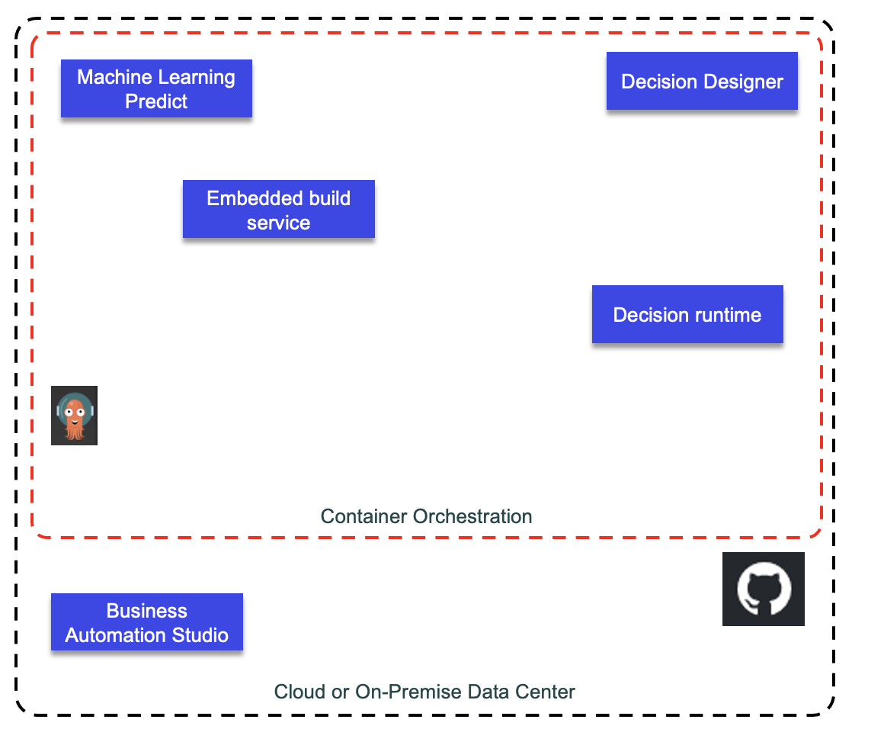

# Automated Decision Service

Automation Decision Services provides decision modeling capabilities that help business experts capture and automate repeatable decisions. 
Automation Decision Services comes with two main components: a designer and a runtime that can be installed separately.

Components:

* Decision Designer to develop decision model. It is connected to Github to manage decision artifacts. It is used to build and deploy the decision runtime.
* Decision Service: runtime

## Decision model

Decision model diagrams are composed of a set of nodes that are used as building blocks to represent decisions in a graphical way:

* Decision nodes represent the end decision, that is the decision that you want to automate, and the subdecisions that the end decision depends on.
* Data nodes represent the data that is needed to make a decision.
* Function nodes encapsulate computations from other decision models.
* Prediction nodes encapsulate predictions that you can call directly from your decision model.

## Getting started

* [Product doc - getting started](https://www.ibm.com/docs/en/cloud-paks/cp-biz-automation/21.0.x?topic=resources-getting-started-tutorial) goes over a simple decision model to send a message according to some weather data.
* 

## Collaborating

## Not yet there

## Useful links

* [ODM Docker image](https://hub.docker.com/r/ibmcom/odm/)
* [Eclipse Oxygen needed for Decision Designer](http://www.eclipse.org/downloads/packages/release/oxygen/3a)