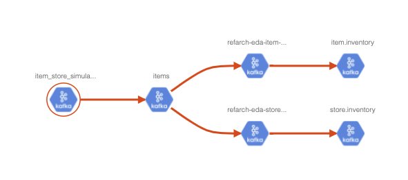

# Apache Atlas

[Apache Atlas](https://atlas.apache.org/index.html#/) is a data governance tool which facilitates gathering, processing, and maintaining metadata.

The architecture illustrates that Atlas exposes APIs to add and query elements of the repository, but also is integrated with Kafka for asynchronous communication.

 

The Core framework includes a graph database based on [JanusGraph](https://janusgraph.org/).

The Kafka integration may be used to consume metadata change events from Atlas.

## Key features

* **Centralized** metadata management platform.
* **Data classification** based on rules and regex. Identify the incoming data and filter them out based on those classifications.
* **Data lineage**: shows the origin, movement, transformation and destination of data.

## Concepts

Some important concepts to know:

* a **Type** in Atlas is a definition of how particular types of metadata objects are stored and accessed. 
A type represents one or a collection of attributes that define the properties for the metadata object.
* An **`Entity`** is an instance of a Type.
* A type has a metatype. Atlas has the following metatypes:

    * **Primitive** metatypes: boolean, byte, short, int, long, float, double, biginteger, bigdecimal, string, date
    * **Enum** metatypes
    * **Collection** metatypes: array, map
    * **Composite** metatypes: Entity, Struct, Classification, Relationship
* Atlas comes with a few pre-defined system types: Referenceable, Asset, Infrastructure, DataSet, Process. The ones very interesting are:

    * **Infrastructure** extends Asset and may be used for cluster, host,...
    * **DataSet** extends Referenceable, represents a type that stores data. Expected to have a Schema to define attributes.
    * **Process** extends Asset represents any data transformation operation.
* **Relationships** to describe connections between entities.
* We can define `Classification` which can be associated to entities but are not attributes: 

```json
 {
    "category": "CLASSIFICATION",
    "name": "customer_PII",
    "description": "Used for classifying a data which contains customer personal information, hence indicating confidential private",
    "typeVersion": "1.0",
    "attributeDefs": [],
    "superTypes": []
}
```

* A type can **extend** another type: A `kafka_topic_schema` is an array of `kafka_message_schema`:

```json
{
        "superTypes" : [ "kafka_topic" ],
        "category" : "ENTITY",
        "name" : "kafka_topic_and_schema",
        "attributeDefs" : [
          {
            "name" : "value_schema",
            "typeName" : "array<kafka_message_schema>",
            "isOptional" : true,
            "cardinality" : "SINGLE",
            "valuesMinCount" : 1,
            "valuesMaxCount" : 1,
            "isUnique" : false,
            "isIndexable" : false
          },
        ]
}
```

### Remarks

Each of the predefined sources have matching type definitions. For Kafka, it may be needed to adapt 
the definition or develop new definition to support and end-to-end governance of Kafka components.


## Getting started

* Start with docker:

```sh
docker run -d -p 21000:21000 -p 21443:21443 --name atlas sburn/apache-atlas /opt/apache-atlas-2.1.0/bin/atlas_start.py
```

Login in as `admin/admin`.

* Start with a docker compose:

```yaml
services:
  atlas:
    container_name: atlas
    hostname: atlas
    image: sburn/apache-atlas
    ports:
      - 21000:21000 
      - 21443:21443
    environment:
      MANAGE_LOCAL_HBASE: "true"
      MANAGE_LOCAL_SOLR: "false"
    command:
      /opt/apache-atlas-2.1.0/bin/atlas_start.py
    volumes:
      - $PWD/environment/atlas/data:/tmp/data/
```


* Define new types See project [eda-governance](https://github.com/jbcodeforce/eda-governance): 

Her is an example defining a Kafka_Cluster type to be an Infrastructure

```json
"entityDefs": [
    {
      "superTypes": [
        "Infrastructure"
      ],
      "category": "ENTITY",
      "name": "eda_kafka_cluster",
      "description": "a Kafka Cluster groups multiple Kafka Brokers and references topics",
      "typeVersion": "1.0",
      "attributeDefs": [
        {
          "name": "cluster.name",
          "typeName": "string",
          "isOptional": false,
          "cardinality": "SINGLE",
          "valuesMinCount": 1,
          "valuesMaxCount": 1,
          "isUnique": true,
          "isIndexable": true
        }, 
        ....
```

* Define dataset entities

```json
"entities": [
    {
      "typeName": "eda_kafka_cluster",
      "createdBy": "maas_service",
      "attributes": {
        "qualifiedName": "assets-arch-eda.eda-dev",
        "cluster.name": "eda-dev",
        "description": "EDA team's event streams 2020 cluster",
        ...
```

The qualifiedName is important to define some naming convention like `<kafka_component>@<clustername>` for example. 
Also important that entities represent instances. So if the same topic is defined into two clusters we need to
have two entities in Atlas using the different qualifiedNames.

* Define process entities

For example an application is a process:

```json
```

* Define relationship between any defined types. Example a topic is linked to a cluster:

```json
{
 "category": "ENTITY",
  "name": "eda_kafka_topic",
  "superTypes": [
                "DataSet"
            ],
  "attributeDefs": [
    {
      "name": "cluster",
      "typeName": "eda_kafka_cluster",
      "isOptional": false,
      "cardinality": "SINGLE",
      "isUnique": false,
      "isIndexable": true
    },
    {
      "name": "clusterQualifiedName",
      "typeName": "string",
      "isOptional": false,
      "cardinality": "SINGLE",
      "isUnique": false,
      "isIndexable": true
    }]
}
```

Then the entity will use the following setting in the cluster name:

```json
{
        "typeName": "eda_kafka_topic",
        "attributes": {
          "qualifiedName": "items@eda-dev",
          "name": "items",
          "cluster": {"uniqueAttributes": {"qualifiedName": "eda-dev"}, "typeName": "eda_kafka_cluster"},
          "clusterQualifiedName": "eda-dev"
        }
}
```

We can also define the composition, like a broker is included in the cluster and will not live outside of a cluster:

```json
 {
      "superTypes": [
        "Infrastructure"
      ],
      "category": "ENTITY",
      "name": "eda_kafka_cluster",
    ...
    "attributeDefs": [
    {
    "name": "brokers",
    "typeName": "array<eda_kafka_broker>",
    "isOptional": true,
    "cardinality": "SET",
    "valuesMinCount": 1,
    "valuesMaxCount": 3000,
    "isUnique": false,
    "isComposite": true,
    "isIndexable": false,
    "includeInNotification": false,
    "searchWeight": -1,
    "relationshipTypeName": "eda_kafka_topic"
}
```

## Data lineage

Atlas will address part of the data lineage as we can declare the physical dependencies between components:




## Continuous visibility of flows

Atlas can listen to Kafka topic to get updates to propagate to the entities. But there is no real time view of the data inside of the topic, for example, to see where 
a data land. 

## Deploy to Kubernetes

Apache Atlas requires 3 applications to be installed

* **Solr**: This is used to index the Atlas Data so that we can search the data in Atlas UI.
* **Cassandra:** acts as a backend and stores the data ingested by Apache Atlas, which is nothing but the Metadata.
* **Zookeeper:** for cluster management.

## Source of readings

* [REST API v2](https://atlas.apache.org/api/v2/index.html)
* [Model governance with Atlas - part 1](https://community.cloudera.com/t5/Community-Articles/Customizing-Atlas-Part1-Model-governance-traceability-and/ta-p/249250)
* [Model governance with Atlas - part 2](https://community.cloudera.com/t5/Community-Articles/Customizing-Atlas-Part2-Deep-source-metadata-embedded/ta-p/249377)
* [Model governance with Atlas - part 3](https://community.cloudera.com/t5/Community-Articles/Customizing-Atlas-Part3-Lineage-beyond-Hadoop-including/ta-p/249318)
* [Atlas Helm Chart with Solr and cassandra](https://github.com/manjitsin/atlas-helm-chart)
