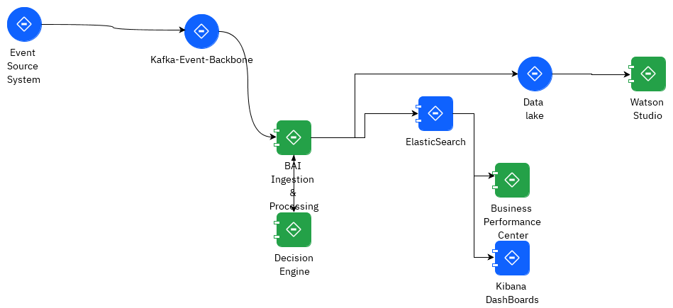
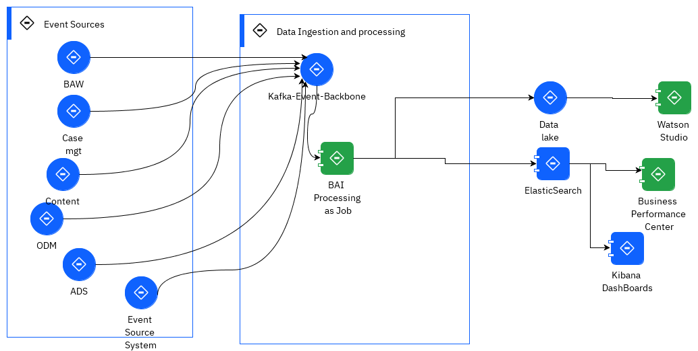

# Self driving enterprise

Goal: BAI processes event data (from IBM Business automation products) so that you can derive insights into the performance of your business.

It will be the foundation for self driving enterprise.

## Value propositions

* AI continuously listen to events to correlate and derive business context to actionable insight in real time
* Deliver visibility, apply analytics or machine learning algorithms that add intelligence to the platform and 
provide guidance to knowledge workers and business owners.
* **Detect** The insights engine builds a 360° view of the business to correlate events in-context, derives insights by applying analytics and detect business-relevant situations by applying rules, CEP and ML. 
* Business owners keep contorl when automation fails
* Able to fully explain and account for its observations, correlations and actions
* Self-driving automations leapfrog traditional automation of tasks and workflow, by triggering actions 
based on insights and their impact on objectives and KPIs and automates across Business and IT silos

## Features

* Ingest and process records from Kafka, store to Elastic Search
* Unify on single event framework for Automation and AI.
* Aggregate these events into business-relevant KPIs
* Monitoring with Kibana dashboards: Kibana uses index patterns to search indexes defined within Elasticsearch. An index pattern can match the name of a single index, or include a wildcard (*) to match multiple indexes
* Store events to data lake like HDFS for off line queries
* Business Performance Center to visualize your data and monitor business performance
* Add anonymization rules to secure sensitive data

## Architecture

The features above are supported by different components as illustrated below:



Looking at the components, the BAI processing is based on Flink jobs: The distribution includes a set of jars for each supported event source.



### Event Sources

* Components of the IBM Cloud Pak for Business Automation platform
* Any Kafka records in Kafka Topics
* Supports BPM events to monitor the lifecycles of processes and activities, looped activities, 
tasks, gateways, timers, messages, and tracking groups. Aggregation of process time series, or from the business data
* Most of the older DBA products sent events in a predefined format, while ADS, Workforce Insight or custom event source use Avro Schema.

### High Availability


## Getting started

See [the product documentation](https://www.ibm.com/docs/en/cloud-paks/cp-biz-automation/21.0.x?topic=installing-business-automation-insights-without-kubernetes) 
and [for MacOS](https://www.ibm.com/docs/en/cloud-paks/cp-biz-automation/21.0.x?topic=kubernetes-installing-macos).
Need to get the images from Passport Advantage searching 'business automation insight', to get a zip named 
`CP4Auto_20.0.3-bai4s.tgz`. Unzip and start the `bai-start --acceptLicense ` with `--init` for the first time to get certificates and users set up.
The error message about port numbers not set for any of the services started by docker compose is due to not executing 
the `.env`. The questions asked help to populate this .env file.

*The env file needs to be modified to export all the env variables declared, as docker-compose will not see them if not exported*

```sh
bai-for-server/bai-flink:20.0.3                           6123/tcp, 8081/tcp                                     data_processors-deployer_1
bai-for-server/bai-admin:20.0.3                           0.0.0.0:6892->6892/tcp                                 data_admin_1
confluentinc/cp-schema-registry:5.5.1                     8081/tcp, 0.0.0.0:8084->8084/tcp                       data_schema-registry_1
bai-for-server/bai-setup:20.0.3                                                                     data_setup_1
confluentinc/cp-kafka:5.5.1                               9092/tcp, 0.0.0.0:29092->29092/tcp                     data_kafka_1
bai-for-server/bai-flink-taskmanager:20.0.3               6123/tcp, 8081/tcp                                     data_taskmanager_1
bai-for-server/bai-monitoring-app:20.0.3                  9080/tcp, 0.0.0.0:9443->9443/tcp                       data_business-performance-center_1
bai-for-server/bai-kibana:20.0.3                          0.0.0.0:5601->5601/tcp                                 data_kibana_1
bai-for-server/bai-flink:20.0.3                           6123/tcp, 8081/tcp                                     data_jobmanager_1
bai-for-server/bai-elasticsearch:20.0.3                   9200/tcp, 9300/tcp                                     data_elasticsearch_1
bai-for-server/bai-management:20.0.3                                                                  data_management_1
confluentinc/cp-zookeeper:5.5.1                           2181/tcp, 2888/tcp, 0.0.0.0:2121->2121/tcp, 3888/tcp   data_zookeeper_1
```

## Use cases

* Apply analytics with Brunel library to get insights on the decisions done in ODM, for example on loan origination, and the variables used to do eligibility.
* How to take better benefit of BPM process execution data and inject Machine Learning techniques to predict the duration of BPMN processes, 
based on the data captured by the process

## Samples

[Sample data for IBM Business Automation Insights](https://github.com/icp4a/bai-data-samples)

## More reading

* [BAI product documentation](https://www.ibm.com/docs/en/cloud-paks/cp-biz-automation/21.0.x?topic=services-business-automation-insights)
* [ODM Kibana dashboard](https://www.ibm.com/docs/en/cloud-paks/cp-biz-automation/21.0.x?topic=dashboards-odm-decisions)
* [BPM or ODM sample dashboards](https://www.ibm.com/docs/en/cloud-paks/cp-biz-automation/21.0.x?topic=insights-samples)
* [ODM and BAI Getting Started document](https://github.com/ODMDev/decisions-bai-gettingstarted)
* [handle custom events](https://github.com/icp4a/bai-emitter-samples)
* [Notebooks for Machine learning with Business Automation Insights](https://github.com/IBM-DBA/bai-ai-samples)