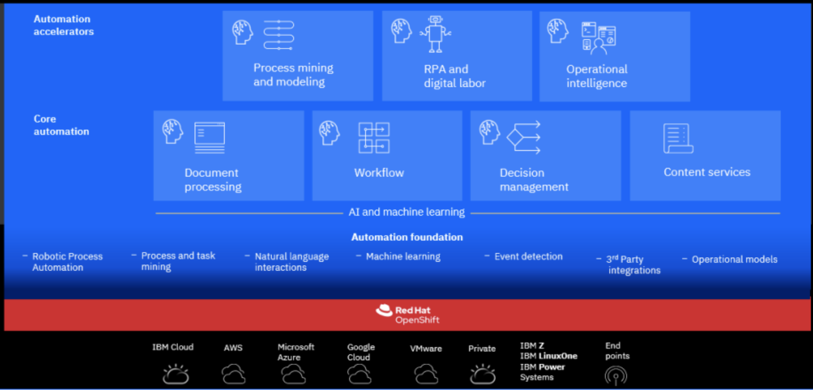
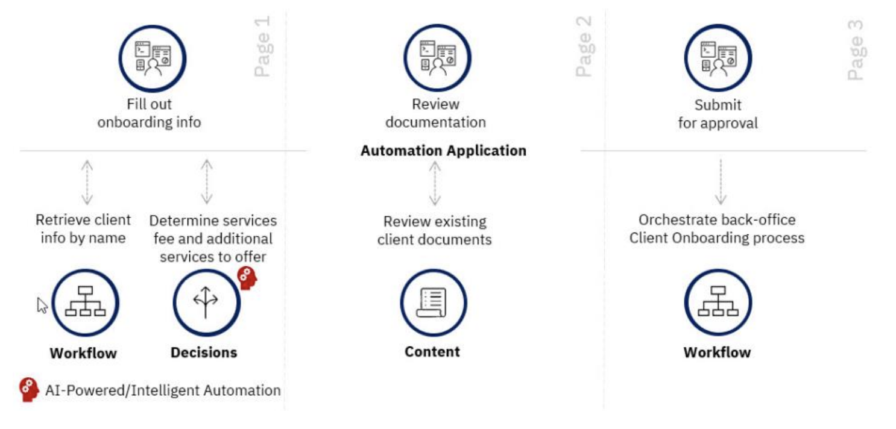
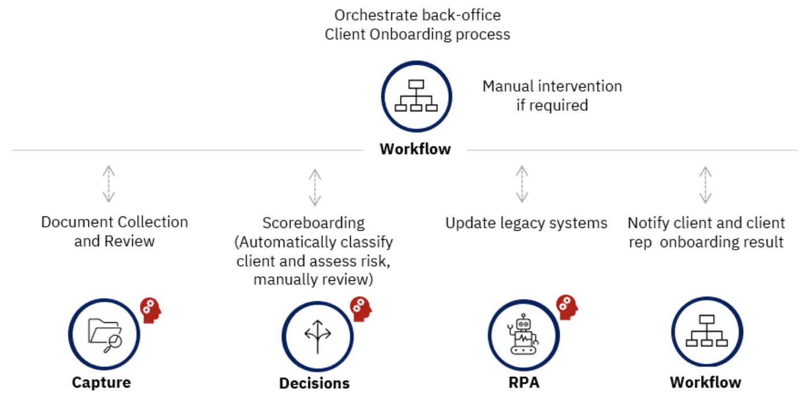

# Cloud Pak for Automation

IBM Cloud Pak for Business Automation is a set of integrated market-leading software, running on top
of Red Hat OpenShift and therefore built for any hybrid cloud.
Support following business automation capabilities — for content, decisions, process mining,
RPA, workflows, and document processing, but add uniform platform experience, better component reuse.



Running in containers and Kubernetes is to improve cost of operation and deployment. For example using
Liberty will reduce the packaging from multiple GB to only 800MB, start faster 10s, and simpler configuration.
Docker images help to maintain product delivery and access to iFixes from a central registry. 
Kubernetes helps to standardize on Operation and SRE skillset, innate HA, better application isolation, 
and improved portability.  

**Container Federation** is the concept to share capabilities between products:

    * Task federation (PFS)
    * Single UI (Navigator)
    * Common content services (CPE)
    * Global Teams (UMS)
    * Aggregated monitoring/KPIs (BAI)
    * Federated BPM Portal
    * All application tier federated by default (BAW) 

Automation foundation provides common services, used by CP4I and CP4D.

As CP4BA runs on OpenShift, some considerations need to be addressed.

## Operators

The following operators are installed with Cloud Pak for Automation

* **IBM® Automation Foundation Core**: 

    * RPA-driven automation, process mining, mongoDB for Identity and Access Management (IAM), metering, OpenID,..  Zen UI and event processor.

* **Cloud Pak foundational services**: (bedrock - common services) [Product doc](https://www.ibm.com/docs/en/cpfs). It includes IAM and certificate management.
* **IBM® Automation foundation** operator installs the required dependency operators, such as the IBM Events Operator, the Elasticsearch Operator and the Event Processing Operator.
* **Cloud Pak for Business Automation** delivers an integrated and managed collection of containerized services

## Rapid deployment

For production deployment see the [product documentation](https://www.ibm.com/docs/en/cloud-paks/cp-biz-automation)

See [the SWAT team repository](https://github.com/IBM/cp4ba-rapid-deployment) to setup CP4Automation for demonstration purpose.
This repository provides step-by-step instructions to set up the needed infrastructure for the Demo deployment:

* Install IBM Cloud Pak for Business Automation version 21.0.2 (enterprise deployment)
* Get the required infrastructure on IBM Cloud (OpenShift cluster, VM for LDAP and optionally VM for RPA)
* Installing all the prerequisite software of CP4BA (LDAP and DB2)

A cluster will all capabilities needs 11 nodes (see [system requirements](https://www.ibm.com/docs/en/cloud-paks/cp-biz-automation/21.0.x?topic=pei-system-requirements)):

* Master (3 nodes): 4 vCPU and 8 Gi memory on each node.
* Worker (8 nodes): 16 vCPU and 32 Gi memory on each node.

For ADP and deep learning processing of document, node needs to get GPU and CPU must meet TensorFlow AVX requirements.

For demo purpose 3 nodes are enough. 

* Three worker nodes with 32 CPUs and 64Gi RAM (e.g., flavor c3c.32x64 on ROKS)
* One db2 worker node with 32 CPUs and 128Gi RAM (e.g., flavor b3c.32x128 on ROKS)

>>>> We can only have one instance of Cloud pak automation on one cluster

## Installation

The [Container Application Software for Enterprises (CASE) repository](https://github.com/IBM/cloud-pak) includes
a zip file (cert-kubernetes) with configurations and scripts according to the product version.

Here is a curl to get this zip

```sh
export SCRIPT_VERSION=3.1.4
export CERT_VERSION=21.0.2
curl -o ./assets/ibm-cp-automation-${SCRIPT_VERSION}.tgz -LJO https://github.com/IBM/cloud-pak/raw/master/repo/case/ibm-cp-automation/${SCRIPT_VERSION}/ibm-cp-automation-${SCRIPT_VERSION}.tgz
```

see also [this script to run this curl and more in a silent setup](https://github.com/ibm-cloud-architecture/dba-gitops-catalog/blob/main/setup_silent.sh).

This script runs `cp4a-clusteradmin-setup.sh` which deploys CP4A- operator.

Inside this archive there is a script to build the CR for the CP4Automation components you want to deploy.

### Deploying OpenLDAP

* [Article from  Garage team on how to deploy OpenLDAP server on OpenShift](https://medium.com/ibm-garage/how-to-host-and-deploy-an-openldap-sever-in-openshift-affab06a4365)
* [OpenLDAP bitmani documentation](https://docs.bitnami.com/tutorials/create-openldap-server-kubernetes/)

See [openLDAP instance configuration in ibm-cloud-architecture/dba-gitops-catalog](https://github.com/ibm-cloud-architecture/dba-gitops-catalog/tree/main/instances/openLDAP)

### Deploy PostgreSQL

The postgreSQL operator defines a new Kubernetes resource called "Cluster" representing a PostgreSQL cluster made up of a single primary and an optional number of replicas that co-exist in a chosen Kubernetes namespace 
for High Availability and offloading of read-only queries..

### Deploy Foundation operators 

See the silent setup script in [this doc](https://github.com/ibm-cloud-architecture/dba-gitops-catalog/)

### Deploying one of the Automation capability

You can then generate the custom resource (CR) file by using another script `./cp4a-deployment.sh`

This script will ask:

* deployment type (demo, enterprise)
* OpenShift deployment type (ROKS, OCP, CNCF)
* Automation capability: 
        1) FileNet Content Manager 
        2) Operational Decision Manager 
        3) Automation Decision Services 
        4) Business Automation Application 
        5) Business Automation Workflow 
        (a) Workflow Authoring 
        (b) Workflow Runtime 
        6) Automation Workstream Services 
        7) IBM Automation Document Processing 
        (a) Development Environment 
        (b) Runtime Environment 


### ODM specifics

Follow [link](http://www.ibm.com/support/knowledgecenter/SSYHZ8_21.0.x/com.ibm.dba.offerings/topics/con_odm_prod.html) for details about this product.

* Need LDAP
* Need a database like Postgresql
* You do not have to integrate with the User Management Service (UMS)
* Running the `./cp4a-deployment.sh` script and selecting ODM, you have the choice to select ODM sub components like

        1) Decision Center (Selected)
        2) Rule Execution Server (Selected)
        3) Decision Runner 
        4) User Management Service 
        5) Business Automation Insights 

   When doing Enterprise deployment the LDAP type supported does not include OpenLDAP, we can select microsoft active directory and modify the generated CR.yaml.

The CR has the following declarations to review

    ```yaml
    sc_deployment_type: "enterprise"
    sc_deployment_platform: "ROKS"
    sc_deployment_patterns: "foundation,decisions"
    sc_optional_components: "decisionCenter,decisionServerRuntime"
    odm_configuration:
    # To enable ODM Runtime.
    decisionServerRuntime:
        enabled: true
        replicaCount: 2
    # To enable the Authoring part
    decisionRunner:
        enabled: false
        replicaCount: 2
    decisionCenter:
        enabled: true
        replicaCount: 2
    ```

And more to update for LDAP and Postgresql DB

* Install [Rule Designer from the Eclipse Marketplace](https://marketplace.eclipse.org/content/ibm-operational-decision-manager-developers-v-8105-rule-designer).

## Getting Started

Once installed, all the URLs, user and password information, you need will be present in the `icp4adeploy-cp4ba-access-info` config map

```sh
oc describe cm icp4adeploy-cp4ba-access-info 
```


* check the Common service operator full version and deployed namespace

```
oc get csv --all-namespaces | grep common-service-
```


## The Client Onboarding demo

* Pdf and instructions [github.com/IBM/cp4ba-labs](https://github.com/IBM/cp4ba-labs/tree/main/IBM%20Cloud%20Pak%20for%20Business%20Automation%20(End-to-End))
* repository: [dba-onboarding-automation](https://github.com/ibm-cloud-architecture/dba-onboarding-automation)

The client application includes three pages to support following use cases:



The back-office workflow using the Workflow capability may involve an account manager, the client, and/or the client representative



**Summary:**

* 'Client Onboarding app' is created with **Automation Application Designer**
* Workflow orchestrate back office services 
* Decision to categorize client in different segment
* Use RPA to update older applications


See this [](https://github.com/IBM/cp4ba-rapid-deployment/blob/main/cp4ba-21-0-2/00selectTemplate.md#template-for-the-client-onboarding-demo)
