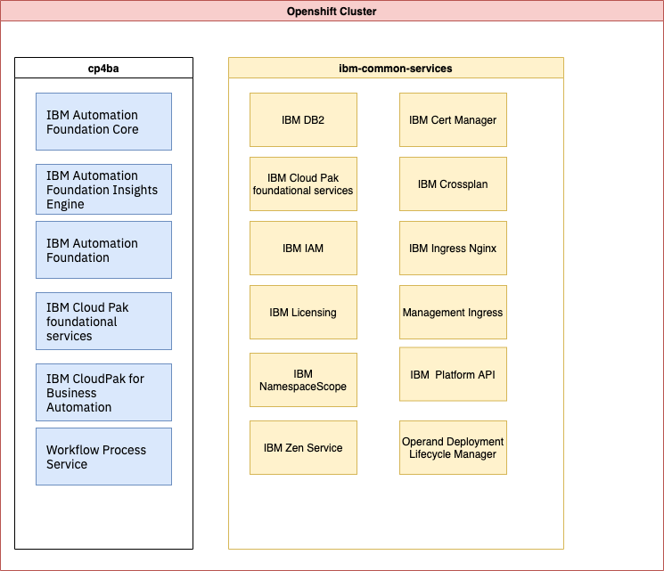
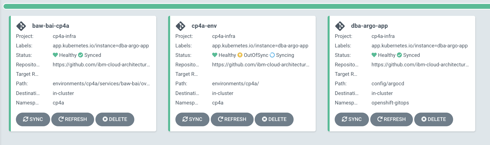
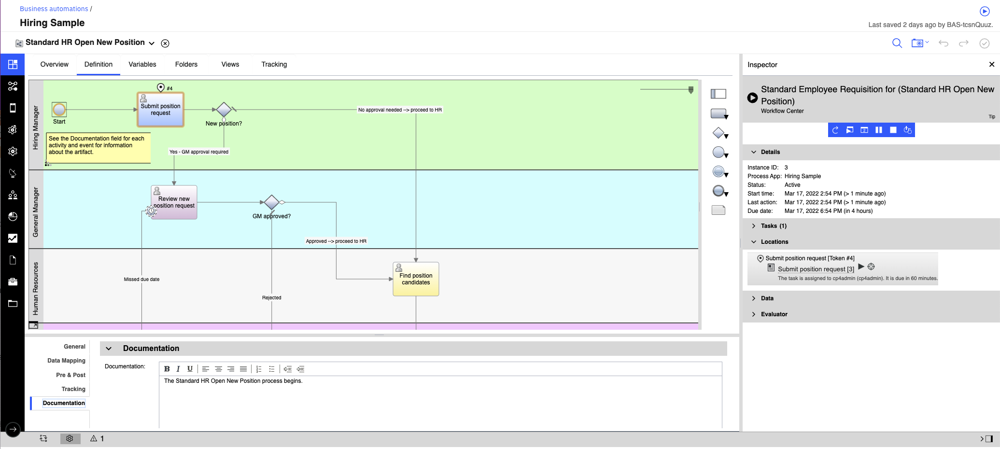
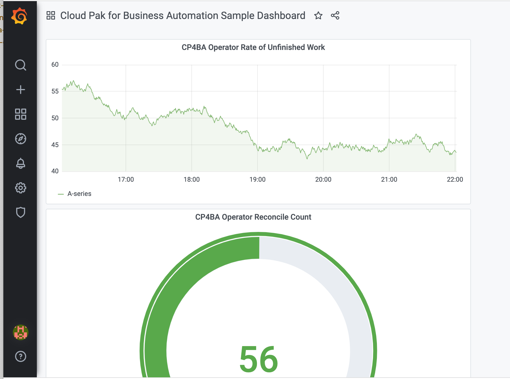
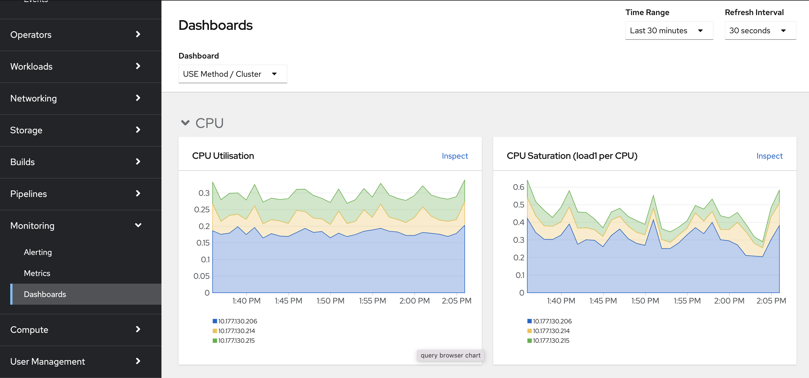

# Cloud Pak for Automation

!!! info
    Updated 3/17/2022

[IBM Cloud Pak for Business Automation](https://www.ibm.com/docs/en/cloud-paks/cp-biz-automation/21.0.3) is a set of integrated market-leading software, running on top of Red Hat OpenShift and therefore built for any hybrid cloud.
Support following business automation capabilities — for content, decisions, process mining,
RPA, workflows, and document processing, but add uniform platform experience, better component reuse.


Running in containers and Kubernetes is to improve cost of operation and deployment. For example using
Liberty will reduce the packaging from multiple GB to only 800MB, start faster 10s, and simpler configuration.

## Value propositions

Companies need to apply intelligent automation across the enterprise to improve profitability, revenue growth

* Reduce customer service disruptions
* Improve management of IT service requests
* Empower LOBs through low-code tooling to quickly develop simple business application
* Identify gaps in operations workers

### Use cases:

* Digitize processes to maintain business continuity
* Approve operations tickets and exceptions
* Automate KYC regulatory compliance
* Quickly identify fraudulent transactions
* Reduce time from procure to pay
* Speed order to cash
* Speed employee onboarding

#### [Refund request](https://ibm-cloud-architecture.github.io/refarch-dba/use-cases/refund-req/) automation

* Model as-is processes to identify process opportunities
* Digitize and capture data from refund request forms
* Create customer facing application using low-code tools
* Mine process data from line of business systems to help analyze existing performance gaps
* Monitor customer support KPIs around refund processing with real time dashboard
* Automate important refund decisions: warranty checks, troubleshooting pathways, fraud detection, etc. - prior to approval
* Automatically route requests requiring manual review to the appropriate customer support representative(s)
* Use workflow to streamline the refund process and help ensure timely refunds for valid request

### Common challenges

* Business data is inaccessible and siloed preventing a complete view of customers and hindering compliance initiatives
* Performance gaps caused by manual systems prevent efficiency and lack of reliable insights prevents operational visibility
* Execution on key initiatives is slowed because of the lack of the right tools or right skills

---

## Product capabilities

* Process mining: to discover inefficiencies in existing business process.
* Robotic process automation: digital employees
* Operational intelligence: gain insights with built-in AI to provide recommended actions
* Capture: extract information from document.
* Content: share and manage content - connect content to process
* Decision
* Workflow: choreograph human and systems. Improve consistency across buiness operations with increased visibility. 

### Foundational services

* Zen UI hostname is now the only hostname that is exposed externally - it is the unique front door to access any capabilities
* Authentication and single sign-on (SSO) are now provided by IBM Cloud Pak foundational services. If Zen cannot authenticate the user, then the request is redirected to the Identity and Access Management (IAM) service for authentication. If the user is authenticated, Zen issues a JWT token. Zen JWT tokens are understood and shared by all the Cloud Pak components.


### Business Automation Workflow Authoring and Automation Workstream Services

Workflow automation orchestrates multiple business processes (straight-through, human-assisted or case management) within operations and provides visibility into each step. Automation Workstream Services (AWS) provides a no-code solution for streamlining, automating, and accelerating activities in your daily work

When selecting BAW, we can have optional components like Case, Content integratio, or workstreams.

### ODM to CP4Automation

* Access to New Value-Added Offerings and Containerized IBM Middleware
* Access to Industry-Leading Red Hat Cloud Platform & Solutions
* License Flexibility
* Cloud Friendly metrics: VPC and MVS metrics
* Full stack certification including open source support

* Monitor rules execution in real-time using dashboards (BAI only available on CP4A)
* Collect operational data for analysis and ML to identify patterns for continuous improvement of rules. (BAI)
* Extend the value of rules by automating employee tasks and processes
* Gain enterprise-grade container security and simplified administration
* Improve the quality of automated decisions with data from unstructured documents (Data CAP)

### Business automation application

Use Business Automation Application (BAA) to create and run business applications that use the capabilities of the platform. Build low-code business applications using Application Designer, test them with Playback Application Engine and run them in Application Engine. These applications are available to users in Business Automation Navigator.

When selecting busness automation application, we can select business automation navigator and business orchestration optional components.

---

## Installation

### Concepts

Docker images help to maintain product delivery and access to iFixes from a central registry. 
Kubernetes helps to standardize on Operation and SRE skillset, innate HA, better application isolation, 
and improved portability.  

**Container Federation** is the concept to share capabilities between products:

* Task federation (PFS)
* Single UI (Navigator)
* Common content services (CPE)
* Aggregated monitoring/KPIs (BAI)
* Federated BPM Portal
* All application tier federated by default (BAW) 


### Operators

* **Operator** is a long running process to perform products (Operands) deployment and Day 2 operations, like upgrades, failover, or scaling. Operator is constantly watching your cluster’s desired state for the software installed. 
* **Operator Lifecycle Manager (OLM)**: Helps you to deploy, and update, and generally manage the lifecycle of all of the Operators (and their associated services) running across your clusters.
The operator lifecycle manager (OLM) acts as the management system for the operators on that cluster. Cluster administrators control which operators are available and who can interact with the running operators.

The following operators are installed with Cloud Pak for Automation

* **IBM® Automation Foundation Core**: 

    * RPA-driven automation, process mining, mongoDB for Identity and Access Management (IAM), metering, OpenID,..  Zen UI.

* **Cloud Pak foundational services**: (bedrock - common services) [Product doc](https://www.ibm.com/docs/en/cpfs). It includes IAM and certificate management.
The services connect all IBM Cloud Paks with Operand Deployment Lifecycle Manager (ODLM) and use a specific namespace (ibm-common-services) to manage the service instances
* **IBM® Automation Insights foundation** operator installs the required dependency operators, such as the IBM Events Operator, the Elasticsearch Operator and the Event Processing Operator.
* **Cloud Pak for Business Automation** includes Business Automation Studio and Business Automation Navigator to provide a unified authoring environment and an entry point to various low-code design tools with a single sign-on (SSO) experience and team management.


### Namespace

Divide workloads into dedicated namespaces for the application life cycle: dev, staging, production. **Meter** can be used to understand
the deployments against entitlements.

An administrator can configure the role and role binding resources for each application before any operator is deployed. 
Each application must specify a serviceAccountName in its pod spec, and the service account must be created.

### CRD

The Cloud Pak for Business Automation operator uses a custom resource definition (CRD), which describes 
what the operator is meant to watch.

### CRs

Then Automation is using a single CR to define the capabilities you want to deploy.

Here is an [important note](https://www.ibm.com/docs/en/cloud-paks/cp-biz-automation/21.0.3?topic=deployment-capabilities-starter-deployments) on relationship between capabilities and operators. 

Depending on the selected capabilities, the needed components of the foundation are installed. The final custom resource file combines capabilities and components from one or more capabilities.

### Product installation general steps

* [Preparing OpenShift Cluster](https://www.ibm.com/docs/en/cloud-paks/cp-biz-automation/21.0.3?topic=deployment-preparing-your-cluster):
The installation needs a dynamic storage class and a block storage class. 
If any other Cloud Pak needs to be installed into the same cluster, you must use the same choice for the namespaces because IBM Automation foundation is a shared resource between Cloud Paks.
* Get entitlement key
* Install an instance of LDAP for your intended deployment. [For dev purpose we use OpenLDAP](#deploying-openldap) and see [DBA GitOps catalog]() for that. 
For production deployment Tivoli Active Directory or Microsoft Active Directory are recommended.
* Install Openshift GitOps operator
* Install Cloud Pak Business Automation operator in `openshift-operators` monitoring All namespaces.
* Install operand using Custom Resource for each targeted environment (dev, staging, production). This is the tricky part as coherence is needed.


### Capacity

A cluster with all capabilities needs 11 nodes (see [system requirements](https://www.ibm.com/docs/en/cloud-paks/cp-biz-automation/21.0.x?topic=pei-system-requirements)):

* Master (3 nodes): 4 vCPU and 8 Gi memory on each node.
* Worker (8 nodes): 16 vCPU and 32 Gi memory on each node.

For ADP and deep learning processing of document, some Nodes need to get GPU and CPU must meet TensorFlow AVX requirements.

For demo purpose 3 nodes are enough. 

* Three worker nodes with 32 CPUs and 64Gi RAM (e.g., flavor c3c.32x64 on ROKS)
* One db2 worker node with 32 CPUs and 128Gi RAM (e.g., flavor b3c.32x128 on ROKS)

>>>> Before 2021.3, We can only have one instance of Cloud pak automation on one cluster

### Starter deployment for demo purpose

This section is a summary of the [product documentation](https://www.ibm.com/docs/en/cloud-paks/cp-biz-automation/21.0.3?topic=openshift-installing-starter-deployments) with links to assets to deploy with CLI.

### Preparing

[See the instructions in infra repo](https://github.com/ibm-cloud-architecture/dba-infra-gitops/)

#### Installing

The "starter" deployment provisions Db2® and OpenLDAP with the default values, so you do not need to prepare them in advance.

Deployment is centralized by one unique CR that specifies the capabilities to use, and to configure how to access
the external services like LDAP.

* Create a CP4BA deployment cluster CR: See example in [BAW BAI CR](https://github.com/ibm-cloud-architecture/dba-infra-gitops/blob/main/environments/dba-dev/services/baw-bai/base/baw-bai-cr.yaml) in a dba-infra-gitops project. Can be done manually or with the `./cert-kubernetes/scripts/cp4a-deployment.sh ` tool.


  ```sh
    # from dba-infra-gitops/    
    oc apply -f environments/dba-dev/services/baw-bai-cr.yaml
  ```

* Get the  `cp4ba-access-info` ConfigMaps for the different URLs to access the deployed capacities.

  ```sh
  oc describe cm icp4adeploy-cp4ba-access-info
  ```


* Troubleshooting: [https://www.ibm.com/support/pages/node/6426995](https://www.ibm.com/support/pages/node/6426995)

See also [the SWAT team repository](https://github.com/IBM/cp4ba-rapid-deployment) to setup CP4Automation for demonstration purpose.


### Air Gapped

* Need to have an existing container image registry, protected with a TLS certificate signed by a Custom CA
* Update pull-secret by adding the information fo your own registry

    ```sh

    ```
* Mirror OpenShift Container Platform
* Mirror RedHat Operator Catalog (OperatorHub)
* Mirroring CloudPak Container Images

> TBC

???- "See documentation"
    * [OpenShift: Mirroring images for a disconnected installation](https://docs.openshift.com/container-platform/4.9/installing/installing-mirroring-installation-images.html)
    * [Production deployment gitops note](https://production-gitops.dev/infrastructure/restricted-networks/)


### Production deployment

For production deployment see the [product documentation](https://www.ibm.com/docs/en/cloud-paks/cp-biz-automation)

#### Deploying OpenLDAP

* [Article from  Garage team on how to deploy OpenLDAP server on OpenShift](https://medium.com/ibm-garage/how-to-host-and-deploy-an-openldap-sever-in-openshift-affab06a4365)
* [OpenLDAP bitmani documentation](https://docs.bitnami.com/tutorials/create-openldap-server-kubernetes/)

See [openLDAP instance configuration in ibm-cloud-architecture/dba-gitops-catalog](https://github.com/ibm-cloud-architecture/dba-gitops-catalog/tree/main/instances/openLDAP)

```sh
oc apply -k environments/openLDAP
# Test it:
oc rsh $(oc get po -o name -n openldap| grep ldap) -n openldap
# In pod shell
ldapsearch -x -H ldap://localhost:1389 dc=example,dc=org -D "cn=admin,dc=example,dc=org" -w adminpassword
```

#### Deploy PostgreSQL

The postgreSQL operator defines a new Kubernetes resource called "Cluster" representing 
a PostgreSQL cluster made up of a single primary and an optional number of replicas that co-exist in a chosen Kubernetes namespace 
for High Availability and offloading of read-only queries..

#### Deploy Foundation operators 

See the silent setup script in [this doc](https://github.com/ibm-cloud-architecture/dba-gitops-catalog/)

#### Deploying one of the Automation capability

You can then generate the custom resource (CR) file by using another script `./cp4a-deployment.sh`

This script will ask:

* deployment type (demo, enterprise)
* OpenShift deployment type (ROKS, OCP, CNCF)
* Automation capability: 

        1) FileNet Content Manager 
        2) Operational Decision Manager 
        3) Automation Decision Services 
        4) Business Automation Application 
        5) Business Automation Workflow 
        (a) Workflow Authoring 
        (b) Workflow Runtime 
        6) Automation Workstream Services 
        7) IBM Automation Document Processing 
        (a) Development Environment 
        (b) Runtime Environment 

#### [Uninstall](https://www.ibm.com/docs/en/cloud-paks/cp-biz-automation/21.0.3?topic=uc-uninstalling-capabilities-from-command-line)

* Start by deleting the operator
* You can delete your custom resource deployments by deleting the CR YAML file or the CR instance.
* After you uninstall, you might want to clean up certain files and secrets that you applied to the cluster for specific capabilities.
* [Unsintall foundation services](https://www.ibm.com/docs/en/cloud-paks/1.0?topic=online-uninstalling-foundational-services)
* []()

## Getting Started

Once installed, all the URLs, user and password information, you will need are in the `icp4adeploy-cp4ba-access-info` config map

```sh
oc describe cm icp4adeploy-cp4ba-access-info 
```


* check the Common service operator full version and deployed namespace

```
oc get csv --all-namespaces | grep common-service-
```

> TBC

## Day 1 & Day 2 Demo script

Day 1 is installation. Day 2 is about keeping steady state of the application and platform.

1. Present Operator Hub Catalog - search for IBM product
1. Present Gitops Catalog: [dba-gitops-catalog](https://github.com/ibm-cloud-architecture/dba-gitops-catalog) and the the [IBM catalog definition](https://github.com/ibm-cloud-architecture/dba-gitops-catalog/blob/main/ibm-catalog/catalog_source.yaml)
1. In the `openshift-operators` project, explain that operators are running as pods and are monitoring all Namespaces. so Operands can be deployed anywhere. Some common services operators are running in the `ibm-common-services` project. It is possible to isolate the deployment in one project like in the cp4ba project in below figure (also techzone pre-deployed cp4ba).

    

1. Those operators were deployed from a set of subscriptions: See [this subscription.yaml](https://github.com/ibm-cloud-architecture/dba-gitops-catalog/tree/main/ibm-cp4a-operator/operator/base) file.
1. Go to the `IBM Cloud Pak for Business Automation` operator UI to explain the operator UI, review the subscription yaml. 
1. Review the structure of the [dba-infra-gitops](https://github.com/ibm-cloud-architecture/dba-infra-gitops) as a GitOps repository for bootstrapping operators, secrets and then deploy to different environments. 
1. Review of the [BAW-BAI custom resource](https://github.com/ibm-cloud-architecture/dba-infra-gitops/blob/main/environments/cp4ba/services/all-dba/icp4acluster-icp4adeploy.yaml) explain the configuration and options

      ```yaml
      sc_deployment_patterns: "foundation,workflow-workstreams"
      ## The optional components for the "foundation pattern" are ums, bas and bai.  If the user selects any of those optional components,
      ## it will be set here. Available option:
      sc_optional_components: "baw_authoring,business_orchestration,workstreams,bai"
      ```

1. Go to ArgoCD UI and demonstrate that argo applications are monitoring the git repository for any updates, and apply change to the target manifests.
  
    * Get GitOps admin user's password

      ```sh
      oc extract secret/openshift-gitops-cluster -n openshift-gitops --to=-
      ```

    * Get URL:
    
      ```sh
       chrome https://$(oc get route openshift-gitops-server -o jsonpath='{.status.ingress[].host}'  -n openshift-gitops)
      ```

    

1. Quick access to product Zen UI(cpd)

    A ConfigMap is created in the namespace to provide the cluster-specific details to access the services and applications. The IBM Cloud Pak Platform (Zen) UI is used to provide a role-based user interface for all Cloud Pak capabilities:
    
    * Get the cpd URL from the access-info configmap in the OpenShift console.
    * Use LDAP enterprise loing, `cp4admin` user
    * In the main Automation Console, use Design > Business automations menu to start the designer front end. Select Workflow, > Hiring Sample, and open it.

    
    
    * You can run the process step by step using the top right arrow.

1. Product update: 

    * An update to the custom resource (CR) overwrites the deployed resources. The operator applies the changes during the control loop (observe, analyze, act) that occurs as a result of constantly watching the state of the Kubernetes resources.
    * To remove a capability from the deployment, locate the specific XXX_configuration section and delete this line along with all of its parameters.
    * In some cases, changes that you make in the custom resource YAML by using the operator or directly in the environment are not automatically propagated to all pods

1. Product upgrade 

    * Before you start an upgrade, define a backup recovery process and take snapshots to enable rollback if needed
    * [Preparing your deployed custom resource for an upgrade](https://www.ibm.com/docs/en/cloud-paks/cp-biz-automation/21.0.3?topic=containers-preparing-your-deployed-custom-resource-upgrade)
    * Transparent upgrade by changing the operator release / channel
    * Modify the differemt Custom Resource

1. Explain monitoring

  See [this prometheus introduction](../prometheus.md)

  * As Cloud Pak for automation are custom applications in the context of OpenShift monitoring, we need to define  `User Project Monitoring`. To do so 

      ```sh
      # in infra gitops project
      oc apply -f config/monitoring/cluster-monitoring-config-cm.yaml -n openshift-
      # verify the monitoring pods
      oc get pods -n openshift-user-workload-monitoring
      ```

  * the IBM Cloud Pak Foundational Services makes it easy to deploy an additional instance of Grafana.

      ```sh
      # verify Grafana services are deployed
      oc get pods -n ibm-common-services -l app.kubernetes.io/managed-by=ibm-monitoring-grafana-operator
      ```

      The Grafana based services are deployed and managed by the IBM Monitoring Grafana Operator.
    
  * Verify grafana is running

      ```sh
      oc get pods -w -n ibm-common-services -l app=grafana
      # Get the console url
      oc get route -n ibm-common-services cp-console
      # login with OCP admin user, and then the monitoring option on the left.
      # This should take you to the Grafana UI. 
      ```
  * Enable monitoring in the custom resource if not already done. 
  * Notify Prometheus of additional targets where it can scrape custom metrics from. Use a ServiceMonitor provided by the Prometheus operator to specify additional endpoints for a Prometheus instance

    ```sh
    oc apply -f environments/cp4ba/services/monitoring/cp4a-operator-monitor.yaml -n cp4ba
    ```

  * Define Grafana dashboard and set the organization to be `cp4ba`, and click on the sample dashboard.

    ```sh
    oc apply -f environments/cp4ba/services/monitoring/cp4ba-sample-dashboard.yaml 
    ```

  The simple dashboard visualizes the `ansible_operator_reconciles_count` counter and the rate of change for the `workqueue_unfinished_work_seconds` counter.

  

  * Go to Monitoring in OCP console Monitor> 

  

???- "More reading"
    * [Monitor Components of the IBM Cloud Pak For Business Automation](https://community.ibm.com/community/user/automation/blogs/jorge-rodriguez1/2021/10/04/how-to-monitor-ibm-cloud-pak-for-ba)
    * [Monitoring parameters](https://www.ibm.com/docs/en/cloud-paks/cp-biz-automation/21.0.x?topic=parameters-monitoring)

## The Client Onboarding demo

* Pdf and instructions [github.com/IBM/cp4ba-labs](https://github.com/IBM/cp4ba-labs/tree/main/IBM%20Cloud%20Pak%20for%20Business%20Automation%20(End-to-End))
* repository: [dba-onboarding-automation](https://github.com/ibm-cloud-architecture/dba-onboarding-automation)

The client application includes three pages to support following use cases:


The back-office workflow using the Workflow capability may involve an account manager, the client, and/or the client representative


**Summary:**

* 'Client Onboarding app' is created with **Automation Application Designer**
* Workflow orchestrate back office services 
* Decision to categorize client in different segment
* Use RPA to update older applications


See this [template-for-the-client-onboarding-demo](https://github.com/IBM/cp4ba-rapid-deployment/blob/main/cp4ba-21-0-2/00selectTemplate.md#template-for-the-client-onboarding-demo)
