# Process mining

Process mining is about obtaining knowledge of, and insights in, processes by means 
of analyzing the event data, generated during the execution of the process.

[IBM Process Mining](https://www.ibm.com/docs/en/cloud-paks/1.0?topic=foundation-process-mining) 
automatically discovers, constantly monitors, and optimizes business processes.

During process mining, specialized data mining algorithms are applied to identify trends, 
patterns, and details contained in event logs recorded by an information system.

## Features

* Ingest data of process execution from business apps, or middleware or logs
* Simulation capability:  business analysts can use to test unlimited process change. 
It combines historical data with contextual data, like decision routing rules, to create what-if scenarios that are then analyzed
* Calculate metrics
* Task Mining captures and sends real user interaction data on desktops to process mining server.
* Task mining helps to discover how much time users are allocating on the process and how much time the activities are idle because of context switches. 
It can identify deviation and inefficiencies, and potential task to automate.

## Architecture

* Process mining has 4 components

    * Process Discovery
    * BPA: for simulation and keep processes, roles and systems information
    * Analytics
    * Admin to manage tenants, groups, users,...

* Task Miner has an **Agent** running locally to the client Windows workstation to track user activities, 
encrypt the data and sends to the Data Collector (at a configured threshold).

* On the server side, Task Mining has 3 components

    * Data Collector: 
    * Data processor
    * Task miner
    * We can add a persistence layer to keep projects and anonymized collected data.

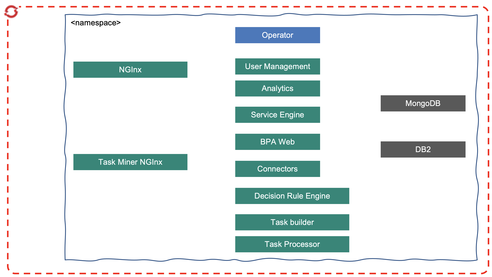

Which can be seen for a production deployment as:

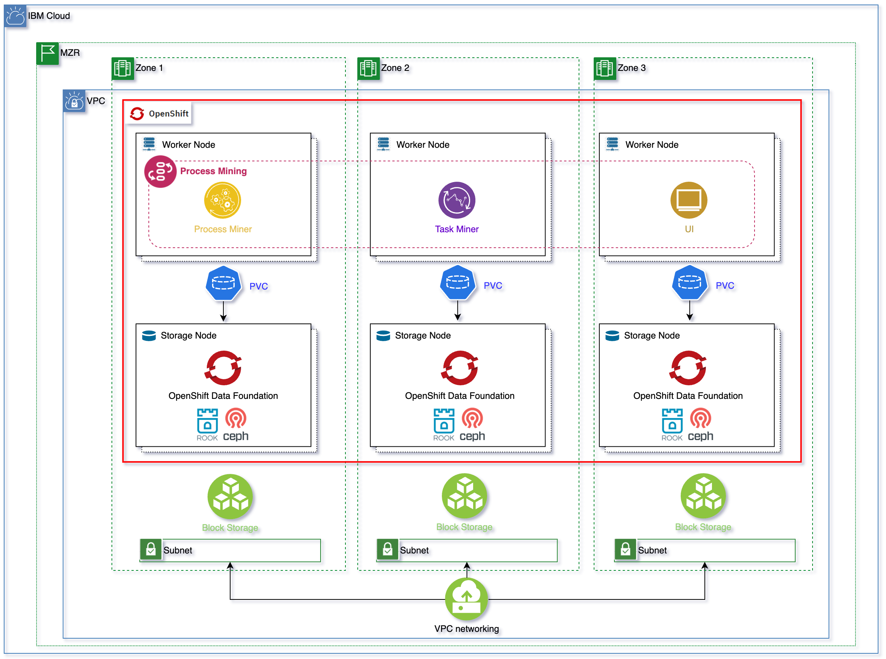

Important to not that process engine is supporting analysts users and data at rest processing. 
So the impact on resource requirements are the number of concurrent users from 2 to 30 (?),
and the complexity of the process. One key performance factor is the data quality.

## Use Cases

Understand the `procure to pay` process which connects the procurement and entire supply 
chain processes within a company through the goods receipt process, and finally 
to the payment issued to the vendor. The system is SAP, the top level activities are

* Purchase requisition
* purchase order
* send PO to Vendor
* Good receipt
* Invoice receipt
* payment

Process mining helps business analysts to identify maverick buying by looking for:

* Orders without a purchase requisition
* Invoices without an order

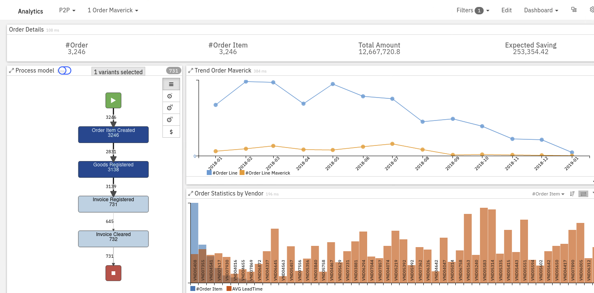

We can use process mining to identify **process path deviations** and discover the root causes and the 
impact of those deviations such as a cost associated with extra resources and process delays. 
Process deviations are discovered by comparing model discovered from process mining data with a reference model 
that could come from Blueworks live or other BPM tools.

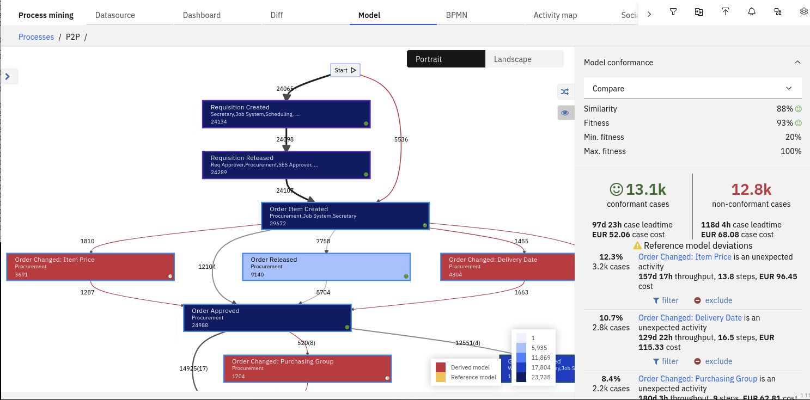

The non-conformant activities can be identified by the red background color and 
the non-conformant transitions are also set to red.

## Getting started

Access to a Process Mining Server via the NGInx server address. 

* If needed create an organization
* Create a process 

  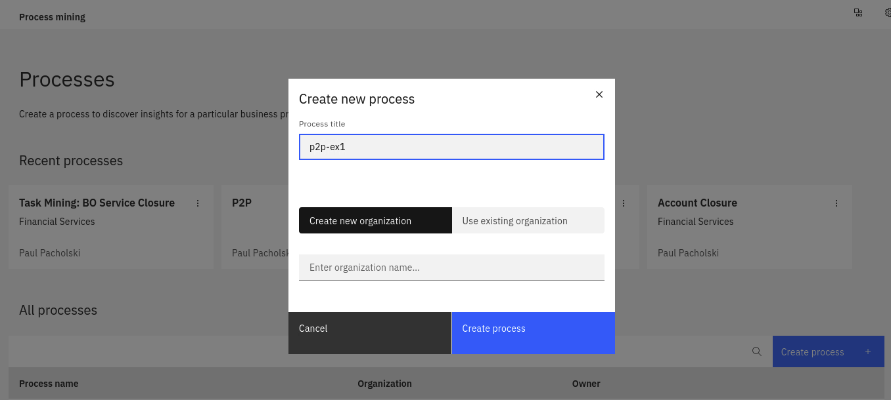

* To analyze the process, you will need to upload a log file (.CSV or .XES) containing mined process data
into the Data Source
* Once data loaded, maps identify data columns:  Process ID, Activity, Start time, End Time, Resource and Role

  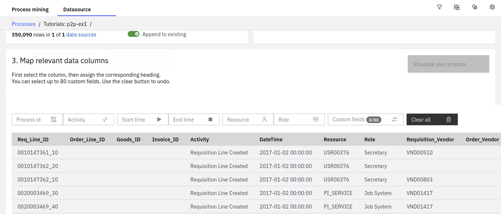

* After mapping the logfile, you can visualize the process by creating process Model. Every time something changes in the Workspace or more data is added you will need to recreate the process Model.

  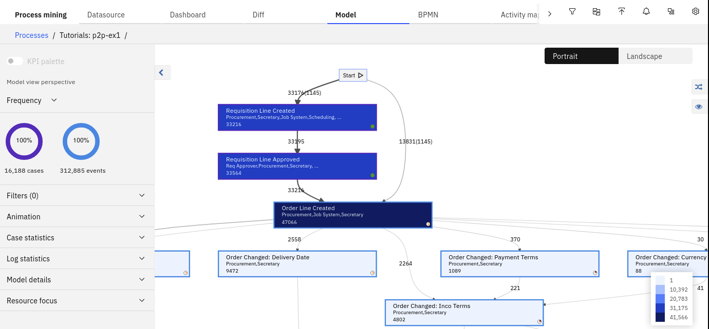

!!! info
    The Model automatically displays the frequency analysis. The dark blue color 
    highlights the most frequent activities, whilst the bold arrows highlight the 
    most frequent transitions.
     
      * The numbers next to the lines shows how many times that specific process flow 
    has been followed.
      * The numbers within the rectangles shows the number of times that the activity is performed
      * The description in the rectangles indicates the name of the activity and the roles by which the activity is carried out.
      * The Activity border reflects the multilevel nature of the process.
      * Control % of Activities (occurrences) and % of Relations by expanding Model details section

* **Dashboard** contains process and case statistics with perf stats over time.

  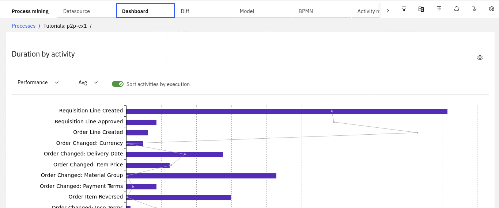

* **BPMN** view is built from the process data model. Some decision gateways are added to represent OR or XOR routing logic. 
`Rule Discovery` option will analyze the data and try to define conditional statements for those routing decisions. 
The problem will become, as those rules really relevant for the process flow.
The BPMN flow can be exported and imported into BlueWorks Live or BAW. 
* **Activity Map** are used to analyze human resources by name and job title. It highlights if employees
are doing what they are supposed to be doing: activity by team, teams by activity...
  
  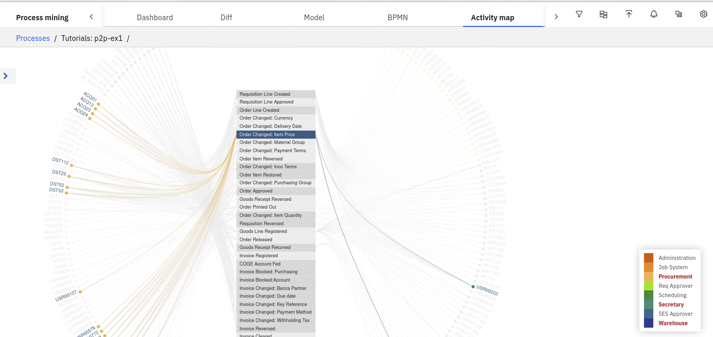

* **Social net** allows you to discover and analyze the relationships between users and groups that are
formed within a process. In the `Doing similar tasks` view:

  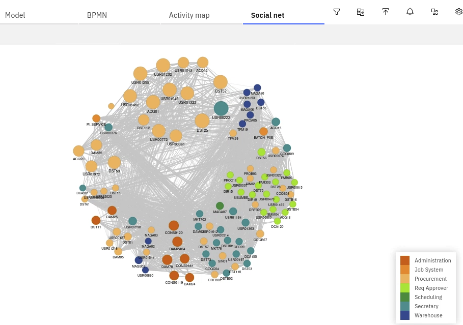

!!! info
    * The bullets represent resources
    * Resources are clustered by common activities carried out
    * The bullet will be bigger for those resources who are sharing more activities
    * Different colors identify different roles

* Analytics offers a set of predefined Dashboards to assess mavericks. 

  

## Installation

On OpenShift, the process mining is installed via operator, with dependencies on common services and foundation core
The operator supports instances of type `ProcessMining` CRD.

* Need storage class supporting the ReadWriteMany (RWX) mode
* Need MongoDB, DB2
* Need SSL
* Need entitlement key

It is possible to deploy more than one operator instance in different namespaces.

The Process Mining components adds two permissions to the Cloud Pak role management: "Automation Analyst" and "Automation Administrator"

In order to offer Read Write Many (RWX) storage for the applications running on RedHat OpenShift cluster, we need to make OpenShift Data Foundation [available in our RedHat OpenShift cluster](https://cloud.ibm.com/docs/openshift?topic=openshift-ocs-storage-prep). 

[OpenShift Data Foundation (ODF)](https://www.redhat.com/en/resources/openshift-data-foundation-datasheet) is a storage solution that consists of open source technologies [Ceph](https://docs.ceph.com/en/latest/start/intro/), [Noobaa](https://www.noobaa.io/), and [Rook](https://rook.io/). 
ODF allows you to provision and manage File, Block, and Object storage for your containerized workloads in Red Hat® OpenShift® on IBM Cloud™ clusters. 
Unlike other storage solutions where you might need to configure separate drivers and operators for each type of storage, 
ODF is a unified solution capable of adapting or scaling to your storage needs.

In order to [install OpenShift Data Foundation (ODF)](https://cloud.ibm.com/docs/openshift?topic=openshift-deploy-odf-vpc) in our 
RedHat OpenShift Kubernetes Service (ROKS) cluster on IBM Cloud on a Virtual Private Cloud (VPC) Gen 2, 
we need to make sure that our OpenShift cluster counts with at least three worker nodes. 
For high availability, we must create our OpenShift cluster with at least one worker node per zone 
across three zones. Each worker node must have a minimum of 16 CPUs and 64 GB RAM.

!!! danger "Important"
    The `storageClass` used to configure OpenShift Data Foundation to request storage volumes **must be of type** [**`metro`**](https://cloud.ibm.com/docs/openshift?topic=openshift-vpc-block#vpc-block-reference). 

!!! info
    What `metro` means is that the `volumeBindingMode` of that `storageClass` will be set to `WaitForFirstConsumer` as opposed to 
    the default `Immediate`. And what that means is that the Persistent Volume creation and 
    allocation by the IBM Cloud Object Storage, as a result of its Persistent Volume Claim, 
    will not happen until the pod linked to that Persistent Volume Claim is scheduled. 
    This allows IBM Cloud Object Storage to know what Availability Zone of your MultiZone 
    Region cluster the pod requesting block storage ended up on and, as a result, to be 
    able to provision such storage in the appropriate place. Otherwise, if we used 
    a `storageClass` whose `volumeBindingMode` was the default `Immediate`, IBM Cloud Object Storage 
    would create and allocate the Persistent Volume in one of the Availability Zones which might 
    not be the same Availability Zone the pod requiring such storage ends up on as a result of the 
    OpenShift pod scheduler which would make the storage inaccessible to the pod. 
    See Kubernetes official documentation [here](https://kubernetes.io/docs/concepts/storage/storage-classes/#volume-binding-mode) for further detail.

!!! danger "Important"
    The `storageClass` you need to configure OpenShift Data Foundation to use with **must not have Retain Reclaim policy**. 
    Using `ibmc-file-gold-gid` seems to work

!!! info
    If you retain the Persistent Volume, it might end up assigned to a pod in a different Availability Zone later, making that storage inaccessible to the pod allocated to. 

See the process mining subscription in [dba-gitops-catalog](https://github.com/ibm-cloud-architecture/dba-gitops-catalog/tree/main/process-mining/operator/base)

## Integration with data ingestion

As of now there is no direct integration with real data streaming, like Kafka or MQ. So for a Kafka deployment
we need to use S3 Sink with some record to CSV transformation.

 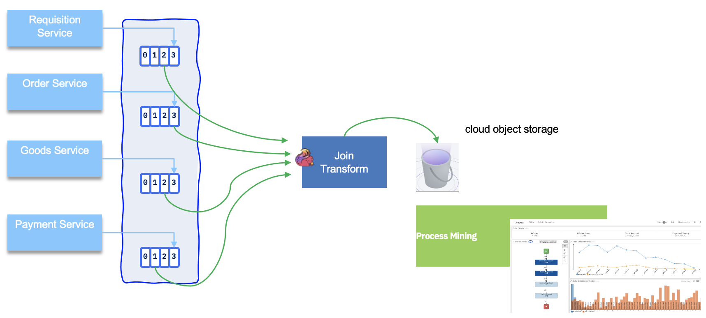

## Read more

* [Academic papers on process mining](https://sebastiaanvanzelst.com/?page_id=62)
* [Product marketing page](https://www.ibm.com/cloud/cloud-pak-for-business-automation/process-mining)
* [Process mining REST API](https://www.ibm.com/docs/en/cloud-paks/1.0?topic=mining-process-rest-api)