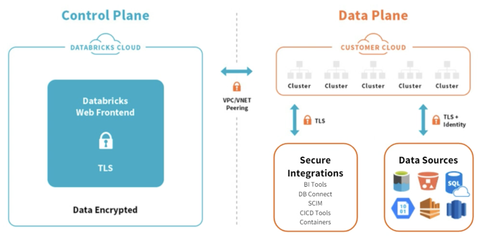
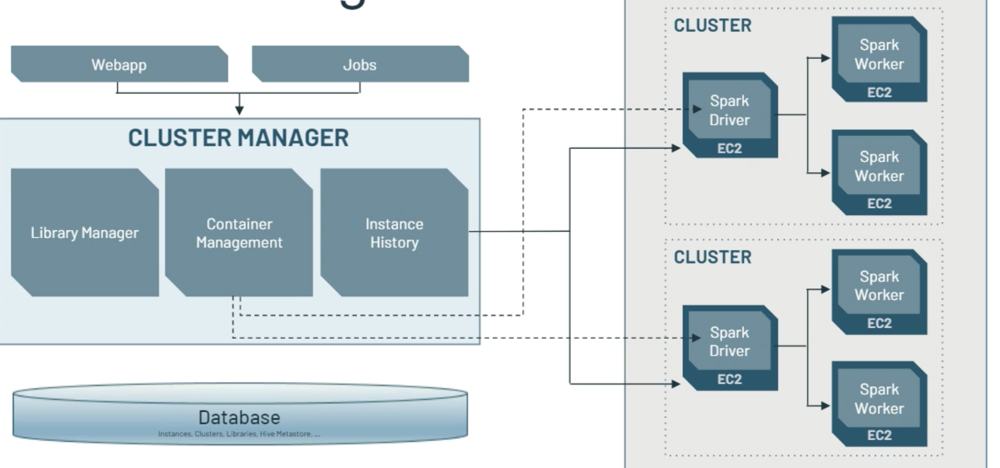

# Databricks

Databricks helps organizations make their data ready for analytics, empowering data science teams to make data-driven decisions and rapidly adopt machine learning via there proprietary platform Data Lakehouse. The current Data Lakehouse platform tenets revolve around 

* Multi-tenant control plane ( 1 or more per region)
* Single-tenant data plane in Customers account
* Each workspace maps to one VPC (one region)
* Multiple workspace maps to one VPC
* Cross account IAM roles used to launch and manage the clusters
* Clusters are used to connect to different data stores like Databases, streaming, on-prem, private hosted Github/code repos...

Based on Apache Sparks, Delta Lake, MLFlow, HDFS, and AWS resources like EC2, EKS, S3, IAM.

## Value proposition

Big data and AI complexity slows innovation: managing big data infrastructure, define data pipelines to produce stale data with poor performance, and isolated, no collaboration for data scientists and data engineers. 

## Architecture

{ width=700 }

(src: Databricks copyright)

* Control plane is managed by Databricks in their cloud account, and it includes backend services, webapp for workpaces, job manager... It hosts everything except the Sparks Cluster.
* Each customer has his own workspace, any command runs in workspace will exist inside the control plane 
* Data plane is managed by customer's cloud account. Data is own, isolated and secured by each customer. Datasources can be inside the customer account or external services.

The Webapp is where customers access all the platform interfaces (APIs and UI):

{ width=700 }

(src: Databricks copyright)

The database is RDS and store all the information about customers metadata, workspace.

Cluster manager is part of the control plane and help admin to manage Spark Cluster,

{ width=700 }

(src: Databricks copyright)

Workspace is a group of folders and files which are mostly notebooks.

The Cluster manager is an extension of the Spark CM with nicer user interface. 

An admin end user once connected to the platform can do at least:

* Manage users, groups, entitlements, instance profiles (which is is associate to a IAM role pass through attached to the EC2 instances supporting the cluster) .
* Create workspaces and defined access control.
* Manage all-purpose or job clusters.
* Define policy to control resources of the cluster: for example cluster mode specifies the level of isolation, runtime version, ML runtime with GPU access or not... It is possible to specify on-demand and spot instance composition for the number of node in the cluster. 
* Submit job. It can also create a cluster to support the job, and then release the resources.
* Create data tables.
* Define MLflow.

Two types of compute resource:

* All purpose compute: shared cluster, ad-hoc work, multi tenant, more expensive
* Job compute: single user, ephemeral clusters created for a job. Great isolation. Lower cost.

## Sources

* [Databricks enablement for admin](https://www.databricks.com/p/thank-you/databricks-onboarding-sessions-thank-you)
* [Product documentation](https://docs.databricks.com/introduction/index.html)