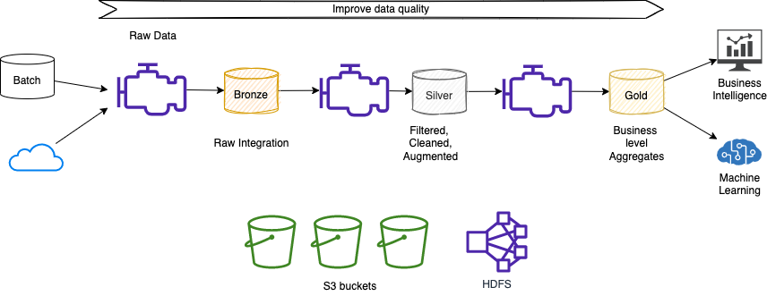

# Databricks

Databricks helps organizations make their data ready for analytics, empowering data science teams to make data-driven decisions and rapidly adopt machine learning via there proprietary platform Data Lakehouse. The current Data Lakehouse platform tenets revolve around:

* Multi-tenant control plane ( 1 or more per region)
* Single-tenant data plane in Customers account
* Each workspace maps to one VPC (one region)
* Multiple workspace maps to one VPC
* Cross account IAM roles used to launch and manage the clusters
* Clusters are used to connect to different data stores like Databases, streaming, on-prem, private hosted Github/code repos...


Based on Apache Sparks, Delta Lake, and [MLflow](https://mlflow.org/), HDFS, and AWS resources like EC2, EKS, S3, IAM.

Workspace manages assets for a user:


## Value propositions

Data warehouse solutions were developed to address data silos done by using multiple, decentralized operational databases. The goal was to provide an architectural model for the flow of data from operational systems to decision support environments. Data warehouse has limitations to support big data, unstructured data, and to support ML use cases. Most of the time uses proprietary formats.

Data lake, with Hadoop, was aiming to support big data processing, on parallel servers organized in cluster. Shortly after the introduction of Hadoop, **Apache Spark** was introduced. Spark was the first unified analytics engine that facilitated large scale data processing, SQL analytics, and ML.

Data lakes are difficult to set up, do not support transactions, do not enforce data quality, very difficult to mix append and reads, batch and streaming jobs. We can add that modifying existing data is difficult, like a delete operation for GDPR compliance. With data lakes, it is difficult to manage large metadata, and data catalogs. A lot of data lake projects became data swamp.

A lakehouse is a new architecture that combines the best elements of data lakes and data warehouses. It enables users to do everything from BI, SQL analytics, data science, and ML on a single platform. It supports ACID transactions, large metadata, indexing, bloom filters, schema validation, governance to understand how data is used, direct access to source data, scalable. Data is saved in open data formats and supports structured and unstructured data.



**Figure 1: Data lake - data pipeline**

The [lakehouse](https://delta.io/) approach to data pipelines offers modern data engineering best practices for improved productivity, system stability, and data reliability, including streaming data to enable reliable real-time analytics.

Big data and AI complexity slows innovation: managing big data infrastructure, define data pipelines to produce stale data with poor performance, and isolated, no collaboration for data scientists and data engineers. 

### [Delta lake](https://delta.io)

Delta lake is an open approach to bring data management and governance on top of data lakes. It is a storage layer to bring the following:

* reliability via ACID transaction
* performance via indexing to maximize the efficiency of the query
* governance using Unity catalog to enforce access control list on table
* quality to support different busines needs.

Data Scientists can define flows ans pipelines to process data from raw to filtered-cleaned-augmented, as a source of truth to business level aggregates.

Delta Lake is available with multiple AWS services, such as AWS Glue Spark jobs, Amazon EMR, Amazon Athena, and Amazon Redshift Spectrum.

### Deeper Dive

* [Delta Lake documentation](https://docs.delta.io/latest/index.html)
* [Crawl Delta Lake tables using AWS Glue crawlers](https://aws.amazon.com/blogs/big-data/crawl-delta-lake-tables-using-aws-glue-crawlers/)
* [Introducing native Delta Lake table support with AWS Glue crawlers](https://aws.amazon.com/blogs/big-data/introducing-native-delta-lake-table-support-with-aws-glue-crawlers/)
* [Process Apache Hudi, Delta Lake, Apache Iceberg datasets at scale, part 1: AWS Glue Studio Notebook](https://aws.amazon.com/blogs/big-data/part-1-integrate-apache-hudi-delta-lake-apache-iceberg-datasets-at-scale-aws-glue-studio-notebook/)

## Architecture

{ width=700 }

(src: Databricks)

* Control plane is managed by Databricks in their cloud account, and it includes backend services, webapp for workpaces, notebooks repository, job manager, cluster manager... It hosts everything except the Sparks Cluster.
* Each customer has his own workspace, any command runs in workspace will exist inside the control plane.
* Data plane is managed by customer's cloud account. Data is own, isolated and secured by each customer. Datasources can be inside the customer account or external services.
* There is a private network between the data and the control planes. A lot of control over how cloud accounts are integrated and secured.

The Webapp is where customers access all the platform interfaces (APIs and UI):

{ width=700 }

(src: Databricks copyright)

The database is RDS and stores all the information about customers metadata, workspace.

Cluster manager is part of the control plane and helps admin to manage Spark Cluster. The Cluster manager is an extension of the Spark CM with nicer user interface. 

{ width=700 }

(src: Databricks copyright)

There are two types of cluster: 1/ All-purpose to be used to support interactive notebooks execution, 2/ Job clusters to run automated jobs.
Workspace is a group of folders and files which are mostly notebooks.

An admin end user once connected to the platform can do at least:

* Manage users, groups, entitlements, instance profiles (which is is associate to a IAM role pass through attached to the EC2 instances supporting the cluster) .
* Create workspaces and defined access control.
* Manage all-purpose or job clusters.
* Define policy to control resources of the cluster: for example cluster mode specifies the level of isolation, runtime version, ML runtime with GPU access or not... It is possible to specify on-demand and spot instance composition for the number of node in the cluster. 
* Submit job. It can also create a cluster to support the job, and then release the resources.
* Create data tables.
* Define [MLflow](https://mlflow.org/): An open source platform for the machine learning lifecycle.

Two types of compute resource:

* All purpose compute: shared cluster, ad-hoc work, multi tenant, more expensive
* Job compute: single user, ephemeral clusters created for a job. Great isolation. Lower cost.

## Unity Catalog

The Unity Catalog offers a fine-grained governance for data lakes across cloud and is based on ANSI SQL. It provides a centrally shared (via delta shaing protocol), auditable (what is used, who used, data lineage), secured, management capability for all data types (tables, files, columns and ML models ). It integrates with existing data catalogs, and storages.

## Databricks SQL

Run SQL queries through SQL optimized clusters, powered by Photon that directly query Delta Lake tables. 


!!! note
    Photon is a vectorized query engine to take advantages of the new CPUs architecture for extremely fast parallel processing.

The query editor is also integrated with visualization to present the data with diagrams and charts and build dashboards.


The SQL can be integrated with existing BI tools like Qlik, Tableau, dbt, Fivetran...

To be able to execute SQL, workspace admin user needs to define an endpoint, a Catalog and a database. Serverless endpoints are managed by Databricks, or classical with remote access to data plane to customer's account.
Catalog (`samples`) is needed to access Databases (`nyctaxi`):


Support all the management at the query level, looking at execution history, and fine-grained access control.

SQL warehouse supports 3 types:

* Classic as entry level
* Pro
* Serverless: SQL warehouses run in the customer’s Databricks account using serverless compute.


Creating a Warehouse helps to configure the cluster size, scaling characteristics (which lead to different pricing in DBU units), the type and 
catalog:


Within a catalog, we can use Data Explorer to see the database, the tables (`trips`) and then the column declarations:


Using query we can define Alert.

## Machine Learning

The libraries used are TensorFlow, XGBoost, Scikit-learn.

The ML service uses MLFlow which includes the following components:

* Models: manage and deploy models from a variety of ML libraries to a variety of model serving and inference platforms. 
* Projects: package ML code in a reusable, reproductible form to share.
* Model registry
* Model serving

## Sources

* [Databricks enablement for admin](https://www.databricks.com/p/thank-you/databricks-onboarding-sessions-thank-you).
* [Product documentation](https://docs.databricks.com/introduction/index.html).

## Serverless deployment

The serverless deployment is running Databricks control plane as pods in EKS, and customers can run their Sparks job (SQL processing as of now), in nodes added dynamically inside EKS cluster. For security reason the Spark job manager runs in VM to provide better isolation. The VM hypervisor is [QEMU](https://www.qemu.org/), but it could be AWS [Firecracker](https://firecracker-microvm.github.io/). 


The goal is to support different node types: spot instance, or microVM on EC2 baremetal. The performance goal is to be able to start VMs within a second, and be able to recycling them in less than 5 seconds. In the serverless world it possible to have thousand of VMs / nodes in kubernetes cluster and hundred of start/stop events per second.

Each job processing is done on data that could come from S3 buckets within Databricks account, in the same region, or copied from customer's S3 buckets to EBS volumes attached to the EC2.

For real-time processing, Spark streaming may be used and connected to Kafka, Kinesis, and any queueing systems. 
Java or Scala based processing will take longer time to start than SQL based deployment.

## Hands on enablement

* Example of python to read csv file and save it in Delta Lake format

    ```python
    from pyspark.sql.functions import avg

    diamonds = spark.read.csv("/databricks-datasets/Rdatasets/data-001/csv/ggplot2/diamonds.csv", header="true", inferSchema="true")
    diamonds.write.format("delta").mode("overwrite").save("/delta/diamonds")
    display(diamonds.select("color","price").groupBy("color").agg(avg("price")).sort("color"))
    ```

* Then read it using SQL

    ```sql
    CREATE TABLE diamonds USING DELTA LOCATION '/delta/diamonds/'
    ```

* [Learning portal.](https://partner-academy.databricks.com/learn/)
* [Cloud Lakehouse labs Github](https://github.com/databricks-demos/cloud-lakehouse-labs)
* [Data engineering learning path - Github](https://github.com/databricks-academy/data-engineer-learning-path/releases/tag/v1.0.1)